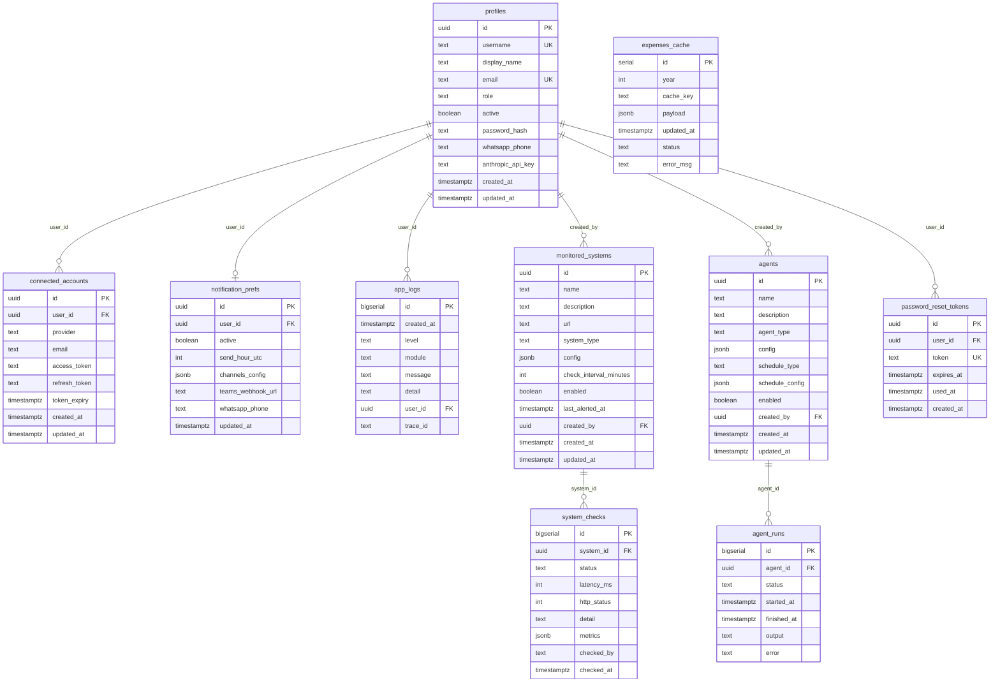
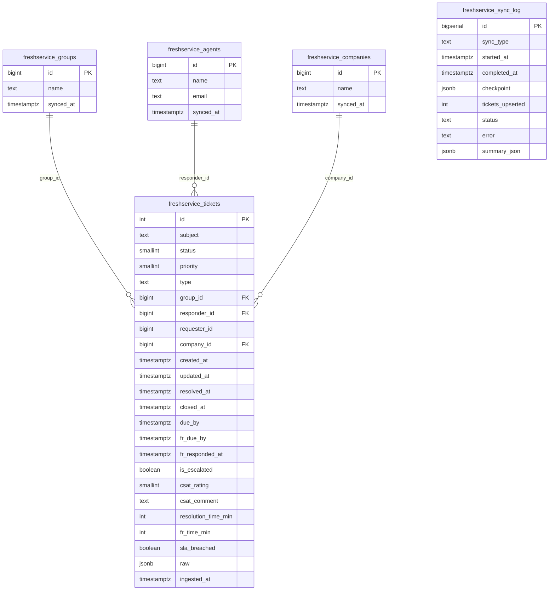
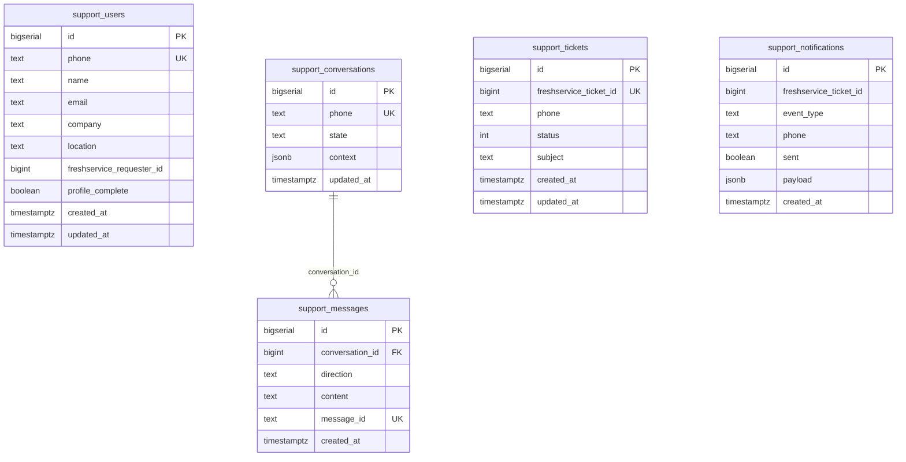
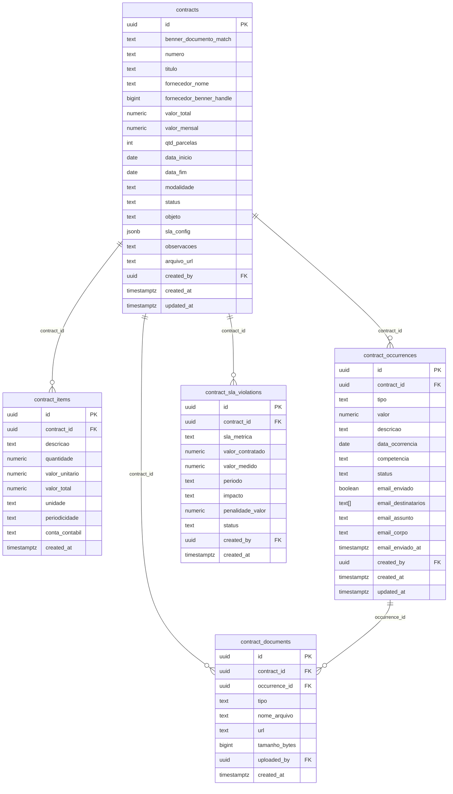
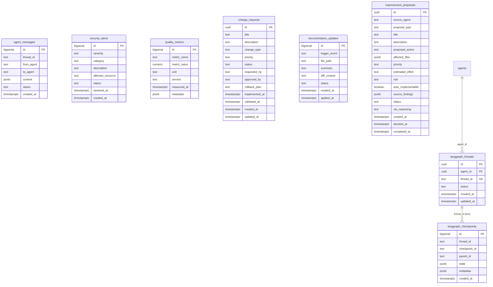
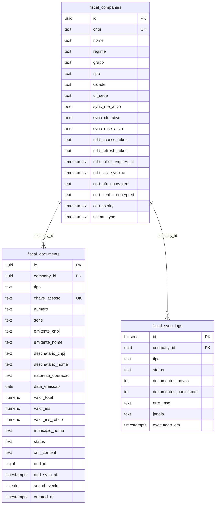

# Jarvis — Arquitetura e Documentação

## Visão Geral

Sistema interno da Voetur/VTCLog com autenticação própria e nove módulos:

| Módulo | Serviço | Porta | Descrição |
|---|---|---|---|
| Core | core-service | 8001 | Autenticação, usuários, administração |
| Monitoramento | monitoring-service | 8002 | Health checks agendados, dashboard em tempo real |
| Freshservice | freshservice-service | 8003 | Dashboard e sync de tickets do helpdesk |
| Moneypenny | moneypenny-service | 8004 | Resumo diário de e-mails e agenda via Microsoft 365 |
| Agentes | agents-service | 8005 | Jobs agendados + criação de agentes via Claude AI / LangGraph |
| Gastos TI | expenses-service | 8006 | Dashboard financeiro executivo — despesas de TI via ERP Benner |
| VoeIA | support-service | 8007 | Bot WhatsApp de suporte com abertura de chamados no Freshservice |
| Desempenho | performance-service | 8008 | Gestão de ciclos, metas, avaliações e KPIs de desempenho |
| Fiscal | fiscal-service | 8009 | Validação NFe/NFSe — sync NDD Digital, busca full-text, dashboard |

---

## Arquitetura

```
Browser
  └─► nginx:443 (HTTPS — frontend container)
        ├─ /api/* ─────────────────────────► Kong:8000 (interno Docker)
        │                                     ├─ /api/fiscal/*
        │                                     │     └─► fiscal-service:8009
        │                                     ├─ /api/performance/*
        │                                     │     └─► performance-service:8008
        │                                     ├─ /api/auth, /api/users, /api/admin, /api/health
        │                                     │     └─► core-service:8001
        │                                     ├─ /api/monitoring/*
        │                                     │     └─► monitoring-service:8002
        │                                     ├─ /api/freshservice/*
        │                                     │     └─► freshservice-service:8003
        │                                     ├─ /api/moneypenny/*
        │                                     │     └─► moneypenny-service:8004
        │                                     ├─ /api/agents/*
        │                                     │     └─► agents-service:8005
        │                                     ├─ /api/expenses/*
        │                                     │     └─► expenses-service:8006
        │                                     └─ /api/support/*
        │                                           └─► support-service:8007
        └─ / ──────────────────────────────► SPA React (nginx serve estático)

Inter-serviço (Docker app_net):
  agents-service → freshservice-service:8003 (HTTP interno + JWT gerado em agent_runner.py)
  expenses-service → SQL Server externo 10.141.0.111:1444 (BennerSistemaCorporativo — leitura)
  performance-service → SQL Server externo 10.141.0.111:1444 (BennerRH — leitura para sync)

Supabase Self-Hosted (Docker app_net):
  Kong:8000 → postgrest, gotrue, realtime, storage
  postgres:5432  (127.0.0.1 — nunca exposto)
  studio:54323   (127.0.0.1 — admin local)
```

---

## Portas

| Porta | Serviço | Bind | Acesso externo |
|---|---|---|---|
| 443 | nginx (HTTPS) | 0.0.0.0 | sim |
| 80 | nginx (redirect) | 0.0.0.0 | sim |
| 8181 | nginx (Evolution API proxy) | 0.0.0.0 | sim |
| 5432 | PostgreSQL | 127.0.0.1 | bloqueado |
| 9100 | Monitor Agent | 127.0.0.1 | bloqueado |
| 8080 | Evolution API | 127.0.0.1 | bloqueado |
| 54321 | Supabase Kong | 127.0.0.1 | bloqueado |
| 54323 | Supabase Studio | 127.0.0.1 | bloqueado |

Microsserviços (8001–8009): sem portas expostas ao host, apenas rede interna Docker.

---

## Sistema de Roles

| Role | Módulos | Permissões-chave |
|---|---|---|
| `admin` | todos | gerenciar usuários, acessar todos os dados |
| `user` | core, monitoring, freshservice, moneypenny, agents | acesso padrão |
| `rh` | desempenho | criar metas, assinar avaliações, calibrar, fechar ciclo |
| `gestor` | desempenho | criar metas, avaliar liderados, gerenciar KPIs/PDI |
| `coordenador` | desempenho | criar metas, avaliar liderados, gerenciar PDI |
| `supervisor` | desempenho | criar metas, avaliar liderados, assinar avaliação |
| `colaborador` | desempenho | assinar metas recebidas, autoavaliação, tomar ciência |

---

## Banco de Dados — MER Completo

O banco PostgreSQL (Supabase self-hosted) contém **53 tabelas** distribuídas em 6 arquivos de schema.

### Schema Core (`schema.sql`) — 10 tabelas



### Schema Freshservice (`schema_freshservice.sql`) — 5 tabelas



**Funções SQL (RPC via PostgREST):**

| Função | Parâmetros | Retorno |
|---|---|---|
| `freshservice_summary` | `p_from, p_to: timestamptz` | JSON com totais, CSAT, SLA breach, resolução média |
| `freshservice_sla_by_group` | `p_from, p_to: timestamptz` | JSON com breach % e resolução por grupo |
| `freshservice_agents_monthly` | `p_year, p_month: int` | JSON com fechamentos por agente no mês |
| `freshservice_top_requesters` | `p_from, p_to, p_limit` | JSON com empresas que mais abriram chamados |
| `freshservice_csat_summary` | `p_from, p_to: timestamptz` | JSON com NPS detalhado: happy/neutral/unhappy por grupo |
| `upsert_csat_ratings` | `p_ratings: jsonb` | int (registros atualizados) — batch update de CSAT |

### Schema VoeIA Support (`schema_support.sql`) — 5 tabelas



### Schema Governança de Contratos (`schema_governance.sql`) — 5 tabelas



### Schema Agentes / LangGraph (`schema_langgraph.sql`) — 8 tabelas



**Tipos de agente LangGraph (constraint `agents_agent_type_check`):**
`langgraph_cto`, `langgraph_log_scanner`, `langgraph_log_improver`, `langgraph_fix_validator`, `langgraph_security`, `langgraph_code_security`, `langgraph_quality`, `langgraph_quality_validator`, `langgraph_uptime`, `langgraph_docs`, `langgraph_docker`, `langgraph_frontend`, `langgraph_backend`, `langgraph_infrastructure`, `langgraph_api`, `langgraph_automation`, `langgraph_itil_version`, `langgraph_change_mgmt`, `langgraph_change_validator`, `langgraph_integration_validator`, `langgraph_scheduling`

### Schema Desempenho (`schema_performance.sql`) — 20 tabelas


**Permissões por role:**

| Permission | colaborador | supervisor | coordenador | gestor | rh |
|---|:---:|:---:|:---:|:---:|:---:|
| `acknowledge_goal` | ✓ | | | | |
| `fill_self_review` | ✓ | | | | |
| `acknowledge_review` | ✓ | | | | |
| `create_goal` | | ✓ | ✓ | ✓ | ✓ |
| `fill_manager_review` | | ✓ | ✓ | ✓ | ✓ |
| `sign_review` | | ✓ | ✓ | ✓ | ✓ |
| `manage_pdi` | | | ✓ | ✓ | ✓ |
| `manage_kpis` | | | | ✓ | ✓ |
| `close_cycle` | | | | | ✓ |
| `calibrate` | | | | | ✓ |
| `view_financial_score` | | | | | ✓ |

**Score engine (`services/score_engine.py`):**
- Pesos: `goals=50%`, `competencies=25%`, `behavior=15%`, `compliance=10%`
- Bloqueio compliance: se `compliance_score < 2.0` → `final_score` capped em `2.5`
- Dois momentos de assinatura: Momento 1 (`performance_goal_acknowledgments`) e Momento 2 (`performance_review_acknowledgments`)

---

## Inventário de Rotas por Serviço

### core-service:8001
| Método | Rota | Acesso | Descrição |
|---|---|---|---|
| POST | `/api/auth/login` | público | login + JWT |
| POST | `/api/auth/logout` | autenticado | invalida sessão |
| POST | `/api/auth/refresh` | autenticado | renova JWT |
| POST | `/api/auth/forgot-password` | público | envia e-mail reset |
| POST | `/api/auth/reset-password` | público | conclui reset |
| GET | `/api/users/me` | autenticado | perfil próprio |
| PATCH | `/api/users/me` | autenticado | atualiza perfil |
| GET | `/api/admin/users` | admin | lista usuários |
| POST | `/api/admin/users` | admin | cria usuário |
| PATCH | `/api/admin/users/{id}` | admin | edita usuário |
| DELETE | `/api/admin/users/{id}` | admin | remove usuário |
| GET | `/api/health` | público | healthcheck |

### monitoring-service:8002
| Método | Rota | Acesso | Descrição |
|---|---|---|---|
| GET | `/api/monitoring/systems` | user | lista sistemas |
| POST | `/api/monitoring/systems` | admin | cria sistema |
| GET | `/api/monitoring/systems/{id}/checks` | user | histórico de checks |
| POST | `/api/monitoring/systems/{id}/check` | admin | força check manual |
| GET | `/api/monitoring/dashboard` | user | status em tempo real |

### freshservice-service:8003
| Método | Rota | Acesso | Descrição |
|---|---|---|---|
| GET | `/api/freshservice/summary` | user | resumo por período |
| GET | `/api/freshservice/sla` | user | SLA por grupo |
| GET | `/api/freshservice/agents` | user | produtividade por agente |
| GET | `/api/freshservice/csat` | user | CSAT detalhado |
| POST | `/api/freshservice/sync` | admin | dispara sync manual |

### expenses-service:8006
| Método | Rota | Acesso | Descrição |
|---|---|---|---|
| GET | `/api/expenses/dashboard` | user | despesas por ano/filial/tipo |
| GET | `/api/expenses/forecast` | user | previsão linear + média móvel |
| GET | `/api/expenses/empresas` | user | lista filiais disponíveis |
| GET | `/api/expenses/comparativo` | user | comparação entre dois anos |
| POST | `/api/expenses/sync` | admin | sincroniza cache do Benner |

### support-service:8007
| Método | Rota | Acesso | Descrição |
|---|---|---|---|
| POST | `/api/support/webhooks/whatsapp` | Evolution API | recebe mensagem WhatsApp |
| POST | `/api/support/webhooks/freshservice` | Freshservice | recebe evento de ticket |
| GET | `/api/support/conversations` | admin/support | lista conversas |
| GET | `/api/support/tickets` | admin/support | lista tickets |
| GET | `/api/support/users` | admin/support | lista usuários cadastrados |
| GET | `/api/support/health` | público | healthcheck |
| GET | `/api/support/ready` | público | readiness |

### fiscal-service:8009
| Método | Rota | Acesso | Descrição |
|---|---|---|---|
| GET | `/api/fiscal/companies` | autenticado | lista empresas |
| GET | `/api/fiscal/sync/logs` | autenticado | logs globais |
| GET | `/api/fiscal/nfse` | autenticado | busca NFSe com filtros |
| GET | `/api/fiscal/nfse/stats` | autenticado | totais por período |
| POST | `/api/fiscal/nfse/sync/run` | admin | dispara sync NFSe NDD |
| GET | `/api/fiscal/{id}/ndd/authorize-url` | admin | URL PKCE para frontend |
| GET | `/api/fiscal/ndd/callback` | público | callback OAuth NDD |
| GET | `/api/fiscal/{id}/ndd/status` | autenticado | status token NDD |
| POST | `/api/fiscal/{id}/certificates` | admin | upload cert A1 |

### performance-service:8008
| Método | Rota | Acesso | Descrição |
|---|---|---|---|
| GET | `/api/performance/goals` | todos os roles | lista metas |
| POST | `/api/performance/goals` | gestor/coord/supervisor/rh | cria meta |
| PATCH | `/api/performance/goals/{id}` | criador | atualiza meta |
| POST | `/api/performance/goals/{id}/acknowledge` | colaborador | Momento 1 — assina meta |
| GET | `/api/performance/evaluations/cycles` | todos | lista ciclos |
| POST | `/api/performance/evaluations/cycles` | rh | cria ciclo |
| GET | `/api/performance/evaluations/reviews` | todos | lista avaliações |
| POST | `/api/performance/evaluations/reviews` | rh | cria avaliação |
| PATCH | `/api/performance/evaluations/reviews/{id}` | reviewer/rh | atualiza scores |
| POST | `/api/performance/evaluations/reviews/{id}/sign` | gestor/coord/supervisor/rh | Momento 2 — assina |
| POST | `/api/performance/evaluations/reviews/{id}/acknowledge` | colaborador | Momento 2 — ciência |
| GET | `/api/performance/competencies` | todos | lista competências |
| POST | `/api/performance/competencies/{review_id}/scores` | reviewer | lança scores de competências |
| GET | `/api/performance/evidences` | todos | lista evidências |
| POST | `/api/performance/evidences` | todos | registra evidência |
| GET | `/api/performance/kpis` | gestor/rh | lista KPIs |
| POST | `/api/performance/kpis/{id}/snapshots` | gestor/rh | registra snapshot KPI |
| GET | `/api/performance/admin/employees` | rh/admin | lista colaboradores |
| POST | `/api/performance/admin/sync-benner` | rh/admin | sincroniza RH do Benner |
| GET | `/api/performance/admin/dashboard` | rh/admin | dashboard calibração |
| GET | `/api/performance/admin/audit-log` | rh/admin | trilha de auditoria |
| GET | `/api/performance/health` | público | healthcheck |
| GET | `/api/performance/ready` | público | readiness |

---

## VoeIA — support-service:8007

Bot de suporte via WhatsApp que gerencia onboarding de usuários e abertura/acompanhamento de chamados no Freshservice.

**Fluxo geral:**
```
WhatsApp user → Evolution API → POST /api/support/webhooks/whatsapp
                                       │
                                       ▼
                              ConversationFSM (13 estados)
                               ├── lookup/salva support_users
                               ├── salva support_conversations
                               └── chama FreshserviceConnector
                                       │ resposta
                                       ▼
                              Evolution API POST /message/sendText/voetur-support

Freshservice evento → POST /api/support/webhooks/freshservice?secret=…
                              │
                              ▼
                      notification_worker (idempotente)
                       └── Evolution API POST /message/sendText/voetur-support
```

**FSM — estados:**
`onboarding_email` → `onboarding_confirm_fs` | `onboarding_name` → `onboarding_company` → `onboarding_location` → `onboarding_final_confirm` → `onboarding_empresa` → `selecting_catalog` → `selecting_subcategory` → `selecting_action` → `collecting_description` → `confirming_ticket` → `idle`

**Catálogo de departamentos:**

| # | Departamento | workspace_id Freshservice |
|---|---|---|
| 1 | TI | 2 |
| 2 | Financeiro | 5 |
| 3 | RH / Pessoal | 6 |
| 4 | Operações | 13 |
| 5 | Suprimentos | 18 |

**Particularidades desta instância Freshservice (voetur1.freshservice.com):**
- Campo `empresa` é custom_field obrigatório em todos os tickets; valores: `VTC OPERADORA LOGÍSTICA (Matriz)`, `VOETUR TURISMO (Matriz)`, `VIP CARGAS BRASÍLIA (Matriz)`, `VIP SERVICE CLUB MARINA (Matriz)`, `VIP CARGAS RIO (MATRIZ)`
- Agents (admins) devem usar `requester_id` na criação de ticket — campo `email` é silenciosamente ignorado pela API
- Busca de usuário: `/requesters` primeiro, fallback `/agents` com resolução de `location_id` e `department_ids`
- `category`/`sub_category` não enviados — valores do catálogo interno não correspondem aos do Freshservice

**Deduplicação de webhook:** cache `OrderedDict` TTL 60s, limite 1000 entradas — retorna 200 imediatamente para mensagens duplicadas.

**Configuração WhatsApp:**
- Instância: `SUPPORT_WHATSAPP_INSTANCE` (default `voetur-support`)
- JID completo (`@lid` ou `@s.whatsapp.net`) passado no `sendText`
- `linkPreview: false` em todos os envios

---

## VoeIA — Changelog

### 2026-05-13 — Fix deduplicação webhook + health check Docker

**Problema:** A Evolution API entrega o mesmo evento webhook duas vezes; sem deduplicação o bot processava e respondia em duplicata. O health check do container travava indefinidamente (uvicorn sem timeout→Docker matava com ExitCode -1).

**Arquivos:** `support-service/routes/webhook.py`, `docker-compose.yml`

- `webhook.py`: adicionado `_is_duplicate(msg_id)` — cache `OrderedDict` com TTL de 60s e limite de 1000 entradas; retorna 200 imediatamente para mensagens já vistas
- `docker-compose.yml`: `urlopen` no health check recebe `timeout=4`; `start_period` aumentado de 10s para 30s

---

### 2026-05-13 — Missão 1: Auto-detecção de empresa via Freshservice

**Problema:** Após encontrar o usuário no Freshservice e confirmar os dados, o bot ainda pedia para escolher manualmente entre as 5 empresas — passo redundante.

**Arquivos:** `support-service/services/freshservice_connector.py`, `support-service/services/conversation.py`

- `freshservice_connector.py`: `search_requester_by_email()` agora extrai `company_id` e resolve o nome via `GET /companies/{id}` (novo método `_resolve_company()`); retorna campo `company_name`
- `conversation.py`: adicionado `_FS_COMPANY_TO_EMPRESA_KEY` (mapeamento nome FS → chave 1–5) e `_match_empresa_key()`; quando Freshservice retorna empresa reconhecida, o campo `empresa` é salvo automaticamente e o passo `onboarding_empresa` é pulado

**Fallback:** Se `company_id` for nulo ou o nome não bater com nenhuma chave → fluxo original (usuário escolhe manualmente).

**Mapeamento atual:**

| Nome no Freshservice | Empresa local |
|---|---|
| `voetur turismo` | VOETUR TURISMO (Matriz) |
| `vtc operadora logística` | VTC OPERADORA LOGÍSTICA (Matriz) |
| `vip cargas brasília` | VIP CARGAS BRASÍLIA (Matriz) |
| `vip service club marina` | VIP SERVICE CLUB MARINA (Matriz) |
| `vip cargas rio` | VIP CARGAS RIO (MATRIZ) |

Para adicionar/corrigir: editar `_FS_COMPANY_TO_EMPRESA_KEY` em `conversation.py`.

---

### 2026-05-13 — Missão 2: Navegação "voltar" nas fases de abertura de chamado

**Problema:** Usuário sem poder voltar ao menu de departamentos após avançar nas etapas — precisava recomeçar a conversa.

**Arquivo:** `support-service/services/conversation.py`

Adicionada função `_is_back(text)` que reconhece: `0`, `voltar`, `menu`, `início`, `inicio`.

Nos estados abaixo, digitar qualquer dessas palavras retorna imediatamente ao menu de departamentos (`selecting_catalog`) sem resetar o cadastro do usuário:

| Estado | Trigger de volta |
|---|---|
| `selecting_subcategory` | `0` / `voltar` |
| `selecting_action` | `0` / `voltar` |
| `collecting_description` | `0` / `voltar` |
| `confirming_ticket` | `0` / `voltar` |

---

### 2026-05-13 — Missão 3: Docker auto-start no boot do Windows Server

**Problema:** Após reinicialização do servidor, os containers não subiam automaticamente — `setup-autostart.ps1` nunca havia sido executado.

**Solução:** Executar como Administrador:
```powershell
Set-ExecutionPolicy -Scope Process -ExecutionPolicy Bypass
E:\claudecode\claudecode\setup-autostart.ps1
```

Isso registra a task `Jarvis-Docker-Startup` no Task Scheduler do Windows com:
- Trigger: `AtStartup`
- Principal: `NT AUTHORITY\SYSTEM` (Highest)
- Ação: executa `E:\claudecode\claudecode\jarvis-startup.bat`

O script `jarvis-startup.bat`: inicia Docker Desktop → aguarda até 120s → `docker compose up -d` → aplica memory limits.

**Verificação:**
```powershell
Get-ScheduledTask -TaskName "Jarvis-Docker-Startup"
# State: Ready
```

**Log de execução:** `C:\Windows\Temp\jarvis-startup.log`

---

## Módulo Gastos TI — expenses-service:8006

Lê ERP Benner via `pyodbc` (SQL Server `10.141.0.111:1444`, `BennerSistemaCorporativo`).

- **Filtro base**: `PAR.EMPRESA = 1` + `K_GESTOR = 23` (gestor de TI)
- **Endpoints**: `GET /api/expenses/dashboard?year=&filial=&tipo=` · `GET /api/expenses/forecast` · `GET /api/expenses/empresas` · `GET /api/expenses/comparativo?ano1=&ano2=`
- **Forecast**: regressão linear + média móvel 3m, pure Python
- **Resiliência**: `CircuitBreaker("benner")` + `@sql_retry` (3 tentativas, 2s→10s backoff) em `services/resilience.py`; `TTLCache(ttl=300)` nos serviços pesados; cache Supabase via `POST /api/expenses/sync`
- **PayFly**: apenas pagamentos liquidados (`DATALIQUIDACAO IS NOT NULL`); separação entre despesas contratuais e eventuais; suporte a parcelas pendentes

---

## Módulo Desempenho — performance-service:8008

Gestão completa de ciclos de avaliação de desempenho. Fase 1 MVP em produção; Fase 2 (PDI funcional, relatórios gerenciais) prevista.

**Sincronização Benner RH:**
- APScheduler cron diário 02:00 em `services/benner_sync.py`
- Lê `BennerRH` via `pyodbc` (variável `SQL_SERVER_BENNER_HR_DB`)
- Popula `performance_departments` e `performance_employees`
- CircuitBreaker + sql_retry idêntico ao expenses-service

**Momentos de assinatura:**
- **Momento 1** — colaborador recebe a meta e assina (`performance_goal_acknowledgments`)
- **Momento 2** — gestor assina o resultado + colaborador toma ciência (`performance_review_acknowledgments`)

**Ciclo de vida da avaliação:**
```
draft → open → evaluation → calibration → closed
```

**Status da meta:**
```
draft → pending_ack → active → in_review → completed | expired | cancelled
```

**Status da revisão:**
```
pending_self → pending_manager → pending_second_manager → pending_hr → pending_ack → completed | disputed | archived
```

---

## Observabilidade

- `app_logs.trace_id` — correlaciona logs entre serviços pelo mesmo `X-Trace-ID`
- `run_error_growth_check()` em `monitoring-service/services/log_monitor.py` — roda a cada 6h, detecta crescimento ≥ 80% de erros e abre GitHub issue
- `/ready` padronizado: `{status, service, uptime_seconds, components: {...}}`
- Índice em `agent_messages(to_agent, status, created_at)` para performance de consultas
- `performance_audit_logs` — trilha de auditoria para todas as operações de escrita no módulo de desempenho

---

## Módulo Fiscal — fiscal-service:8009

Validação e visualização de documentos fiscais (NFe, CTe, NFSe) sincronizados via portal **NDD Digital**.

### Empresas cadastradas

| Grupo | CNPJ | Cidade/UF | NFe | CTe | NFSe |
|---|---|---|:---:|:---:|:---:|
| VTC (Matriz) | 24.893.687/0001-08 | Brasília/DF | ✓ | ✓ | — |
| VTC (Filial) | 24.893.687/0002-80 | Rio de Janeiro/RJ | ✓ | ✓ | — |
| VTC (Filial) | 24.893.687/0003-61 | Recife/PE | ✓ | ✓ | — |
| VTC (Filial) | 24.893.687/0011-71 | Guarulhos/SP | ✓ | ✓ | — |
| VTC (Filial) | 24.893.687/0014-14 | Contagem/MG | ✓ | ✓ | — |
| VTC (Filial) | 24.893.687/0015-03 | Brasília fil./DF | ✓ | ✓ | — |
| VTC (Filial) | 24.893.687/0017-67 | Campinas/SP | ✓ | ✓ | — |
| Voetur (Matriz) | 01.017.250/0001-05 | Brasília/DF | ✓ | — | ✓ |
| Payfly (Matriz) | 66.649.752/0001-96 | São Paulo/SP | — | — | — (sem cert A1) |

### Schema (`fiscal_documents` + `fiscal_companies`)



**Campos `fiscal_companies`:**
- `grupo`: `vtclog` | `voetur` | `payfly`
- `tipo`: `matriz` | `filial`
- `cert_pfx_encrypted`: certificado A1 Fernet-encrypted (nunca armazenado como arquivo)
- `ndd_refresh_token`: permite renovação automática do token NDD sem interação humana

**Full-text search:** trigger `tsvector_update_fiscal_documents` mantém `search_vector` atualizado; pesos A=nomes, B=natureza, C=município, D=número/chave. Índice GIN + `pg_trgm` para CNPJ parcial.

**RPC:** `fiscal_nfse_search(p_query, p_company_id, p_limit, p_offset)` — busca com ranking por relevância via `websearch_to_tsquery('portuguese', p_query)`.

### Jobs APScheduler

| Horário | Job | Escopo |
|---|---|---|
| 02:00 | `_sync_all_companies` | NFe + CTe de todas as empresas com cert A1 |
| 04:00 | `_sync_retry_errors` | Reprocessa documentos com status erro |
| 05:00 | `_sync_nfse_ndd_incremental` | NFSe via NDD Digital (watermark `ndd_last_sync_at`) |

**Sync NFSe:** uma conta NDD cobre todas as empresas do grupo. O job busca a empresa com `sync_nfse_ativo=True` e token válido, faz OData incremental por `dataProcessamento >= ndd_last_sync_at`, mapeia `cnpj_tomador → company_id`. Rate limit: `XML_WORKERS=2`, `INTER_PAGE_SLEEP=2s` (~3 notas/s).

**Certificados A1:** nunca armazenados como arquivo — encriptados com Fernet (`CERT_ENCRYPTION_KEY`), decriptados para tempfile apenas durante o sync, deletados após uso.

### Rotas fiscal-service:8009

| Método | Rota | Acesso | Descrição |
|---|---|---|---|
| GET | `/api/fiscal/companies` | autenticado | lista empresas com status sync/token |
| GET | `/api/fiscal/sync/logs` | autenticado | logs globais (todas as empresas) |
| GET | `/api/fiscal/nfse` | autenticado | busca NFSe com 10+ filtros + full-text |
| GET | `/api/fiscal/nfse/stats` | autenticado | totais por período (count, valor, ISS, município) |
| POST | `/api/fiscal/nfse/sync/run` | admin | dispara sync NFSe NDD imediatamente |
| GET | `/api/fiscal/{id}/sync/logs` | autenticado | logs de sync de uma empresa |
| POST | `/api/fiscal/{id}/ndd/token` | admin | salva access_token manualmente (DevTools) |
| GET | `/api/fiscal/{id}/ndd/authorize-url` | admin | retorna URL PKCE com `offline_access` para obter refresh_token |
| GET | `/api/fiscal/{id}/ndd/authorize` | admin | redireciona para auth NDD (fluxo PKCE completo) |
| GET | `/api/fiscal/ndd/callback` | público | recebe código NDD, troca por tokens, salva no banco |
| GET | `/api/fiscal/{id}/ndd/status` | autenticado | status do token NDD (expirado, minutos restantes) |
| POST | `/api/fiscal/{id}/certificates` | admin | upload certificado A1 (Fernet-encrypted) |
| POST | `/api/fiscal/{id}/sync/run` | admin | dispara sync NFe/CTe manual |

### Conexão NDD Digital (OAuth2 PKCE)

Fluxo para obter `refresh_token` permanente (feito **uma única vez** por conta NDD):

```
1. Admin clica "Conectar NDD Digital" no Jarvis (aba Sync)
2. Jarvis chama GET /api/fiscal/{id}/ndd/authorize-url (gera PKCE state)
3. Abre popup → NDD Identity Server (login com credenciais NDD)
4. NDD redireciona → GET /api/fiscal/ndd/callback?code=…&state=…
5. fiscal-service troca code → access_token + refresh_token (offline_access)
6. Tokens salvos em fiscal_companies → renovação automática a cada sync
7. Popup fecha e envia postMessage ao Jarvis confirmando conexão
```

Após isso: `_get_ndd_token(company_id)` em `nfse_fetcher.py` auto-renova usando `refresh_token` via `POST /connect/token` (grant_type=`refresh_token`).

---

## Integrações externas

- **Microsoft 365 / Azure AD**: app Moneypenny, tenant `fb902eca-dc08-4dec-9e2c-7ce70ee14cf5`
- **ERP Benner**: SQL Server `10.141.0.111:1444`, banco `BennerSistemaCorporativo`, user `usr_jarvis_read`
- **Benner RH**: SQL Server `10.141.0.111:1444`, banco configurado via `SQL_SERVER_BENNER_HR_DB`, user `usr_jarvis_read`
- **Freshservice**: `voetur1.freshservice.com`, autenticação via API key
- **WhatsApp**: Evolution API (instâncias `voetur` e `voetur-support`)
- **SMTP**: `smtp.office365.com`, `noreply@voetur.com.br`
- **NDD Digital**: `spaceportalprod.e-datacenter.nddigital.com.br` — portal fiscal NFe/CTe/NFSe; OAuth2 PKCE via `ndd-identity-space-gateway`; token TTL 1800s + refresh automático
