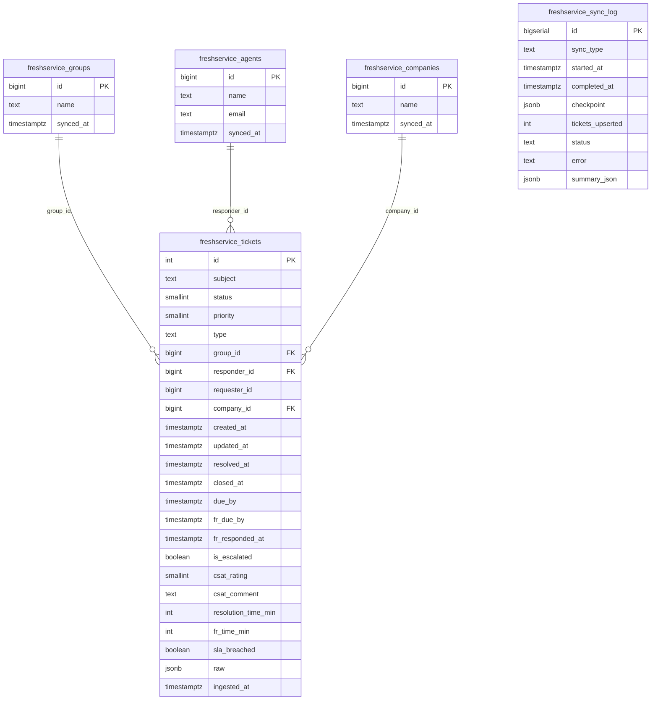
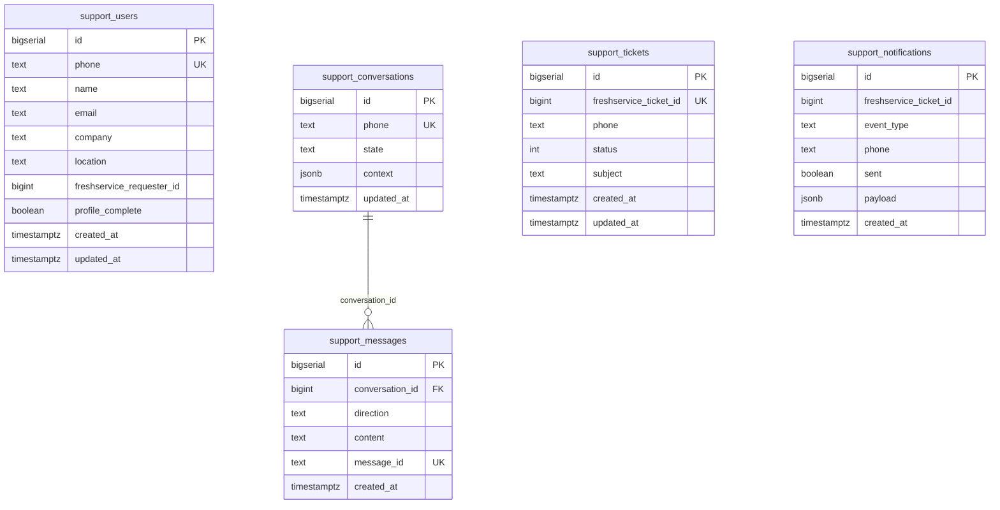
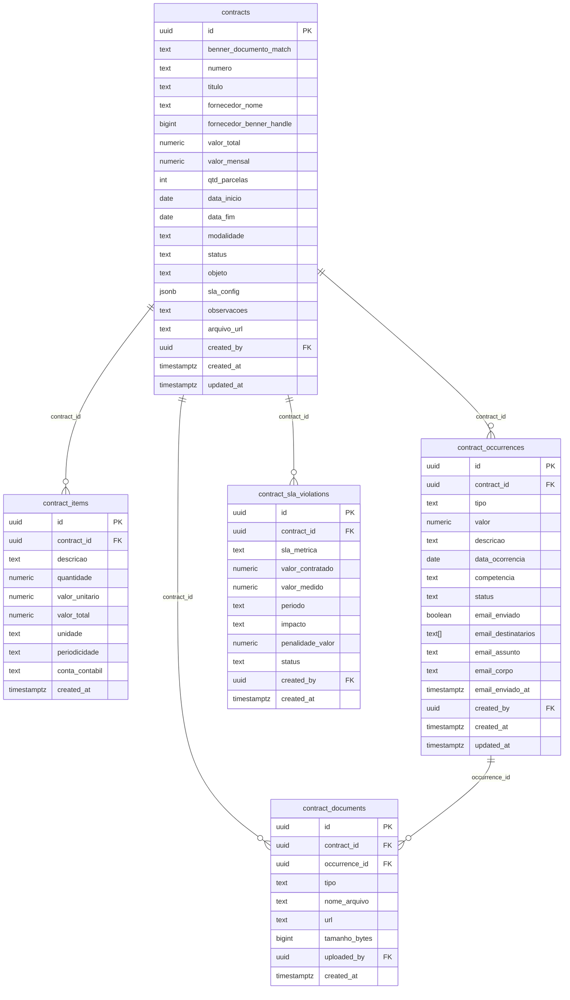
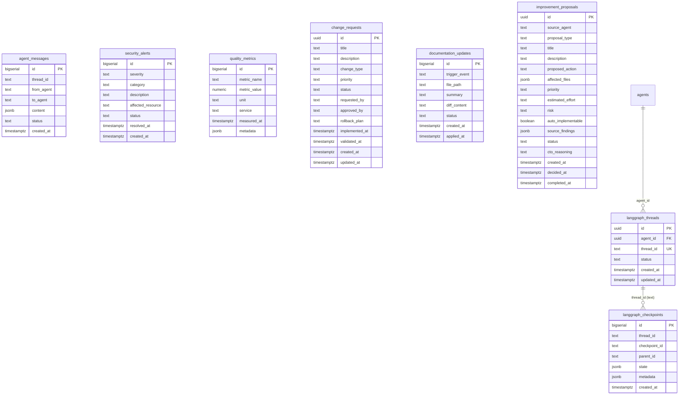
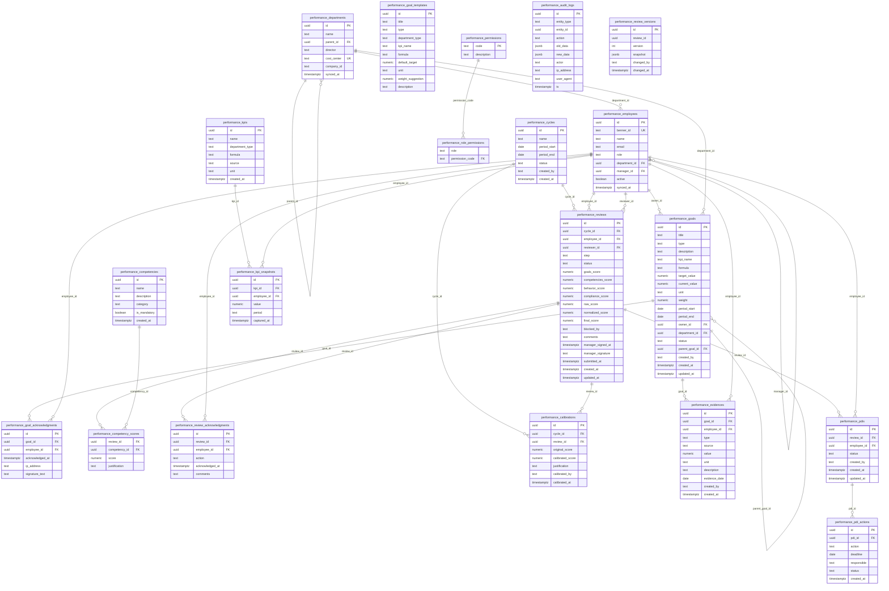
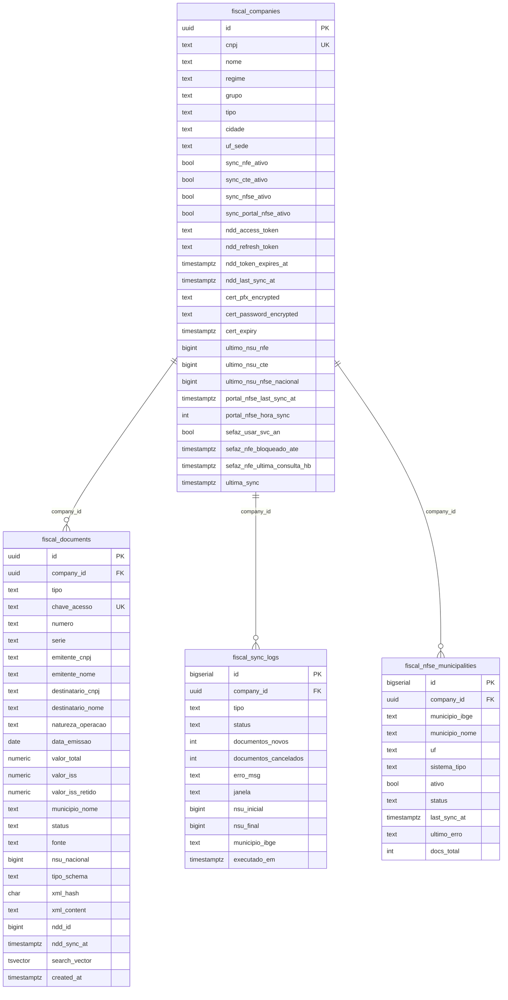

# Jarvis — Arquitetura e Documentação

## Visão Geral

Sistema interno da Voetur/VTCLog com autenticação própria e dez módulos:

| Módulo | Serviço | Porta | Descrição |
|---|---|---|---|
| Core | core-service | 8001 | Autenticação, usuários, administração |
| Monitoramento | monitoring-service | 8002 | Health checks agendados, dashboard em tempo real |
| Freshservice | freshservice-service | 8003 | Dashboard e sync de tickets do helpdesk |
| Moneypenny | moneypenny-service | 8004 | Resumo diário de e-mails e agenda via Microsoft 365 |
| ~~Agentes~~ | ~~agents-service~~ | ~~8005~~ | ❌ **DESABILITADO** — consumo excessivo CPU/RAM. Ver `agents-service/DISABLED.md` |
| Gastos TI | expenses-service | 8006 | Dashboard financeiro, PayFly viagens e Mídia & Redes Sociais |
| VoeIA | support-service | 8007 | Bot WhatsApp de suporte com abertura de chamados no Freshservice |
| Desempenho | performance-service | 8008 | Gestão de ciclos, metas, avaliações e KPIs de desempenho |
| Fiscal | fiscal-service | 8009 | Validação NFe/NFSe — sync NDD Digital, busca full-text, dashboard |
| Financeiro | financeiro-service | 8011 | Conciliação e analytics financeiro via ERP Benner (MSSQL read-only) |

### Serviços suspensos (❌ não sobem automaticamente)

| Serviço | Motivo | Localização da doc |
|---|---|---|
| `agents-service` | Consumo CPU/RAM excessivo causava lentidão geral | `agents-service/DISABLED.md` |
| `hermes-service` | CPU alta (>80%) | `hermes-service/DISABLED.md` |
| `evolution-api` | 52% CPU constante sem usuários ativos | `evolution-api-patched/DISABLED.md` |
| `ollama` | 2 GB RAM reservado em servidor com recursos limitados | `ollama/DISABLED.md` |

> ⚠️ **NÃO religar sem autorização humana explícita.** Todos usam `restart: "no"` + `profiles: ["agents"]` — não sobem no `docker compose up -d` padrão.

---

## Arquitetura

```
Browser
  └─► nginx:443 (HTTPS — frontend container)
        ├─ /api/* ─────────────────────────► Kong:8000 (interno Docker)
        │                                     ├─ /api/financeiro/*
        │                                     │     └─► financeiro-service:8011
        │                                     ├─ /api/fiscal/*
        │                                     │     └─► fiscal-service:8009
        │                                     ├─ /api/performance/*
        │                                     │     └─► performance-service:8008
        │                                     ├─ /api/auth, /api/users, /api/admin, /api/health
        │                                     │     └─► core-service:8001
        │                                     ├─ /api/monitoring/*
        │                                     │     └─► monitoring-service:8002
        │                                     ├─ /api/freshservice/*
        │                                     │     └─► freshservice-service:8003
        │                                     ├─ /api/moneypenny/*
        │                                     │     └─► moneypenny-service:8004
        │                                     ├─ /api/agents/*
        │                                     │     └─► agents-service:8005
        │                                     ├─ /api/expenses/*
        │                                     │     └─► expenses-service:8006
        │                                     └─ /api/support/*
        │                                           └─► support-service:8007
        └─ / ──────────────────────────────► SPA React (nginx serve estático)

Inter-serviço (Docker app_net):
  agents-service → freshservice-service:8003 (HTTP interno + JWT gerado em agent_runner.py)
  expenses-service → SQL Server externo 10.141.0.111:1444 (BennerSistemaCorporativo — leitura)
  performance-service → SQL Server externo 10.141.0.111:1444 (BennerRH — leitura para sync)
  financeiro-service → SQL Server 10.141.0.111\VOETUR (BennerSistemaCorporativo — leitura BI via usr_bi)

Supabase Self-Hosted (Docker app_net):
  Kong:8000 → postgrest, gotrue, realtime, storage
  postgres:5432  (127.0.0.1 — nunca exposto)
  studio:54323   (127.0.0.1 — admin local)
```

---

## Portas

| Porta | Serviço | Bind | Acesso externo |
|---|---|---|---|
| 443 | nginx (HTTPS) | 0.0.0.0 | sim |
| 80 | nginx (redirect) | 0.0.0.0 | sim |
| 8181 | nginx (Evolution API proxy) | 127.0.0.1 | **não** (restrito localhost) |
| 5432 | PostgreSQL | 127.0.0.1 | bloqueado |
| 9100 | Monitor Agent | 127.0.0.1 | bloqueado |
| 8080 | Evolution API | 127.0.0.1 | bloqueado |
| 54321 | Supabase Kong | 127.0.0.1 | bloqueado |
| 54323 | Supabase Studio | 127.0.0.1 | bloqueado |

Microsserviços (8001–8011): sem portas expostas ao host, apenas rede interna Docker.

---

## Sistema de Roles

| Role | Módulos | Permissões-chave |
|---|---|---|
| `admin` | todos | gerenciar usuários, acessar todos os dados |
| `user` | core, monitoring, freshservice, moneypenny, agents | acesso padrão |
| `rh` | desempenho | criar metas, assinar avaliações, calibrar, fechar ciclo |
| `gestor` | desempenho | criar metas, avaliar liderados, gerenciar KPIs/PDI |
| `coordenador` | desempenho | criar metas, avaliar liderados, gerenciar PDI |
| `supervisor` | desempenho | criar metas, avaliar liderados, assinar avaliação |
| `colaborador` | desempenho | assinar metas recebidas, autoavaliação, tomar ciência |

---

## Banco de Dados — MER Completo

O banco PostgreSQL (Supabase self-hosted) contém **53 tabelas** distribuídas em 6 arquivos de schema.

### Schema Core (`schema.sql`) — 10 tabelas


### Schema Freshservice (`schema_freshservice.sql`) — 5 tabelas



**Funções SQL (RPC via PostgREST):**

| Função | Parâmetros | Retorno |
|---|---|---|
| `freshservice_summary` | `p_from, p_to: timestamptz` | JSON com totais, CSAT, SLA breach, resolução média |
| `freshservice_sla_by_group` | `p_from, p_to: timestamptz` | JSON com breach % e resolução por grupo |
| `freshservice_agents_monthly` | `p_year, p_month: int` | JSON com fechamentos por agente no mês |
| `freshservice_top_requesters` | `p_from, p_to, p_limit` | JSON com empresas que mais abriram chamados |
| `freshservice_csat_summary` | `p_from, p_to: timestamptz` | JSON com NPS detalhado: happy/neutral/unhappy por grupo |
| `upsert_csat_ratings` | `p_ratings: jsonb` | int (registros atualizados) — batch update de CSAT |

### Schema VoeIA Support (`schema_support.sql`) — 5 tabelas



### Schema Governança de Contratos (`schema_governance.sql`) — 5 tabelas



### Schema Agentes / LangGraph (`schema_langgraph.sql`) — 8 tabelas



**Tipos de agente LangGraph (constraint `agents_agent_type_check`):**
`langgraph_cto`, `langgraph_log_scanner`, `langgraph_log_improver`, `langgraph_fix_validator`, `langgraph_security`, `langgraph_code_security`, `langgraph_quality`, `langgraph_quality_validator`, `langgraph_uptime`, `langgraph_docs`, `langgraph_docker`, `langgraph_frontend`, `langgraph_backend`, `langgraph_infrastructure`, `langgraph_api`, `langgraph_automation`, `langgraph_itil_version`, `langgraph_change_mgmt`, `langgraph_change_validator`, `langgraph_integration_validator`, `langgraph_scheduling`

### Schema Desempenho (`schema_performance.sql`) — 20 tabelas



**Permissões por role:**

| Permission | colaborador | supervisor | coordenador | gestor | rh |
|---|:---:|:---:|:---:|:---:|:---:|
| `acknowledge_goal` | ✓ | | | | |
| `fill_self_review` | ✓ | | | | |
| `acknowledge_review` | ✓ | | | | |
| `create_goal` | | ✓ | ✓ | ✓ | ✓ |
| `fill_manager_review` | | ✓ | ✓ | ✓ | ✓ |
| `sign_review` | | ✓ | ✓ | ✓ | ✓ |
| `manage_pdi` | | | ✓ | ✓ | ✓ |
| `manage_kpis` | | | | ✓ | ✓ |
| `close_cycle` | | | | | ✓ |
| `calibrate` | | | | | ✓ |
| `view_financial_score` | | | | | ✓ |

**Score engine (`services/score_engine.py`):**
- Pesos: `goals=50%`, `competencies=25%`, `behavior=15%`, `compliance=10%`
- Bloqueio compliance: se `compliance_score < 2.0` → `final_score` capped em `2.5`
- Dois momentos de assinatura: Momento 1 (`performance_goal_acknowledgments`) e Momento 2 (`performance_review_acknowledgments`)

---

## Inventário de Rotas por Serviço

### core-service:8001
| Método | Rota | Acesso | Descrição |
|---|---|---|---|
| POST | `/api/auth/login` | público | login + JWT |
| POST | `/api/auth/logout` | autenticado | invalida sessão |
| POST | `/api/auth/refresh` | autenticado | renova JWT |
| POST | `/api/auth/forgot-password` | público | envia e-mail reset |
| POST | `/api/auth/reset-password` | público | conclui reset |
| GET | `/api/users/me` | autenticado | perfil próprio |
| PATCH | `/api/users/me` | autenticado | atualiza perfil |
| GET | `/api/admin/users` | admin | lista usuários |
| POST | `/api/admin/users` | admin | cria usuário |
| PATCH | `/api/admin/users/{id}` | admin | edita usuário |
| DELETE | `/api/admin/users/{id}` | admin | remove usuário |
| GET | `/api/health` | público | healthcheck |

### monitoring-service:8002
| Método | Rota | Acesso | Descrição |
|---|---|---|---|
| GET | `/api/monitoring/systems` | user | lista sistemas |
| POST | `/api/monitoring/systems` | admin | cria sistema |
| GET | `/api/monitoring/systems/{id}/checks` | user | histórico de checks |
| POST | `/api/monitoring/systems/{id}/check` | admin | força check manual |
| GET | `/api/monitoring/dashboard` | user | status em tempo real |

### freshservice-service:8003
| Método | Rota | Acesso | Descrição |
|---|---|---|---|
| GET | `/api/freshservice/summary` | user | resumo por período |
| GET | `/api/freshservice/sla` | user | SLA por grupo |
| GET | `/api/freshservice/agents` | user | produtividade por agente |
| GET | `/api/freshservice/csat` | user | CSAT detalhado |
| POST | `/api/freshservice/sync` | admin | dispara sync manual |

### expenses-service:8006
| Método | Rota | Acesso | Descrição |
|---|---|---|---|
| GET | `/api/expenses/dashboard` | user | despesas por ano/filial/tipo |
| GET | `/api/expenses/forecast` | user | previsão linear + média móvel |
| GET | `/api/expenses/empresas` | user | lista filiais disponíveis |
| GET | `/api/expenses/comparativo` | user | comparação entre dois anos |
| POST | `/api/expenses/sync` | admin | sincroniza cache do Benner |
| GET | `/api/expenses/payfly/media/posts` | user | lista publicações coletadas |
| GET | `/api/expenses/payfly/media/metrics` | user | rollup mensal por plataforma |
| GET | `/api/expenses/payfly/media/daily-metrics` | user | rollup diário (últimos N dias) |
| GET | `/api/expenses/payfly/media/crisis` | user | status de crise (ok/warning/critical) |
| GET | `/api/expenses/payfly/media/categories` | user | breakdown por categoria |
| POST | `/api/expenses/payfly/media/fetch` | admin | dispara coleta imediata (trigger manual) |

### support-service:8007
| Método | Rota | Acesso | Descrição |
|---|---|---|---|
| POST | `/api/support/webhooks/whatsapp` | Evolution API | recebe mensagem WhatsApp |
| POST | `/api/support/webhooks/freshservice` | Freshservice | recebe evento de ticket |
| GET | `/api/support/conversations` | admin/support | lista conversas |
| GET | `/api/support/tickets` | admin/support | lista tickets |
| GET | `/api/support/users` | admin/support | lista usuários cadastrados |
| GET | `/api/support/health` | público | healthcheck |
| GET | `/api/support/ready` | público | readiness |

### fiscal-service:8009
| Método | Rota | Acesso | Descrição |
|---|---|---|---|
| GET | `/api/fiscal/companies` | autenticado | lista empresas |
| GET | `/api/fiscal/sync/logs` | autenticado | logs globais |
| GET | `/api/fiscal/nfse` | autenticado | busca NFSe com filtros |
| GET | `/api/fiscal/nfse/stats` | autenticado | totais por período |
| POST | `/api/fiscal/nfse/sync/run` | admin | dispara sync NFSe NDD |
| GET | `/api/fiscal/{id}/ndd/authorize-url` | admin | URL PKCE para frontend |
| GET | `/api/fiscal/ndd/callback` | público | callback OAuth NDD |
| GET | `/api/fiscal/{id}/ndd/status` | autenticado | status token NDD |
| POST | `/api/fiscal/{id}/certificates` | admin | upload cert A1 |

### performance-service:8008
| Método | Rota | Acesso | Descrição |
|---|---|---|---|
| GET | `/api/performance/goals` | todos os roles | lista metas |
| POST | `/api/performance/goals` | gestor/coord/supervisor/rh | cria meta |
| PATCH | `/api/performance/goals/{id}` | criador | atualiza meta |
| POST | `/api/performance/goals/{id}/acknowledge` | colaborador | Momento 1 — assina meta |
| GET | `/api/performance/evaluations/cycles` | todos | lista ciclos |
| POST | `/api/performance/evaluations/cycles` | rh | cria ciclo |
| GET | `/api/performance/evaluations/reviews` | todos | lista avaliações |
| POST | `/api/performance/evaluations/reviews` | rh | cria avaliação |
| PATCH | `/api/performance/evaluations/reviews/{id}` | reviewer/rh | atualiza scores |
| POST | `/api/performance/evaluations/reviews/{id}/sign` | gestor/coord/supervisor/rh | Momento 2 — assina |
| POST | `/api/performance/evaluations/reviews/{id}/acknowledge` | colaborador | Momento 2 — ciência |
| GET | `/api/performance/competencies` | todos | lista competências |
| POST | `/api/performance/competencies/{review_id}/scores` | reviewer | lança scores de competências |
| GET | `/api/performance/evidences` | todos | lista evidências |
| POST | `/api/performance/evidences` | todos | registra evidência |
| GET | `/api/performance/kpis` | gestor/rh | lista KPIs |
| POST | `/api/performance/kpis/{id}/snapshots` | gestor/rh | registra snapshot KPI |
| GET | `/api/performance/admin/employees` | rh/admin | lista colaboradores |
| POST | `/api/performance/admin/sync-benner` | rh/admin | sincroniza RH do Benner |
| GET | `/api/performance/admin/dashboard` | rh/admin | dashboard calibração |
| GET | `/api/performance/admin/audit-log` | rh/admin | trilha de auditoria |
| GET | `/api/performance/health` | público | healthcheck |
| GET | `/api/performance/ready` | público | readiness |

---

## VoeIA — support-service:8007

Bot de suporte via WhatsApp que gerencia onboarding de usuários e abertura/acompanhamento de chamados no Freshservice.

**Fluxo geral:**
```
WhatsApp user → Evolution API → POST /api/support/webhooks/whatsapp
                                       │
                                       ▼
                              ConversationFSM (13 estados)
                               ├── lookup/salva support_users
                               ├── salva support_conversations
                               └── chama FreshserviceConnector
                                       │ resposta
                                       ▼
                              Evolution API POST /message/sendText/voetur-support

Freshservice evento → POST /api/support/webhooks/freshservice?secret=…
                              │
                              ▼
                      notification_worker (idempotente)
                       └── Evolution API POST /message/sendText/voetur-support
```

**FSM — estados:**
`onboarding_email` → `onboarding_confirm_fs` | `onboarding_name` → `onboarding_company` → `onboarding_location` → `onboarding_final_confirm` → `onboarding_empresa` → `selecting_catalog` → `selecting_subcategory` → `selecting_action` → `collecting_description` → `confirming_ticket` → `idle`

**Catálogo de departamentos:**

| # | Departamento | workspace_id Freshservice |
|---|---|---|
| 1 | TI | 2 |
| 2 | Financeiro | 5 |
| 3 | RH / Pessoal | 6 |
| 4 | Operações | 13 |
| 5 | Suprimentos | 18 |

**Particularidades desta instância Freshservice (voetur1.freshservice.com):**
- Campo `empresa` é custom_field obrigatório em todos os tickets; valores: `VTC OPERADORA LOGÍSTICA (Matriz)`, `VOETUR TURISMO (Matriz)`, `VIP CARGAS BRASÍLIA (Matriz)`, `VIP SERVICE CLUB MARINA (Matriz)`, `VIP CARGAS RIO (MATRIZ)`
- Agents (admins) devem usar `requester_id` na criação de ticket — campo `email` é silenciosamente ignorado pela API
- Busca de usuário: `/requesters` primeiro, fallback `/agents` com resolução de `location_id` e `department_ids`
- `category`/`sub_category` não enviados — valores do catálogo interno não correspondem aos do Freshservice

**Deduplicação de webhook:** cache `OrderedDict` TTL 60s, limite 1000 entradas — retorna 200 imediatamente para mensagens duplicadas.

**Configuração WhatsApp:**
- Instância: `SUPPORT_WHATSAPP_INSTANCE` (default `voetur-support`)
- JID completo (`@lid` ou `@s.whatsapp.net`) passado no `sendText`
- `linkPreview: false` em todos os envios

---

## VoeIA — Changelog

### 2026-05-13 — Fix deduplicação webhook + health check Docker

**Problema:** A Evolution API entrega o mesmo evento webhook duas vezes; sem deduplicação o bot processava e respondia em duplicata. O health check do container travava indefinidamente (uvicorn sem timeout→Docker matava com ExitCode -1).

**Arquivos:** `support-service/routes/webhook.py`, `docker-compose.yml`

- `webhook.py`: adicionado `_is_duplicate(msg_id)` — cache `OrderedDict` com TTL de 60s e limite de 1000 entradas; retorna 200 imediatamente para mensagens já vistas
- `docker-compose.yml`: `urlopen` no health check recebe `timeout=4`; `start_period` aumentado de 10s para 30s

---

### 2026-05-13 — Missão 1: Auto-detecção de empresa via Freshservice

**Problema:** Após encontrar o usuário no Freshservice e confirmar os dados, o bot ainda pedia para escolher manualmente entre as 5 empresas — passo redundante.

**Arquivos:** `support-service/services/freshservice_connector.py`, `support-service/services/conversation.py`

- `freshservice_connector.py`: `search_requester_by_email()` agora extrai `company_id` e resolve o nome via `GET /companies/{id}` (novo método `_resolve_company()`); retorna campo `company_name`
- `conversation.py`: adicionado `_FS_COMPANY_TO_EMPRESA_KEY` (mapeamento nome FS → chave 1–5) e `_match_empresa_key()`; quando Freshservice retorna empresa reconhecida, o campo `empresa` é salvo automaticamente e o passo `onboarding_empresa` é pulado

**Fallback:** Se `company_id` for nulo ou o nome não bater com nenhuma chave → fluxo original (usuário escolhe manualmente).

**Mapeamento atual:**

| Nome no Freshservice | Empresa local |
|---|---|
| `voetur turismo` | VOETUR TURISMO (Matriz) |
| `vtc operadora logística` | VTC OPERADORA LOGÍSTICA (Matriz) |
| `vip cargas brasília` | VIP CARGAS BRASÍLIA (Matriz) |
| `vip service club marina` | VIP SERVICE CLUB MARINA (Matriz) |
| `vip cargas rio` | VIP CARGAS RIO (MATRIZ) |

Para adicionar/corrigir: editar `_FS_COMPANY_TO_EMPRESA_KEY` em `conversation.py`.

---

### 2026-05-13 — Missão 2: Navegação "voltar" nas fases de abertura de chamado

**Problema:** Usuário sem poder voltar ao menu de departamentos após avançar nas etapas — precisava recomeçar a conversa.

**Arquivo:** `support-service/services/conversation.py`

Adicionada função `_is_back(text)` que reconhece: `0`, `voltar`, `menu`, `início`, `inicio`.

Nos estados abaixo, digitar qualquer dessas palavras retorna imediatamente ao menu de departamentos (`selecting_catalog`) sem resetar o cadastro do usuário:

| Estado | Trigger de volta |
|---|---|
| `selecting_subcategory` | `0` / `voltar` |
| `selecting_action` | `0` / `voltar` |
| `collecting_description` | `0` / `voltar` |
| `confirming_ticket` | `0` / `voltar` |

---

### 2026-05-13 — Missão 3: Docker auto-start no boot do Windows Server

**Problema:** Após reinicialização do servidor, os containers não subiam automaticamente — `setup-autostart.ps1` nunca havia sido executado.

**Solução:** Executar como Administrador:
```powershell
Set-ExecutionPolicy -Scope Process -ExecutionPolicy Bypass
E:\claudecode\claudecode\setup-autostart.ps1
```

Isso registra a task `Jarvis-Docker-Startup` no Task Scheduler do Windows com:
- Trigger: `AtLogon` (usuário `victor.ramalho`) — WSL não suporta SYSTEM
- Ação: executa `E:\claudecode\claudecode\jarvis-startup.bat`

O script `jarvis-startup.bat`: aguarda Docker responder → `docker compose up -d`.

**Verificação:**
```powershell
Get-ScheduledTask -TaskName "Jarvis-Docker-Startup"
# State: Ready
```

**Log de execução:** `C:\Windows\Temp\jarvis-startup.log`

---

## Módulo Gastos TI — expenses-service:8006

Lê ERP Benner via `pyodbc` (SQL Server `10.141.0.111:1444`, `BennerSistemaCorporativo`).

- **Filtro base**: `PAR.EMPRESA = 1` + `K_GESTOR = 23` (gestor de TI)
- **Endpoints**: `GET /api/expenses/dashboard?year=&filial=&tipo=` · `GET /api/expenses/forecast` · `GET /api/expenses/empresas` · `GET /api/expenses/comparativo?ano1=&ano2=`
- **Forecast**: regressão linear + média móvel 3m, pure Python
- **Resiliência**: `CircuitBreaker("benner")` + `@sql_retry` (3 tentativas, 2s→10s backoff) em `services/resilience.py`; `TTLCache(ttl=300)` nos serviços pesados; cache Supabase via `POST /api/expenses/sync`
- **PayFly (despesas Benner)**: apenas pagamentos liquidados (`DATALIQUIDACAO IS NOT NULL`); separação entre despesas contratuais e eventuais; suporte a parcelas pendentes

### PayFly Viagens — API V2

Integração com a API PayFly de reservas corporativas (voos e hotéis), separada do módulo Benner.

**Client** (`services/payfly_v2_client.py`):
- URL base: `https://integrations-api.payfly.com.br`
- Auth: `POST /api/auth/token` com `clientId` + `clientSecret` → Bearer token com cache thread-safe (renova 2 min antes do vencimento)
- `get_reservation_ids(start, end)` → IDs agrupados por status: `emitidos`, `cancelados`, `reservados`, `expirados`
- `get_reservation_detail(id, type)` → detalhe completo da reserva
- `sync_date_range(start, end)` → busca IDs + detalhes em paralelo (5 workers), faz upsert em batches de 50 na tabela `payfly_reservations`
- Flatten: 68 campos mapeados do JSON aninhado → schema plano no Supabase

**Scheduler** (`services/payfly_scheduler.py`):
- APScheduler embutido no expenses-service (não depende do agents-service)
- Job `payfly_reservations_daily`: cron **04:00 BRT** todo dia, sincroniza o dia anterior (`date.today() - 1`)
- Incremental puro — nunca re-processa mais de 1 dia por execução automática

**Endpoints** (`routes/payfly_reservations.py`):

| Método | Path | Descrição |
|---|---|---|
| GET | `/api/expenses/payfly/reservations/stats` | KPIs agregados (total, por status, por empresa) via RPC |
| GET | `/api/expenses/payfly/reservations/dashboard` | Top-10 solicitantes por valor e quantidade |
| GET | `/api/expenses/payfly/reservations/` | Lista paginada com filtros (status/tipo/empresa/datas) |
| GET | `/api/expenses/payfly/reservations/{id}` | Detalhe completo de uma reserva |
| POST | `/api/expenses/payfly/reservations/sync` | Sync manual de um período (máx. 31 dias) — background |
| POST | `/api/expenses/payfly/reservations/sync/bulk` | Carga histórica desde `start_date` até ontem — background |

**Schema** (`migrations/003_payfly_reservations.sql`): tabela `payfly_reservations` com 92 colunas + `raw_json` jsonb. Índices em `status`, `type`, `company_name`, `choice_date`, `travel_start_date`, `total_amount`.

**Frontend** (`PayFlyPage.tsx` — tabs Dashboard e Vendas):
- Período padrão: `2026-01-01` → hoje
- Botão **"Carga Histórica (jan/2026→hoje)"**: dispara `sync/bulk` desde 01/01/2026, sobrescreve dados existentes via upsert
- Botão **"Sincronizar período"**: sync do intervalo selecionado nos filtros

---

### PayFly Mídia & Redes Sociais

Pipeline de monitoramento reputacional completamente embutido no **expenses-service** (independente do agents-service).

**Pipeline** (`services/media_pipeline.py`) — 8 etapas:
1. `fetch_all()` — RSS paralelo: Google News (×2), Bing News, Reddit, Reclame Aqui, Skift, Panrotas, Startups BR, Finsiders, BrasilTuris, RevistaHoteis, DiárioTurismo, MercadoEventos
2. `extract_full_articles()` — newspaper3k/BS4 nos top-10 mais relevantes
3. `classify_articles_llm()` — Gemini 2.0 Flash → `category` + `sentiment_label` (opcional: requer `GOOGLE_API_KEY`)
4. `embed_articles()` — text-embedding-004 → vector(768) via pgvector (opcional: requer `GOOGLE_API_KEY`)
5. `_store()` — bulk upsert em `payfly_media_posts` (deduplicação por URL)
6. **`_recompute_metrics()`** — relê banco para os meses/datas afetados e reconstrói: `payfly_media_metrics` (mensal × plataforma) + `payfly_media_daily_metrics` (diário, todas plataformas)
7. `detect_crisis()` — compara 24h vs baseline 30d
8. `send_crisis_webhook()` — POST ao webhook configurado se `warning` ou `critical`

**Scheduler** (`services/media_scheduler.py`):
- APScheduler embutido no expenses-service — **não depende do agents-service**
- Job `payfly_media_6h`: cron **a cada 6h** (00h, 06h, 12h, 18h BRT)
- `misfire_grace_time=600s`

**Tabelas:**
| Tabela | Conteúdo |
|---|---|
| `payfly_media_posts` | Artigos coletados — upsert por URL |
| `payfly_media_metrics` | Rollup mensal: `platform × ref_month`, contagens pos/neg/neutro |
| `payfly_media_daily_metrics` | Rollup diário: `date`, contagens combinadas de todas as plataformas |

**Frontend** (`PayFlyPage.tsx` — tab Mídia & Redes Sociais):
- Banner de status reputacional (🟢 Estável / 🟡 Atenção / 🔴 Crise)
- KPIs mensais com comparativo mês anterior
- Gráfico de tendência diária (30 dias) + breakdown por categoria
- Lista de publicações com filtros por sentimento e categoria
- **Botão "Coletar agora"** — chama `POST /api/expenses/payfly/media/fetch` (admin), exibe resultado e recarrega dados
- **Botão "Recarregar"** — relê endpoints sem nova coleta

---

## Módulo Desempenho — performance-service:8008

Gestão completa de ciclos de avaliação de desempenho com avaliação do gestor, auto-avaliação, ciência digital/presencial, calibração e indicadores por nível hierárquico.

**Sincronização Benner RH:**
- APScheduler cron diário 02:00 em `services/benner_sync.py`
- Lê `BennerRH` via `pyodbc` (variável `SQL_SERVER_BENNER_HR_DB`)
- Popula `performance_departments` e `performance_employees`
- CircuitBreaker + sql_retry idêntico ao expenses-service

**Níveis hierárquicos e indicadores:**

| Nível | Role | Indicadores |
|-------|------|-------------|
| 1 — Gerente | `gerente` | 10 indicadores estratégicos (AVD.N1) |
| 2 — Coord./Supervisor | `coordenador_supervisor` | 10 indicadores táticos (AVD.N2) |
| 3 — Adm./Operacional | `administrativo_operacional` | 10 ind. admin (N3.3.1) + 10 operacional (N3.3.3) |

**Ciclo de avaliação:**
```
draft → open → closed
```

**Fluxo de avaliação do gestor:**
1. RH cria e abre ciclo → clica "Enviar Avaliações"
2. Tokens criados em `performance_evaluation_tokens` → e-mail enviado ao gestor
3. Gestor acessa `/avaliar/{token}` → preenche scores + justificativas (mín. 10 palavras em nota 1 ou 5) + observação opcional
4. Submit: `performance_reviews` (status=completed) + `performance_indicator_scores`
5. Colaborador toma ciência via e-mail (`/ciencia/{token}`) ou presencialmente (`/ciencia-presencial`)
6. RH pode calibrar nota final (auditado)

**Fluxo de auto-avaliação:**
1. RH clica "Enviar Auto-Avaliações" (botão segregado, violeta)
2. Tokens criados em `performance_self_evaluation_tokens` para TODOS os colaboradores ativos (L1+L2+L3)
3. Colaborador acessa `/auto-avaliar/{token}` → preenche scores por indicador
4. Justificativas e observação 100% opcionais (sem mínimo de palavras)
5. Submit: `performance_reviews` com `is_self_evaluation=True`, `evaluator_id=employee_id`
6. Dashboard mostra % de conclusão de auto-avaliações; Gestão RH mostra status por colaborador

**Ciência presencial:**
- Página `/desempenho` → aba "Ciência Presencial" (integrada, não mais item standalone no menu)
- Também acessível via link direto `/ciencia-presencial` (URL pública preservada)

**Status da revisão (simplificado):**
```
pending → completed → acknowledged | calibrated
```

**Tabelas principais:**

| Tabela | Descrição |
|--------|-----------|
| `performance_cycles` | Ciclos de avaliação (draft/open/closed) |
| `performance_employees` | Colaboradores com nível hierárquico |
| `performance_indicators` | Indicadores por nível (hierarchy_level 1/2/3) |
| `performance_evaluation_tokens` | Tokens de avaliação do gestor |
| `performance_self_evaluation_tokens` | Tokens de auto-avaliação (todos os níveis) |
| `performance_reviews` | Avaliações (is_self_evaluation distingue tipo) |
| `performance_indicator_scores` | Scores individuais por indicador + justificativa |
| `performance_review_acknowledgments` | Ciência digital do colaborador |
| `performance_calibrations` | Histórico de calibrações do RH |
| `performance_audit_logs` | Trilha de auditoria completa |

**Validações backend críticas (public.py):**
- Nota extrema (1 ou 5) → justificativa com mínimo **10 palavras** (somente avaliação do gestor)
- Observação do gestor: opcional (campo `observations` nullable)
- Auto-avaliação: sem nenhuma validação de justificativa ou observação

---

## Observabilidade

- `app_logs.trace_id` — correlaciona logs entre serviços pelo mesmo `X-Trace-ID`
- `run_error_growth_check()` em `monitoring-service/services/log_monitor.py` — roda a cada 6h, detecta crescimento ≥ 80% de erros e abre GitHub issue
- `/ready` padronizado: `{status, service, uptime_seconds, components: {...}}`
- Índice em `agent_messages(to_agent, status, created_at)` para performance de consultas
- `performance_audit_logs` — trilha de auditoria para todas as operações de escrita no módulo de desempenho

---

## Módulo Fiscal — fiscal-service:8009

Validação e visualização de documentos fiscais (NFe, CTe, NFSe). Fontes: **NDD Digital** (OAuth2 OData), **Portal Nacional NFS-e** (ADN — gov.br/nfse, mTLS ICP-Brasil) e **SEFAZ DistDFeInt** (SOAP via zeep). Interface completa com 5 tabs: Dashboard, NFSe, NFe/CTe, Sync e Certificados.

### Empresas cadastradas

| Grupo | CNPJ | Cidade/UF | NFe | CTe | NFSe |
|---|---|---|:---:|:---:|:---:|
| VTC (Matriz) | 24.893.687/0001-08 | Brasília/DF | ✓ | ✓ | — |
| VTC (Filial) | 24.893.687/0002-80 | Rio de Janeiro/RJ | ✓ | ✓ | — |
| VTC (Filial) | 24.893.687/0003-61 | Recife/PE | ✓ | ✓ | — |
| VTC (Filial) | 24.893.687/0011-71 | Guarulhos/SP | ✓ | ✓ | — |
| VTC (Filial) | 24.893.687/0014-14 | Contagem/MG | ✓ | ✓ | — |
| VTC (Filial) | 24.893.687/0015-03 | Brasília fil./DF | ✓ | ✓ | — |
| VTC (Filial) | 24.893.687/0017-67 | Campinas/SP | ✓ | ✓ | — |
| Voetur (Matriz) | 01.017.250/0001-05 | Brasília/DF | ✓ | — | ✓ |
| Voetur (Filial RJ) | 01.017.250/0008-73 | Rio de Janeiro/RJ | ✓ | — | ✓ |
| Voetur (Filial SP) | 01.017.250/0013-30 | São Paulo/SP | ✓ | — | ✓ |
| Payfly (Matriz) | 66.649.752/0001-96 | São Paulo/SP | — | — | — (sem cert A1) |

### Schema (`fiscal_documents` + `fiscal_companies`)



**Campos `fiscal_companies`:**
- `grupo`: `vtclog` | `voetur` | `payfly`
- `tipo`: `matriz` | `filial`
- `cert_pfx_encrypted`: certificado A1 Fernet-encrypted (nunca armazenado como arquivo)
- `ndd_refresh_token`: permite renovação automática do token NDD sem interação humana
- `fonte` em `fiscal_documents`: `ndd` | `portal_nacional` | `sefaz`
- `tipo_schema`: `resumo` (resNFe — sem XML completo) | `completo` (procNFe)
- `xml_hash`: SHA-256 hex do XML original — compliance fiscal 5-6 anos
- `sefaz_nfe_bloqueado_ate`: preenchido quando cStat 656 (consumo excessivo ADN/SEFAZ); sync ignorado enquanto no futuro
- `sefaz_nfe_ultima_consulta_hb`: heartbeat da última consulta SEFAZ — alerta se > 55 dias (perda permanente de documentos após 60 dias)
- `portal_nfse_hora_sync`: hora (0-23, horário Brasília) em que o sync automático do Portal Nacional roda para esta empresa

**Full-text search:** trigger `tsvector_update_fiscal_documents` mantém `search_vector` atualizado; pesos A=nomes, B=natureza, C=município, D=número/chave. Índice GIN + `pg_trgm` para CNPJ parcial.

**RPCs:**
- `fiscal_nfse_search(p_query, p_company_id, p_limit, p_offset)` — busca full-text com ranking por relevância
- `fiscal_nfse_stats(p_company_id, p_ano, p_mes)` — totais agregados: count, valor_total, valor_iss, por_municipio, por_status

**`chave_acesso`:** coluna `text` (não `varchar(44)`) — NFSe do Portal Nacional usam chaves maiores que 44 chars.

**`fiscal_nfse_municipalities`:** tabela de configuração de municípios por empresa para sync via API municipal direta (Nota Carioca RJ, Paulistana SP, ISS-DF). Seed via `POST /{id}/municipalities/seed` (popula 32 municípios do registry NDD). `sistema_tipo`: `nddigital` | `carioca` | `paulistana` | `df`.

**Certificados A1:** upload via `POST /{id}/certificates` valida o PKCS12 contra a senha **antes** de salvar — erro 400 imediato se senha incorreta.

### Jobs APScheduler

| Horário | Job | Escopo |
|---|---|---|
| 02:00 | `_sync_all_companies` | NFe + CTe de todas as empresas com cert A1 |
| 04:00 | `_sync_retry_errors` | Reprocessa empresas com erro na janela 02:00 |
| 05:00 | `_sync_nfse_ndd_incremental` | NFSe via NDD Digital (watermark `ndd_last_sync_at`) |
| toda hora cheia | `_sync_portal_nfse` | Portal Nacional NFS-e (ADN) — filtra empresas por `portal_nfse_hora_sync == hora_atual` |

**Sync NFSe NDD:** uma conta NDD cobre todas as empresas do grupo. O job busca empresa com `sync_nfse_ativo=True` e token válido, faz OData incremental por `dataProcessamento >= ndd_last_sync_at`, mapeia `cnpj_tomador → company_id`. Rate limit: `XML_WORKERS=2`, `INTER_PAGE_SLEEP=2s` (~3 notas/s).

**Sync Portal Nacional NFS-e (ADN):**
- Autenticação: mTLS com certificado ICP-Brasil A1 — sem headers extras
- Endpoint: `GET https://adn.nfse.gov.br/contribuintes/DFe/{NSU:015d}` (NSU incremental por CNPJ)
- Limite: 256 req/hora; `time.sleep(2)` entre lotes
- cStat 137 = sem novos; 138 = ok; 656 = bloqueio 1h → persiste em `sefaz_nfe_bloqueado_ate`
- Schemas: `procNFse` (completo) | `resNFse` (resumo) | `procEventoNFse` (cancelamento)
- NSU salvo por batch → retoma exatamente de onde parou

**Sync SEFAZ NF-e (DistDFeInt):**
- SOAP via zeep; WSDL `https://www1.nfe.fazenda.gov.br/NFeDistribuicaoDFe/NFeDistribuicaoDFe.asmx`
- Limite: 20 req/hora + 600 req/5min; `time.sleep(3)` entre lotes
- cStat 656 → `sefaz_nfe_bloqueado_ate` + skip automático nas próximas execuções
- Heartbeat: alerta em log se > 55 dias sem consultar (perda irreversível após 60 dias)
- Schema 15 = `resNFe` (resumo, sem XML); schema 55 = `procNFe` (completo)
- SVC-AN: ativável por empresa via `sefaz_usar_svc_an=true`

**Backoff exponencial:** `retry_utils.with_backoff()` aplicado a NDD (listing OData + download XML individual) e ADN (requisições mTLS). Estratégia: 5s → 10s → 20s para erros de rede transientes (Timeout, ConnectionError). Auth errors e cStat 656 falham imediatamente.

**Certificados A1:** nunca armazenados como arquivo — encriptados com Fernet (`CERT_ENCRYPTION_KEY`), decriptados para tempfile apenas durante o sync (context manager `extract_pem_for_requests`), deletados após uso.

### Rotas fiscal-service:8009

**Documentos e busca:**
| Método | Rota | Acesso | Descrição |
|---|---|---|---|
| GET | `/api/fiscal/companies` | autenticado | lista empresas com status sync/token |
| GET | `/api/fiscal/sync/logs` | autenticado | logs globais (todas as empresas) |
| GET | `/api/fiscal/sync/status` | autenticado | status consolidado por empresa e tipo de sync (com flag `is_stuck`) |
| GET | `/api/fiscal/nfse` | autenticado | busca NFSe/NFe/CTe com filtros: tipo, fonte, status, CNPJ, período, full-text |
| GET | `/api/fiscal/nfse/stats` | autenticado | totais por período (count, valor, ISS, município) |
| POST | `/api/fiscal/fetch-by-key` | autenticado | busca por chave de acesso: banco → ADN → SEFAZ; salva se encontrado |

**Exportação:**
| Método | Rota | Acesso | Descrição |
|---|---|---|---|
| GET | `/api/fiscal/nfse/export/csv` | autenticado | CSV UTF-8 BOM com filtros tipo/fonte/período (para Excel) |
| GET | `/api/fiscal/nfse/export/xml` | autenticado | ZIP com XMLs originais dos documentos |

**Sync e agendamento:**
| Método | Rota | Acesso | Descrição |
|---|---|---|---|
| POST | `/api/fiscal/nfse/sync/run` | admin | dispara sync NFSe NDD imediatamente |
| POST | `/api/fiscal/portal-nfse/sync/run` | admin | dispara sync Portal Nacional NFS-e (empresa ou todas) |
| GET | `/api/fiscal/{id}/portal-nfse/logs` | autenticado | últimas 5 tentativas de sync NFSe_Portal desta empresa |
| POST | `/api/fiscal/{id}/ndd/sync` | admin | sync NDD manual imediato para esta empresa |
| POST | `/api/fiscal/{id}/nfse/sync/all` | admin | sync unificado: NDD + Portal Nacional + Municipal Direto em paralelo |

**NDD Digital:**
| Método | Rota | Acesso | Descrição |
|---|---|---|---|
| GET | `/api/fiscal/{id}/sync/logs` | autenticado | logs de sync de uma empresa |
| POST | `/api/fiscal/{id}/ndd/token` | admin | salva access_token manualmente (DevTools) |
| GET | `/api/fiscal/{id}/ndd/authorize-url` | admin | retorna URL PKCE com `offline_access` |
| GET | `/api/fiscal/{id}/ndd/authorize` | admin | redireciona para auth NDD (PKCE completo) |
| GET | `/api/fiscal/ndd/callback` | público | recebe código NDD, troca por tokens |
| GET | `/api/fiscal/{id}/ndd/status` | autenticado | status do token NDD |

**Municípios NFSe (API direta):**
| Método | Rota | Acesso | Descrição |
|---|---|---|---|
| GET | `/api/fiscal/{id}/municipalities` | autenticado | lista municípios configurados para esta empresa |
| POST | `/api/fiscal/{id}/municipalities/seed` | admin | popula 32 municípios do registry NDD para esta empresa |
| PATCH | `/api/fiscal/{id}/municipalities/{ibge}/activate` | admin | ativa município para sync direto |
| PATCH | `/api/fiscal/{id}/municipalities/{ibge}/deactivate` | admin | desativa município |
| POST | `/api/fiscal/{id}/municipalities/{ibge}/test` | admin | testa conexão com API do município (sandbox opcional) |
| POST | `/api/fiscal/{id}/municipalities/sync` | admin | sync direto pelos municípios ativos (não-nddigital) |

**Certificados e configurações:**
| Método | Rota | Acesso | Descrição |
|---|---|---|---|
| POST | `/api/fiscal/{id}/certificates` | admin | upload certificado A1 (PFX + senha → Fernet-encrypted; valida PKCS12 antes de salvar) |
| GET | `/api/fiscal/{id}/certificates/status` | autenticado | status: validade, sync_portal_nfse_ativo, hora_sync, bloqueado_ate |
| DELETE | `/api/fiscal/{id}/certificates` | admin | remove certificado |
| PATCH | `/api/fiscal/{id}/portal-nfse/settings` | admin | atualiza `sync_portal_nfse_ativo` e/ou `portal_nfse_hora_sync` |
| POST | `/api/fiscal/{id}/sync/run` | admin | dispara sync NFe/CTe manual |

### Conexão NDD Digital (OAuth2 PKCE)

Fluxo para obter `refresh_token` permanente (feito **uma única vez** por conta NDD):

```
1. Admin clica "Conectar NDD Digital" no Jarvis (aba Sync)
2. Jarvis chama GET /api/fiscal/{id}/ndd/authorize-url (gera PKCE state)
3. Abre popup → NDD Identity Server (login com credenciais NDD)
4. NDD redireciona → GET /api/fiscal/ndd/callback?code=…&state=…
5. fiscal-service troca code → access_token + refresh_token (offline_access)
6. Tokens salvos em fiscal_companies → renovação automática a cada sync
7. Popup fecha e envia postMessage ao Jarvis confirmando conexão
```

Após isso: `_get_ndd_token(company_id)` em `nfse_fetcher.py` auto-renova usando `refresh_token` via `POST /connect/token` (grant_type=`refresh_token`).

---

## Integrações externas

- **Microsoft 365 / Azure AD**: app Moneypenny, tenant `fb902eca-dc08-4dec-9e2c-7ce70ee14cf5`
- **ERP Benner**: SQL Server `10.141.0.111:1444`, banco `BennerSistemaCorporativo`, user `usr_jarvis_read`
- **Benner RH**: SQL Server `10.141.0.111:1444`, banco configurado via `SQL_SERVER_BENNER_HR_DB`, user `usr_jarvis_read`
- **Freshservice**: `voetur1.freshservice.com`, autenticação via API key
- **WhatsApp**: Evolution API (instâncias `voetur` e `voetur-support`)
- **SMTP**: `smtp.office365.com`, `noreply@voetur.com.br`
- **NDD Digital**: `spaceportalprod.e-datacenter.nddigital.com.br` — portal fiscal NFe/CTe/NFSe; OAuth2 PKCE via `ndd-identity-space-gateway`; token TTL 1800s + refresh automático

---

## Infraestrutura — PostgreSQL (Tuning 2026-05-25)

Parâmetros aplicados via `command:` no `docker-compose.yml` (seção `db`):

| Parâmetro | Valor | Motivo |
|---|---|---|
| `listen_addresses` | `*` | **Crítico** — sem isso PostgreSQL recusa conexões TCP da rede Docker |
| `shared_buffers` | `256MB` | Cache compartilhado (~25% RAM disponível) |
| `effective_cache_size` | `4GB` | Hint ao planner sobre cache total do SO |
| `work_mem` | `6MB` | Reduzido com max_connections=200 (200×6=1.2 GB max) |
| `maintenance_work_mem` | `128MB` | VACUUM, CREATE INDEX |
| `wal_buffers` | `16MB` | Buffer WAL antes de flush |
| `random_page_cost` | `1.5` | Favorece index scans (SSD) |
| `effective_io_concurrency` | `200` | Prefetch paralelo (NVMe) |
| `checkpoint_completion_target` | `0.9` | Suaviza I/O de checkpoint |
| `default_statistics_target` | `200` | Estimativas mais precisas no planner |

CPU do container `db` aumentado de `1` → `1.5`.

> ⚠️ O parâmetro `listen_addresses=*` **deve ser o primeiro** na lista `command:`. Se omitido, PostgreSQL escuta apenas `localhost` e recusa toda conexão TCP dos serviços Docker → todos os serviços falham com `PGRST000: Connection refused`.

---

## Banco de Dados — Otimizações 2026-05-25

Scripts: `fix_missing_columns.sql` e `optimize_queries.sql` na raiz do projeto.

### Colunas adicionadas (`fix_missing_columns.sql`)

5 colunas que estavam faltando e causavam loops de erro (42703) em múltiplos serviços (~614 rollbacks/ciclo):

| Tabela | Coluna | Tipo |
|---|---|---|
| `monitored_systems` | `consecutive_down_count` | `integer DEFAULT 0` |
| `monitored_systems` | `validation_status` | `text` |
| `performance_cycle_reopens` | `created_at` | `timestamptz DEFAULT now()` |
| `profiles` | `teams_chat_id` | `text` |
| `profiles` | `teams_mode` | `text DEFAULT 'individual'` |

### Índices criados (`optimize_queries.sql`)

| Tabela | Índice | Motivo |
|---|---|---|
| `freshservice_sync_log` | `idx_fsl_started_at` | 188 seq_scans — order by started_at DESC |
| `freshservice_sync_log` | `idx_fsl_sync_type_started_at` | filtro sync_type + order |
| `monitored_systems` | `idx_monitored_systems_enabled` (parcial) | 100% seq_scan no dashboard |
| `payfly_reservations` | `idx_pf_res_status_choice_date` | listagem com filtro status |
| `payfly_reservations` | `idx_pf_res_company_choice_date` | filtro por empresa |
| `freshservice_tickets` | `idx_fst_updated_at` | sync incremental por updated_at |
| `freshservice_tickets` | `idx_fst_workspace_updated` | sync por workspace_id |

### Índices removidos (duplicatas)

3 índices duplicados em `fiscal_documents` que dobrariam o custo de INSERT/UPDATE/DELETE:
`idx_fiscal_docs_chave`, `idx_fiscal_docs_emit_cnpj`, `idx_fiscal_docs_dest_cnpj`

### Funções reescritas

**`fiscal_nfse_stats`**: reescrita de 3 passes separados para 1 CTE único. `EXTRACT(YEAR FROM data_emissao)` substituído por comparação com range `timestamptz` → planner usa índice btree em `data_emissao`. Tempo de resposta: ~3-4s → <100ms.

**`payfly_dashboard`**: `choice_date::date` substituído por `choice_date >= p_start_date::timestamptz` → elimina cast linha-a-linha, índice btree passa a ser utilizado.

### Freshservice sync — batch size

`freshservice-service/services/freshservice.py`: `_UPSERT_BATCH` aumentado de `5` → `50` (10× menos chamadas ao Supabase por sync).

---

## Fiscal — Correções e Melhorias 2026-05-27

### Problema 1: Navegação entre módulos quebrada

**Causa**: `<Suspense fallback={<PageLoader />}>` envolvia o `<Routes>` inteiro em `App.tsx`. Ao navegar para uma página lazy ainda não carregada, o React substituía o layout completo (sidebar + header) pelo spinner. O usuário via tela vazia sem perceber que a navegação havia funcionado.

**Fix**: Suspense movido para dentro de `AppLayout`, envolvendo apenas o `<Outlet />`:

```tsx
// frontend/src/components/AppLayout.tsx
<main className="flex-1 overflow-auto bg-gray-50 dark:bg-gray-950">
  <Suspense fallback={<div className="flex items-center justify-center h-64">...</div>}>
    <Outlet />
  </Suspense>
</main>
```

Resultado: sidebar e header permanecem visíveis durante qualquer transição de página. O spinner aparece apenas na área de conteúdo.

### Problema 2: XML exibido em uma única linha

**Causa**: XML armazenado sem indentação. O `<pre>` preserva espaços existentes mas não os cria.

**Fix**: Função `formatXml()` adicionada em `FiscalPage.tsx` — indenta com base em abertura/fechamento de tags, aplicada no `<pre>` do modal de detalhe. Funciona para todos os documentos existentes e novos sem alteração no banco.

### Problema 3: Dashboard lento / dropdown demora

**Causa**: `loadStats()` era chamado sem empresa selecionada, disparando `fiscal_nfse_stats` com `p_company_id = NULL` (agrega todos os documentos de todas as empresas desnecessariamente).

**Fix**:
- Guard: `if (!token || !selectedId) return;` no início de `loadStats()`
- Estado `companiesLoading` no dropdown: mostra "Carregando empresas…" com disabled durante o fetch

### CI TypeScript — erros corrigidos (2026-05-27)

| Arquivo | Erro | Fix |
|---|---|---|
| `PublicCienciaPage.tsx` | `BRAND`, `BRAND_DARK` não usados; `vtc` declarado como prop mas nunca usado, causando `Cannot find name 'vtc'` | Removidos |
| `PublicEvaluationPage.tsx` | `BRAND`, `BRAND_DARK` não usados | Removidos |
| `PublicSelfEvaluationPage.tsx` | `employeeName` no destructuring mas nunca lido | Removido do destructuring |

### Backup PostgreSQL — Correção do banco `evolution` (2026-05-26)

`scripts/backup.ps1` reescrito:
- Backup do volume Docker do Evolution API removido — container desabilitado, volume vazio, gerava `.tar.gz` de 0 bytes silenciosamente
- Adicionado `pg_dump -d evolution` direto no `jarvis-db-1` → banco WhatsApp (8.7 MB) salvo diariamente como `evolution_db_${TIMESTAMP}.dump`
- Função `assert-size`: valida tamanho mínimo e faz `exit 1` se abaixo do limite (Task Scheduler marca job como falho)
- Thresholds: postgres ≥ 10 MB, evolution_db ≥ 0.05 MB

---

## Migração de Servidor — 2026-05-29

### Novo servidor: 10.140.0.220 (VOET-SVM140220)

Migração concluída do servidor antigo (`10.61.10.100`) para o novo (`10.140.0.220`).

- **DNS**: `jarvis.voetur.com.br` deve apontar para `10.140.0.220` (atualização pendente no AD DNS `VOET-SVM140005` após 2026-05-29)
- **DNS Server**: `VOET-SVM140005.grupovoetur.local (10.140.0.5)` — via AD DNS Manager ou `dnscmd . /RecordAdd voetur.com.br jarvis A 10.140.0.220`
- **Acesso temporário via IP**: enquanto DNS não propagar, adicionar `10.140.0.220 jarvis.voetur.com.br` no `hosts` local; ou acessar `https://10.140.0.220` (cert warning esperado)
- **Pós-DNS**: reverter `VITE_API_URL` no `.env` para `https://jarvis.voetur.com.br` e rebuildar frontend (`docker compose up -d --build frontend`)

### Resilência e limites de recursos

Todos os containers passaram a ter `memswap_limit` explícito (= `mem_limit`) — swap desabilitado por container, evitando degradação silenciosa de performance. Hermes-service e evolution-api movidos para `profiles: ["disabled"]` — nunca sobem no `docker compose up -d` padrão.

---

## Hardening de Segurança — 2026-05-29

### Vulnerabilidades corrigidas

| Área | Problema | Fix |
|---|---|---|
| `kong.yml` | Chaves `anon` e `service_role` hardcoded no git | Substituídas por `${ANON_KEY}` e `${SERVICE_ROLE_KEY}` (lidas do `.env` em runtime) |
| `kong.yml` | CORS global com `origins: ["*"]` + `credentials: true` | Restrito a `["https://jarvis.voetur.com.br", "https://10.140.0.220"]` |
| `docker-compose.yml` | Porta `8181` (Evolution API proxy) exposta em `0.0.0.0` | Restrita a `127.0.0.1:8181` |
| `core-service/routes/auth.py` | Filter injection: `.or_(f"username.eq.{identifier}")` permitia injeção PostgREST | Substituído por duas queries `.eq()` separadas |
| `core-service/routes/auth.py` | `GET /profile` retornava `anthropic_api_key` em plaintext | Mascarado: retorna `sk-...xxxx` (últimos 4 chars) |
| `core-service/routes/auth.py` | `smtplib.SMTP()` sem timeout — bloqueava thread indefinidamente | Adicionado `timeout=15` |
| `core-service/routes/auth.py` | `smtp.ehlo()` antes de `starttls()` redundante (smtplib já faz internamente) | Removido; mantido apenas o pós-TLS (RFC 3207) |
| `performance-service/services/email.py` | `smtp.ehlo()` ausente **após** `starttls()` | Adicionado (RFC 3207 — re-greeting obrigatório) |

### Pendente (não alterado por decisão do usuário)

- Rotação de chaves JWT Supabase (`anon` e `service_role`)
- Certificados SSL/TLS
- Senhas de banco e serviços externos

---

## Correção de Encoding — 2026-05-29

### Problema

Dados migrados do servidor antigo apresentavam caracteres especiais corrompidos em todo o sistema. Exemplo: `Representa├º├╡es` em vez de `Representações`. Causa: bytes UTF-8 interpretados como CP850 (terminal DOS) foram copiados e persistidos como Unicode literal no banco.

### Escopo da correção

| Tabela | Registros corrigidos |
|---|---|
| `fiscal_companies` (nome + cidade) | 16 |
| `fiscal_documents` (emitente, destinatário, município, xml) | 70.187 |
| `fiscal_nfse_municipalities` | 42 |
| `freshservice_tickets.subject` | 2.890 |
| `freshservice_groups` | 5 |
| `payfly_reservations` (12 colunas) | ~4.300 |
| `payfly_media_posts` | 211 |
| `monitored_systems` | 2 |
| `performance_*` | 26 |
| `app_logs` | 5 |
| **Total** | **~77.700 campos** |

### Mapeamento de caracteres

| Corrompido | Correto | | Corrompido | Correto |
|:---:|:---:|---|:---:|:---:|
| `├º` | `ç` | | `├¬` | `ê` |
| `├╡` | `õ` | | `├┤` | `ô` |
| `├¡` | `í` | | `├║` | `ú` |
| `├ú` | `ã` | | `├ü` | `Á` |
| `├í` | `á` | | `├ç` | `Ç` |
| `├â` | `Ã` | | `├ë` | `É` |
| `ΓÇô` | `–` (en dash) | | `ΓÇ»` | `–` |

Script de correção preservado em `fix_encoding.sql` na raiz do projeto.

---

## Análise de Banco de Dados — 2026-05-29

### Bugs críticos identificados (pendentes de fix)

| Severidade | Local | Problema |
|---|---|---|
| HIGH | `fiscal-service/services/scheduler.py:120` | Timezone bug: filtro de retry usa data naive (sem offset) → janela 02:00–04:00 BRT nunca encontra erros em UTC |
| HIGH | `performance-service/routes/evaluations.py:215` | N+1: 1 query/avaliador + 1 query/subordinado em `send_tokens` (até 121 round-trips) |
| HIGH | `performance-service/routes/admin.py:1371` | N+1: 2 queries/colaborador em `send_tokens_current_cycle` (400+ round-trips com 200 colaboradores) |
| HIGH | `performance-service/routes/admin.py:1591` | N+1: 2 queries/colaborador em `send_self_evaluation_tokens` |
| HIGH | `performance-service/routes/public.py:134` | Sem transação: review + scores + token são 3 writes separados; crash entre eles cria estado inconsistente |
| HIGH | `performance-service/routes/public.py:303` | Race condition: dupla submissão de ciência pode gerar constraint error 500 em vez de 400 |
| MEDIUM | `fiscal-service/routes/fiscal_export.py:47` | SELECT sem LIMIT em `fiscal_documents` (43k+ rows); export XML carrega todo `xml_content` em RAM (~430 MB) |
| MEDIUM | `fiscal-service/services/scheduler.py:745` | `_ensure_period` swallows silenciosamente exceções → documentos salvos com `period_id = NULL` |
| MEDIUM | `fiscal-service/routes/documents.py:85` | Filtro por `ano` sem `mes` retorna todos os documentos da empresa sem limite de data |

### Índices criados (2026-05-29)

```sql
-- performance_employees.cpf — endpoint público de busca presencial (full table scan → index scan)
CREATE INDEX idx_perf_emp_cpf ON performance_employees (cpf) WHERE cpf IS NOT NULL;

-- performance_evaluation_tokens — queries por employee_id eliminadas pelo pre-fetch, mas índice garante plano correto
CREATE INDEX idx_perf_eval_tokens_employee ON performance_evaluation_tokens (employee_id, cycle_id);
```

### Otimizações de query aplicadas (2026-05-29)

| Arquivo | Fix |
|---|---|
| `fiscal-service/services/scheduler.py` | Timezone bug: retry window usa agora `T02:00:00-03:00` e `T04:00:00-03:00` (BRT explícito) |
| `fiscal-service/services/scheduler.py` | `_ensure_period`: `except Exception: pass` → log da exceção (period_id NULL não mais silencioso) |
| `fiscal-service/routes/documents.py` | Filtro por `ano` sem `mes` agora aplica range anual em vez de retornar tudo |
| `fiscal-service/routes/fiscal_export.py` | Export XML exige `data_inicio` ou `data_fim` — sem filtro retorna HTTP 400 |
| `performance-service/routes/admin.py` | Dashboard: reviews do ciclo filtradas no DB por `employee_id` (antes: fetch all + Python filter) |
| `performance-service/routes/admin.py` | `send_tokens_current_cycle`: pré-carrega reviews e tokens antes do loop (N+1 → 2 queries) |
| `performance-service/routes/admin.py` | `send_self_evaluation_tokens`: pré-carrega tokens e empresas antes do loop (N+1 → 2 queries) |
| `performance-service/routes/evaluations.py` | `send_tokens`: pré-carrega subordinados e tokens antes do loop duplo (N×M → 2 queries) |
| `performance-service/routes/public.py` | Ciência digital: race condition tratada na constraint UNIQUE (retorna 400 em vez de 500) |

---

## Financeiro — financeiro-service (port 8011) — 2026-06-05

### Visão geral

Port do módulo `voesync-financial_reconciliation` adaptado para o ecossistema Jarvis.
Lê dados financeiros do ERP Benner (MSSQL, instância `VOET-SVM141111\VOETUR`, usuário `usr_bi` read-only)
e expõe endpoints analíticos com cache in-process (TTLCache).

**Origem**: `grupovoetur/voesync-financial_reconciliation` (AdonisJS 6 / TypeScript)
**Stack Jarvis**: FastAPI (Python) + pymssql + cachetools + APScheduler

### Endpoints

| Método | Path | Cache TTL | Descrição |
|---|---|---|---|
| GET | `/health` | — | Healthcheck público |
| GET | `/api/financeiro/empresas` | 60 min | Lista empresas ativas do Benner |
| GET | `/api/financeiro/dashboard` | 60 min | KPIs do dia anterior (entradas, saídas, saldo por conta, top CCs, impostos) |
| GET | `/api/financeiro/conciliacao` | 10 min | Movimentações + resumo por conta bancária com status conciliação |
| GET | `/api/financeiro/balanco` | 15 min | Balancete por conta contábil (plano de contas, nível folha) |
| GET | `/api/financeiro/razao` | 10 min | Razão por natureza: cliente (C) ou fornecedor (D) |
| GET | `/api/financeiro/receitas` | 15 min | Receitas: resumo por operação + detalhe |
| GET | `/api/financeiro/despesas` | 15 min | Despesas: resumo por centro de custo + detalhe |
| GET | `/api/financeiro/adiantamentos` | 10 min | Antecipações (`EHANTECIPACAO='S'`) por natureza |
| GET | `/api/financeiro/impostos-retidos` | 10 min | IRRF, PIS, COFINS, ISS, CSLL — totais + detalhe |
| GET | `/api/financeiro/log-movimentacoes` | 5 min | Auditoria de movimentações com usuário de inclusão |

**Auth**: todos os endpoints (exceto `/health`) exigem JWT com `role: admin` ou `role: user`.

**Parâmetros comuns**:
- `empresa` (handle Benner) — opcional na maioria
- `dataInicio` / `dataFim` — formato `YYYY-MM-DD`, máximo 31 dias (`MAX_PERIOD_DAYS`)
- `natureza` — `cliente` ou `fornecedor` (apenas razão e adiantamentos)
- `filial`, `conta` — filtros opcionais onde aplicável

### Banco de dados (MSSQL — Benner, read-only)

| Tabela Benner | Uso |
|---|---|
| `dbo.FN_MOVIMENTACOES` | Todas as movimentações financeiras (tabela principal) |
| `dbo.EMPRESAS` | Lista de empresas ativas |
| `dbo.GN_PESSOAS` | Clientes e fornecedores |
| `dbo.GN_OPERACOES` | Tipos de operação (histórico) |
| `dbo.GN_BANCOS` | Bancos |
| `dbo.FN_CONTASTESOURARIA` | Contas bancárias/tesouraria |
| `dbo.FN_DOCUMENTOS` | Documentos (flag de antecipação) |
| `dbo.CT_CONTAS` | Plano de contas |
| `dbo.CT_CONTATOTAIS` | Saldos por competência |
| `dbo.CT_CC` | Centros de custo |
| `dbo.Z_USUARIOS` | Usuários do ERP (para log de inclusão) |

### Scheduler

- **Job**: `dashboard_nightly` — cron `0 1 * * *` (01:00 America/Sao_Paulo)
- **Função**: Itera todas as empresas ativas no Benner, calcula as métricas do dia anterior e pré-aquece o cache do dashboard
- **Cache TTL**: 24h (86.400s) para resultados do job noturno
- **Implementação**: APScheduler `BackgroundScheduler` — start/stop no `lifespan` do FastAPI

### Cache in-process

Substituição do Redis do módulo original por `cachetools.TTLCache` com `RLock` thread-safe.
Cada módulo tem cache independente com maxsize e TTL configurados individualmente.

```
financeiro-service TTL Cache:
  empresas          → maxsize=10,  ttl=3600s
  dashboard         → maxsize=100, ttl=3600s
  conciliacao       → maxsize=500, ttl=600s
  balanco           → maxsize=500, ttl=900s
  razao             → maxsize=500, ttl=600s
  receitas          → maxsize=500, ttl=900s
  despesas          → maxsize=500, ttl=900s
  adiantamentos     → maxsize=500, ttl=600s
  impostos_retidos  → maxsize=500, ttl=600s
  log_movimentacoes → maxsize=500, ttl=300s
```

### Usuário de teste

| Campo | Valor |
|---|---|
| Login | `financeiro.teste@voetur.com.br` |
| Senha | *(ver gestor de senhas — não comitar)* |
| Role | `user` |
| Status | ativo |

### Variáveis de ambiente

```
MSSQL_HOST=10.141.0.111\VOETUR   # instância nomeada — SQL Server Browser resolve a porta
MSSQL_USER=usr_bi
MSSQL_PASSWORD=<no .env>
MSSQL_DATABASE=BennerSistemaCorporativo
MAX_PERIOD_DAYS=31
```

> **Nota**: `MSSQL_PORT` não é definido quando se usa instância nomeada. O SQL Server Browser (UDP 1434) resolve automaticamente a porta da instância `VOETUR`.
