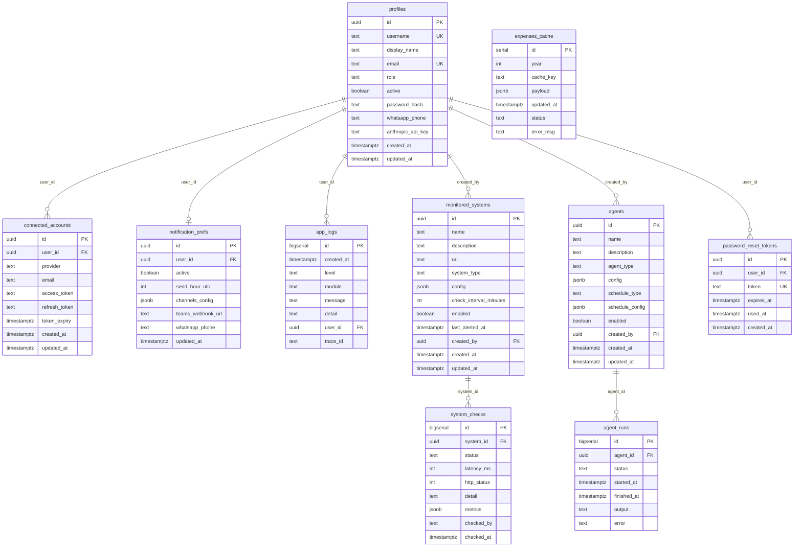
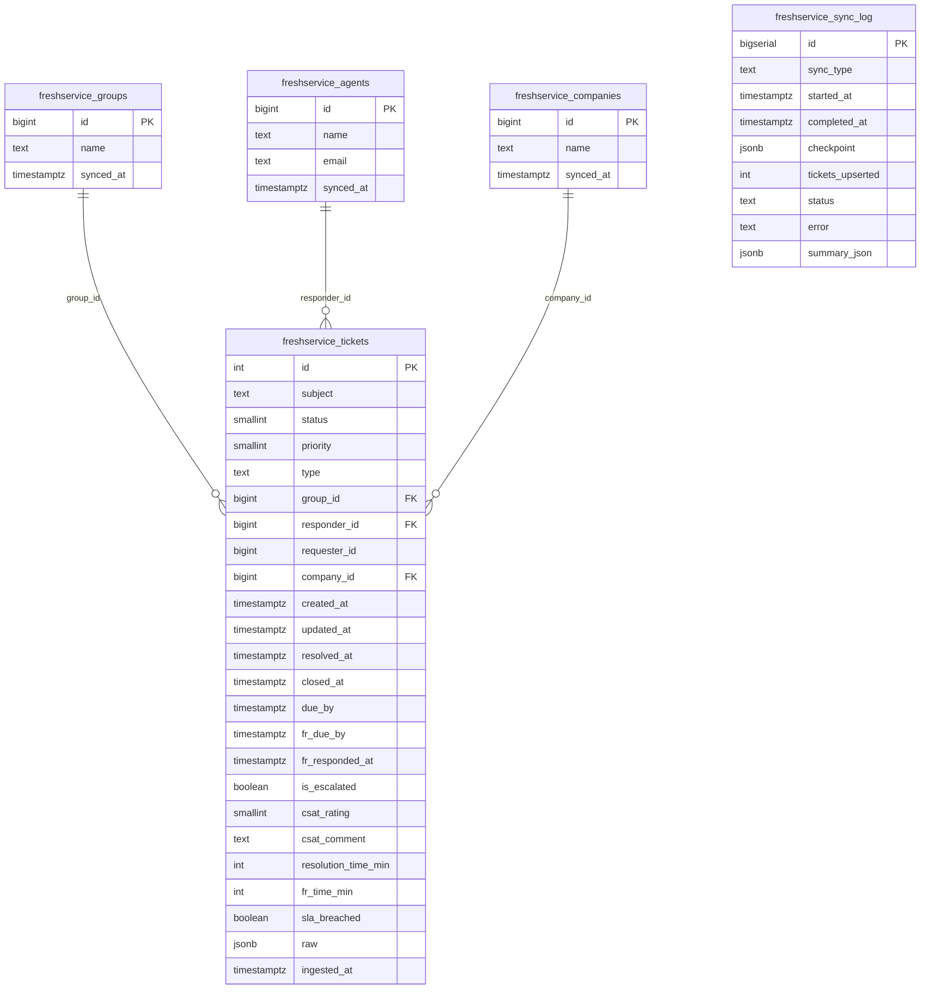
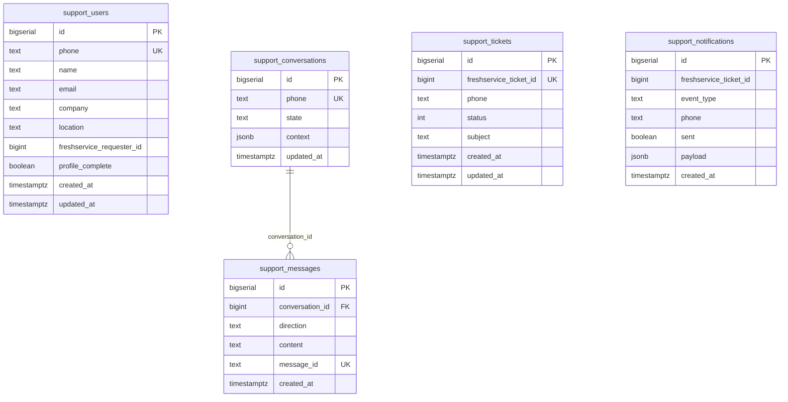
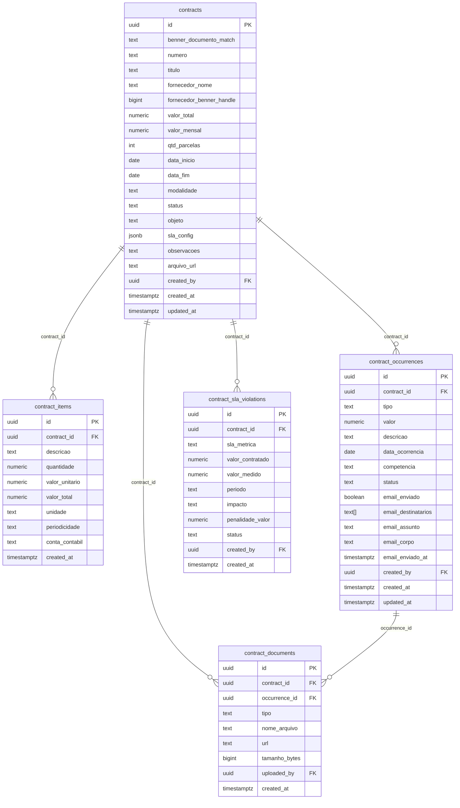
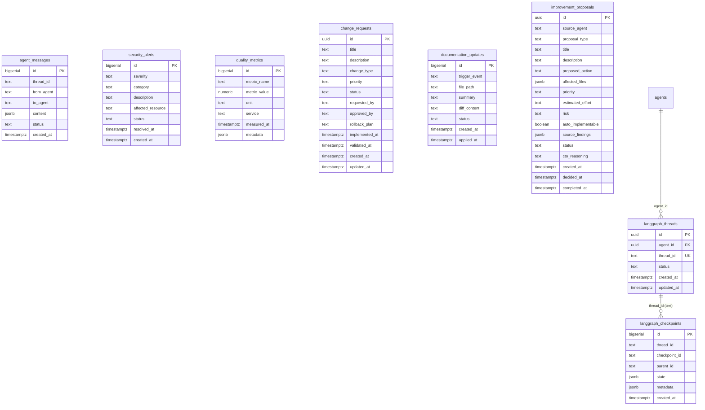
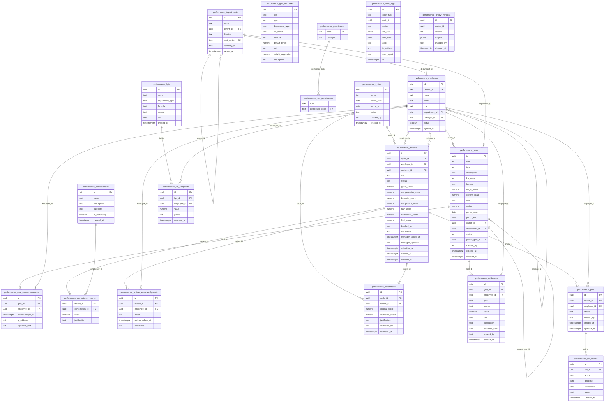
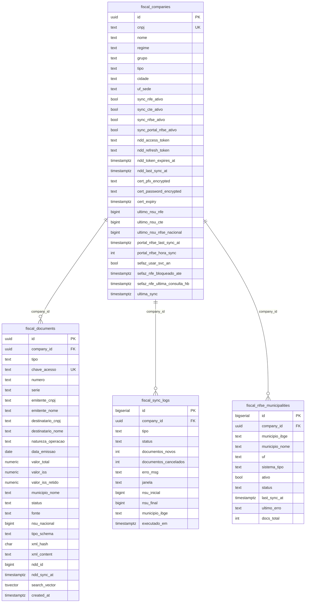
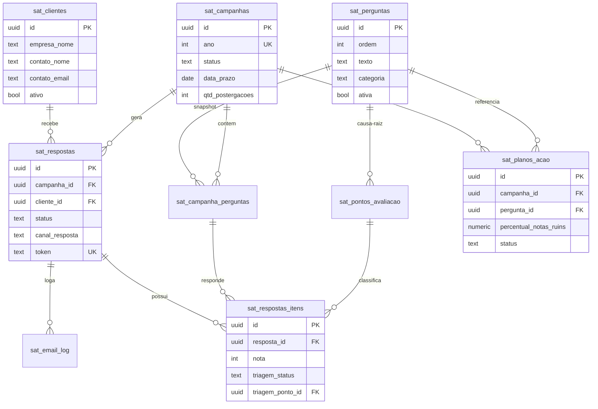

# Jarvis — Arquitetura e Documentação

## Visão Geral

Sistema interno da Voetur/VTCLog com autenticação própria e dez módulos:

| Módulo | Serviço | Porta | Descrição |
|---|---|---|---|
| Core | core-service | 8001 | Autenticação, usuários, administração |
| Monitoramento | monitoring-service | 8002 | Health checks agendados, dashboard em tempo real |
| Freshservice | freshservice-service | 8003 | Dashboard e sync de tickets do helpdesk |
| Moneypenny | moneypenny-service | 8004 | Resumo diário de e-mails e agenda via Microsoft 365 |
| ~~Agentes~~ | ~~agents-service~~ | ~~8005~~ | ❌ **DESABILITADO** — consumo excessivo CPU/RAM. Ver `agents-service/DISABLED.md` |
| Gastos TI | expenses-service | 8006 | Dashboard financeiro, PayFly viagens e Mídia & Redes Sociais |
| VoeIA | support-service | 8007 | Bot WhatsApp de suporte com abertura de chamados no Freshservice |
| Desempenho | performance-service | 8008 | Gestão de ciclos, metas, avaliações e KPIs de desempenho |
| Fiscal | fiscal-service | 8009 | Validação NFe/NFSe — sync NDD Digital, busca full-text, dashboard |
| Financeiro | financeiro-service | 8011 | Conciliação e analytics financeiro via ERP Benner (MSSQL read-only) |
| Cofre de Cartões | cards-service | 8012 | Solicitação e aprovação de cartões corporativos com criptografia Fernet |
| Aval. Experiência | experiencia-service | 8013 | Avaliações de 45/90 dias — sync Benner, e-mail ao gestor, assinatura digital |
| Status das Vagas de RH | rh-service | 8014 | Gestão de vagas/processos de admissão — dashboard, upload de planilha, impressão de formulário |
| Pesquisa de Satisfação | satisfacao-service | 8015 | Pesquisa de satisfação de clientes (VTG.CM.PGP.01) — formulário público via token, dashboard com alertas de notas ruins, triagem e plano de ação |

### Serviços suspensos (❌ não sobem automaticamente)

| Serviço | Motivo | Localização da doc |
|---|---|---|
| `agents-service` | Consumo CPU/RAM excessivo causava lentidão geral | `agents-service/DISABLED.md` |
| `hermes-service` | CPU alta (>80%) | `hermes-service/DISABLED.md` |
| `ollama` | 2 GB RAM reservado em servidor com recursos limitados | `ollama/DISABLED.md` |

> ⚠️ **NÃO religar sem autorização humana explícita.** Todos usam `restart: "no"` + `profiles: ["agents"]` — não sobem no `docker compose up -d` padrão.

---

## Arquitetura

```
Browser
  └─► nginx:443 (HTTPS — frontend container)
        ├─ /api/* ─────────────────────────► Kong:8000 (interno Docker)
        │                                     ├─ /api/financeiro/*
        │                                     │     └─► financeiro-service:8011
        │                                     ├─ /api/fiscal/*
        │                                     │     └─► fiscal-service:8009
        │                                     ├─ /api/performance/*
        │                                     │     └─► performance-service:8008
        │                                     ├─ /api/auth, /api/users, /api/admin, /api/health
        │                                     │     └─► core-service:8001
        │                                     ├─ /api/monitoring/*
        │                                     │     └─► monitoring-service:8002
        │                                     ├─ /api/freshservice/*
        │                                     │     └─► freshservice-service:8003
        │                                     ├─ /api/moneypenny/*
        │                                     │     └─► moneypenny-service:8004
        │                                     ├─ /api/agents/*
        │                                     │     └─► agents-service:8005
        │                                     ├─ /api/expenses/*
        │                                     │     └─► expenses-service:8006
        │                                     ├─ /api/support/*
        │                                     │     └─► support-service:8007
        │                                     ├─ /api/cards/*
        │                                     │     └─► cards-service:8012
        │                                     ├─ /api/experiencia/*
        │                                     │     └─► experiencia-service:8013
        │                                     ├─ /api/rh/*
        │                                     │     └─► rh-service:8014
        │                                     └─ /api/satisfacao/*
        │                                           └─► satisfacao-service:8015
        └─ / ──────────────────────────────► SPA React (nginx serve estático)

Inter-serviço (Docker app_net):
  agents-service → freshservice-service:8003 (HTTP interno + JWT gerado em agent_runner.py)
  expenses-service → SQL Server externo 10.141.0.111:1444 (BennerSistemaCorporativo — leitura)
  performance-service → SQL Server externo 10.141.0.111:1444 (BennerRH — leitura para sync)
  financeiro-service → SQL Server 10.141.0.111\VOETUR (BennerSistemaCorporativo — leitura BI via usr_bi)

Supabase Self-Hosted (Docker app_net):
  Kong:8000 → postgrest, gotrue, realtime, storage
  postgres:5432  (127.0.0.1 — nunca exposto)
  studio:54323   (127.0.0.1 — admin local)
```

---

## Portas

| Porta | Serviço | Bind | Acesso externo |
|---|---|---|---|
| 443 | nginx (HTTPS) | 0.0.0.0 | sim |
| 80 | nginx (redirect) | 0.0.0.0 | sim |
| 8181 | nginx (proxy WAHA) | 127.0.0.1 | **não** (restrito localhost) |
| 5432 | PostgreSQL | 127.0.0.1 | bloqueado |
| 9100 | Monitor Agent | 127.0.0.1 | bloqueado |
| 3000 | WAHA | 127.0.0.1 | bloqueado |
| 54321 | Supabase Kong | 127.0.0.1 | bloqueado |
| 54323 | Supabase Studio | 127.0.0.1 | bloqueado |

Microsserviços (8001–8011): sem portas expostas ao host, apenas rede interna Docker.

---

## Sistema de Roles

| Role | Módulos | Permissões-chave |
|---|---|---|
| `admin` | todos | gerenciar usuários, acessar todos os dados |
| `user` | core, monitoring, freshservice, moneypenny, agents | acesso padrão |
| `rh` | desempenho | criar metas, assinar avaliações, calibrar, fechar ciclo |
| `gestor` | desempenho | criar metas, avaliar liderados, gerenciar KPIs/PDI |
| `coordenador` | desempenho | criar metas, avaliar liderados, gerenciar PDI |
| `supervisor` | desempenho | criar metas, avaliar liderados, assinar avaliação |
| `colaborador` | desempenho | assinar metas recebidas, autoavaliação, tomar ciência |
| `sgi` | satisfacao | gerenciar campanhas, cadastro de clientes/perguntas, triagem de notas ruins, plano de ação |

---

## Banco de Dados — MER Completo

O banco PostgreSQL (Supabase self-hosted) contém **53 tabelas** distribuídas em 6 arquivos de schema.

### Schema Core (`schema.sql`) — 10 tabelas


```mermaid
erDiagram
    profiles {
        uuid id PK
        text username UK
        text display_name
        text email UK
        text role
        boolean active
        text password_hash
        text whatsapp_phone
        text anthropic_api_key
        timestamptz created_at
        timestamptz updated_at
    }

    connected_accounts {
        uuid id PK
        uuid user_id FK
        text provider
        text email
        text access_token
        text refresh_token
        timestamptz token_expiry
        timestamptz created_at
        timestamptz updated_at
    }

    notification_prefs {
        uuid id PK
        uuid user_id FK
        boolean active
        int send_hour_utc
        jsonb channels_config
        text teams_webhook_url
        text whatsapp_phone
        timestamptz updated_at
    }

    app_logs {
        bigserial id PK
        timestamptz created_at
        text level
        text module
        text message
        text detail
        uuid user_id FK
        text trace_id
    }

    monitored_systems {
        uuid id PK
        text name
        text description
        text url
        text system_type
        jsonb config
        int check_interval_minutes
        boolean enabled
        timestamptz last_alerted_at
        uuid created_by FK
        timestamptz created_at
        timestamptz updated_at
    }

    system_checks {
        bigserial id PK
        uuid system_id FK
        text status
        int latency_ms
        int http_status
        text detail
        jsonb metrics
        text checked_by
        timestamptz checked_at
    }

    agents {
        uuid id PK
        text name
        text description
        text agent_type
        jsonb config
        text schedule_type
        jsonb schedule_config
        boolean enabled
        uuid created_by FK
        timestamptz created_at
        timestamptz updated_at
    }

    agent_runs {
        bigserial id PK
        uuid agent_id FK
        text status
        timestamptz started_at
        timestamptz finished_at
        text output
        text error
    }

    password_reset_tokens {
        uuid id PK
        uuid user_id FK
        text token UK
        timestamptz expires_at
        timestamptz used_at
        timestamptz created_at
    }

    expenses_cache {
        serial id PK
        int year
        text cache_key
        jsonb payload
        timestamptz updated_at
        text status
        text error_msg
    }

    profiles ||--o{ connected_accounts : "user_id"
    profiles ||--o| notification_prefs : "user_id"
    profiles ||--o{ app_logs : "user_id"
    profiles ||--o{ monitored_systems : "created_by"
    profiles ||--o{ agents : "created_by"
    profiles ||--o{ password_reset_tokens : "user_id"
    monitored_systems ||--o{ system_checks : "system_id"
    agents ||--o{ agent_runs : "agent_id"
```

### Schema Freshservice (`schema_freshservice.sql`) — 5 tabelas


```mermaid
erDiagram
    freshservice_tickets {
        int id PK
        text subject
        smallint status
        smallint priority
        text type
        bigint group_id FK
        bigint responder_id FK
        bigint requester_id
        bigint company_id FK
        timestamptz created_at
        timestamptz updated_at
        timestamptz resolved_at
        timestamptz closed_at
        timestamptz due_by
        timestamptz fr_due_by
        timestamptz fr_responded_at
        boolean is_escalated
        smallint csat_rating
        text csat_comment
        int resolution_time_min
        int fr_time_min
        boolean sla_breached
        jsonb raw
        timestamptz ingested_at
    }

    freshservice_agents {
        bigint id PK
        text name
        text email
        timestamptz synced_at
    }

    freshservice_groups {
        bigint id PK
        text name
        timestamptz synced_at
    }

    freshservice_companies {
        bigint id PK
        text name
        timestamptz synced_at
    }

    freshservice_sync_log {
        bigserial id PK
        text sync_type
        timestamptz started_at
        timestamptz completed_at
        jsonb checkpoint
        int tickets_upserted
        text status
        text error
        jsonb summary_json
    }

    freshservice_groups ||--o{ freshservice_tickets : "group_id"
    freshservice_agents ||--o{ freshservice_tickets : "responder_id"
    freshservice_companies ||--o{ freshservice_tickets : "company_id"
```

**Funções SQL (RPC via PostgREST):**

| Função | Parâmetros | Retorno |
|---|---|---|
| `freshservice_summary` | `p_from, p_to: timestamptz` | JSON com totais, CSAT, SLA breach, resolução média |
| `freshservice_sla_by_group` | `p_from, p_to: timestamptz` | JSON com breach % e resolução por grupo |
| `freshservice_agents_monthly` | `p_year, p_month: int` | JSON com fechamentos por agente no mês |
| `freshservice_top_requesters` | `p_from, p_to, p_limit` | JSON com empresas que mais abriram chamados |
| `freshservice_csat_summary` | `p_from, p_to: timestamptz` | JSON com NPS detalhado: happy/neutral/unhappy por grupo |
| `upsert_csat_ratings` | `p_ratings: jsonb` | int (registros atualizados) — batch update de CSAT |

### Schema VoeIA Support (`schema_support.sql`) — 5 tabelas


```mermaid
erDiagram
    support_users {
        bigserial id PK
        text phone UK
        text name
        text email
        text company
        text location
        bigint freshservice_requester_id
        boolean profile_complete
        timestamptz created_at
        timestamptz updated_at
    }

    support_conversations {
        bigserial id PK
        text phone UK
        text state
        jsonb context
        timestamptz updated_at
    }

    support_messages {
        bigserial id PK
        bigint conversation_id FK
        text direction
        text content
        text message_id UK
        timestamptz created_at
    }

    support_tickets {
        bigserial id PK
        bigint freshservice_ticket_id UK
        text phone
        int status
        text subject
        timestamptz created_at
        timestamptz updated_at
    }

    support_notifications {
        bigserial id PK
        bigint freshservice_ticket_id
        text event_type
        text phone
        boolean sent
        jsonb payload
        timestamptz created_at
    }

    support_conversations ||--o{ support_messages : "conversation_id"
```

### Schema Governança de Contratos (`schema_governance.sql`) — 5 tabelas


```mermaid
erDiagram
    contracts {
        uuid id PK
        text benner_documento_match
        text numero
        text titulo
        text fornecedor_nome
        bigint fornecedor_benner_handle
        numeric valor_total
        numeric valor_mensal
        int qtd_parcelas
        date data_inicio
        date data_fim
        text modalidade
        text status
        text objeto
        jsonb sla_config
        text observacoes
        text arquivo_url
        uuid created_by FK
        timestamptz created_at
        timestamptz updated_at
    }

    contract_items {
        uuid id PK
        uuid contract_id FK
        text descricao
        numeric quantidade
        numeric valor_unitario
        numeric valor_total
        text unidade
        text periodicidade
        text conta_contabil
        timestamptz created_at
    }

    contract_occurrences {
        uuid id PK
        uuid contract_id FK
        text tipo
        numeric valor
        text descricao
        date data_ocorrencia
        text competencia
        text status
        boolean email_enviado
        text[] email_destinatarios
        text email_assunto
        text email_corpo
        timestamptz email_enviado_at
        uuid created_by FK
        timestamptz created_at
        timestamptz updated_at
    }

    contract_documents {
        uuid id PK
        uuid contract_id FK
        uuid occurrence_id FK
        text tipo
        text nome_arquivo
        text url
        bigint tamanho_bytes
        uuid uploaded_by FK
        timestamptz created_at
    }

    contract_sla_violations {
        uuid id PK
        uuid contract_id FK
        text sla_metrica
        numeric valor_contratado
        numeric valor_medido
        text periodo
        text impacto
        numeric penalidade_valor
        text status
        uuid created_by FK
        timestamptz created_at
    }

    contracts ||--o{ contract_items : "contract_id"
    contracts ||--o{ contract_occurrences : "contract_id"
    contracts ||--o{ contract_documents : "contract_id"
    contracts ||--o{ contract_sla_violations : "contract_id"
    contract_occurrences ||--o{ contract_documents : "occurrence_id"
```

### Schema Agentes / LangGraph (`schema_langgraph.sql`) — 8 tabelas


```mermaid
erDiagram
    langgraph_threads {
        uuid id PK
        uuid agent_id FK
        text thread_id UK
        text status
        timestamptz created_at
        timestamptz updated_at
    }

    langgraph_checkpoints {
        bigserial id PK
        text thread_id
        text checkpoint_id
        text parent_id
        jsonb state
        jsonb metadata
        timestamptz created_at
    }

    agent_messages {
        bigserial id PK
        text thread_id
        text from_agent
        text to_agent
        jsonb content
        text status
        timestamptz created_at
    }

    security_alerts {
        bigserial id PK
        text severity
        text category
        text description
        text affected_resource
        text status
        timestamptz resolved_at
        timestamptz created_at
    }

    quality_metrics {
        bigserial id PK
        text metric_name
        numeric metric_value
        text unit
        text service
        timestamptz measured_at
        jsonb metadata
    }

    change_requests {
        uuid id PK
        text title
        text description
        text change_type
        text priority
        text status
        text requested_by
        text approved_by
        text rollback_plan
        timestamptz implemented_at
        timestamptz validated_at
        timestamptz created_at
        timestamptz updated_at
    }

    documentation_updates {
        bigserial id PK
        text trigger_event
        text file_path
        text summary
        text diff_content
        text status
        timestamptz created_at
        timestamptz applied_at
    }

    improvement_proposals {
        uuid id PK
        text source_agent
        text proposal_type
        text title
        text description
        text proposed_action
        jsonb affected_files
        text priority
        text estimated_effort
        text risk
        boolean auto_implementable
        jsonb source_findings
        text status
        text cto_reasoning
        timestamptz created_at
        timestamptz decided_at
        timestamptz completed_at
    }

    agents ||--o{ langgraph_threads : "agent_id"
    langgraph_threads ||--o{ langgraph_checkpoints : "thread_id (text)"
```

**Tipos de agente LangGraph (constraint `agents_agent_type_check`):**
`langgraph_cto`, `langgraph_log_scanner`, `langgraph_log_improver`, `langgraph_fix_validator`, `langgraph_security`, `langgraph_code_security`, `langgraph_quality`, `langgraph_quality_validator`, `langgraph_uptime`, `langgraph_docs`, `langgraph_docker`, `langgraph_frontend`, `langgraph_backend`, `langgraph_infrastructure`, `langgraph_api`, `langgraph_automation`, `langgraph_itil_version`, `langgraph_change_mgmt`, `langgraph_change_validator`, `langgraph_integration_validator`, `langgraph_scheduling`

### Schema Desempenho (`schema_performance.sql`) — 20 tabelas


```mermaid
erDiagram
    performance_cycles {
        uuid id PK
        text name
        date period_start
        date period_end
        text status
        text created_by
        timestamptz created_at
    }

    performance_employees {
        uuid id PK
        text benner_id UK
        text name
        text email
        text role
        uuid department_id FK
        uuid manager_id FK
        boolean active
        timestamptz synced_at
    }

    performance_departments {
        uuid id PK
        text name
        uuid parent_id FK
        text director
        text cost_center UK
        text company_id
        timestamptz synced_at
    }

    performance_goals {
        uuid id PK
        text title
        text type
        text description
        text kpi_name
        text formula
        numeric target_value
        numeric current_value
        text unit
        numeric weight
        date period_start
        date period_end
        uuid owner_id FK
        uuid department_id FK
        text status
        uuid parent_goal_id FK
        text created_by
        timestamptz created_at
        timestamptz updated_at
    }

    performance_goal_acknowledgments {
        uuid id PK
        uuid goal_id FK
        uuid employee_id FK
        timestamptz acknowledged_at
        text ip_address
        text signature_text
    }

    performance_goal_templates {
        uuid id PK
        text title
        text type
        text department_type
        text kpi_name
        text formula
        numeric default_target
        text unit
        numeric weight_suggestion
        text description
    }

    performance_competencies {
        uuid id PK
        text name
        text description
        text category
        boolean is_mandatory
        timestamptz created_at
    }

    performance_reviews {
        uuid id PK
        uuid cycle_id FK
        uuid employee_id FK
        uuid reviewer_id FK
        text step
        text status
        numeric goals_score
        numeric competencies_score
        numeric behavior_score
        numeric compliance_score
        numeric raw_score
        numeric normalized_score
        numeric final_score
        text blocked_by
        text comments
        timestamptz manager_signed_at
        text manager_signature
        timestamptz submitted_at
        timestamptz created_at
        timestamptz updated_at
    }

    performance_competency_scores {
        uuid review_id FK
        uuid competency_id FK
        numeric score
        text justification
    }

    performance_review_acknowledgments {
        uuid id PK
        uuid review_id FK
        uuid employee_id FK
        text action
        timestamptz acknowledged_at
        text comments
    }

    performance_calibrations {
        uuid id PK
        uuid cycle_id FK
        uuid review_id FK
        numeric original_score
        numeric calibrated_score
        text justification
        text calibrated_by
        timestamptz calibrated_at
    }

    performance_evidences {
        uuid id PK
        uuid goal_id FK
        uuid employee_id FK
        text type
        text source
        numeric value
        text unit
        text description
        date evidence_date
        text created_by
        timestamptz created_at
    }

    performance_kpis {
        uuid id PK
        text name
        text department_type
        text formula
        text source
        text unit
        timestamptz created_at
    }

    performance_kpi_snapshots {
        uuid id PK
        uuid kpi_id FK
        uuid employee_id FK
        numeric value
        text period
        timestamptz captured_at
    }

    performance_pdis {
        uuid id PK
        uuid review_id FK
        uuid employee_id FK
        text status
        text created_by
        timestamptz created_at
        timestamptz updated_at
    }

    performance_pdi_actions {
        uuid id PK
        uuid pdi_id FK
        text action
        date deadline
        text responsible
        text status
        timestamptz created_at
    }

    performance_permissions {
        text code PK
        text description
    }

    performance_role_permissions {
        text role
        text permission_code FK
    }

    performance_audit_logs {
        uuid id PK
        text entity_type
        uuid entity_id
        text action
        jsonb old_data
        jsonb new_data
        text actor
        text ip_address
        text user_agent
        timestamptz ts
    }

    performance_review_versions {
        uuid id PK
        uuid review_id
        int version
        jsonb snapshot
        text changed_by
        timestamptz changed_at
    }

    performance_departments ||--o{ performance_departments : "parent_id"
    performance_departments ||--o{ performance_employees : "department_id"
    performance_employees ||--o{ performance_employees : "manager_id"
    performance_employees ||--o{ performance_goals : "owner_id"
    performance_departments ||--o{ performance_goals : "department_id"
    performance_goals ||--o{ performance_goals : "parent_goal_id"
    performance_goals ||--o{ performance_goal_acknowledgments : "goal_id"
    performance_employees ||--o{ performance_goal_acknowledgments : "employee_id"
    performance_cycles ||--o{ performance_reviews : "cycle_id"
    performance_employees ||--o{ performance_reviews : "employee_id"
    performance_employees ||--o{ performance_reviews : "reviewer_id"
    performance_reviews ||--o{ performance_competency_scores : "review_id"
    performance_competencies ||--o{ performance_competency_scores : "competency_id"
    performance_reviews ||--o{ performance_review_acknowledgments : "review_id"
    performance_employees ||--o{ performance_review_acknowledgments : "employee_id"
    performance_cycles ||--o{ performance_calibrations : "cycle_id"
    performance_reviews ||--o{ performance_calibrations : "review_id"
    performance_goals ||--o{ performance_evidences : "goal_id"
    performance_employees ||--o{ performance_evidences : "employee_id"
    performance_kpis ||--o{ performance_kpi_snapshots : "kpi_id"
    performance_employees ||--o{ performance_kpi_snapshots : "employee_id"
    performance_reviews ||--o{ performance_pdis : "review_id"
    performance_employees ||--o{ performance_pdis : "employee_id"
    performance_pdis ||--o{ performance_pdi_actions : "pdi_id"
    performance_permissions ||--o{ performance_role_permissions : "permission_code"
```

**Permissões por role:**

| Permission | colaborador | supervisor | coordenador | gestor | rh |
|---|:---:|:---:|:---:|:---:|:---:|
| `acknowledge_goal` | ✓ | | | | |
| `fill_self_review` | ✓ | | | | |
| `acknowledge_review` | ✓ | | | | |
| `create_goal` | | ✓ | ✓ | ✓ | ✓ |
| `fill_manager_review` | | ✓ | ✓ | ✓ | ✓ |
| `sign_review` | | ✓ | ✓ | ✓ | ✓ |
| `manage_pdi` | | | ✓ | ✓ | ✓ |
| `manage_kpis` | | | | ✓ | ✓ |
| `close_cycle` | | | | | ✓ |
| `calibrate` | | | | | ✓ |
| `view_financial_score` | | | | | ✓ |

**Score engine (`services/score_engine.py`):**
- Pesos: `goals=50%`, `competencies=25%`, `behavior=15%`, `compliance=10%`
- Bloqueio compliance: se `compliance_score < 2.0` → `final_score` capped em `2.5`
- Dois momentos de assinatura: Momento 1 (`performance_goal_acknowledgments`) e Momento 2 (`performance_review_acknowledgments`)

---

## Inventário de Rotas por Serviço

### core-service:8001
| Método | Rota | Acesso | Descrição |
|---|---|---|---|
| POST | `/api/auth/login` | público | login + JWT |
| POST | `/api/auth/logout` | autenticado | invalida sessão |
| POST | `/api/auth/refresh` | autenticado | renova JWT |
| POST | `/api/auth/forgot-password` | público | envia e-mail reset |
| POST | `/api/auth/reset-password` | público | conclui reset |
| GET | `/api/users/me` | autenticado | perfil próprio |
| PATCH | `/api/users/me` | autenticado | atualiza perfil |
| GET | `/api/admin/users` | admin | lista usuários |
| POST | `/api/admin/users` | admin | cria usuário |
| PATCH | `/api/admin/users/{id}` | admin | edita usuário |
| DELETE | `/api/admin/users/{id}` | admin | remove usuário |
| GET | `/api/health` | público | healthcheck |

### monitoring-service:8002
| Método | Rota | Acesso | Descrição |
|---|---|---|---|
| GET | `/api/monitoring/systems` | user | lista sistemas |
| POST | `/api/monitoring/systems` | admin | cria sistema |
| GET | `/api/monitoring/systems/{id}/checks` | user | histórico de checks |
| POST | `/api/monitoring/systems/{id}/check` | admin | força check manual |
| GET | `/api/monitoring/dashboard` | user | status em tempo real |

### freshservice-service:8003
| Método | Rota | Acesso | Descrição |
|---|---|---|---|
| GET | `/api/freshservice/summary` | user | resumo por período |
| GET | `/api/freshservice/sla` | user | SLA por grupo |
| GET | `/api/freshservice/agents` | user | produtividade por agente |
| GET | `/api/freshservice/csat` | user | CSAT detalhado |
| POST | `/api/freshservice/sync` | admin | dispara sync manual |

### expenses-service:8006
| Método | Rota | Acesso | Descrição |
|---|---|---|---|
| GET | `/api/expenses/dashboard` | user | despesas por ano/filial/tipo |
| GET | `/api/expenses/forecast` | user | previsão linear + média móvel |
| GET | `/api/expenses/empresas` | user | lista filiais disponíveis |
| GET | `/api/expenses/comparativo` | user | comparação entre dois anos |
| POST | `/api/expenses/sync` | admin | sincroniza cache do Benner |
| GET | `/api/expenses/payfly/media/posts` | user | lista publicações coletadas |
| GET | `/api/expenses/payfly/media/metrics` | user | rollup mensal por plataforma |
| GET | `/api/expenses/payfly/media/daily-metrics` | user | rollup diário (últimos N dias) |
| GET | `/api/expenses/payfly/media/crisis` | user | status de crise (ok/warning/critical) |
| GET | `/api/expenses/payfly/media/categories` | user | breakdown por categoria |
| POST | `/api/expenses/payfly/media/fetch` | admin | dispara coleta imediata (trigger manual) |

**SLA de pagamento (`kpis.sla_contratos` / `kpis.sla_eventual`, `services/expenses.py::_sla`):** % de parcelas já vencidas (`DATAVENCIMENTO <= hoje`) liquidadas até a data de vencimento (`DATALIQUIDACAO <= DATAVENCIMENTO`), separado por categoria Contrato/Eventual. Meta fixa de 80% (`_SLA_META`). Parcela com vencimento futuro não entra no cálculo. Consumido pelos cards "SLA Contratos"/"SLA Eventual" no dashboard — accent verde/vermelho conforme bateu a meta, clique abre `ExpenseDrillDownModal` com as parcelas do período.

**Cards clicáveis:** os 4 KPICards do grid principal + os 2 de SLA abrem `ExpenseDrillDownModal` (busca por fornecedor/filial/histórico, status por linha: A vencer / Pago no prazo / Pago com atraso / Atrasada). O placeholder "Comparativos pendentes" foi removido do `KPICard` — card sem comparação simplesmente não mostra a área de comparação.

### support-service:8007
| Método | Rota | Acesso | Descrição |
|---|---|---|---|
| POST | `/api/support/webhooks/whatsapp` | WAHA | recebe mensagem WhatsApp |
| POST | `/api/support/webhooks/freshservice` | Freshservice | recebe evento de ticket |
| GET | `/api/support/conversations` | admin/support | lista conversas |
| GET | `/api/support/tickets` | admin/support | lista tickets |
| GET | `/api/support/users` | admin/support | lista usuários cadastrados |
| GET | `/api/support/health` | público | healthcheck |
| GET | `/api/support/ready` | público | readiness |

### fiscal-service:8009
| Método | Rota | Acesso | Descrição |
|---|---|---|---|
| GET | `/api/fiscal/companies` | autenticado | lista empresas |
| GET | `/api/fiscal/sync/logs` | autenticado | logs globais |
| GET | `/api/fiscal/nfse` | autenticado | busca NFSe com filtros |
| GET | `/api/fiscal/nfse/stats` | autenticado | totais por período |
| POST | `/api/fiscal/nfse/sync/run` | admin | dispara sync NFSe NDD |
| GET | `/api/fiscal/{id}/ndd/authorize-url` | admin | URL PKCE para frontend |
| GET | `/api/fiscal/ndd/callback` | público | callback OAuth NDD |
| GET | `/api/fiscal/{id}/ndd/status` | autenticado | status token NDD |
| POST | `/api/fiscal/{id}/certificates` | admin | upload cert A1 |

### performance-service:8008
| Método | Rota | Acesso | Descrição |
|---|---|---|---|
| GET | `/api/performance/goals` | todos os roles | lista metas |
| POST | `/api/performance/goals` | gestor/coord/supervisor/rh | cria meta |
| PATCH | `/api/performance/goals/{id}` | criador | atualiza meta |
| POST | `/api/performance/goals/{id}/acknowledge` | colaborador | Momento 1 — assina meta |
| GET | `/api/performance/evaluations/cycles` | todos | lista ciclos |
| POST | `/api/performance/evaluations/cycles` | rh | cria ciclo |
| GET | `/api/performance/evaluations/reviews` | todos | lista avaliações |
| POST | `/api/performance/evaluations/reviews` | rh | cria avaliação |
| PATCH | `/api/performance/evaluations/reviews/{id}` | reviewer/rh | atualiza scores |
| POST | `/api/performance/evaluations/reviews/{id}/sign` | gestor/coord/supervisor/rh | Momento 2 — assina |
| POST | `/api/performance/evaluations/reviews/{id}/acknowledge` | colaborador | Momento 2 — ciência |
| GET | `/api/performance/competencies` | todos | lista competências |
| POST | `/api/performance/competencies/{review_id}/scores` | reviewer | lança scores de competências |
| GET | `/api/performance/evidences` | todos | lista evidências |
| POST | `/api/performance/evidences` | todos | registra evidência |
| GET | `/api/performance/kpis` | gestor/rh | lista KPIs |
| POST | `/api/performance/kpis/{id}/snapshots` | gestor/rh | registra snapshot KPI |
| GET | `/api/performance/admin/employees` | rh/admin | lista colaboradores |
| POST | `/api/performance/admin/sync-benner` | rh/admin | sincroniza RH do Benner |
| GET | `/api/performance/admin/dashboard` | rh/admin | dashboard calibração |
| GET | `/api/performance/admin/audit-log` | rh/admin | trilha de auditoria |
| GET | `/api/performance/health` | público | healthcheck |
| GET | `/api/performance/ready` | público | readiness |

### rh-service:8014

| Método | Rota | Acesso | Descrição |
|---|---|---|---|
| GET | `/api/rh/health`, `/api/rh/ready` | público | healthcheck |
| GET | `/api/rh/dashboard` | admin/rh | KPIs + breakdowns (filtros: período, empresa, status, tipo de vaga/contrato, nível, hierarquia, etapa, seção, analista, requisitante, cargo, busca `q` — casa candidato/cargo/nº requisição/**responsável**) |
| GET | `/api/rh/vagas` | admin/rh | lista paginada — mesmos filtros + busca `q` (candidato/cargo/nº requisição/responsável) |
| POST | `/api/rh/vagas/iniciar` | admin/rh | cria o processo (draft) e gera `numero_requisicao` automático |
| GET/PATCH/DELETE | `/api/rh/vagas/{id}` | admin/rh | detalhe (autosave por campo) / exclui |
| GET | `/api/rh/vagas/template` | admin/rh | baixa .xlsx modelo com dropdowns das listas atuais |
| POST | `/api/rh/vagas/import` | admin/rh | upload multipart .xlsx — upsert por nº de requisição, grava auditoria em `rh_uploads` |
| GET | `/api/rh/uploads/ultimo`, `/api/rh/uploads` | admin/rh | auditoria de uploads (quem/quando/contadores) |
| GET/POST/PATCH/DELETE | `/api/rh/lookups/{tipo}` | admin/rh | CRUD das listas (empresas, cargos, hierarquias, etapas do processo, etc.) |

Tabelas (`rh_*`, `migrations/001_rh_schema.sql` + `002_rh_pipeline.sql`): `rh_vagas` (processo de admissão), `rh_uploads` (auditoria), `rh_etapas_processo` (pipeline ordenado de 16 etapas com seção responsável) e 12 tabelas de lista suspensa seedadas com os valores oficiais da planilha `Controle de Vagas - BSB.xlsx` (empresas com prefixo de numeração, cargos com nível padrão, etc.). Automação: selecionar cargo autopreenche nível; selecionar etapa autopreenche seção e, nas etapas "Concluído"/"Cancelado", o status da vaga.

**Import de planilha — cuidado com nº de requisição duplicado/placeholder:** `services/excel_import.py` faz upsert por `numero_requisicao` — linhas com o mesmo número (ex: várias vagas usando o texto literal `PJ`) colidem num único registro, perdendo as demais. Linhas sem número de requisição sempre geram INSERT novo (nunca fazem match) — reimportar a mesma planilha duplica essas linhas. Antes de reimportar uma planilha com números repetidos, desambiguar manualmente (sufixo `-2`, `-3`, ...) preservando a ocorrência que já bate com o registro existente no banco.

**Dashboard — breakdown por analista (`kpis` local ao frontend, `RhPage.tsx`):** `por_analista` do backend já separa `abertas` (status `em_aberto=true`: EM ANDAMENTO/REABERTO) de `congeladas` (CONGELADO) — **não somar os dois** como "em andamento" (armadilha: um analista que já saiu da empresa pode ter dezenas de vagas CONGELADAS que não são carga de trabalho ativa). A tabela "Vagas por analista" e os 3 painéis de produtividade (Concluídas / Em andamento / Congeladas) usam os campos separados. `por_empresa_fechadas` (novo campo, só CONCLUÍDO) alimenta o gráfico "Vagas fechadas por empresa" — `por_empresa` (todos os status) continua intocado para o relatório impresso semanal.

### rh-service — Fase 2: Assinatura Automatizada via D4Sign

Submenu paralelo ao fluxo de impressão (`routes/assinatura.py`, `services/d4sign_client.py`, `rh_assinaturas` em `migrations/003_rh_assinaturas.sql`). Fluxo: gera documento a partir de template Word com tokens (`makedocumentbytemplateword`) → cadastra 4 signatários em ordem sequencial (solicitante → rh → depto_pessoal → diretoria) → envia para assinatura. Suporta aditivo (cancelamento/alteração) pós-conclusão e webhook HMAC (`routes/webhook_d4sign.py`) pros status de finalizado/cancelado/parcial.

**Estado (2026-08-12):** cofre e template já criados no painel sandbox (`D4SIGN_BASE_URL=https://sandbox.d4sign.com.br`, credenciais no `.env` do container `rh-service`, não commitadas):
- Cofre "Teste": `aa569dfd-b1bd-4bbd-a683-37643abb547f`
- Template `Template_Requisicao_de_Pessoal.docx`: `9bf798ab-7db5-48a3-8362-72800a393789`

**Bug aberto no suporte D4Sign — tokens não substituídos via API:** `POST /documents/{safe}/makedocumentbytemplateword` retorna sucesso e cria o documento, mas os campos permanecem literais (`${solicitante}`, `${data_recebimento}`, `${numero_requisicao}`, `${centro_custo}`, etc.) no docx/PDF gerado — confirmado abrindo o XML interno dos documentos `a9135b89-7f4a-4b94-96f1-2297570afdf9` e `7a3949c5-bf40-4c17-97ae-6e377cba14c7`. `GET /templates` confirma que o template tem as variáveis certas cadastradas em `tokens_gerais` (mesmos nomes do payload), então não é erro de nomenclatura. Preenchimento manual pela interface web do D4Sign funciona normalmente — o bug é específico da API.

**Regressão adicional (2026-08-11/12):** novas chamadas ao mesmo endpoint passaram a retornar HTTP 200 com corpo vazio e **nenhum documento é criado** (confirmado via `GET /documents` — `total_documents` não incrementa), sem erro reportado. Ou seja, o comportamento da API pode ter mudado desde os testes anteriores — antes ao menos criava o documento (sem substituir tokens), agora nem isso.

**Chamado no suporte D4Sign:** aberto com Diego Costa (`diego.costa@d4sign.com.br`, Analista de Suporte). Enviado em 2026-08-12: UUIDs de cofre/template/documento de reprodução + payload e headers exatos de uma tentativa que retornou corpo vazio. Aguardando retorno. **Enquanto não resolvido, o fluxo de assinatura automatizada via API está bloqueado** — não habilitar em produção até confirmação do fix.

---

## VoeIA — support-service:8007

Bot de suporte via WhatsApp que gerencia onboarding de usuários e abertura/acompanhamento de chamados no Freshservice.

**Fluxo geral:**
```
WhatsApp user → WAHA → POST /api/support/webhooks/whatsapp
                                       │
                                       ▼
                              ConversationFSM (13 estados)
                               ├── lookup/salva support_users
                               ├── salva support_conversations
                               └── chama FreshserviceConnector
                                       │ resposta
                                       ▼
                              WAHA POST /api/sendText (session voetur-support)

Freshservice evento → POST /api/support/webhooks/freshservice?secret=…
                              │
                              ▼
                      notification_worker (idempotente)
                       └── WAHA POST /api/sendText (session voetur-support)
```

**FSM — estados:**
`onboarding_email` → `onboarding_confirm_fs` | `onboarding_name` → `onboarding_company` → `onboarding_location` → `onboarding_final_confirm` → `onboarding_empresa` → `selecting_catalog` → `selecting_subcategory` → `selecting_action` → `collecting_description` → `confirming_ticket` → `idle`

**Catálogo de departamentos:**

| # | Departamento | workspace_id Freshservice |
|---|---|---|
| 1 | TI | 2 |
| 2 | Financeiro | 5 |
| 3 | RH / Pessoal | 6 |
| 4 | Operações | 13 |
| 5 | Suprimentos | 18 |

**Particularidades desta instância Freshservice (voetur1.freshservice.com):**
- Campo `empresa` é custom_field obrigatório em todos os tickets; valores: `VTC OPERADORA LOGÍSTICA (Matriz)`, `VOETUR TURISMO (Matriz)`, `VIP CARGAS BRASÍLIA (Matriz)`, `VIP SERVICE CLUB MARINA (Matriz)`, `VIP CARGAS RIO (MATRIZ)`
- Agents (admins) devem usar `requester_id` na criação de ticket — campo `email` é silenciosamente ignorado pela API
- Busca de usuário: `/requesters` primeiro, fallback `/agents` com resolução de `location_id` e `department_ids`
- `category`/`sub_category` não enviados — valores do catálogo interno não correspondem aos do Freshservice
- `source` do ticket = `4` (Chat) — **nunca usar `1` (Email)**: workspace tem automação que fecha sozinho chamados com origem Email

**Dívida técnica conhecida (migração Evolution API → WAHA, 2026-08-24):** `moneypenny-service` (lembretes de calendário) e `monitoring-service` (`check_evolution` em `services/monitor.py`, tipo `evolution` em `monitored_systems`) ainda falam o protocolo antigo da Evolution API (`/message/sendText/{instance}`, `/instance/connectionState/{instance}`, header `apikey`) — incompatível com os endpoints do WAHA. Não corrigido porque **nunca foram usados em produção** (`notification_prefs` e `monitored_systems` sem nenhuma linha desses tipos até 2026-08-24). `WHATSAPP_API_URL` hoje aponta pro WAHA (`http://waha:3000`) para todos os serviços — se algum dia habilitarem WhatsApp no Moneypenny ou o monitor `evolution`, ajustar esse código para o formato WAHA (`/api/sendText`, `session`/`chatId`, header `X-Api-Key`) antes de usar.

**Deduplicação de webhook:** cache `OrderedDict` TTL 60s, limite 1000 entradas — retorna 200 imediatamente para mensagens duplicadas.

**Configuração WhatsApp:**
- Instância: `SUPPORT_WHATSAPP_INSTANCE` (default `voetur-support`)
- JID completo (`@lid` ou `@s.whatsapp.net`) passado no `sendText`
- `linkPreview: false` em todos os envios

---

## VoeIA — Changelog

### 2026-08-24 — Fix fechamento automático de chamados criados via WhatsApp

**Problema:** Chamados de teste (#241488, #241489) abertos pelo bot fechavam sozinhos no Freshservice pouco depois da criação. Causa: `create_ticket()` enviava `source: 1` (Email); o workspace tem uma automação (Freshservice Automator) que fecha automaticamente chamados com origem Email.

**Arquivo:** `support-service/services/freshservice_connector.py`

- `create_ticket()`: `source` alterado de `1` (Email) para `4` (Chat)

**Deploy:** `docker compose up -d --build --no-deps support-service`

---

### 2026-05-13 — Fix deduplicação webhook + health check Docker

**Problema:** A Evolution API entrega o mesmo evento webhook duas vezes; sem deduplicação o bot processava e respondia em duplicata. O health check do container travava indefinidamente (uvicorn sem timeout→Docker matava com ExitCode -1).

**Arquivos:** `support-service/routes/webhook.py`, `docker-compose.yml`

- `webhook.py`: adicionado `_is_duplicate(msg_id)` — cache `OrderedDict` com TTL de 60s e limite de 1000 entradas; retorna 200 imediatamente para mensagens já vistas
- `docker-compose.yml`: `urlopen` no health check recebe `timeout=4`; `start_period` aumentado de 10s para 30s

---

### 2026-05-13 — Missão 1: Auto-detecção de empresa via Freshservice

**Problema:** Após encontrar o usuário no Freshservice e confirmar os dados, o bot ainda pedia para escolher manualmente entre as 5 empresas — passo redundante.

**Arquivos:** `support-service/services/freshservice_connector.py`, `support-service/services/conversation.py`

- `freshservice_connector.py`: `search_requester_by_email()` agora extrai `company_id` e resolve o nome via `GET /companies/{id}` (novo método `_resolve_company()`); retorna campo `company_name`
- `conversation.py`: adicionado `_FS_COMPANY_TO_EMPRESA_KEY` (mapeamento nome FS → chave 1–5) e `_match_empresa_key()`; quando Freshservice retorna empresa reconhecida, o campo `empresa` é salvo automaticamente e o passo `onboarding_empresa` é pulado

**Fallback:** Se `company_id` for nulo ou o nome não bater com nenhuma chave → fluxo original (usuário escolhe manualmente).

**Mapeamento atual:**

| Nome no Freshservice | Empresa local |
|---|---|
| `voetur turismo` | VOETUR TURISMO (Matriz) |
| `vtc operadora logística` | VTC OPERADORA LOGÍSTICA (Matriz) |
| `vip cargas brasília` | VIP CARGAS BRASÍLIA (Matriz) |
| `vip service club marina` | VIP SERVICE CLUB MARINA (Matriz) |
| `vip cargas rio` | VIP CARGAS RIO (MATRIZ) |

Para adicionar/corrigir: editar `_FS_COMPANY_TO_EMPRESA_KEY` em `conversation.py`.

---

### 2026-05-13 — Missão 2: Navegação "voltar" nas fases de abertura de chamado

**Problema:** Usuário sem poder voltar ao menu de departamentos após avançar nas etapas — precisava recomeçar a conversa.

**Arquivo:** `support-service/services/conversation.py`

Adicionada função `_is_back(text)` que reconhece: `0`, `voltar`, `menu`, `início`, `inicio`.

Nos estados abaixo, digitar qualquer dessas palavras retorna imediatamente ao menu de departamentos (`selecting_catalog`) sem resetar o cadastro do usuário:

| Estado | Trigger de volta |
|---|---|
| `selecting_subcategory` | `0` / `voltar` |
| `selecting_action` | `0` / `voltar` |
| `collecting_description` | `0` / `voltar` |
| `confirming_ticket` | `0` / `voltar` |

---

### 2026-05-13 — Missão 3: Docker auto-start no boot do Windows Server

**Problema:** Após reinicialização do servidor, os containers não subiam automaticamente — `setup-autostart.ps1` nunca havia sido executado.

**Solução:** Executar como Administrador:
```powershell
Set-ExecutionPolicy -Scope Process -ExecutionPolicy Bypass
E:\claudecode\claudecode\setup-autostart.ps1
```

Isso registra a task `Jarvis-Docker-Startup` no Task Scheduler do Windows com:
- Trigger: `AtLogon` (usuário `victor.ramalho`) — WSL não suporta SYSTEM
- Ação: executa `E:\claudecode\claudecode\jarvis-startup.bat`

O script `jarvis-startup.bat`: aguarda Docker responder → `docker compose up -d`.

**Verificação:**
```powershell
Get-ScheduledTask -TaskName "Jarvis-Docker-Startup"
# State: Ready
```

**Log de execução:** `C:\Windows\Temp\jarvis-startup.log`

---

### 2026-08-10 — Rate-limit por IP colidindo entre usuários (Kong + slowapi)

**Problema:** durante o disparo em massa de avaliações/auto-avaliações do performance-service, usuários reais recebiam 429 em lote. Causa em duas camadas:
1. `limiter.py` de todos os serviços usava `get_remote_address` (slowapi) — atrás do Kong, todo request chega com o mesmo IP de proxy, então o rate-limit por IP colapsava num único bucket compartilhado por todos os usuários.
2. Kong não confiava no hop do nginx (`KONG_TRUSTED_IPS` nunca configurado) e sobrescrevia `X-Forwarded-For` com o IP interno do proxy — mesmo corrigindo o `key_func`, o header real nunca chegava no serviço.
3. `performance-service/routes/public.py` tinha ainda um bloqueio anti-brute-force *hardcoded* (`ip = request.client.host`) nas rotas presenciais (`ciencia-presencial`, `auto-avaliacao-presencial`) — 3 erros de digitação de **qualquer** colaborador bloqueava todo mundo por 5 min.

**Fix:**
- `limiter.py` (replicado nos 10 serviços ativos, exceto `cards-service` que já tinha solução por `user_id`): `get_real_ip()` lê `X-Forwarded-For` com fallback pro `client.host`.
- `docker-compose.yml`: `KONG_TRUSTED_IPS: "172.18.0.0/16"` — confia na rede interna Docker, preserva o `X-Forwarded-For` setado pelo nginx.
- `public.py`: as 3 rotas presenciais passam a usar `get_real_ip()` no bloqueio anti-brute-force também.

### 2026-08-10 — Troca de gestor não propagava pra token de avaliação já criado

**Problema:** ao trocar o `manager_id` de um colaborador em Gestão RH, o token de avaliação (`performance_evaluation_tokens`) já criado no ciclo aberto mantinha o `evaluator_id` antigo (snapshot da criação). A tela do ciclo mostrava o gestor errado, e "Reenviar" mandava e-mail pra quem já tinha sido notificado, não pro novo gestor. Causou 3 incidentes reportados + 6 casos latentes (auditados e corrigidos manualmente via `UPDATE`).

**Fix:** `update_employee` (`PUT /api/performance/admin/employees/{id}`) agora propaga a troca de `manager_id` pro `evaluator_id` de qualquer token pendente (não usado, não invalidado) do ciclo aberto — sem disparar e-mail, só corrige o destinatário pra próxima ação do RH.

### 2026-08-10 — 500 (URI too long) em `/admin/evaluations`

**Problema:** a tela "Gestão RH" (todas as avaliações do ciclo) retornava 500 — PostgREST recusa URLs com `.in_()` de centenas de UUIDs ("414 URI too long", mas o cliente Python mascarava como 500). Frontend engolia o erro e mostrava lista vazia, sem indicar falha.

**Fix:** aplicado o helper `_chunks()` (lotes de 150 IDs, já usado em outras rotas) nas 5 queries `.in_()` de `list_evaluations` (`GET /admin/evaluations`).

### 2026-08-10 — Calibragem ("Análise RH") agora considera divergência por item

**Antes:** `calibragem_necessaria` só olhava a aderência **geral** (nota final gestor vs. auto-avaliação) ≤50%. Um colaborador podia ter aderência geral de 66-79% (ok) mas 1-6 competências individuais com divergência ≤50% entre si, sem nunca cair pra Análise RH.

**Fix:** `calibragem_necessaria` (nas 3 rotas que a calculam: `list_evaluations`, `evaluations/{id}/detail`, `evaluations/detail`) agora é `true` se a aderência geral ≤50% **ou** qualquer item/indicador individual tiver aderência ≤50% (`needs_calibration` já computado por item em `_merge_indicator_matrix`), e ainda não calibrado.

### 2026-08-10 — Dashboard: gráfico por empresa + drilldown de auto-avaliação agrupado

- `GET /api/performance/admin/dashboard` ganhou o campo `by_company` (avaliações e auto-avaliações completadas, agregadas por `company_id` do colaborador). Substituiu o gráfico "Médias por Indicador" no frontend por "Avaliações e Auto-Avaliações Realizadas — por Empresa" (cor fixa por empresa, ordem VTC → Viagens → demais).
- `GET /api/performance/admin/dashboard/pending-self-eval` passou a agrupar por gestor (mesmo padrão de `pending-evaluators`), em vez de lista plana — o drilldown "Colaboradores Pendentes de Auto-Avaliação" ganhou expandir/colapsar por gestor.

### 2026-08-11 — Correções pontuais (experiencia-service e cards-service)

- **experiencia-service** (`routes/admin.py`, `/admin/45-dias`): busca por texto (`?q=`) dava 500 (`AttributeError: NoneType.lower`) quando `nome`/`gestor_nome` do colaborador era `NULL` no banco — `.get("campo", "")` só usa o default quando a *chave* não existe, não quando o *valor* é `None`. Trocado por `.get("campo") or ""` nos dois pontos (busca de avaliação 45 dias, duplicado em outra função do mesmo arquivo).
- **cards-service** (`auth.py`, `get_cards_perfil`): usuário sem nenhuma linha em `cards_permissoes` dava 500 em vez do 403 esperado — `.maybe_single()` deveria retornar `data=None` pra 0 linhas, mas o PostgREST devolve 406 nesse cenário (em algumas versões) e o cliente Python retorna `None` no lugar do objeto de resposta, quebrando `row.data`. Envolvido em `try/except` tratando qualquer falha como "sem permissão".

### 2026-08-11 — Auditoria completa de `.in_()` sem paginação no performance-service

O bug de "414/URI too long" (Kong/PostgREST recusam URLs com centenas de UUIDs num `.in_()`) já tinha sido corrigido em `list_evaluations` e `pending-ciencia` no dia anterior — mas o volume de avaliações continuou crescendo (237+ no mesmo dia) e o mesmo padrão apareceu em mais lugares, silenciosamente (o cliente Python transforma o erro 414 numa exceção de parsing JSON, então aparecia como 500 genérico nos logs, não como 414).

Auditoria cobriu **todo** o `performance-service` (`admin.py`, `action_plans.py`, `evaluations.py`, `my.py`, `action_plans_public.py`, `services/*.py`) e corrigiu com o helper `_chunks()` (lotes de 150 IDs, já existente):

- `GET /admin/dashboard` — o próprio dashboard principal estava quebrando (acks/calibs/indicator_scores por review_id).
- `dashboard_export` (XLSX), `list_employees` (Gestão RH), os 2 drilldowns de gestor pendente (`mgr_ids`).
- **`reset_cycle_data`** (zona de perigo, "Remove todas as avaliações do ciclo atual") — os 5 deletes em cascata (`performance_calibration_items`, `performance_review_acknowledgments`, `performance_calibrations`, `performance_indicator_scores`, `performance_acknowledgment_tokens`) não eram paginados; um 414 no meio deixaria o reset pela metade.
- `action_plans.py`: `_resolve_employees`, `_build_candidates`, geração de planos iniciais, `_build_alerts` (causa real do 500 visto em `/action-plans/alerts`), `send_phases_batch`.
- **`POST /cycles/{id}/send-tokens`** (`evaluations.py`) — o próprio endpoint de disparo em massa que originou o incidente do dia anterior tinha 2 `.in_()` sem paginação (subordinados de todos os avaliadores + tokens já existentes), sem filtro de empresa. Sem chunking, um disparo pra empresa grande sem filtro quebraria o próprio disparo.
- `services/action_plan_scheduler.py` — job diário (`_flag_due_phases`, 07:00) que sinaliza fases de plano de ação vencidas; falha aqui é **silenciosa** (só loga e sai, sem alertar ninguém), então corrigido por precaução mesmo com volume baixo esperado.

Revisados e descartados como seguros (escopo sempre pequeno por design): busca por um único `review_id`/`action_plan_id`, subordinados de um único gestor logado, `branch_ids` distintos (poucas filiais), `action_plans_public.py` (sempre 1-2 IDs por token).

### 2026-08-11/12 — Ajustes de UI no dashboard de desempenho

- Modais de drilldown (`ModalWrapper`, `CienciaViewModal`) não fechavam ao clicar fora — só pelo botão X. Adicionado handler de clique no backdrop (`e.target === e.currentTarget`).
- StatCard "Sem Avaliação" renomeado para "Avaliações Pendentes".
- StatCard/drilldown "Análises RH": antes mostrava calibragens **já feitas** (`calibrations_count` — ficava zerado mesmo com backlog grande, dando falsa sensação de "tudo ok"). Passou a mostrar **pendente de calibragem** (`calibragem_necessaria=true` e ainda não calibrado) — novo endpoint `GET /admin/dashboard/pending-calibration` reaproveita `list_evaluations`.
- `dashboard/pending-ciencia`: sempre retornava vazio por 2 bugs — misturava auto-avaliações completadas junto com avaliações do gestor (contagem dobrada, ex. 404 = 132+272) e tinha o mesmo `.in_()` sem paginação (156 IDs). Corrigido: filtra `is_self_evaluation=False` e usa `_chunks()`.
- Gráfico "Avaliações e Auto-Avaliações — por Empresa": cor fixa por empresa (mesma cor nas 2 barras, opacidade diferente pra distinguir avaliação/auto-avaliação — um único swatch de legenda não dá pra representar "cor varia por empresa"), legenda de cores por empresa acima do gráfico, valores nas colunas, ordem VTC → Viagens → demais, legenda de métrica movida pro topo (colidia com os nomes das empresas no eixo X).

### 2026-08-12 — Backup: upload OneDrive + limpeza automática do Docker

Ver `docs/BACKUP.md` — `backup.ps1` agora envia os dumps pro OneDrive do Victor (retenção 30d diária + cópia mensal) e limpa build cache/imagens Docker órfãs após cada execução. Restauração completa testada e validada (dump → container isolado → `pg_restore` → contagem de linhas) em 2026-08-10.

---

## Módulo Gastos TI — expenses-service:8006

Lê ERP Benner via `pyodbc` (SQL Server `10.141.0.111:1444`, `BennerSistemaCorporativo`).

- **Filtro base**: `PAR.EMPRESA = 1` + `K_GESTOR = 23` (gestor de TI)
- **Endpoints**: `GET /api/expenses/dashboard?year=&filial=&tipo=` · `GET /api/expenses/forecast` · `GET /api/expenses/empresas` · `GET /api/expenses/comparativo?ano1=&ano2=`
- **Forecast**: regressão linear + média móvel 3m, pure Python
- **Resiliência**: `CircuitBreaker("benner")` + `@sql_retry` (3 tentativas, 2s→10s backoff) em `services/resilience.py`; `TTLCache(ttl=300)` nos serviços pesados; cache Supabase via `POST /api/expenses/sync`
- **PayFly (despesas Benner)**: apenas pagamentos liquidados (`DATALIQUIDACAO IS NOT NULL`); separação entre despesas contratuais e eventuais; suporte a parcelas pendentes

### PayFly Viagens — API V2

Integração com a API PayFly de reservas corporativas (voos e hotéis), separada do módulo Benner.

**Client** (`services/payfly_v2_client.py`):
- URL base: `https://integrations-api.payfly.com.br`
- Auth: `POST /api/auth/token` com `clientId` + `clientSecret` → Bearer token com cache thread-safe (renova 2 min antes do vencimento)
- `get_reservation_ids(start, end)` → IDs agrupados por status: `emitidos`, `cancelados`, `reservados`, `expirados`
- `get_reservation_detail(id, type)` → detalhe completo da reserva
- `sync_date_range(start, end)` → busca IDs + detalhes em paralelo (5 workers), faz upsert em batches de 50 na tabela `payfly_reservations`
- Flatten: 68 campos mapeados do JSON aninhado → schema plano no Supabase

**Scheduler** (`services/payfly_scheduler.py`):
- APScheduler embutido no expenses-service (não depende do agents-service)
- Job `payfly_reservations_daily`: cron **04:00 BRT** todo dia, sincroniza o dia anterior (`date.today() - 1`)
- Incremental puro — nunca re-processa mais de 1 dia por execução automática

**Endpoints** (`routes/payfly_reservations.py`):

| Método | Path | Descrição |
|---|---|---|
| GET | `/api/expenses/payfly/reservations/stats` | KPIs agregados (total, por status, por empresa) via RPC |
| GET | `/api/expenses/payfly/reservations/dashboard` | Top-10 solicitantes por valor e quantidade |
| GET | `/api/expenses/payfly/reservations/` | Lista paginada com filtros (status/tipo/empresa/datas) |
| GET | `/api/expenses/payfly/reservations/{id}` | Detalhe completo de uma reserva |
| POST | `/api/expenses/payfly/reservations/sync` | Sync manual de um período (máx. 31 dias) — background |
| POST | `/api/expenses/payfly/reservations/sync/bulk` | Carga histórica desde `start_date` até ontem — background |

**Schema** (`migrations/003_payfly_reservations.sql`): tabela `payfly_reservations` com 92 colunas + `raw_json` jsonb. Índices em `status`, `type`, `company_name`, `choice_date`, `travel_start_date`, `total_amount`.

**Frontend** (`PayFlyPage.tsx` — tabs Dashboard e Vendas):
- Período padrão: `2026-01-01` → hoje
- Botão **"Carga Histórica (jan/2026→hoje)"**: dispara `sync/bulk` desde 01/01/2026, sobrescreve dados existentes via upsert
- Botão **"Sincronizar período"**: sync do intervalo selecionado nos filtros

---

### PayFly Mídia & Redes Sociais

Pipeline de monitoramento reputacional completamente embutido no **expenses-service** (independente do agents-service).

**Pipeline** (`services/media_pipeline.py`) — 8 etapas:
1. `fetch_all()` — RSS paralelo: Google News (×2), Bing News, Reddit, Reclame Aqui, Skift, Panrotas, Startups BR, Finsiders, BrasilTuris, RevistaHoteis, DiárioTurismo, MercadoEventos
2. `extract_full_articles()` — newspaper3k/BS4 nos top-10 mais relevantes
3. `classify_articles_llm()` — Gemini 2.0 Flash → `category` + `sentiment_label` (opcional: requer `GOOGLE_API_KEY`)
4. `embed_articles()` — text-embedding-004 → vector(768) via pgvector (opcional: requer `GOOGLE_API_KEY`)
5. `_store()` — bulk upsert em `payfly_media_posts` (deduplicação por URL)
6. **`_recompute_metrics()`** — relê banco para os meses/datas afetados e reconstrói: `payfly_media_metrics` (mensal × plataforma) + `payfly_media_daily_metrics` (diário, todas plataformas)
7. `detect_crisis()` — compara 24h vs baseline 30d
8. `send_crisis_webhook()` — POST ao webhook configurado se `warning` ou `critical`

**Scheduler** (`services/media_scheduler.py`):
- APScheduler embutido no expenses-service — **não depende do agents-service**
- Job `payfly_media_6h`: cron **a cada 6h** (00h, 06h, 12h, 18h BRT)
- `misfire_grace_time=600s`

**Tabelas:**
| Tabela | Conteúdo |
|---|---|
| `payfly_media_posts` | Artigos coletados — upsert por URL |
| `payfly_media_metrics` | Rollup mensal: `platform × ref_month`, contagens pos/neg/neutro |
| `payfly_media_daily_metrics` | Rollup diário: `date`, contagens combinadas de todas as plataformas |

**Frontend** (`PayFlyPage.tsx` — tab Mídia & Redes Sociais):
- Banner de status reputacional (🟢 Estável / 🟡 Atenção / 🔴 Crise)
- KPIs mensais com comparativo mês anterior
- Gráfico de tendência diária (30 dias) + breakdown por categoria
- Lista de publicações com filtros por sentimento e categoria
- **Botão "Coletar agora"** — chama `POST /api/expenses/payfly/media/fetch` (admin), exibe resultado e recarrega dados
- **Botão "Recarregar"** — relê endpoints sem nova coleta

---

## Módulo Desempenho — performance-service:8008

Gestão completa de ciclos de avaliação de desempenho com avaliação do gestor, auto-avaliação, ciência digital/presencial, calibração e indicadores por nível hierárquico.

**Sincronização Benner RH:**
- APScheduler cron diário 02:00 em `services/benner_sync.py`
- Lê `BennerRH` via `pyodbc` (variável `SQL_SERVER_BENNER_HR_DB`)
- Popula `performance_departments` e `performance_employees`
- CircuitBreaker + sql_retry idêntico ao expenses-service

**Níveis hierárquicos e indicadores:**

| Nível | Role | Indicadores |
|-------|------|-------------|
| 1 — Gerente | `gerente` | 10 indicadores estratégicos (AVD.N1) |
| 2 — Coord./Supervisor | `coordenador_supervisor` | 10 indicadores táticos (AVD.N2) |
| 3 — Adm./Operacional | `administrativo_operacional` | 10 ind. admin (N3.3.1) + 10 operacional (N3.3.3) |

**Ciclo de avaliação:**
```
draft → open → closed
```

**Fluxo de avaliação do gestor:**
1. RH cria e abre ciclo → clica "Enviar Avaliações"
2. Tokens criados em `performance_evaluation_tokens` → e-mail enviado ao gestor
3. Gestor acessa `/avaliar/{token}` → preenche scores + justificativas (mín. 10 palavras em nota 1 ou 5) + observação opcional
4. Submit: `performance_reviews` (status=completed) + `performance_indicator_scores`
5. Colaborador toma ciência via e-mail (`/ciencia/{token}`) ou presencialmente (`/ciencia-presencial`)
6. RH pode calibrar nota final (auditado)

**Fluxo de auto-avaliação:**
1. RH clica "Enviar Auto-Avaliações" (botão segregado, violeta)
2. Tokens criados em `performance_self_evaluation_tokens` para TODOS os colaboradores ativos (L1+L2+L3)
3. Colaborador acessa `/auto-avaliar/{token}` → preenche scores por indicador
4. Justificativas e observação 100% opcionais (sem mínimo de palavras)
5. Submit: `performance_reviews` com `is_self_evaluation=True`, `evaluator_id=employee_id`
6. Dashboard mostra % de conclusão de auto-avaliações; Gestão RH mostra status por colaborador

**Ciência presencial:**
- Página `/desempenho` → aba "Ciência Presencial" (integrada, não mais item standalone no menu)
- Também acessível via link direto `/ciencia-presencial` (URL pública preservada)

**Status da revisão (simplificado):**
```
pending → completed → acknowledged | calibrated
```

**Tabelas principais:**

| Tabela | Descrição |
|--------|-----------|
| `performance_cycles` | Ciclos de avaliação (draft/open/closed) |
| `performance_employees` | Colaboradores com nível hierárquico |
| `performance_indicators` | Indicadores por nível (hierarchy_level 1/2/3) |
| `performance_evaluation_tokens` | Tokens de avaliação do gestor |
| `performance_self_evaluation_tokens` | Tokens de auto-avaliação (todos os níveis) |
| `performance_reviews` | Avaliações (is_self_evaluation distingue tipo) |
| `performance_indicator_scores` | Scores individuais por indicador + justificativa |
| `performance_review_acknowledgments` | Ciência digital do colaborador |
| `performance_calibrations` | Histórico de calibrações do RH |
| `performance_audit_logs` | Trilha de auditoria completa |

**Validações backend críticas (public.py):**
- Nota extrema (1 ou 5) → justificativa com mínimo **10 palavras** (somente avaliação do gestor)
- Observação do gestor: opcional (campo `observations` nullable)
- Auto-avaliação: sem nenhuma validação de justificativa ou observação

**Exportação XLSX (`GET /api/performance/admin/dashboard/export`, `routes/admin.py::dashboard_export`):** 4 abas — Resumo, Avaliações (gestor), Auto-Avaliações, Médias por Indicador. Monta um mapa `employee_id → funcionário` em memória (`emp_map`) pra "juntar" nome/cargo/nível/empresa/filial nas linhas de `performance_reviews`; esse mapa **precisa estar filtrado pelos mesmos `company_id`/`branch_id` da exportação** — se a query de reviews não for filtrada pelo mesmo conjunto de `employee_id` do `emp_map`, linhas de funcionário fora do filtro entram com essas colunas em branco (bug corrigido em 2026-08). O nome do avaliador é resolvido num mapa **sem** filtro (`emp_map_all`), porque o avaliador pode pertencer a empresa/filial diferente do colaborador avaliado. A aba Auto-Avaliações usa o mesmo padrão de colunas da aba Avaliações (inclui "Nota", vinda de `final_score` do `performance_reviews` com `is_self_evaluation=True` — toda auto-avaliação enviada já tem nota, só falta quando ainda está "Pendente").

---

## Observabilidade

- `app_logs.trace_id` — correlaciona logs entre serviços pelo mesmo `X-Trace-ID`
- `run_error_growth_check()` em `monitoring-service/services/log_monitor.py` — roda a cada 6h, detecta crescimento ≥ 80% de erros e abre GitHub issue
- `/ready` padronizado: `{status, service, uptime_seconds, components: {...}}`
- Índice em `agent_messages(to_agent, status, created_at)` para performance de consultas
- `performance_audit_logs` — trilha de auditoria para todas as operações de escrita no módulo de desempenho

---

## Módulo Fiscal — fiscal-service:8009

Validação e visualização de documentos fiscais (NFe, CTe, NFSe). Fontes: **NDD Digital** (OAuth2 OData), **Portal Nacional NFS-e** (ADN — gov.br/nfse, mTLS ICP-Brasil) e **SEFAZ DistDFeInt** (SOAP via zeep). Interface completa com 5 tabs: Dashboard, NFSe, NFe/CTe, Sync e Certificados.

### Empresas cadastradas

| Grupo | CNPJ | Cidade/UF | NFe | CTe | NFSe |
|---|---|---|:---:|:---:|:---:|
| VTC (Matriz) | 24.893.687/0001-08 | Brasília/DF | ✓ | ✓ | — |
| VTC (Filial) | 24.893.687/0002-80 | Rio de Janeiro/RJ | ✓ | ✓ | — |
| VTC (Filial) | 24.893.687/0003-61 | Recife/PE | ✓ | ✓ | — |
| VTC (Filial) | 24.893.687/0011-71 | Guarulhos/SP | ✓ | ✓ | — |
| VTC (Filial) | 24.893.687/0014-14 | Contagem/MG | ✓ | ✓ | — |
| VTC (Filial) | 24.893.687/0015-03 | Brasília fil./DF | ✓ | ✓ | — |
| VTC (Filial) | 24.893.687/0017-67 | Campinas/SP | ✓ | ✓ | — |
| Voetur (Matriz) | 01.017.250/0001-05 | Brasília/DF | ✓ | — | ✓ |
| Voetur (Filial RJ) | 01.017.250/0008-73 | Rio de Janeiro/RJ | ✓ | — | ✓ |
| Voetur (Filial SP) | 01.017.250/0013-30 | São Paulo/SP | ✓ | — | ✓ |
| Payfly (Matriz) | 66.649.752/0001-96 | São Paulo/SP | — | — | — (sem cert A1) |

### Schema (`fiscal_documents` + `fiscal_companies`)


```mermaid
erDiagram
    fiscal_companies {
        uuid id PK
        text cnpj UK
        text nome
        text regime
        text grupo
        text tipo
        text cidade
        text uf_sede
        bool sync_nfe_ativo
        bool sync_cte_ativo
        bool sync_nfse_ativo
        bool sync_portal_nfse_ativo
        text ndd_access_token
        text ndd_refresh_token
        timestamptz ndd_token_expires_at
        timestamptz ndd_last_sync_at
        text cert_pfx_encrypted
        text cert_password_encrypted
        timestamptz cert_expiry
        bigint ultimo_nsu_nfe
        bigint ultimo_nsu_cte
        bigint ultimo_nsu_nfse_nacional
        timestamptz portal_nfse_last_sync_at
        int portal_nfse_hora_sync
        bool sefaz_usar_svc_an
        timestamptz sefaz_nfe_bloqueado_ate
        timestamptz sefaz_nfe_ultima_consulta_hb
        timestamptz ultima_sync
    }

    fiscal_documents {
        uuid id PK
        uuid company_id FK
        text tipo
        text chave_acesso UK
        text numero
        text serie
        text emitente_cnpj
        text emitente_nome
        text destinatario_cnpj
        text destinatario_nome
        text natureza_operacao
        date data_emissao
        numeric valor_total
        numeric valor_iss
        numeric valor_iss_retido
        text municipio_nome
        text status
        text fonte
        bigint nsu_nacional
        text tipo_schema
        char xml_hash
        text xml_content
        bigint ndd_id
        timestamptz ndd_sync_at
        tsvector search_vector
        timestamptz created_at
    }

    fiscal_sync_logs {
        bigserial id PK
        uuid company_id FK
        text tipo
        text status
        int documentos_novos
        int documentos_cancelados
        text erro_msg
        text janela
        bigint nsu_inicial
        bigint nsu_final
        text municipio_ibge
        timestamptz executado_em
    }

    fiscal_nfse_municipalities {
        bigserial id PK
        uuid company_id FK
        text municipio_ibge
        text municipio_nome
        text uf
        text sistema_tipo
        bool ativo
        text status
        timestamptz last_sync_at
        text ultimo_erro
        int docs_total
    }

    fiscal_companies ||--o{ fiscal_documents : "company_id"
    fiscal_companies ||--o{ fiscal_sync_logs : "company_id"
    fiscal_companies ||--o{ fiscal_nfse_municipalities : "company_id"
```

**Campos `fiscal_companies`:**
- `grupo`: `vtclog` | `voetur` | `payfly`
- `tipo`: `matriz` | `filial`
- `cert_pfx_encrypted`: certificado A1 Fernet-encrypted (nunca armazenado como arquivo)
- `ndd_refresh_token`: permite renovação automática do token NDD sem interação humana
- `fonte` em `fiscal_documents`: `ndd` | `portal_nacional` | `sefaz`
- `tipo_schema`: `resumo` (resNFe — sem XML completo) | `completo` (procNFe)
- `xml_hash`: SHA-256 hex do XML original — compliance fiscal 5-6 anos
- `sefaz_nfe_bloqueado_ate`: preenchido quando cStat 656 (consumo excessivo ADN/SEFAZ); sync ignorado enquanto no futuro
- `sefaz_nfe_ultima_consulta_hb`: heartbeat da última consulta SEFAZ — alerta se > 55 dias (perda permanente de documentos após 60 dias)
- `portal_nfse_hora_sync`: hora (0-23, horário Brasília) em que o sync automático do Portal Nacional roda para esta empresa

**Full-text search:** trigger `tsvector_update_fiscal_documents` mantém `search_vector` atualizado; pesos A=nomes, B=natureza, C=município, D=número/chave. Índice GIN + `pg_trgm` para CNPJ parcial.

**RPCs:**
- `fiscal_nfse_search(p_query, p_company_id, p_limit, p_offset)` — busca full-text com ranking por relevância
- `fiscal_nfse_stats(p_company_id, p_ano, p_mes)` — totais agregados: count, valor_total, valor_iss, por_municipio, por_status

**`chave_acesso`:** coluna `text` (não `varchar(44)`) — NFSe do Portal Nacional usam chaves maiores que 44 chars.

**`fiscal_nfse_municipalities`:** tabela de configuração de municípios por empresa para sync via API municipal direta (Nota Carioca RJ, Paulistana SP, ISS-DF). Seed via `POST /{id}/municipalities/seed` (popula 32 municípios do registry NDD). `sistema_tipo`: `nddigital` | `carioca` | `paulistana` | `df`.

**Certificados A1:** upload via `POST /{id}/certificates` valida o PKCS12 contra a senha **antes** de salvar — erro 400 imediato se senha incorreta.

### Jobs APScheduler

| Horário | Job | Escopo |
|---|---|---|
| 02:00 | `_sync_all_companies` | NFe + CTe de todas as empresas com cert A1 |
| 04:00 | `_sync_retry_errors` | Reprocessa empresas com erro na janela 02:00 |
| 05:00 | `_sync_nfse_ndd_incremental` | NFSe via NDD Digital (watermark `ndd_last_sync_at`) |
| toda hora cheia | `_sync_portal_nfse` | Portal Nacional NFS-e (ADN) — filtra empresas por `portal_nfse_hora_sync == hora_atual` |

**Sync NFSe NDD:** uma conta NDD cobre todas as empresas do grupo. O job busca empresa com `sync_nfse_ativo=True` e token válido, faz OData incremental por `dataProcessamento >= ndd_last_sync_at`, mapeia `cnpj_tomador → company_id`. Rate limit: `XML_WORKERS=2`, `INTER_PAGE_SLEEP=2s` (~3 notas/s).

**Sync Portal Nacional NFS-e (ADN):**
- Autenticação: mTLS com certificado ICP-Brasil A1 — sem headers extras
- Endpoint: `GET https://adn.nfse.gov.br/contribuintes/DFe/{NSU:015d}` (NSU incremental por CNPJ)
- Limite: 256 req/hora; `time.sleep(2)` entre lotes
- cStat 137 = sem novos; 138 = ok; 656 = bloqueio 1h → persiste em `sefaz_nfe_bloqueado_ate`
- Schemas: `procNFse` (completo) | `resNFse` (resumo) | `procEventoNFse` (cancelamento)
- NSU salvo por batch → retoma exatamente de onde parou

**Sync SEFAZ NF-e (DistDFeInt):**
- SOAP via zeep; WSDL `https://www1.nfe.fazenda.gov.br/NFeDistribuicaoDFe/NFeDistribuicaoDFe.asmx`
- Limite: 20 req/hora + 600 req/5min; `time.sleep(3)` entre lotes
- cStat 656 → `sefaz_nfe_bloqueado_ate` + skip automático nas próximas execuções
- Heartbeat: alerta em log se > 55 dias sem consultar (perda irreversível após 60 dias)
- Schema 15 = `resNFe` (resumo, sem XML); schema 55 = `procNFe` (completo)
- SVC-AN: ativável por empresa via `sefaz_usar_svc_an=true`

**Backoff exponencial:** `retry_utils.with_backoff()` aplicado a NDD (listing OData + download XML individual) e ADN (requisições mTLS). Estratégia: 5s → 10s → 20s para erros de rede transientes (Timeout, ConnectionError). Auth errors e cStat 656 falham imediatamente.

**Certificados A1:** nunca armazenados como arquivo — encriptados com Fernet (`CERT_ENCRYPTION_KEY`), decriptados para tempfile apenas durante o sync (context manager `extract_pem_for_requests`), deletados após uso.

### Rotas fiscal-service:8009

**Documentos e busca:**
| Método | Rota | Acesso | Descrição |
|---|---|---|---|
| GET | `/api/fiscal/companies` | autenticado | lista empresas com status sync/token |
| GET | `/api/fiscal/sync/logs` | autenticado | logs globais (todas as empresas) |
| GET | `/api/fiscal/sync/status` | autenticado | status consolidado por empresa e tipo de sync (com flag `is_stuck`) |
| GET | `/api/fiscal/nfse` | autenticado | busca NFSe/NFe/CTe com filtros: tipo, fonte, status, CNPJ, período, full-text |
| GET | `/api/fiscal/nfse/stats` | autenticado | totais por período (count, valor, ISS, município) |
| POST | `/api/fiscal/fetch-by-key` | autenticado | busca por chave de acesso: banco → ADN → SEFAZ; salva se encontrado |

**Exportação:**
| Método | Rota | Acesso | Descrição |
|---|---|---|---|
| GET | `/api/fiscal/nfse/export/csv` | autenticado | CSV UTF-8 BOM com filtros tipo/fonte/período (para Excel) |
| GET | `/api/fiscal/nfse/export/xml` | autenticado | ZIP com XMLs originais dos documentos |

**Sync e agendamento:**
| Método | Rota | Acesso | Descrição |
|---|---|---|---|
| POST | `/api/fiscal/nfse/sync/run` | admin | dispara sync NFSe NDD imediatamente |
| POST | `/api/fiscal/portal-nfse/sync/run` | admin | dispara sync Portal Nacional NFS-e (empresa ou todas) |
| GET | `/api/fiscal/{id}/portal-nfse/logs` | autenticado | últimas 5 tentativas de sync NFSe_Portal desta empresa |
| POST | `/api/fiscal/{id}/ndd/sync` | admin | sync NDD manual imediato para esta empresa |
| POST | `/api/fiscal/{id}/nfse/sync/all` | admin | sync unificado: NDD + Portal Nacional + Municipal Direto em paralelo |

**NDD Digital:**
| Método | Rota | Acesso | Descrição |
|---|---|---|---|
| GET | `/api/fiscal/{id}/sync/logs` | autenticado | logs de sync de uma empresa |
| POST | `/api/fiscal/{id}/ndd/token` | admin | salva access_token manualmente (DevTools) |
| GET | `/api/fiscal/{id}/ndd/authorize-url` | admin | retorna URL PKCE com `offline_access` |
| GET | `/api/fiscal/{id}/ndd/authorize` | admin | redireciona para auth NDD (PKCE completo) |
| GET | `/api/fiscal/ndd/callback` | público | recebe código NDD, troca por tokens |
| GET | `/api/fiscal/{id}/ndd/status` | autenticado | status do token NDD |

**Municípios NFSe (API direta):**
| Método | Rota | Acesso | Descrição |
|---|---|---|---|
| GET | `/api/fiscal/{id}/municipalities` | autenticado | lista municípios configurados para esta empresa |
| POST | `/api/fiscal/{id}/municipalities/seed` | admin | popula 32 municípios do registry NDD para esta empresa |
| PATCH | `/api/fiscal/{id}/municipalities/{ibge}/activate` | admin | ativa município para sync direto |
| PATCH | `/api/fiscal/{id}/municipalities/{ibge}/deactivate` | admin | desativa município |
| POST | `/api/fiscal/{id}/municipalities/{ibge}/test` | admin | testa conexão com API do município (sandbox opcional) |
| POST | `/api/fiscal/{id}/municipalities/sync` | admin | sync direto pelos municípios ativos (não-nddigital) |

**Certificados e configurações:**
| Método | Rota | Acesso | Descrição |
|---|---|---|---|
| POST | `/api/fiscal/{id}/certificates` | admin | upload certificado A1 (PFX + senha → Fernet-encrypted; valida PKCS12 antes de salvar) |
| GET | `/api/fiscal/{id}/certificates/status` | autenticado | status: validade, sync_portal_nfse_ativo, hora_sync, bloqueado_ate |
| DELETE | `/api/fiscal/{id}/certificates` | admin | remove certificado |
| PATCH | `/api/fiscal/{id}/portal-nfse/settings` | admin | atualiza `sync_portal_nfse_ativo` e/ou `portal_nfse_hora_sync` |
| POST | `/api/fiscal/{id}/sync/run` | admin | dispara sync NFe/CTe manual |

### Conexão NDD Digital (OAuth2 PKCE)

Fluxo para obter `refresh_token` permanente (feito **uma única vez** por conta NDD):

```
1. Admin clica "Conectar NDD Digital" no Jarvis (aba Sync)
2. Jarvis chama GET /api/fiscal/{id}/ndd/authorize-url (gera PKCE state)
3. Abre popup → NDD Identity Server (login com credenciais NDD)
4. NDD redireciona → GET /api/fiscal/ndd/callback?code=…&state=…
5. fiscal-service troca code → access_token + refresh_token (offline_access)
6. Tokens salvos em fiscal_companies → renovação automática a cada sync
7. Popup fecha e envia postMessage ao Jarvis confirmando conexão
```

Após isso: `_get_ndd_token(company_id)` em `nfse_fetcher.py` auto-renova usando `refresh_token` via `POST /connect/token` (grant_type=`refresh_token`).

---

## Integrações externas

- **Microsoft 365 / Azure AD**: app Moneypenny, tenant `fb902eca-dc08-4dec-9e2c-7ce70ee14cf5`
- **ERP Benner**: SQL Server `10.141.0.111:1444`, banco `BennerSistemaCorporativo`, user `usr_jarvis_read`
- **Benner RH**: SQL Server `10.141.0.111:1444`, banco configurado via `SQL_SERVER_BENNER_HR_DB`, user `usr_jarvis_read`
- **Freshservice**: `voetur1.freshservice.com`, autenticação via API key
- **Freshdesk Omni**: `voeturomni.freshdesk.com` (API — login em `voeturomni.myfreshworks.com`), autenticação via API key (`FRESHDESK_API_KEY`). Relatório mensal ACCIONA: ver `docs/relatorio-acciona-freshdesk.md`
- **WhatsApp**: WAHA (sessions `voetur` e `voetur-support`)
- **SMTP**: `smtp.office365.com`, `noreply@voetur.com.br`
- **NDD Digital**: `spaceportalprod.e-datacenter.nddigital.com.br` — portal fiscal NFe/CTe/NFSe; OAuth2 PKCE via `ndd-identity-space-gateway`; token TTL 1800s + refresh automático

---

## Infraestrutura — PostgreSQL (Tuning 2026-05-25)

Parâmetros aplicados via `command:` no `docker-compose.yml` (seção `db`):

| Parâmetro | Valor | Motivo |
|---|---|---|
| `listen_addresses` | `*` | **Crítico** — sem isso PostgreSQL recusa conexões TCP da rede Docker |
| `shared_buffers` | `256MB` | Cache compartilhado (~25% RAM disponível) |
| `effective_cache_size` | `4GB` | Hint ao planner sobre cache total do SO |
| `work_mem` | `6MB` | Reduzido com max_connections=200 (200×6=1.2 GB max) |
| `maintenance_work_mem` | `128MB` | VACUUM, CREATE INDEX |
| `wal_buffers` | `16MB` | Buffer WAL antes de flush |
| `random_page_cost` | `1.5` | Favorece index scans (SSD) |
| `effective_io_concurrency` | `200` | Prefetch paralelo (NVMe) |
| `checkpoint_completion_target` | `0.9` | Suaviza I/O de checkpoint |
| `default_statistics_target` | `200` | Estimativas mais precisas no planner |

CPU do container `db` aumentado de `1` → `1.5`.

> ⚠️ O parâmetro `listen_addresses=*` **deve ser o primeiro** na lista `command:`. Se omitido, PostgreSQL escuta apenas `localhost` e recusa toda conexão TCP dos serviços Docker → todos os serviços falham com `PGRST000: Connection refused`.

---

## Banco de Dados — Otimizações 2026-05-25

Scripts: `fix_missing_columns.sql` e `optimize_queries.sql` na raiz do projeto.

### Colunas adicionadas (`fix_missing_columns.sql`)

5 colunas que estavam faltando e causavam loops de erro (42703) em múltiplos serviços (~614 rollbacks/ciclo):

| Tabela | Coluna | Tipo |
|---|---|---|
| `monitored_systems` | `consecutive_down_count` | `integer DEFAULT 0` |
| `monitored_systems` | `validation_status` | `text` |
| `performance_cycle_reopens` | `created_at` | `timestamptz DEFAULT now()` |
| `profiles` | `teams_chat_id` | `text` |
| `profiles` | `teams_mode` | `text DEFAULT 'individual'` |

### Índices criados (`optimize_queries.sql`)

| Tabela | Índice | Motivo |
|---|---|---|
| `freshservice_sync_log` | `idx_fsl_started_at` | 188 seq_scans — order by started_at DESC |
| `freshservice_sync_log` | `idx_fsl_sync_type_started_at` | filtro sync_type + order |
| `monitored_systems` | `idx_monitored_systems_enabled` (parcial) | 100% seq_scan no dashboard |
| `payfly_reservations` | `idx_pf_res_status_choice_date` | listagem com filtro status |
| `payfly_reservations` | `idx_pf_res_company_choice_date` | filtro por empresa |
| `freshservice_tickets` | `idx_fst_updated_at` | sync incremental por updated_at |
| `freshservice_tickets` | `idx_fst_workspace_updated` | sync por workspace_id |

### Índices removidos (duplicatas)

3 índices duplicados em `fiscal_documents` que dobrariam o custo de INSERT/UPDATE/DELETE:
`idx_fiscal_docs_chave`, `idx_fiscal_docs_emit_cnpj`, `idx_fiscal_docs_dest_cnpj`

### Funções reescritas

**`fiscal_nfse_stats`**: reescrita de 3 passes separados para 1 CTE único. `EXTRACT(YEAR FROM data_emissao)` substituído por comparação com range `timestamptz` → planner usa índice btree em `data_emissao`. Tempo de resposta: ~3-4s → <100ms.

**`payfly_dashboard`**: `choice_date::date` substituído por `choice_date >= p_start_date::timestamptz` → elimina cast linha-a-linha, índice btree passa a ser utilizado.

### Freshservice sync — batch size

`freshservice-service/services/freshservice.py`: `_UPSERT_BATCH` aumentado de `5` → `50` (10× menos chamadas ao Supabase por sync).

---

## Fiscal — Correções e Melhorias 2026-05-27

### Problema 1: Navegação entre módulos quebrada

**Causa**: `<Suspense fallback={<PageLoader />}>` envolvia o `<Routes>` inteiro em `App.tsx`. Ao navegar para uma página lazy ainda não carregada, o React substituía o layout completo (sidebar + header) pelo spinner. O usuário via tela vazia sem perceber que a navegação havia funcionado.

**Fix**: Suspense movido para dentro de `AppLayout`, envolvendo apenas o `<Outlet />`:

```tsx
// frontend/src/components/AppLayout.tsx
<main className="flex-1 overflow-auto bg-gray-50 dark:bg-gray-950">
  <Suspense fallback={<div className="flex items-center justify-center h-64">...</div>}>
    <Outlet />
  </Suspense>
</main>
```

Resultado: sidebar e header permanecem visíveis durante qualquer transição de página. O spinner aparece apenas na área de conteúdo.

### Problema 2: XML exibido em uma única linha

**Causa**: XML armazenado sem indentação. O `<pre>` preserva espaços existentes mas não os cria.

**Fix**: Função `formatXml()` adicionada em `FiscalPage.tsx` — indenta com base em abertura/fechamento de tags, aplicada no `<pre>` do modal de detalhe. Funciona para todos os documentos existentes e novos sem alteração no banco.

### Problema 3: Dashboard lento / dropdown demora

**Causa**: `loadStats()` era chamado sem empresa selecionada, disparando `fiscal_nfse_stats` com `p_company_id = NULL` (agrega todos os documentos de todas as empresas desnecessariamente).

**Fix**:
- Guard: `if (!token || !selectedId) return;` no início de `loadStats()`
- Estado `companiesLoading` no dropdown: mostra "Carregando empresas…" com disabled durante o fetch

### CI TypeScript — erros corrigidos (2026-05-27)

| Arquivo | Erro | Fix |
|---|---|---|
| `PublicCienciaPage.tsx` | `BRAND`, `BRAND_DARK` não usados; `vtc` declarado como prop mas nunca usado, causando `Cannot find name 'vtc'` | Removidos |
| `PublicEvaluationPage.tsx` | `BRAND`, `BRAND_DARK` não usados | Removidos |
| `PublicSelfEvaluationPage.tsx` | `employeeName` no destructuring mas nunca lido | Removido do destructuring |

### Backup PostgreSQL — Correção do banco `evolution` (2026-05-26)

`scripts/backup.ps1` reescrito:
- Backup do volume Docker do Evolution API removido — container desabilitado, volume vazio, gerava `.tar.gz` de 0 bytes silenciosamente
- Adicionado `pg_dump -d evolution` direto no `jarvis-db-1` → banco WhatsApp (8.7 MB) salvo diariamente como `evolution_db_${TIMESTAMP}.dump`
- Função `assert-size`: valida tamanho mínimo e faz `exit 1` se abaixo do limite (Task Scheduler marca job como falho)
- Thresholds: postgres ≥ 10 MB, evolution_db ≥ 0.05 MB

---

## Migração de Servidor — 2026-05-29

### Novo servidor: 10.140.0.220 (VOET-SVM140220)

Migração concluída do servidor antigo (`10.61.10.100`) para o novo (`10.140.0.220`).

- **DNS**: `jarvis.voetur.com.br` deve apontar para `10.140.0.220` (atualização pendente no AD DNS `VOET-SVM140005` após 2026-05-29)
- **DNS Server**: `VOET-SVM140005.grupovoetur.local (10.140.0.5)` — via AD DNS Manager ou `dnscmd . /RecordAdd voetur.com.br jarvis A 10.140.0.220`
- **Acesso temporário via IP**: enquanto DNS não propagar, adicionar `10.140.0.220 jarvis.voetur.com.br` no `hosts` local; ou acessar `https://10.140.0.220` (cert warning esperado)
- **Pós-DNS**: reverter `VITE_API_URL` no `.env` para `https://jarvis.voetur.com.br` e rebuildar frontend (`docker compose up -d --build frontend`)

### Resilência e limites de recursos

Todos os containers passaram a ter `memswap_limit` explícito (= `mem_limit`) — swap desabilitado por container, evitando degradação silenciosa de performance. Hermes-service e evolution-api movidos para `profiles: ["disabled"]` — nunca sobem no `docker compose up -d` padrão.

---

## Hardening de Segurança — 2026-05-29

### Vulnerabilidades corrigidas

| Área | Problema | Fix |
|---|---|---|
| `kong.yml` | Chaves `anon` e `service_role` hardcoded no git | Substituídas por `${ANON_KEY}` e `${SERVICE_ROLE_KEY}` (lidas do `.env` em runtime) |
| `kong.yml` | CORS global com `origins: ["*"]` + `credentials: true` | Restrito a `["https://jarvis.voetur.com.br", "https://10.140.0.220"]` |
| `docker-compose.yml` | Porta `8181` (Evolution API proxy) exposta em `0.0.0.0` | Restrita a `127.0.0.1:8181` |
| `core-service/routes/auth.py` | Filter injection: `.or_(f"username.eq.{identifier}")` permitia injeção PostgREST | Substituído por duas queries `.eq()` separadas |
| `core-service/routes/auth.py` | `GET /profile` retornava `anthropic_api_key` em plaintext | Mascarado: retorna `sk-...xxxx` (últimos 4 chars) |
| `core-service/routes/auth.py` | `smtplib.SMTP()` sem timeout — bloqueava thread indefinidamente | Adicionado `timeout=15` |
| `core-service/routes/auth.py` | `smtp.ehlo()` antes de `starttls()` redundante (smtplib já faz internamente) | Removido; mantido apenas o pós-TLS (RFC 3207) |
| `performance-service/services/email.py` | `smtp.ehlo()` ausente **após** `starttls()` | Adicionado (RFC 3207 — re-greeting obrigatório) |

### Pendente (não alterado por decisão do usuário)

- Rotação de chaves JWT Supabase (`anon` e `service_role`)
- Certificados SSL/TLS
- Senhas de banco e serviços externos

---

## Correção de Encoding — 2026-05-29

### Problema

Dados migrados do servidor antigo apresentavam caracteres especiais corrompidos em todo o sistema. Exemplo: `Representa├º├╡es` em vez de `Representações`. Causa: bytes UTF-8 interpretados como CP850 (terminal DOS) foram copiados e persistidos como Unicode literal no banco.

### Escopo da correção

| Tabela | Registros corrigidos |
|---|---|
| `fiscal_companies` (nome + cidade) | 16 |
| `fiscal_documents` (emitente, destinatário, município, xml) | 70.187 |
| `fiscal_nfse_municipalities` | 42 |
| `freshservice_tickets.subject` | 2.890 |
| `freshservice_groups` | 5 |
| `payfly_reservations` (12 colunas) | ~4.300 |
| `payfly_media_posts` | 211 |
| `monitored_systems` | 2 |
| `performance_*` | 26 |
| `app_logs` | 5 |
| **Total** | **~77.700 campos** |

### Mapeamento de caracteres

| Corrompido | Correto | | Corrompido | Correto |
|:---:|:---:|---|:---:|:---:|
| `├º` | `ç` | | `├¬` | `ê` |
| `├╡` | `õ` | | `├┤` | `ô` |
| `├¡` | `í` | | `├║` | `ú` |
| `├ú` | `ã` | | `├ü` | `Á` |
| `├í` | `á` | | `├ç` | `Ç` |
| `├â` | `Ã` | | `├ë` | `É` |
| `ΓÇô` | `–` (en dash) | | `ΓÇ»` | `–` |

Script de correção preservado em `fix_encoding.sql` na raiz do projeto.

---

## Análise de Banco de Dados — 2026-05-29

### Bugs críticos identificados (pendentes de fix)

| Severidade | Local | Problema |
|---|---|---|
| HIGH | `fiscal-service/services/scheduler.py:120` | Timezone bug: filtro de retry usa data naive (sem offset) → janela 02:00–04:00 BRT nunca encontra erros em UTC |
| HIGH | `performance-service/routes/evaluations.py:215` | N+1: 1 query/avaliador + 1 query/subordinado em `send_tokens` (até 121 round-trips) |
| HIGH | `performance-service/routes/admin.py:1371` | N+1: 2 queries/colaborador em `send_tokens_current_cycle` (400+ round-trips com 200 colaboradores) |
| HIGH | `performance-service/routes/admin.py:1591` | N+1: 2 queries/colaborador em `send_self_evaluation_tokens` |
| HIGH | `performance-service/routes/public.py:134` | Sem transação: review + scores + token são 3 writes separados; crash entre eles cria estado inconsistente |
| HIGH | `performance-service/routes/public.py:303` | Race condition: dupla submissão de ciência pode gerar constraint error 500 em vez de 400 |
| MEDIUM | `fiscal-service/routes/fiscal_export.py:47` | SELECT sem LIMIT em `fiscal_documents` (43k+ rows); export XML carrega todo `xml_content` em RAM (~430 MB) |
| MEDIUM | `fiscal-service/services/scheduler.py:745` | `_ensure_period` swallows silenciosamente exceções → documentos salvos com `period_id = NULL` |
| MEDIUM | `fiscal-service/routes/documents.py:85` | Filtro por `ano` sem `mes` retorna todos os documentos da empresa sem limite de data |

### Índices criados (2026-05-29)

```sql
-- performance_employees.cpf — endpoint público de busca presencial (full table scan → index scan)
CREATE INDEX idx_perf_emp_cpf ON performance_employees (cpf) WHERE cpf IS NOT NULL;

-- performance_evaluation_tokens — queries por employee_id eliminadas pelo pre-fetch, mas índice garante plano correto
CREATE INDEX idx_perf_eval_tokens_employee ON performance_evaluation_tokens (employee_id, cycle_id);
```

### Otimizações de query aplicadas (2026-05-29)

| Arquivo | Fix |
|---|---|
| `fiscal-service/services/scheduler.py` | Timezone bug: retry window usa agora `T02:00:00-03:00` e `T04:00:00-03:00` (BRT explícito) |
| `fiscal-service/services/scheduler.py` | `_ensure_period`: `except Exception: pass` → log da exceção (period_id NULL não mais silencioso) |
| `fiscal-service/routes/documents.py` | Filtro por `ano` sem `mes` agora aplica range anual em vez de retornar tudo |
| `fiscal-service/routes/fiscal_export.py` | Export XML exige `data_inicio` ou `data_fim` — sem filtro retorna HTTP 400 |
| `performance-service/routes/admin.py` | Dashboard: reviews do ciclo filtradas no DB por `employee_id` (antes: fetch all + Python filter) |
| `performance-service/routes/admin.py` | `send_tokens_current_cycle`: pré-carrega reviews e tokens antes do loop (N+1 → 2 queries) |
| `performance-service/routes/admin.py` | `send_self_evaluation_tokens`: pré-carrega tokens e empresas antes do loop (N+1 → 2 queries) |
| `performance-service/routes/evaluations.py` | `send_tokens`: pré-carrega subordinados e tokens antes do loop duplo (N×M → 2 queries) |
| `performance-service/routes/public.py` | Ciência digital: race condition tratada na constraint UNIQUE (retorna 400 em vez de 500) |

---

## performance-service — Disparo em massa de tokens de avaliação — 2026-08-10

Com ~1075 colaboradores elegíveis (L1-L3) no ciclo, o disparo em massa de
`POST /cycle/send-tokens` e `POST /cycle/send-self-evaluation-tokens`
passou a falhar com **500 (postgrest 414 "URI too long")**: `.in_("employee_id", [...])`
com 1000+ UUIDs de uma vez gera uma querystring maior que o limite aceito
pelo PostgREST. O mesmo bug afetava `GET /cycle/tokens` (lista de tokens do
RH) e o dashboard summary quando filtrado por uma empresa grande.

**Fix — chunking:** helper `_chunks(items, size=150)` em `routes/admin.py`
— todo `.in_()` que pode escalar com o total de colaboradores/tokens busca
em lotes de 150 IDs (~5,5 KB, seguro) e faz merge dos resultados.

**Fix — envio por empresa (menor → maior):** `send_tokens_current_cycle`
processa uma empresa por vez (North → VIP Service → VIP Cargas → Voetur
Viagens → VTC), reduzindo ainda mais o tamanho de cada lote e isolando
falha de uma empresa sem perder o que já foi enviado/logado nas demais
(`resultado_por_empresa` no retorno e no `log_action`).

**Regra de negócio — Diretores (nível 4):** não recebem o e-mail
consolidado no disparo em massa. O token já é criado e fica pronto
(`sent_at IS NULL`), mas o envio só acontece quando o RH reenviar
manualmente pelo token individual (`POST /cycle/tokens/{id}/resend`).
Gerentes, supervisores e coordenadores (L1-L3) continuam recebendo
imediatamente.

**Idempotência:** `performance_evaluation_tokens.sent_at` (e
`sent_to_email`) são gravados por token logo após o envio bem-sucedido do
e-mail consolidado do gestor. Um novo disparo em massa pula qualquer
colaborador cujo token já tenha `sent_at` setado — evita duplicar e-mail
se o serviço reiniciar (deploy, crash) no meio de um envio em background.
`send_self_evaluation_tokens` já gravava `sent_at`; ganhou a mesma checagem
de skip antes de reenviar.

**Log de sucesso/falha:** `_send_evaluation_batches_background` grava, por
gestor, `{evaluator_email, company_name, qtd_colaboradores, ok, erro}` em
`performance_audit_logs` (`entity_type=cycle`, `action=send_tokens_background`)
além de logar via `_logger` — antes só existia um contador agregado.

**Lição operacional:** rebuild/redeploy de `performance-service` durante um
disparo em massa em andamento mata a `BackgroundTask` no meio (processo
morre com o container). Sem a marcação de `sent_at` isso deixava impossível
saber quem já tinha sido notificado — o que motivou o fix de idempotência
acima. Evitar redeploy do serviço enquanto um envio em massa estiver em
andamento; se acontecer, o reenvio agora é seguro (pula quem já tem
`sent_at`).

---

## Financeiro — financeiro-service (port 8011) — 2026-06-05

### Visão geral

Port do módulo `voesync-financial_reconciliation` adaptado para o ecossistema Jarvis.
Lê dados financeiros do ERP Benner (MSSQL, instância `VOET-SVM141111\VOETUR`, usuário `usr_bi` read-only)
e expõe endpoints analíticos com cache in-process (TTLCache).

**Origem**: `grupovoetur/voesync-financial_reconciliation` (AdonisJS 6 / TypeScript)
**Stack Jarvis**: FastAPI (Python) + pymssql + cachetools + APScheduler

### Endpoints

| Método | Path | Cache TTL | Descrição |
|---|---|---|---|
| GET | `/health` | — | Healthcheck público |
| GET | `/api/financeiro/empresas` | 60 min | Lista empresas ativas do Benner |
| GET | `/api/financeiro/dashboard` | 60 min | KPIs do dia anterior (entradas, saídas, saldo por conta, top CCs, impostos) |
| GET | `/api/financeiro/conciliacao` | 10 min | Movimentações + resumo por conta bancária com status conciliação |
| GET | `/api/financeiro/balanco` | 15 min | Balancete por conta contábil (plano de contas, nível folha) |
| GET | `/api/financeiro/razao` | 10 min | Razão por natureza: cliente (C) ou fornecedor (D) |
| GET | `/api/financeiro/receitas` | 15 min | Receitas: resumo por operação + detalhe |
| GET | `/api/financeiro/despesas` | 15 min | Despesas: resumo por centro de custo + detalhe |
| GET | `/api/financeiro/adiantamentos` | 10 min | Antecipações (`EHANTECIPACAO='S'`) por natureza |
| GET | `/api/financeiro/impostos-retidos` | 10 min | IRRF, PIS, COFINS, ISS, CSLL — totais + detalhe |
| GET | `/api/financeiro/log-movimentacoes` | 5 min | Auditoria de movimentações com usuário de inclusão |

**Auth**: todos os endpoints (exceto `/health`) exigem JWT com `role: admin` ou `role: user`.

**Parâmetros comuns**:
- `empresa` (handle Benner) — opcional na maioria
- `dataInicio` / `dataFim` — formato `YYYY-MM-DD`, máximo 31 dias (`MAX_PERIOD_DAYS`)
- `natureza` — `cliente` ou `fornecedor` (apenas razão e adiantamentos)
- `filial`, `conta` — filtros opcionais onde aplicável

### Banco de dados (MSSQL — Benner, read-only)

| Tabela Benner | Uso |
|---|---|
| `dbo.FN_MOVIMENTACOES` | Todas as movimentações financeiras (tabela principal) |
| `dbo.EMPRESAS` | Lista de empresas ativas |
| `dbo.GN_PESSOAS` | Clientes e fornecedores |
| `dbo.GN_OPERACOES` | Tipos de operação (histórico) |
| `dbo.GN_BANCOS` | Bancos |
| `dbo.FN_CONTASTESOURARIA` | Contas bancárias/tesouraria |
| `dbo.FN_DOCUMENTOS` | Documentos (flag de antecipação) |
| `dbo.CT_CONTAS` | Plano de contas |
| `dbo.CT_CONTATOTAIS` | Saldos por competência |
| `dbo.CT_CC` | Centros de custo |
| `dbo.Z_USUARIOS` | Usuários do ERP (para log de inclusão) |

### Scheduler

- **Job**: `dashboard_nightly` — cron `0 1 * * *` (01:00 America/Sao_Paulo)
- **Função**: Itera todas as empresas ativas no Benner, calcula as métricas do dia anterior e pré-aquece o cache do dashboard
- **Cache TTL**: 24h (86.400s) para resultados do job noturno
- **Implementação**: APScheduler `BackgroundScheduler` — start/stop no `lifespan` do FastAPI

### Cache in-process

Substituição do Redis do módulo original por `cachetools.TTLCache` com `RLock` thread-safe.
Cada módulo tem cache independente com maxsize e TTL configurados individualmente.

```
financeiro-service TTL Cache:
  empresas          → maxsize=10,  ttl=3600s
  dashboard         → maxsize=100, ttl=3600s
  conciliacao       → maxsize=500, ttl=600s
  balanco           → maxsize=500, ttl=900s
  razao             → maxsize=500, ttl=600s
  receitas          → maxsize=500, ttl=900s
  despesas          → maxsize=500, ttl=900s
  adiantamentos     → maxsize=500, ttl=600s
  impostos_retidos  → maxsize=500, ttl=600s
  log_movimentacoes → maxsize=500, ttl=300s
```

### Usuário de teste

| Campo | Valor |
|---|---|
| Login | `financeiro.teste@voetur.com.br` |
| Senha | *(ver gestor de senhas — não comitar)* |
| Role | `user` |
| Status | ativo |

### Variáveis de ambiente

```
MSSQL_HOST=10.141.0.111\VOETUR   # instância nomeada — SQL Server Browser resolve a porta
MSSQL_USER=usr_bi
MSSQL_PASSWORD=<no .env>
MSSQL_DATABASE=BennerSistemaCorporativo
MAX_PERIOD_DAYS=31
```

---

## experiencia-service (porta 8013)

Módulo HR para gestão das avaliações de experiência obrigatórias (45 e 90 dias), norma VPA.RH.PGP.09 v04.

### Tabelas (prefixo `exp_`)

```sql
exp_employees   -- colaboradores sincronizados do Benner (chave: matricula)
exp_avaliacoes  -- avaliação por colaborador por tipo, UNIQUE(employee_id, tipo)
                -- status: pendente → enviado → respondido | expirado | sem_gestor
exp_email_log   -- log auditável de cada e-mail disparado
```

### Sync Benner

- **Banco**: `BennerRh` em `10.141.0.111\VOETUR` porta **1433** (instância VOETUR — não confundir com porta 1444 da instância BI)
- **Credencial**: `usr_bi` / `BENNER_RH_PASSWORD` no `.env`
- **Scheduler**: sync às 03:00 · cobranças às 08:00 (America/Sao_Paulo)
- **Join crítico**: `DO_FUNCIONARIOS.SUPERVISOR` → `RH_PESSOAS.HANDLE` → `DO_FUNCIONARIOS.HANDLE` (supervisor não aponta direto para DO_FUNCIONARIOS)
- **Sem gestor**: quando `SUPERVISOR` é NULL/0 no Benner — RH corrige manualmente na tela antes de enviar

### Endpoints principais

| Método | Rota | Acesso |
|---|---|---|
| GET | `/api/experiencia/admin/45-dias` | admin, rh |
| GET | `/api/experiencia/admin/90-dias` | admin, rh |
| GET | `/api/experiencia/admin/auditoria` | admin, rh |
| POST | `/api/experiencia/admin/enviar/:id` | admin, rh |
| POST | `/api/experiencia/admin/reenviar/:id` | admin, rh |
| POST | `/api/experiencia/admin/disparar-cobracas` | admin, rh |
| POST | `/api/experiencia/admin/sync-benner` | admin, rh |
| GET | `/api/experiencia/formulario/:token` | público |
| POST | `/api/experiencia/formulario/:token` | público |
| GET | `/api/experiencia/admin/export` | admin, rh |

### Response shape

Os endpoints de listagem retornam `colaborador` (objeto aninhado), **não** `exp_employees`:

```json
{
  "id": "uuid",
  "tipo": "45_dias",
  "status": "pendente",
  "colaborador": { "id": "...", "matricula": "...", "nome": "...", "gestor_email": "..." }
}
```

### Variáveis de ambiente

```
SQL_SERVER_HOST=10.141.0.111
SQL_SERVER_PORT=1433
SQL_SERVER_DB=BennerRh
SQL_SERVER_USER=usr_bi
SQL_SERVER_PASSWORD=<BENNER_RH_PASSWORD no .env>
FRONTEND_URL=https://jarvis.voetur.com.br
```

> **Nota**: `MSSQL_PORT` não é definido quando se usa instância nomeada. O SQL Server Browser (UDP 1434) resolve automaticamente a porta da instância `VOETUR`.

---

## Frontend — Auto-reload em chunk stale pós-deploy (2026-07-02)

### Problema

Erro `Failed to fetch dynamically imported module` ao navegar para páginas lazy (ex: `FreshservicePage`). Usuários com aba aberta antes de um deploy do frontend têm `index.html` referenciando hashes de chunk antigos (ex: `FreshservicePage-CWVrEnzU.js`) que não existem mais no `dist/` após o build seguinte (ex: `FreshservicePage-D5U1-BcX.js`).

O `nginx.conf` já mitigava parcialmente (assets `immutable` + `error_page 404` → redirect `/?reload=1`), mas isso só cobre navegação de documento — não intercepta a Promise rejeitada de um `import()` dinâmico do React em uma aba já aberta.

### Fix

`frontend/src/lib/lazyWithReload.ts`: wrapper de `React.lazy` que captura falha do `import()` e força `window.location.reload()` uma única vez (flag em `sessionStorage` evita loop). Substituiu todos os `lazy(() => import(...))` em `App.tsx` (25 páginas).

```ts
// frontend/src/lib/lazyWithReload.ts
export function lazyWithReload<T extends ComponentType<any>>(
  factory: () => Promise<{ default: T }>
) {
  return lazy(async () => {
    try {
      return await factory();
    } catch (error) {
      if (!sessionStorage.getItem(RELOAD_FLAG)) {
        sessionStorage.setItem(RELOAD_FLAG, "1");
        window.location.reload();
        return new Promise<{ default: T }>(() => {});
      }
      throw error;
    }
  });
}
```

Resultado: após um deploy do frontend, a próxima navegação para uma página lazy com chunk stale recarrega a página automaticamente e carrega o build atual, sem erro visível ao usuário.

## Docker Desktop — Docker inteiro fora do ar após reboot do servidor (2026-08-13)

### Problema

Servidor precisou ser reiniciado e o Docker Desktop não voltou — todos os serviços do Jarvis ficaram fora do ar. Causa em cadeia:

1. Uma auto-atualização do Docker Desktop (4.75.0 → 4.86.0) travou (`AppHang`) pouco antes do reboot, deixando o app num estado inconsistente.
2. Com isso, `com.docker.backend.exe` crashava sempre com `panic: runtime error: invalid memory address or nil pointer dereference` em `startDockerAPIProxy` (`services.go:642`) — reproduzível de forma determinística (mesmo endereço de memória), mesmo após reset completo dos settings (`%APPDATA%\Docker`) e re-registro da distro WSL `docker-desktop`. Sinal de que o binário/dependência instalada estava corrompido, não os dados.
3. Reparado via reinstalação (instalador oficial 4.86.0 por cima da instalação existente) — não afeta `docker_data.vhdx` (onde ficam containers/imagens/volumes, montado separadamente via `wsl --mount --bare --vhd`).
4. Após reparar, novo erro: `Wsl/Service/AttachDisk/MountDisk/HCS/E_ACCESSDENIED` ao montar `docker_data.vhdx`. Confirmado com teste manual (`wsl --mount --bare --vhd ...` rodando como Administrador funciona; sem elevação, falha) que o Docker Desktop, rodando sem elevação, não estava conseguindo repassar essa operação pro serviço privilegiado (`com.docker.service`) corretamente.

### Fix

- Removida a entrada de auto-start não elevada em `HKCU:\...\CurrentVersion\Run` (`Docker Desktop`) — é ela que reiniciava o app sem elevação a cada logon, reproduzindo o problema.
- Criada Tarefa Agendada (`Docker Desktop Elevated Autostart`, Task Scheduler) que inicia `Docker Desktop.exe` no logon do usuário com `-RunLevel Highest` — inicia já elevado, sem prompt de UAC, resolvendo o `E_ACCESSDENIED` no mount do disco de dados.
- Nenhuma imagem/container/volume foi perdido durante o incidente — confirmado via `docker images`/`docker ps -a` após recuperação (34 imagens, 26 containers, todos retomados via restart policy).
- `jarvis-hermes-service` continua parado — desligado deliberadamente (CPU alta), não é regressão desse incidente.

### Follow-up

Backup de disco inteiro (`.vhdx`) feito durante o incidente foi só uma rede de segurança pontual, não uma estratégia contínua — ver `docs/BACKUP.md` (2026-08-13): `backup.ps1` passou a exportar também os volumes Docker fora do escopo do `pg_dump` (evolution, waha, hermes, storage, letsencrypt, acme), para não depender de cópia manual do `.vhdx` numa próxima corrupção.

## AVD (performance-service) e Freshservice — Correções de filtros null/vazio (2026-08-17)

Investigação disparada por relato de usuário: filtro "Sem gestor" na aba Hierarquia do AVD não mostrava colaboradores sem gestor. Três bugs confirmados e corrigidos, todos da mesma família — "campo vazio/nulo não é distinguível de campo omitido/ausente" em algum ponto da cadeia frontend→backend→banco.

### Bug 1 — `manager_id` não era limpo ao editar colaborador (`PerformancePage.tsx`, `admin.py::update_employee`)

Ao editar um colaborador e escolher "Sem gestor direto" (ou trocar a empresa no mesmo modal, que reseta o gestor), o frontend mandava `manager_id: undefined` — `JSON.stringify` remove chaves `undefined` do corpo da requisição, então o PUT chegava ao backend sem o campo `manager_id` nenhum. O backend fazia `if body.manager_id is not None`, que não distingue "campo omitido" de "campo nunca enviado" (Pydantic preenche o default `None` nos dois casos) — o `UPDATE` nunca zerava a coluna no banco, e o colaborador ficava com um gestor "fantasma" pra sempre, inclusive pra efeitos do filtro "Sem gestor" (que em si já estava correto).

Fix: frontend passou a mandar `manager_id: null` explicitamente (não é removido pelo `JSON.stringify`); backend trocou os gates `is not None` por checagem de presença via `body.model_fields_set` (Pydantic v2) nos campos limpáveis (`manager_id`, `email`, `cpf`, `whatsapp_phone`, `active`, `jarvis_username`) — só toca a coluna se o campo foi de fato enviado no request.

### Bug 2 — Dashboard Freshservice: clique em bucket "vazio" não filtrava (`FreshservicePage.tsx`, `freshservice-service/routes/freshservice.py`)

Três drill-downs do dashboard ("Sem Grupo" na tabela SLA por Grupo, técnico não atribuído no board de Técnicos, solicitante anônimo no Top 5 Empresas) convertiam um `group_id`/`responder_id`/`company_id` legitimamente `null` em `undefined` antes de montar o filtro — nenhum parâmetro era enviado, e a tabela de tickets voltava sem filtro nenhum (lista inteira do período) em vez de mostrar só aquele bucket vazio. O backend também só suportava `.eq()`, sem braço pra "me dê as linhas com esse campo NULL".

Fix: os 3 cliques passaram a mandar um sentinel de string (`"__none__"`) em vez de descartar o valor; `GET /api/freshservice/tickets` passou a aceitar esse sentinel e usar `.is_(coluna, "null")` (idiom já usado em outros serviços do repo) quando recebido, mantendo `.eq()` pro caso normal.

### Bug 3 — Dashboard AVD: "Gestores com Avaliações Pendentes" escondia ~62% dos pendentes reais (`admin.py::dashboard_pending_evaluators`)

A query que decide quem está pendente de avaliação do gestor contava qualquer `performance_reviews` com `status in (completed, calibrated)` no ciclo, **sem filtrar `is_self_evaluation=False`** — quando o colaborador concluía a própria autoavaliação, isso era confundido com "o gestor já avaliou", e o colaborador desaparecia da lista mesmo que o gestor não tivesse feito nada ainda. Mesma classe de bug já corrigida em `dashboard/pending-ciencia` em 2026-08-11/12 (ver changelog do Módulo Desempenho acima), mas esse endpoint específico ficou de fora daquela auditoria.

Medido no banco antes do fix (ciclo aberto 2025/2026): 204 colaboradores apareciam como pendentes; o número correto era 527 — **323 colaboradores com avaliação do gestor pendente estavam escondidos** do card. Fix: adicionado `.eq("is_self_evaluation", False)` na query de `reviewed_ids`, no mesmo padrão já usado em `dashboard()` e `dashboard_pending_self_eval`.

Auditoria adicional confirmou que nenhum outro submenu do AVD (Ciclo, Avaliações, Gestão RH, Plano de Ação) nem nenhum outro dashboard do Jarvis (RH, Governance, Fiscal, Expenses, Financeiro, Agents, Monitoring) reproduz esse padrão hoje — riscos latentes anotados mas não corrigidos por não serem alcançáveis pela UI atual: `indicators.py::update_indicator` (`exclude_none=True`) e os campos `jarvis_username`/`name`/`active` de `update_branch` em `admin.py`.

## Investigação — Espaço em disco C: do servidor Windows (2026-08-31)

### Problema

Monitoramento de rotina detectou disco C: caindo de forma consistente: 24.65GB → 23.45GB → 20.93GB livres em 5 dias (~0.7GB/dia). Sem sintoma funcional ainda — só tendência.

### Causas descartadas (verificado, não é isso)

- **Volume Shadow Copy (VSS)** — `vssadmin list shadowstorage` (elevado) retornou "No items found" — nenhum shadow storage configurado.
- **Cache do Windows Update** (`C:\Windows\SoftwareDistribution\Download`) — 0GB.
- **Docker Desktop** — o disco de dados real (`docker_data.vhdx`, containers/imagens/volumes) está em **`E:\Docker\wsl\disk\docker_data.vhdx` (45.86GB)**, não em C:. Os `.vhdx` que existem em `C:\Users\<user>\AppData\Local\Docker\wsl\` (`main\ext4.vhdx` 0.1GB, `disk\docker_data.vhdx` 0 bytes) são só a VM utilitária — Docker não é o consumidor de C:.
- **Bundle de VM sandbox do Claude Code** (`AppData\Local\Packages\Claude_pzs8sxrjxfjjc\...\vm_bundles`, 11.34GB) — é o maior item isolado encontrado, mas parado desde 28/05/2026 — não é a causa da queda recente, só peso morto histórico.

### Status

Não identificada uma causa única e ativa — provável acúmulo distribuído normal (cache de navegador ~4.5GB, npm-cache ~2.5GB, extensões/updates de apps). Recomendado ao Victor rodar `Configurações → Sistema → Armazenamento` (Storage) do Windows para uma varredura completa de categorias não acessíveis via PowerShell não-elevado (relatórios de erro, temporários de instalação, cache de sistema). Não urgente: ritmo atual dá ~3-4 semanas de margem antes de virar crítico.

## Revisão — `frontend/nginx.conf` (2026-08-31)

Mudança pendente (não commitada) no `nginx.conf` investigada a pedido do Victor: é só rename cosmético de variável (`$upstream_evo` → `$upstream_waha`, no proxy do WAHA/porta 8181), sem nenhuma mudança funcional.

Não tem relação com o mecanismo de chunk stale documentado em "Frontend — Auto-reload em chunk stale pós-deploy (2026-07-02)" acima — esse mecanismo já está corretamente implementado e ativo (`index.html` sempre `no-cache`; assets JS/CSS `immutable` + `error_page 404` → `/?reload=1`). Dois 404 de chunk antigo vistos no log do nginx em 31/08 são o comportamento esperado desse mecanismo se autocurando, não um bug.

## Dashboard AVD: "Completude" mostrava 100%/0 pendentes com gestores tendo pendências reais (2026-08-31)

Investigação disparada por relato de usuário: o drilldown "Gestores com Avaliações Pendentes" listava 9 gestores com pendências (ex.: Tatiana com 1), mas o card agregado "Completude" do mesmo dashboard mostrava 100% e "Avaliações Pendentes" mostrava 0.

**Causa raiz** (`admin.py::dashboard`): `without_evaluation = total_employees - len(reviewed_ids)` e `completion_pct = len(completed) / total_employees` comparavam **tamanhos de conjunto**, não a interseção real entre "quem tem review completo no ciclo" e "quem está ativo hoje" (`all_emp_ids`). `performance_reviews` do ciclo acumula reviews de colaboradores que já saíram da empresa (inativos), e esse número coincidia, por acaso, com o total de ativos atuais — mascarando pendências de gente ativa que nunca foi avaliada (Diretoria L4 e recém-transferidos).

Medido no banco antes do fix (ciclo aberto 2025/2026, "Todas as empresas"): 994 reviews concluídas no ciclo = 994 colaboradores ativos → dashboard lia 100%/0 pendentes. Interseção real com ativos: 937 — **57 colaboradores ativos sem avaliação escondidos** (13 Diretoria L4 + 44 batendo exatamente com a soma do drilldown por gestor). Fix: `reviewed_ids` passou a ser `{employee_id de completed} & all_emp_ids`; `completion_pct` passou a usar `len(reviewed_ids)` (interseção) em vez de `len(completed)` (bruto).

Bug secundário no mesmo endpoint: `dashboard_pending_evaluators` filtrava `hierarchy_level in [1,2,3]`, excluindo Diretoria (L4) do drilldown por gestor, enquanto `dashboard()` sempre contou L4 no `total_employees` (sem filtro de hierarquia) — universo diferente entre os dois endpoints. Fix: filtro de hierarquia removido do `pending-evaluators`; diretores sem `manager_id` caem no bucket "Sem gestor definido" do drilldown, tornando a pendência visível ao RH.

**Lição:** qualquer métrica agregada que cruze "quem tem X" vs. "quem é elegível/está ativo hoje" precisa de interseção de sets (`&`), nunca subtração de `len()` — a subtração só é seguro quando as duas listas partem exatamente do mesmo universo de IDs, o que raramente é garantido quando uma delas vem de uma tabela histórica (reviews) e a outra de um snapshot do estado atual (employees ativos).

## Frontend — Módulo Agentes: cleanup pós-remoção do agents-service (2026-08-27)

`agents-service` foi removido do stack (não fica mais nem parado — não existe container, nem via `docker ps -a`, diferente de `hermes-service`/`ollama` que ficam parados por `restart: "no"`). O frontend continuava chamando `/api/agents/*` em 4 rotas (`/admin/agentes`, `/admin/proposals`, `/admin/cto-inbox`, `/admin/orquestrador`), com polling de 60-120s em `OrchestratorPage`/`CTOInboxPage`/`ProposalsPage`, gerando erros de DNS resolution repetidos no log do Kong.

Fix (`frontend/src/App.tsx`, `AppLayout.tsx`): as 4 rotas passaram a renderizar um placeholder estático (`ModuloAgentesDesativado`) em vez de montar `AgentsDashboard`/`ProposalsPage`/`CTOInboxPage`/`OrchestratorPage` — os `lazyWithReload()` desses componentes foram removidos de `App.tsx` (chunks nem entram mais no bundle de produção), sem deletar os arquivos de página em si. Link "Agentes (desligado)" removido de `NAV_ITEMS` no menu.

## Freshservice — Dashboard de Tasks Estouradas (2026-08-27)

Módulo Projetos (`freshservice_projects`/`freshservice_project_tasks`, ver schema em "Módulo Freshservice" acima) não tinha nenhum conceito de "atrasada" — `planned_end_date` era só exibido, sem comparação com a data atual, e a conclusão de task depende de curadoria manual (`freshservice_project_statuses.is_done`) que nunca tinha sido feita (12 status, todos sem `label`/`is_done`).

Adicionado:
- `GET /api/freshservice/projects/overdue-summary` (`freshservice-service/routes/freshservice.py`) — agrega tasks com `planned_end_date < hoje` e status sem `is_done`, por projeto.
- `GET /api/freshservice/projects/statuses` estendido com `task_count`/`sample_titles` por status, pra dar contexto na hora de classificar.
- Nova tela `frontend/src/pages/FreshserviceOverdueTasksPage.tsx` (`/freshservice/projetos/estouradas`): KPIs, painel de classificação de status embutido (usa o `PATCH /projects/statuses/{id}` que já existia mas nunca tinha UI), lista de projetos expansível por task com dias de atraso.
- KPI "Tasks estouradas" clicável em `FreshserviceProjectsPage.tsx` + badge "Estourada" na timeline de `FreshserviceProjectDetailPage.tsx`.

**Cuidado ao usar**: os números só ficam corretos depois que alguém classificar quais dos ~12 `status_id` de task significam "concluído" — a tela mostra um banner de aviso enquanto isso não for feito.

## Módulo Desempenho — Fix de performance na busca de avaliações (2026-08-27)

`PerformancePage.tsx` (aba Gestão RH) disparava uma requisição a `GET /api/performance/admin/evaluations?search=...` a cada tecla digitada, sem debounce nem cancelamento da anterior — nome longo digitado rápido gerou ~40 requisições concorrentes, 11 delas com "upstream prematurely closed connection" no Kong. Fix: debounce de 350ms na busca + `AbortController` cancelando a requisição anterior a cada novo `loadList()`. Filtros de dropdown (status, empresa) continuam instantâneos.

## Diversos — WhatsApp/WAHA, modelos LLM, avaliador em lote, source do chamado (2026-08-27)

Commits de correções que já estavam prontas no working tree antes desta sessão (não geradas por ela), commitadas/documentadas nesta rodada por pedido do Victor:

- **Rename Evolution API → WAHA**: `WHATSAPP_API_URL` já apontava pra WAHA (`waha:3000`) há tempo, mas `.env.example`, `core-service/routes/health.py` (health check) e `docs/manual-usuario.md` ainda citavam o nome do serviço anterior ("Evolution API") em comentário/label. Sem mudança de comportamento, só nomenclatura. `moneypenny-service` continua falando o protocolo Evolution API legado separadamente (não confundir com o bot de WhatsApp).
- **`expenses-service` — modelos LLM descontinuados** (`services/media_classifier.py`, `media_pipeline.py`): `gemini-2.0-flash` e `llama-3.1-8b-instant` passaram a retornar 404 (Groq removeu toda a linha `llama-3.x-instant/versatile` do catálogo). Primário agora `gemini-2.5-flash`, fallback `openai/gpt-oss-20b`.
- **`performance-service` — `POST /cycle/tokens/send-for-evaluator`** (`routes/admin.py`): envia num único e-mail todas as avaliações pendentes de um avaliador — cobre gestores Diretoria (nível 4), que o disparo em massa (`/cycle/send-tokens`) pula deliberadamente (token fica criado mas pendente, sem e-mail — ver "performance-service — Disparo em massa de tokens de avaliação" acima). Já estava em uso: foi o endpoint usado nesta sessão pra enviar avaliação de equipe pra Andréia, Rafael e Humberto antes mesmo de estar commitado. `GET /cycle/self-evaluation-tokens` passou a retornar `hierarchy_level` no payload, pra permitir filtro por nível na tela admin.
- **`support-service` — `source` do chamado Freshservice** (`services/freshservice_connector.py`): chamados abertos pelo bot de WhatsApp eram classificados com `source=1` (Email), mascarando a origem real; corrigido para `source=4` (Chat).

## Módulo Pesquisa de Satisfação de Clientes — satisfacao-service:8015 (2026-08-31)

Novo microsserviço que leva o procedimento oficial **VTG.CM.PGP.01 — Pesquisa de Satisfação de Clientes** para dentro do Jarvis, substituindo o fluxo manual via Google Forms + formulário físico. Escopo: pesquisa anual de satisfação (Comercial/SGI); a pesquisa por telefone (canal Go To, atendimento operacional) e um eventual módulo de Ocorrências/Não Conformidades ficam fora de escopo por decisão do Victor — o plano de ação deste módulo é autocontido (status simples aberto/em_andamento/concluido).

**Perfil de acesso**: role `sgi` (novo, junto com `admin`) — único perfil habilitado a ver o módulo. `require_role("admin", "sgi")` em todas as rotas autenticadas do serviço. Adicionado em `core-service/routes/users.py` (`_VALID_ROLES`), `schema.sql` + migration `core-service/migrations/003_add_sgi_role.sql` (corrige também o `CHECK` de `profiles.role`, que estava desatualizado — só listava `admin`/`user` apesar de `rh`/`gerente`/`coordenador_supervisor`/`administrativo_operacional` já estarem em uso), `frontend/src/context/AuthContext.tsx` (`Role`), `AppLayout.tsx` (`NAV_ITEMS`, padrão pai+subitens igual RH) e `constants/modulePermissions.ts`.

**Telas** (3, `frontend/src/pages/`):
- `SatisfacaoDashboardPage.tsx` (`/satisfacao`) — KPIs (convidados, aderência, dias restantes, planos de ação abertos), distribuição de notas por pergunta com badge de alerta (>30% notas ruins), drilldown em modal com comentários pendentes de triagem, comparativo anual (recharts).
- `SatisfacaoEnvioPage.tsx` (`/satisfacao/envio`) — uso do SGI: criar/iniciar/postergar/encerrar campanha, tabela de respostas por cliente (reenviar cobrança, lançar resposta manual como fallback de quem responde fora do sistema), fila de triagem de notas ruins (classificação por causa-raiz), CRUD de planos de ação.
- `SatisfacaoCadastroPage.tsx` (`/satisfacao/cadastro`) — cadastro de clientes/contatos/e-mails, CRUD do template de perguntas e dos "pontos de avaliação" (taxonomia de causa-raiz usada na triagem).

> ⚠️ O formulário público próprio (`PublicSatisfacaoPage.tsx`, `/satisfacao/responder/:token`) descrito originalmente aqui foi **removido em 2026-08-31** — ver seção "Integração Microsoft Forms" abaixo para o motivo e o que substituiu.

**Schema** (`satisfacao-service/migration_001_satisfacao.sql` + seed em `migration_002_satisfacao_seed_pontos.sql`, prefixo `sat_`):


```mermaid
erDiagram
    sat_clientes ||--o{ sat_respostas : recebe
    sat_perguntas ||--o{ sat_pontos_avaliacao : "causa-raiz"
    sat_perguntas ||--o{ sat_campanha_perguntas : "snapshot"
    sat_campanhas ||--o{ sat_campanha_perguntas : contem
    sat_campanhas ||--o{ sat_respostas : gera
    sat_respostas ||--o{ sat_respostas_itens : possui
    sat_respostas ||--o{ sat_email_log : loga
    sat_campanha_perguntas ||--o{ sat_respostas_itens : responde
    sat_pontos_avaliacao ||--o{ sat_respostas_itens : classifica
    sat_campanhas ||--o{ sat_planos_acao : dispara
    sat_perguntas ||--o{ sat_planos_acao : referencia

    sat_clientes {
        uuid id PK
        text empresa_nome
        text contato_nome
        text contato_email
        bool ativo
    }
    sat_perguntas {
        uuid id PK
        int ordem
        text texto
        text categoria
        bool ativa
    }
    sat_campanhas {
        uuid id PK
        int ano UK
        text status
        date data_prazo
        int qtd_postergacoes
    }
    sat_respostas {
        uuid id PK
        uuid campanha_id FK
        uuid cliente_id FK
        text status
        text canal_resposta
        text token UK
    }
    sat_respostas_itens {
        uuid id PK
        uuid resposta_id FK
        int nota
        text triagem_status
        uuid triagem_ponto_id FK
    }
    sat_planos_acao {
        uuid id PK
        uuid campanha_id FK
        uuid pergunta_id FK
        numeric percentual_notas_ruins
        text status
    }
```

- `sat_campanha_perguntas` faz snapshot do texto da pergunta no momento da criação da campanha — editar/desativar uma pergunta depois não altera dados históricos.
- `sat_respostas_itens.triagem_status` vira `pendente` automaticamente quando `nota IN (1,2)` (regra em código, `routes/public.py`/`routes/admin.py`), alimentando a fila de triagem do SGI.
- `sat_planos_acao` é por pergunta×campanha (não por resposta individual), conforme a regra do procedimento ("se notas ruins excederem 30% das respostas de um item").

**Regras de negócio automatizadas** (`services/scheduler.py`, APScheduler `BackgroundScheduler`, timezone `America/Sao_Paulo`):
- `07h00` — `_job_verificar_aderencia`: se aderência < 30% e a campanha ainda não sofreu postergação automática (`qtd_postergacoes == 0`), posterga +10 dias úteis e reforça convite aos pendentes. Só posterga automaticamente **uma vez**; qualquer nova postergação exige ação manual do SGI (decisão confirmada com o Victor, evita loop indefinido de prazos).
- `07h30` — `_job_verificar_prazo_vencido`: encerra automaticamente campanhas cujo `data_prazo` já passou, expirando respostas pendentes.
- `08h00` — `_job_cobranca_automatica`: reenvia cobrança para quem está com status `enviado` há mais de 5 dias sem responder.
- Prazos (15 dias úteis para responder, +10 dias úteis de postergação) calculados via `services/business_days.py`, usando `workalendar.america.Brazil()` (feriados nacionais) — única dependência nova do projeto, isolada neste serviço (decisão confirmada com o Victor: precisão de feriados em vez de contar só fim de semana).

**E-mail**: `services/email_service.py` — SMTP direto (`smtplib`), reaproveitando as env vars `SMTP_*` já usadas por outros serviços + nova `SGI_EMAIL` (destinatário das notificações de nova resposta/notas ruins, default `sgi@voetur.com.br`). Templates: `send_primeiro_envio`, `send_cobranca`, `send_reforco_adesao` (pós-postergação), `send_confirmacao_sgi`. Log de envio em `sat_email_log`, mesmo padrão de `exp_email_log` do `experiencia-service`.

**Documentos-fonte**: as 5 perguntas oficiais e a taxonomia de causa-raiz (53 "pontos de avaliação") vieram da planilha "Questões da Pesquisa e Notas Ruins.xlsx" e do procedimento oficial "VTG.CM.PGP.01 - Pesquisa de Satisfação de Clientes.docx", fornecidos pelo Victor.

## Pesquisa de Satisfação — Integração Microsoft Forms (2026-08-31)

O Jarvis **não é acessível de forma confiável pela internet pública** para clientes externos à rede da Voetur (só a rede interna/VPN acessa de verdade, apesar do domínio existir) — o formulário público próprio descrito acima nunca teria funcionado de verdade para os clientes reais (empresas externas). Substituído por **Microsoft Forms** (público de verdade), com as respostas chegando ao Jarvis via **Power Automate** (fluxo do Victor no M365, gatilho "nova resposta no Forms") chamando um webhook novo — o Graph API não tem endpoint estável para ler respostas de Forms diretamente.

**Removido**: `satisfacao-service/routes/public.py`, `frontend/src/pages/PublicSatisfacaoPage.tsx`, rota `/satisfacao/responder/:token`. As colunas `token`/`token_expires_at` de `sat_respostas` ficam órfãs (sem migration destrutiva).

**Webhook** — `POST /api/satisfacao/webhooks/ms-forms?secret=...` (`satisfacao-service/routes/webhook.py`), sem JWT, autenticado por secret compartilhado via query string (`MS_FORMS_WEBHOOK_SECRET`), mesmo padrão de `support-service/routes/webhook.py` (Freshservice) — sempre retorna `{"ok": true}`, nunca 4xx/5xx, pra não gerar retry agressivo do Power Automate. Como o Forms não gera link único por destinatário, o formulário pede e-mail/empresa como pergunta, e o Jarvis concilia a resposta com o `sat_clientes` certo por esse dado (idempotente via `ms_forms_response_id`, índice único parcial). Sem match automático (0 ou >1 candidatos, ou cliente já respondido/campanha encerrada), a resposta cai em `sat_ms_forms_log` (`status='recebido'`) para conciliação manual do SGI — nunca é descartada.

Contrato JSON esperado pelo webhook (usa `ordem` 1-5 em vez de UUID de pergunta, e `ano_campanha` em vez de UUID de campanha — mais simples de montar manualmente numa ação HTTP do Power Automate):
```json
{
  "ano_campanha": 2026,
  "ms_forms_response_id": "<dynamic: Response Id>",
  "email_informado": "<dynamic: pergunta 'Seu e-mail'>",
  "empresa_informada": "<dynamic: pergunta 'Sua empresa' (opcional)>",
  "itens": [{ "ordem": 1, "nota": 4, "comentario": "" }, ...]
}
```

**Nova tabela `sat_ms_forms_log`** (`migration_003_satisfacao_ms_forms.sql`): registra toda chamada de webhook (payload bruto, `matched`, `status` recebido/conciliado/erro/ignorado, `erro_detalhe`). `sat_campanhas.ms_forms_url` guarda o link do Form por campanha (exigido em `POST /campanhas`, com `PATCH /campanhas/{id}` novo pra corrigir depois — erro de digitação num link colado à mão é praticamente garantido). `canal_resposta` ganhou o valor `'ms_forms'` no CHECK — usado tanto na conciliação automática quanto na manual (nunca `'manual_sgi'`, pra não distorcer a métrica de canal quando a origem real é o cliente via Forms, só a identificação que foi manual).

**Refactor**: `_aplicar_itens()` extraído em `routes/admin.py` — valida notas, grava `sat_respostas_itens`, marca `sat_respostas` como respondida. Reaproveitado por `lancar-manual`, pelo webhook e pela conciliação manual (`POST /ms-forms-log/{id}/conciliar`), evitando triplicar a lógica de triagem.

**Aba "Log de Envios"** nova em `SatisfacaoEnvioPage.tsx`: histórico combinado de `sat_email_log` + `sat_ms_forms_log` por campanha (`GET /campanhas/{id}/log-envios`), com seção destacada de conciliação pendente (escolher manualmente qual cliente pertence a uma resposta não identificada, ou ignorar).

**Dashboard mais inteligente**: `services/dashboard.py` ganhou os blocos `envio` (funil Convidados → % Enviados → % Respondidos) e `notas_gerais` (média geral + distribuição agregada ruim/neutro/bom de **todas** as perguntas juntas, não só por pergunta) — dá uma leitura de saúde geral da campanha antes de abrir o detalhe por pergunta.

**Fix incidental de e-mail**: descoberto durante o teste manual deste módulo — ver seção dedicada "Bug: e-mails rejeitados pelo Office365 (From malformado)" mais abaixo para o detalhamento completo (causa, serviços afetados, auditoria dos demais).

## Bug: e-mails rejeitados pelo Office365 (From malformado) — 2026-08-31

### Como foi descoberto

Durante o teste manual do módulo de Pesquisa de Satisfação, o e-mail de "nova resposta recebida" (`send_confirmacao_sgi`) não chegava à caixa configurada. Investigando o log do container (`docker logs jarvis-satisfacao-service-1`), apareceu:

```
ERROR services.email_service Falha ao enviar e-mail para sgi@voetur.com.br:
(501, b'5.1.7 Invalid address', 'Sistema Jarvis <Jarvis <noreply@voetur.com.br>>')
```

O Office365 rejeitava a mensagem inteira por causa de um cabeçalho `From` sintaticamente inválido — endereço aninhado em colchetes duplicados.

### Causa raiz

A env var `SMTP_FROM` já vem formatada como `"Nome <e-mail>"` (ex.: `Jarvis <noreply@voetur.com.br>`, ver `.env`). Alguns serviços, ao montar a mensagem, faziam:

```python
msg["From"] = f"Sistema Jarvis <{s.smtp_from}>"
```

Isso envolve o valor **já formatado** de novo em colchetes, produzindo `Sistema Jarvis <Jarvis <noreply@voetur.com.br>>` — inválido pra qualquer parser de e-mail, e o Office365 rejeita a mensagem inteira (não é um bounce silencioso: é uma rejeição na conexão SMTP, capturada pelo `try/except` de cada `_send()` e só visível no log do container, nunca para quem tentou usar a funcionalidade).

### Serviços afetados e auditoria completa

Buscado `smtplib`/`msg["From"]`/`smtp_from` em todo o repositório (5 serviços enviam e-mail hoje):

| Serviço | Arquivo | Situação antes | Ação |
|---|---|---|---|
| `satisfacao-service` | `services/email_service.py` | **Bug** — `From` duplicava os colchetes | ✅ Corrigido |
| `experiencia-service` | `services/email_service.py` | **Bug** — mesmo problema, agravado por `SMTP_FROM` nem estar no `docker-compose.yml` desse serviço (ficava `""`, gerando `Sistema Jarvis <>`) | ✅ Corrigido (`_send()` + `docker-compose.yml`) |
| `performance-service` | `services/email.py` | OK — já verificava `if "<" in smtp_from_val` antes de decidir entre usar direto ou `formataddr` | Nenhuma ação (padrão de referência usado no fix) |
| `rh-service` | `services/email_service.py` | OK — `msg["From"] = s.smtp_from or "Sistema Jarvis <noreply@voetur.com.br>"` (usa o valor já formatado direto, sem reenvolver) | Nenhuma ação |
| `core-service` | `routes/auth.py` (reset de senha) | OK — `msg["From"] = s.smtp_from or s.smtp_user`, com `parseaddr()` extraindo só o endereço pro envelope SMTP | Nenhuma ação |

### Correção aplicada

Em `satisfacao-service/services/email_service.py` e `experiencia-service/services/email_service.py`:
```python
smtp_from_val = s.smtp_from or s.smtp_user
msg["From"] = smtp_from_val if "<" in smtp_from_val else formataddr(("Sistema Jarvis", smtp_from_val))
```
Se `smtp_from` já vem no formato `"Nome <e-mail>"`, usa direto; senão (string vazia ou só o e-mail puro) monta com `email.utils.formataddr`. Mesmo padrão já validado em produção pelo `performance-service`.

Em `docker-compose.yml`, adicionado `SMTP_FROM: ${SMTP_FROM}` ao bloco do `experiencia-service` (não existia antes).

### Verificação

Testado diretamente dentro de cada container após o rebuild (`docker exec ... python -c "from services.email_service import send_...; print(send_...(...))"`) — ambos retornaram `True` sem erro no log, confirmando que o Office365 aceitou o envio.

### Pendências

Nenhuma — os 5 serviços que enviam e-mail foram auditados; só 2 tinham o bug e ambos foram corrigidos. Se novos serviços passarem a enviar e-mail no futuro, usar o trecho de código acima (ou copiar de `performance-service/services/email.py`) como referência, em vez de reimplementar `msg["From"]` do zero.
