# DER — Módulo Turismo (TR + TU + BB)

> Diagrama de Entidade-Relacionamento para os módulos de Turismo (TR_), Turismo Utilitário (TU_) e BennerBase (BB_).
> Inclui as 150 tabelas com mais relacionamentos FK, mais tabelas compartilhadas chave (GN_, K_, FN_).
> Data: 2026-05-15 07:21

## Estatísticas do Módulo

| Prefixo | Descrição | Total de Tabelas |
|---------|-----------|-----------------|
| BB | BennerBase — base do sistema de agência de viagens | 576 |
| TR | Turismo — módulo principal de viagens e turismo | 476 |
| TU | Turismo Utilitário | 50 |

## Tabela de Relacionamentos

| Tabela Origem | Coluna | Tabela Destino | Coluna Destino | FK |
|---------------|--------|---------------|----------------|-----|
| BB_ADMINISTRADORASCARTAO | ADMINISTRADORA | GN_PESSOAS | HANDLE | FK_4358_55495 |
| BB_ADMINISTRADORASCARTAO | ADTFORMAPAGAMENTO | FN_FORMASPAGAMENTO | HANDLE | FK_4358_80299 |
| BB_ADMINISTRADORASCARTAO | ADTOPERACAO | GN_OPERACOES | HANDLE | FK_4358_80298 |
| BB_ADMINISTRADORASCARTAO | OCORRENCIA | FN_OCORRENCIAS | HANDLE | FK_4358_61342 |
| BB_AEREO_CLASSES | CONTRATO | BB_FORNCEDORCONTRATOS | HANDLE | FK_1421_10124 |
| BB_AGENTES | PCC | BB_MAQUINAS | HANDLE | FK_1402_9981 |
| BB_ANEXOS | CONTRATOFORNECEDOR | BB_FORNCEDORCONTRATOS | HANDLE | FK_2997_36892 |
| BB_ANEXOS | DOCUMENTO | FN_DOCUMENTOS | HANDLE | FK_2997_98650 |
| BB_ANEXOS | FATURA | BB_FATURAS | HANDLE | FK_2997_81223 |
| BB_ANEXOS | REEMBOLSOITEM | BB_REEMBOLSOITEM | HANDLE | FK_2997_36894 |
| BB_ANEXOS | VENDADOCUMENTO | BB_VENDASDOCUMENTOS | HANDLE | FK_2997_98005 |
| BB_APURACOESFEE | APURACAOREEMBOLSO | BB_APURACOESFEE | HANDLE | FK_4114_55487 |
| BB_APURACOESFEE | CANALVENDA | BB_CANALVENDA | HANDLE | FK_4114_84728 |
| BB_APURACOESFEE | CENTROCUSTO | BB_CLIENTECC | HANDLE | FK_4114_103592 |
| BB_APURACOESFEE | CLIENTE | GN_PESSOAS | HANDLE | FK_4114_52189 |
| BB_APURACOESFEE | FORNECEDOR | BB_FORNCEDORCONTRATOS | HANDLE | FK_4114_55751 |
| BB_APURACOESFEE | GRUPOEMPRESARIAL | GN_GRUPOSEMPRESARIAIS | HANDLE | FK_4114_55748 |
| BB_APURACOESFEE | QUEBRAINFCTRL | BB_CLIENTEINFCTRL | HANDLE | FK_4114_93706 |
| BB_BILHETESESTOQUE | ACCOUNTING | BB_PNRACCOUNTINGS | HANDLE | FK_1813_16342 |
| BB_BILHETESESTOQUE | AGENCIACONSIGNACAO | GN_PESSOAS | HANDLE | FK_1813_24552 |
| BB_BILHETESESTOQUE | CIAAEREA | GN_PESSOAS | HANDLE | FK_1813_16305 |
| BB_BILHETESESTOQUE | CONSOLIDADOR | GN_PESSOAS | HANDLE | FK_1813_32554 |
| BB_BILHETESESTOQUE | FORNECEDOR | GN_PESSOAS | HANDLE | FK_1813_34347 |
| BB_BILHETESESTOQUE | IATAATUAL | GN_PESSOAS | HANDLE | FK_1813_16308 |
| BB_BILHETESESTOQUE | IATAORIGINAL | GN_PESSOAS | HANDLE | FK_1813_16307 |
| BB_BILHETESESTOQUE | PVATUAL | BB_MAQUINAS | HANDLE | FK_1813_30356 |
| BB_BILHETESESTOQUE | PVORIGINAL | BB_MAQUINAS | HANDLE | FK_1813_30357 |
| BB_BILHETESESTOQUE | RLOC | BB_PNRS | HANDLE | FK_1813_16343 |
| BB_BSPCABECALHO | K_DOCUMENTOFINANCEIROCPA | FN_DOCUMENTOS | HANDLE | FK_1488_46032 |
| BB_BSPDETALHE | ACCOUNTING | BB_PNRACCOUNTINGS | HANDLE | FK_1489_24404 |
| BB_BSPDETALHE | AGENTE | BB_MAQUINAS | HANDLE | FK_1489_11090 |
| BB_BSPDETALHE | CABECALHO | BB_BSPCABECALHO | HANDLE | FK_1489_11088 |
| BB_BSPDETALHE | CIA | GN_PESSOAS | HANDLE | FK_1489_12175 |
| BB_BSPDETALHE | DETALHE | BB_BSPDETALHE | HANDLE | FK_1489_30680 |
| BB_BSPDETALHE | DETALHEOUTROARQUIVO | BB_BSPDETALHE | HANDLE | FK_1489_39531 |
| BB_BSPDETALHE | DOC_CONCILIADO | BB_VENDASDOCUMENTOS | HANDLE | FK_1489_12176 |
| BB_BSPDETALHE | DOCFINANCEIROTRANSACAO | FN_DOCUMENTOS | HANDLE | FK_1489_114721 |
| BB_BSPDETALHE | MOEDA | GN_MOEDAS | HANDLE | FK_1489_11096 |
| BB_BSPOFICIOANEXOS | ACCOUNTING | BB_PNRACCOUNTINGS | HANDLE | FK_2316_34219 |
| BB_BSPOFICIOANEXOS | ARQUIVO | BB_BSPCABECALHO | HANDLE | FK_2316_34220 |
| BB_BSPOFICIOANEXOS | BILHETESESTOQUE | BB_BILHETESESTOQUE | HANDLE | FK_2316_34226 |
| BB_BSPOFICIOANEXOS | CODIGOGDS | BB_CLIENTECONTRATOS | HANDLE | FK_2316_34221 |
| BB_BSPOFICIOANEXOS | LANCAMENTOCONSOLIDADORA | BB_LANCAMENTOSCONSOLIDADORA | HANDLE | FK_2316_34225 |
| BB_BSPOFICIOANEXOS | OFICIO | BB_BSPOFICIOS | HANDLE | FK_2316_24377 |
| BB_BSPOFICIOS | AGENTE | BB_AGENTES | HANDLE | FK_2314_24372 |
| BB_BSPOFICIOS | CABECALHO | BB_BSPCABECALHO | HANDLE | FK_2314_34355 |
| BB_BSPOFICIOS | DOCUMENTO | FN_DOCUMENTOS | HANDLE | FK_2314_24580 |
| BB_BSPOFICIOS | DOCUMENTONOTA | FN_DOCUMENTOS | HANDLE | FK_2314_39272 |
| BB_BSPOFICIOS | DOCUMENTONOTAPREVISAO | FN_DOCUMENTOS | HANDLE | FK_2314_39273 |
| BB_BSPOFICIOS | DOCUMENTOPREVISAO | FN_DOCUMENTOS | HANDLE | FK_2314_38907 |
| BB_BSPOFICIOS | IATA | BB_MAQUINAS | HANDLE | FK_2314_24371 |
| BB_BSPOFICIOS | OPERACAO | GN_OPERACOES | HANDLE | FK_2314_24386 |
| BB_BSPOFICIOS | OPERACAOBAIXA | GN_OPERACOES | HANDLE | FK_2314_36522 |
| BB_BSPOFICIOS | OPERACAOCANCELAMENTO | GN_OPERACOES | HANDLE | FK_2314_36521 |
| BB_BSPOFICIOS | PESSOA | GN_PESSOAS | HANDLE | FK_2314_24384 |
| BB_BSPPENDENCIAS | ACCOUNTING | BB_PNRACCOUNTINGS | HANDLE | FK_2672_30389 |
| BB_BSPPENDENCIAS | DETALHE | BB_BSPDETALHE | HANDLE | FK_2672_30388 |
| BB_BSPPENDENCIAS | DETALHE2 | BB_BSPDETALHE | HANDLE | FK_2672_34521 |
| BB_BSPPENDENCIASCONCILIACAO | ACCOUNTING | BB_PNRACCOUNTINGS | HANDLE | FK_3318_41983 |
| BB_BSPPENDENCIASCONCILIACAO | AGENTE | BB_AGENTES | HANDLE | FK_3318_41985 |
| BB_BSPPENDENCIASCONCILIACAO | ARQUIVO | BB_BSPCABECALHO | HANDLE | FK_3318_41971 |
| BB_BSPPENDENCIASCONCILIACAO | BILHETEASSOCIADO | BB_PNRACCOUNTINGS | HANDLE | FK_3318_42025 |
| BB_BSPPENDENCIASCONCILIACAO | CIA | GN_PESSOAS | HANDLE | FK_3318_41975 |
| BB_BSPPENDENCIASCONCILIACAO | DETALHE | BB_BSPDETALHE | HANDLE | FK_3318_41970 |
| BB_BSPPENDENCIASCONCILIACAO | FORNECEDOR | GN_PESSOAS | HANDLE | FK_3318_41984 |
| BB_CALCULOMETAS | CLIENTECONSOLIDADA | GN_PESSOAS | HANDLE | FK_2395_25372 |
| BB_CALCULOMETAS | COLABORADOR | GN_PESSOAS | HANDLE | FK_2395_25354 |
| BB_CALCULOMETAS | FORNECEDOR | GN_PESSOAS | HANDLE | FK_2395_25353 |
| BB_CANALVENDA | AGENTEPADRAO | BB_AGENTES | HANDLE | FK_3083_69360 |
| BB_CARTAOAMEX | CLIENTE | GN_PESSOAS | HANDLE | FK_1741_15420 |
| BB_CARTAOAMEX | PASSAGEIRO | BB_CLIENTEUSUARIOS | HANDLE | FK_1741_56068 |
| BB_CLIENTECC | BB_CLIENTE | GN_PESSOAS | HANDLE | FK_1440_10365 |
| BB_CLIENTECC | K_DIRETORIA | BB_CLIENTECC | HANDLE | FK_1440_84566 |
| BB_CLIENTECC | SOLICITANTECC | GN_PESSOACONTATOS | HANDLE | FK_1440_43612 |
| BB_CLIENTECC | SOLICITANTEDPTO | GN_PESSOACONTATOS | HANDLE | FK_1440_43613 |
| BB_CLIENTECONTRATOS | ADMINISTRADORACARTAO | BB_ADMINISTRADORASCARTAO | HANDLE | FK_1385_116160 |
| BB_CLIENTECONTRATOS | CONTATESOURARIA | FN_CONTASTESOURARIA | HANDLE | FK_1385_36868 |
| BB_CLIENTECONTRATOS | CONTATESOURARIA_TER | FN_CONTASTESOURARIA | HANDLE | FK_1385_36877 |
| BB_CLIENTECONTRATOS | CONTATESOURARIAPNR | FN_CONTASTESOURARIA | HANDLE | FK_1385_65316 |
| BB_CLIENTECONTRATOS | K_CONTAFATURA | FN_CONTASTESOURARIA | HANDLE | FK_1385_85020 |
| BB_CLIENTECONTRATOS | OCORRENCIATARIFABANCARIA | FN_OCORRENCIAS | HANDLE | FK_1385_60835 |
| BB_CLIENTECONTRATOS | OCORRENCIATARIFABANCARIAAEREO | FN_OCORRENCIAS | HANDLE | FK_1385_60836 |
| BB_CLIENTECONTRATOS | OCORRENCIATARIFABANCARIAPNR | FN_OCORRENCIAS | HANDLE | FK_1385_65308 |
| BB_CLIENTECONTRATOS | PESSOA | GN_PESSOAS | HANDLE | FK_1385_9824 |
| BB_CLIENTECONTRATOS | PESSOAAPURACAOFEEAEREO | GN_PESSOAS | HANDLE | FK_1385_102255 |
| BB_CLIENTECONTRATOS | PESSOAAPURACAOFEECARRO | GN_PESSOAS | HANDLE | FK_1385_102257 |
| BB_CLIENTECONTRATOS | PESSOAAPURACAOFEEHOTEL | GN_PESSOAS | HANDLE | FK_1385_102256 |
| BB_CLIENTECONTRATOS | PESSOAAPURACAOFEERODOVIARIO | GN_PESSOAS | HANDLE | FK_1385_102259 |
| BB_CLIENTECONTRATOS | PESSOAAPURACAOFEESERVICO | GN_PESSOAS | HANDLE | FK_1385_102258 |
| BB_CLIENTECONTRATOS | QUEBRAINFCTRL | BB_CLIENTEINFCTRL | HANDLE | FK_1385_48903 |
| BB_CLIENTECONTRATOS | QUEBRAINFCTRLPNR | BB_CLIENTEINFCTRL | HANDLE | FK_1385_65333 |
| BB_CLIENTECONTRATOS | QUEBRAINFCTRLSERV | BB_CLIENTEINFCTRL | HANDLE | FK_1385_48906 |
| BB_CLIENTECONTRATOS | REFERENCIAL1 | BB_REFERENCIAL1 | HANDLE | FK_1385_48902 |
| BB_CLIENTECONTRATOS | REFERENCIAL1PNR | BB_REFERENCIAL1 | HANDLE | FK_1385_65332 |
| BB_CLIENTECONTRATOS | REFERENCIAL1SERV | BB_REFERENCIAL1 | HANDLE | FK_1385_48905 |
| BB_CLIENTECONTRATOS | SOLICITANTE | GN_PESSOACONTATOS | HANDLE | FK_1385_50387 |
| BB_CLIENTECONTRATOS | SOLICITANTEPNR | GN_PESSOACONTATOS | HANDLE | FK_1385_65335 |
| BB_CLIENTECONTRATOS | SOLICITANTESERV | GN_PESSOACONTATOS | HANDLE | FK_1385_50388 |
| BB_CLIENTECONTRATOS | TAXAADMMOEDAAEREO | GN_MOEDAS | HANDLE | FK_1385_113930 |
| BB_CLIENTECONTRATOS | TAXAADMMOEDATERRESTRE | GN_MOEDAS | HANDLE | FK_1385_113931 |
| BB_CLIENTECONTRATOS | TIPODOCUMENTO | FN_TIPOSDOCUMENTOS | HANDLE | FK_1385_36872 |
| BB_CLIENTECONTRATOS | TIPODOCUMENTO_TER | FN_TIPOSDOCUMENTOS | HANDLE | FK_1385_36880 |
| BB_CLIENTECONTRATOS | TIPODOCUMENTOPNR | FN_TIPOSDOCUMENTOS | HANDLE | FK_1385_65312 |
| BB_CLIENTECONTRATOS | VALORINFCTRL | BB_CLIENTEINFCTRL | HANDLE | FK_1385_12126 |
| BB_CLIENTECONTRATOS | VALORINFCTRLAGRUP | BB_CLIENTEINFCTRL | HANDLE | FK_1385_16376 |
| BB_CLIENTECONTRATOS | VALORINFCTRLAGRUPPNR | BB_CLIENTEINFCTRL | HANDLE | FK_1385_65329 |
| BB_CLIENTECONTRATOS | VALORINFCTRLAGRUPSERV | BB_CLIENTEINFCTRL | HANDLE | FK_1385_38174 |
| BB_CLIENTECONTRATOS | VALORINFCTRLPNR | BB_CLIENTEINFCTRL | HANDLE | FK_1385_65331 |
| BB_CLIENTECONTRATOS | VALORINFCTRLSERV | BB_CLIENTEINFCTRL | HANDLE | FK_1385_38176 |
| BB_CLIENTEINFCTRL | PESSOA | GN_PESSOAS | HANDLE | FK_1435_10259 |
| BB_CLIENTEUSUARIOS | CLIENTE | GN_PESSOAS | HANDLE | FK_1423_10127 |
| BB_COLABORADORCONTRATOS | CONTAFINANCEIRA | FN_CONTAS | HANDLE | FK_2310_24335 |
| BB_COLABORADORCONTRATOS | FORMALIQUIDACAO | FN_FORMASPAGAMENTO | HANDLE | FK_2310_24340 |
| BB_COLABORADORCONTRATOS | OPERACAO | GN_OPERACOES | HANDLE | FK_2310_24337 |
| BB_COLABORADORCONTRATOS | OPERACAOCANCELAMENTO | GN_OPERACOES | HANDLE | FK_2310_24338 |
| BB_COLABORADORCONTRATOS | PESSOA | GN_PESSOAS | HANDLE | FK_2310_24280 |
| BB_COLABORADORCONTRATOS | TIPODOC | FN_TIPOSDOCUMENTOS | HANDLE | FK_2310_24336 |
| BB_COLABORADORPARAMCALC | CONTAFINANCEIRA | FN_CONTAS | HANDLE | FK_4359_55514 |
| BB_COLABORADORPARAMCALC | CONTAFINANCEIRACONS | FN_CONTAS | HANDLE | FK_4359_55520 |
| BB_COLABORADORPARAMCALC | FORMALIQUIDACAO | FN_FORMASPAGAMENTO | HANDLE | FK_4359_55519 |
| BB_COLABORADORPARAMCALC | FORMALIQUIDACAOCONS | FN_FORMASPAGAMENTO | HANDLE | FK_4359_55525 |
| BB_COLABORADORPARAMCALC | IMPOSTO | TR_IMPOSTOS | HANDLE | FK_4359_55526 |
| BB_COLABORADORPARAMCALC | OPERACAO | GN_OPERACOES | HANDLE | FK_4359_55516 |
| BB_COLABORADORPARAMCALC | OPERACAOCANCELAMENTO | GN_OPERACOES | HANDLE | FK_4359_55517 |
| BB_COLABORADORPARAMCALC | OPERACAOCANCELAMENTOCONS | GN_OPERACOES | HANDLE | FK_4359_55523 |
| BB_COLABORADORPARAMCALC | OPERACAOCONS | GN_OPERACOES | HANDLE | FK_4359_55522 |
| BB_COLABORADORPARAMCALC | TIPODOC | FN_TIPOSDOCUMENTOS | HANDLE | FK_4359_55515 |
| BB_COLABORADORPARAMCALC | TIPODOCCONS | FN_TIPOSDOCUMENTOS | HANDLE | FK_4359_55521 |
| BB_COMISSAOAPURACAOITENS | ACCOUNTING | BB_PNRACCOUNTINGS | HANDLE | FK_8965_105256 |
| BB_COMISSAOAPURACAOITENS | PARCELA | FN_PARCELAS | HANDLE | FK_8965_105299 |
| BB_COMISSAOCONFIGDOCUMENTOS | COMISSAOTIPO | BB_COMISSAOTIPOS | HANDLE | FK_10478_107214 |
| BB_COMISSAOCONFIGDOCUMENTOS | CONTAFINANCEIRACREDITO | FN_CONTAS | HANDLE | FK_10478_107217 |
| BB_COMISSAOCONFIGDOCUMENTOS | CONTAFINANCEIRADEBITO | FN_CONTAS | HANDLE | FK_10478_107218 |
| BB_COMISSAOCONFIGDOCUMENTOS | FORMALIQUIDACAO | FN_FORMASPAGAMENTO | HANDLE | FK_10478_108151 |
| BB_COMISSAOCONFIGDOCUMENTOS | OPERACAO | GN_OPERACOES | HANDLE | FK_10478_107216 |
| BB_COMISSAOCONFIGDOCUMENTOS | PESSOA | GN_PESSOAS | HANDLE | FK_10478_107220 |
| BB_COMISSAOCONFIGDOCUMENTOS | PROJETO | GN_PROJETOS | HANDLE | FK_10478_107222 |
| BB_COMISSAOCONFIGDOCUMENTOS | TIPODOCUMENTO | FN_TIPOSDOCUMENTOS | HANDLE | FK_10478_107219 |
| BB_COMISSAOTIPOS | ABATERCOMISSAODO | BB_COMISSAOTIPOS | HANDLE | FK_8961_108069 |
| BB_CONFERENCIACONFIG | CONTACASH | FN_CONTAS | HANDLE | FK_3088_38180 |
| BB_CONFERENCIACONFIG | CONTACDA | FN_CONTAS | HANDLE | FK_3088_38182 |
| BB_CONFERENCIACONFIG | CONTACOMISSAO | FN_CONTAS | HANDLE | FK_3088_39255 |
| BB_CONFERENCIACONFIG | CONTADESPESASINT | FN_CONTAS | HANDLE | FK_3088_39324 |
| BB_CONFERENCIACONFIG | CONTAFATURADO | FN_CONTAS | HANDLE | FK_3088_38181 |
| BB_CONFERENCIACONFIG | CONTAFILIAL | FN_CONTAS | HANDLE | FK_3088_39276 |
| BB_CONFERENCIACONFIG | CONTAMARKUPCONCILIACAO | FN_CONTAS | HANDLE | FK_3088_117376 |
| BB_CONFERENCIACONFIG | CONTAMARKUPESTORNOCONCILIACAO | FN_CONTAS | HANDLE | FK_3088_118674 |
| BB_CONFERENCIACONFIG | CONTATAXADOC | FN_CONTAS | HANDLE | FK_3088_38908 |
| BB_CONFERENCIACONFIG | NATUREZAFISCAL | GN_NATUREZASFISCAIS | HANDLE | FK_3088_69050 |
| BB_CONFERENCIACONFIG | NATUREZAFISCALINTER | GN_NATUREZASFISCAIS | HANDLE | FK_3088_69051 |
| BB_CONFERENCIACONFIG | OPERACAO | GN_OPERACOES | HANDLE | FK_3088_38178 |
| BB_CONFERENCIACONFIG | OPERACAOCANCELAMENTO | GN_OPERACOES | HANDLE | FK_3088_38186 |
| BB_CONFERENCIACONFIG | OPERACAOCANCELAMENTOCRECOMISSA | GN_OPERACOES | HANDLE | FK_3088_66126 |
| BB_CONFERENCIACONFIG | OPERACAOCRECOMISSAO | GN_OPERACOES | HANDLE | FK_3088_66125 |
| BB_CONFERENCIACONFIG | OPERACAODOC | GN_OPERACOES | HANDLE | FK_3088_39252 |
| BB_CONFERENCIACONFIG | TIPODOCUMENTO | FN_TIPOSDOCUMENTOS | HANDLE | FK_3088_38179 |
| BB_CONFERENCIACONFIG | TIPODOCUMENTOCRECOMISSAO | FN_TIPOSDOCUMENTOS | HANDLE | FK_3088_66127 |
| BB_CONFERENCIACONFIG | TIPODOCUMENTODOC | FN_TIPOSDOCUMENTOS | HANDLE | FK_3088_39251 |
| BB_CONFERENCIACONFIG | TIPOMISCELANIO | BB_TIPOMISCELANIO | HANDLE | FK_3088_72613 |
| BB_CONFIGCALCULOFEEVALOR | MOEDA | GN_MOEDAS | HANDLE | FK_6056_113932 |
| BB_CONFIGCALCULOFEEVALOR | MOEDAINTERNACIONAL | GN_MOEDAS | HANDLE | FK_6056_113933 |
| BB_CONFIGCONTASPASSPORT | CONSABATISSCOMISSAO | FN_CONTAS | HANDLE | FK_1500_24465 |
| BB_CONFIGCONTASPASSPORT | CONSABATISSINCENTIVO | FN_CONTAS | HANDLE | FK_1500_24466 |
| BB_CONFIGCONTASPASSPORT | CONSABATISSOVER | FN_CONTAS | HANDLE | FK_1500_26708 |
| BB_CONFIGCONTASPASSPORT | CONSCONTACOMISSOESFAT | FN_CONTAS | HANDLE | FK_1500_22079 |
| BB_CONFIGCONTASPASSPORT | CONSCONTACPMFREPASSAR | FN_CONTAS | HANDLE | FK_1500_26709 |
| BB_CONFIGCONTASPASSPORT | CONSCONTACREDITOREEMBOLSO | FN_CONTAS | HANDLE | FK_1500_22005 |
| BB_CONFIGCONTASPASSPORT | CONSCONTACREDITOSDIV | FN_CONTAS | HANDLE | FK_1500_22002 |
| BB_CONFIGCONTASPASSPORT | CONSCONTAINCENTIVOREPASSAR | FN_CONTAS | HANDLE | FK_1500_26713 |
| BB_CONFIGCONTASPASSPORT | CONSCONTAOVERREPASSAR | FN_CONTAS | HANDLE | FK_1500_26711 |
| BB_CONFIGCONTASPASSPORT | CONSCONTAVALORLIQUIDO | FN_CONTAS | HANDLE | FK_1500_22001 |
| BB_CONFIGCONTASPASSPORT | CONSCPCONTACREDITOCARTAO | FN_CONTAS | HANDLE | FK_1500_22012 |
| BB_CONFIGCONTASPASSPORT | CONSCPCONTADEBITODIV | FN_CONTAS | HANDLE | FK_1500_22011 |
| BB_CONFIGCONTASPASSPORT | CONSCPOPERACAO | GN_OPERACOES | HANDLE | FK_1500_22015 |
| BB_CONFIGCONTASPASSPORT | CONSCPOPERACAOCANC | GN_OPERACOES | HANDLE | FK_1500_22017 |
| BB_CONFIGCONTASPASSPORT | CONSCPTIPODOCUMENTO | FN_TIPOSDOCUMENTOS | HANDLE | FK_1500_22014 |
| BB_CONFIGCONTASPASSPORT | CONSOPERACAO | GN_OPERACOES | HANDLE | FK_1500_22007 |
| BB_CONFIGCONTASPASSPORT | CONSOPERACAOCANC | GN_OPERACOES | HANDLE | FK_1500_22008 |
| BB_CONFIGCONTASPASSPORT | CONSTIPODOCUMENTO | FN_TIPOSDOCUMENTOS | HANDLE | FK_1500_22006 |
| BB_CONFIGCONTASPASSPORT | CONTA | FN_CONTAS | HANDLE | FK_1500_11237 |
| BB_CONFIGCONTASPASSPORT | CONTACANCELAMENTOCDAENTRADA | FN_CONTAS | HANDLE | FK_1500_32581 |
| BB_CONFIGCONTASPASSPORT | CONTACANCELAMENTOCDASAIDA | FN_CONTAS | HANDLE | FK_1500_32582 |
| BB_CONFIGCONTASPASSPORT | CONTACOMISSAOENTRADA | FN_CONTAS | HANDLE | FK_1500_16201 |
| BB_CONFIGCONTASPASSPORT | CONTACOMISSAORECEBIDA | FN_CONTAS | HANDLE | FK_1500_26723 |
| BB_CONFIGCONTASPASSPORT | CONTACOMISSAOREPASSADASAIDA | FN_CONTAS | HANDLE | FK_1500_24565 |
| BB_CONFIGCONTASPASSPORT | CONTACOMISSAOSAIDA | FN_CONTAS | HANDLE | FK_1500_16206 |
| BB_CONFIGCONTASPASSPORT | CONTACOMISSAOSAIDA2 | FN_CONTAS | HANDLE | FK_1500_24601 |
| BB_CONFIGCONTASPASSPORT | CONTACORRECAOENTRADA | FN_CONTAS | HANDLE | FK_1500_32583 |
| BB_CONFIGCONTASPASSPORT | CONTACORRECAOSAIDA | FN_CONTAS | HANDLE | FK_1500_32584 |
| BB_CONFIGCONTASPASSPORT | CONTACPMFSAIDA | FN_CONTAS | HANDLE | FK_1500_26717 |
| BB_CONFIGCONTASPASSPORT | CONTADESCCOMENTRADA | FN_CONTAS | HANDLE | FK_1500_32066 |
| BB_CONFIGCONTASPASSPORT | CONTADESCCOMSAIDA | FN_CONTAS | HANDLE | FK_1500_32062 |
| BB_CONFIGCONTASPASSPORT | CONTADESCONTOENTRADA | FN_CONTAS | HANDLE | FK_1500_32067 |
| BB_CONFIGCONTASPASSPORT | CONTADESCONTOSAIDA | FN_CONTAS | HANDLE | FK_1500_26721 |
| BB_CONFIGCONTASPASSPORT | CONTADEVOLUCAOENTRADA | FN_CONTAS | HANDLE | FK_1500_32571 |
| BB_CONFIGCONTASPASSPORT | CONTADEVOLUCAOSAIDA | FN_CONTAS | HANDLE | FK_1500_32572 |
| BB_CONFIGCONTASPASSPORT | CONTAESTORNOENTRADA | FN_CONTAS | HANDLE | FK_1500_16190 |
| BB_CONFIGCONTASPASSPORT | CONTAESTORNOSAIDA | FN_CONTAS | HANDLE | FK_1500_16195 |
| BB_CONFIGCONTASPASSPORT | CONTAINCENTIVORECEBIDO | FN_CONTAS | HANDLE | FK_1500_26724 |
| BB_CONFIGCONTASPASSPORT | CONTAINCENTIVOREPASSADOSAIDA | FN_CONTAS | HANDLE | FK_1500_24564 |
| BB_CONFIGCONTASPASSPORT | CONTAINCENTIVOSAIDA | FN_CONTAS | HANDLE | FK_1500_32061 |
| BB_CONFIGCONTASPASSPORT | CONTALEIKANDIRSAIDA | FN_CONTAS | HANDLE | FK_1500_26718 |
| BB_CONFIGCONTASPASSPORT | CONTAMULTA | FN_CONTAS | HANDLE | FK_1500_24561 |
| BB_CONFIGCONTASPASSPORT | CONTAMULTASAIDA | FN_CONTAS | HANDLE | FK_1500_24562 |
| BB_CONFIGCONTASPASSPORT | CONTAOUTROSVALORESSAIDA | FN_CONTAS | HANDLE | FK_1500_26720 |
| BB_CONFIGCONTASPASSPORT | CONTAOVERRECEBIDO | FN_CONTAS | HANDLE | FK_1500_26725 |
| BB_CONFIGCONTASPASSPORT | CONTAOVERREPASSADOSAIDA | FN_CONTAS | HANDLE | FK_1500_24566 |
| BB_CONFIGCONTASPASSPORT | CONTARETENCAO | FN_CONTAS | HANDLE | FK_1500_21462 |
| BB_CONFIGCONTASPASSPORT | CONTARETENCAOIRCOMISSAOSAIDA | FN_CONTAS | HANDLE | FK_1500_16209 |
| BB_CONFIGCONTASPASSPORT | CONTARETENCAOISSCOMISSAOSAIDA | FN_CONTAS | HANDLE | FK_1500_24622 |
| BB_CONFIGCONTASPASSPORT | CONTASAIDA | FN_CONTAS | HANDLE | FK_1500_11240 |
| BB_CONFIGCONTASPASSPORT | CONTATARIFAENTRADA | FN_CONTAS | HANDLE | FK_1500_32063 |
| BB_CONFIGCONTASPASSPORT | CONTATARIFASAIDA | FN_CONTAS | HANDLE | FK_1500_32059 |
| BB_CONFIGCONTASPASSPORT | CONTATAXAADMENTRADA | FN_CONTAS | HANDLE | FK_1500_32065 |
| BB_CONFIGCONTASPASSPORT | CONTATAXAENTRADA | FN_CONTAS | HANDLE | FK_1500_32064 |
| BB_CONFIGCONTASPASSPORT | CONTATAXASAIDA | FN_CONTAS | HANDLE | FK_1500_32060 |
| BB_CONFIGCONTASPASSPORT | FLCARTAOCONVENIO | FN_FORMASPAGAMENTO | HANDLE | FK_1500_22388 |
| BB_CONFIGCONTASPASSPORT | FORMALIQUIDACAOSAIDA | FN_FORMASPAGAMENTO | HANDLE | FK_1500_24344 |
| BB_CONFIGCONTASPASSPORT | GRUPOCONTABIL | BB_GRUPOSCONTABEIS | HANDLE | FK_1500_20041 |
| BB_CONFIGCONTASPASSPORT | GRUPOCONTABILAPRESENTACAO | BB_GRUPOSCONTABEIS | HANDLE | FK_1500_24350 |
| BB_CONFIGCONTASPASSPORT | GRUPOCONTABILBILCANC | BB_GRUPOSCONTABEIS | HANDLE | FK_1500_28076 |
| BB_CONFIGCONTASPASSPORT | GRUPOCONTABILBILDUP | BB_GRUPOSCONTABEIS | HANDLE | FK_1500_28077 |
| BB_CONFIGCONTASPASSPORT | GRUPOCONTABILCARTAO | BB_GRUPOSCONTABEIS | HANDLE | FK_1500_22384 |
| BB_CONFIGCONTASPASSPORT | GRUPOCONTABILCARTAOAMEX | BB_GRUPOSCONTABEIS | HANDLE | FK_1500_24354 |
| BB_CONFIGCONTASPASSPORT | GRUPOCONTABILCARTAOCONVENIO | BB_GRUPOSCONTABEIS | HANDLE | FK_1500_24352 |
| BB_CONFIGCONTASPASSPORT | GRUPOCONTABILCDA | BB_GRUPOSCONTABEIS | HANDLE | FK_1500_24347 |
| BB_CONFIGCONTASPASSPORT | GRUPOCONTABILCDACARTAO | BB_GRUPOSCONTABEIS | HANDLE | FK_1500_27751 |
| BB_CONFIGCONTASPASSPORT | GRUPOCONTABILCHEQUE | BB_GRUPOSCONTABEIS | HANDLE | FK_1500_24348 |
| BB_CONFIGCONTASPASSPORT | GRUPOCONTABILCHEQUEPRE | BB_GRUPOSCONTABEIS | HANDLE | FK_1500_24356 |
| BB_CONFIGCONTASPASSPORT | GRUPOCONTABILDCO | BB_GRUPOSCONTABEIS | HANDLE | FK_1500_24345 |
| BB_CONFIGCONTASPASSPORT | GRUPOCONTABILDISPUTA | BB_GRUPOSCONTABEIS | HANDLE | FK_1500_28071 |
| BB_CONFIGCONTASPASSPORT | GRUPOCONTABILFATABAT | BB_GRUPOSCONTABEIS | HANDLE | FK_1500_28074 |
| BB_CONFIGCONTASPASSPORT | GRUPOCONTABILFATCLI | BB_GRUPOSCONTABEIS | HANDLE | FK_1500_28072 |
| BB_CONFIGCONTASPASSPORT | GRUPOCONTABILFATCOMP | BB_GRUPOSCONTABEIS | HANDLE | FK_1500_28075 |
| BB_CONFIGCONTASPASSPORT | GRUPOCONTABILFATOTHCLI | BB_GRUPOSCONTABEIS | HANDLE | FK_1500_28073 |
| BB_CONFIGCONTASPASSPORT | GRUPOCONTABILFATREEMBOLSO | BB_GRUPOSCONTABEIS | HANDLE | FK_1500_28078 |
| BB_CONFIGCONTASPASSPORT | GRUPOCONTABILFATURADO | BB_GRUPOSCONTABEIS | HANDLE | FK_1500_24346 |
| BB_CONFIGCONTASPASSPORT | GRUPOCONTABILFATURADOCARTAO | BB_GRUPOSCONTABEIS | HANDLE | FK_1500_27750 |
| BB_CONFIGCONTASPASSPORT | GRUPOCONTABILGOVERNO | BB_GRUPOSCONTABEIS | HANDLE | FK_1500_24355 |
| BB_CONFIGCONTASPASSPORT | GRUPOCONTABILINTERNAS | BB_GRUPOSCONTABEIS | HANDLE | FK_1500_24359 |
| BB_CONFIGCONTASPASSPORT | GRUPOCONTABILMULTIPLOS | BB_GRUPOSCONTABEIS | HANDLE | FK_1500_24358 |
| BB_CONFIGCONTASPASSPORT | GRUPOCONTABILNOSHOW | BB_GRUPOSCONTABEIS | HANDLE | FK_1500_30522 |
| BB_CONFIGCONTASPASSPORT | GRUPOCONTABILPAGAMENTODIRETO | BB_GRUPOSCONTABEIS | HANDLE | FK_1500_24349 |
| BB_CONFIGCONTASPASSPORT | GRUPOCONTABILSEMADICIONAL | BB_GRUPOSCONTABEIS | HANDLE | FK_1500_24353 |
| BB_CONFIGCONTASPASSPORT | GRUPOCONTABILTERCEIROS | BB_GRUPOSCONTABEIS | HANDLE | FK_1500_24357 |
| BB_CONFIGCONTASPASSPORT | GRUPOCONTABILTKT | BB_GRUPOSCONTABEIS | HANDLE | FK_1500_25447 |
| BB_CONFIGCONTASPASSPORT | OPERACAO | GN_OPERACOES | HANDLE | FK_1500_11238 |
| BB_CONFIGCONTASPASSPORT | OPERACAOANTECIPACAO | GN_OPERACOES | HANDLE | FK_1500_27744 |
| BB_CONFIGCONTASPASSPORT | OPERACAOBAIXA | GN_OPERACOES | HANDLE | FK_1500_21481 |
| BB_CONFIGCONTASPASSPORT | OPERACAOCANCELAMENTOCDAENTRADA | GN_OPERACOES | HANDLE | FK_1500_32585 |
| BB_CONFIGCONTASPASSPORT | OPERACAOCANCELAMENTOCDASAIDA | GN_OPERACOES | HANDLE | FK_1500_32586 |
| BB_CONFIGCONTASPASSPORT | OPERACAOCANCELENTRADA | GN_OPERACOES | HANDLE | FK_1500_12120 |
| BB_CONFIGCONTASPASSPORT | OPERACAOCANCELSAIDA | GN_OPERACOES | HANDLE | FK_1500_12119 |
| BB_CONFIGCONTASPASSPORT | OPERACAOCDA | GN_OPERACOES | HANDLE | FK_1500_32068 |
| BB_CONFIGCONTASPASSPORT | OPERACAOCOMISSAOENTRADA | GN_OPERACOES | HANDLE | FK_1500_16203 |
| BB_CONFIGCONTASPASSPORT | OPERACAOCOMISSAOSAIDA | GN_OPERACOES | HANDLE | FK_1500_16207 |
| BB_CONFIGCONTASPASSPORT | OPERACAOCORRECAOENTRADA | GN_OPERACOES | HANDLE | FK_1500_32587 |
| BB_CONFIGCONTASPASSPORT | OPERACAOCORRECAOSAIDA | GN_OPERACOES | HANDLE | FK_1500_32588 |
| BB_CONFIGCONTASPASSPORT | OPERACAODEVOLUCAOENTRADA | GN_OPERACOES | HANDLE | FK_1500_32573 |
| BB_CONFIGCONTASPASSPORT | OPERACAODEVOLUCAOSAIDA | GN_OPERACOES | HANDLE | FK_1500_32574 |
| BB_CONFIGCONTASPASSPORT | OPERACAODISPUTA | GN_OPERACOES | HANDLE | FK_1500_32260 |
| BB_CONFIGCONTASPASSPORT | OPERACAOESTORNOENTRADA | GN_OPERACOES | HANDLE | FK_1500_16191 |
| BB_CONFIGCONTASPASSPORT | OPERACAOESTORNOSAIDA | GN_OPERACOES | HANDLE | FK_1500_16196 |
| BB_CONFIGCONTASPASSPORT | OPERACAORETENCAO | GN_OPERACOES | HANDLE | FK_1500_21463 |
| BB_CONFIGCONTASPASSPORT | OPERACAOSAIDA | GN_OPERACOES | HANDLE | FK_1500_11241 |
| BB_CONFIGCONTASPASSPORT | TIPOCOBRANCASAIDA | FN_TIPOSCOBRANCAS | HANDLE | FK_1500_24365 |
| BB_CONFIGCONTASPASSPORT | TIPODOCCANCELAMENTOCDAENTRADA | FN_TIPOSDOCUMENTOS | HANDLE | FK_1500_32589 |
| BB_CONFIGCONTASPASSPORT | TIPODOCCANCELAMENTOCDASAIDA | FN_TIPOSDOCUMENTOS | HANDLE | FK_1500_32590 |
| BB_CONFIGCONTASPASSPORT | TIPODOCCORRECAOENTRADA | FN_TIPOSDOCUMENTOS | HANDLE | FK_1500_32591 |
| BB_CONFIGCONTASPASSPORT | TIPODOCCORRECAOSAIDA | FN_TIPOSDOCUMENTOS | HANDLE | FK_1500_32592 |
| BB_CONFIGCONTASPASSPORT | TIPODOCDISPUTA | FN_TIPOSDOCUMENTOS | HANDLE | FK_1500_32261 |
| BB_CONFIGCONTASPASSPORT | TIPODOCUMENTO | FN_TIPOSDOCUMENTOS | HANDLE | FK_1500_11239 |
| BB_CONFIGCONTASPASSPORT | TIPODOCUMENTOBAIXA | FN_TIPOSDOCUMENTOS | HANDLE | FK_1500_22083 |
| BB_CONFIGCONTASPASSPORT | TIPODOCUMENTOCOMISSAOENTRADA | FN_TIPOSDOCUMENTOS | HANDLE | FK_1500_16204 |
| BB_CONFIGCONTASPASSPORT | TIPODOCUMENTOCOMISSAOSAIDA | FN_TIPOSDOCUMENTOS | HANDLE | FK_1500_16208 |
| BB_CONFIGCONTASPASSPORT | TIPODOCUMENTODEVOLUCAOENTRADA | FN_TIPOSDOCUMENTOS | HANDLE | FK_1500_32575 |
| BB_CONFIGCONTASPASSPORT | TIPODOCUMENTODEVOLUCAOSAIDA | FN_TIPOSDOCUMENTOS | HANDLE | FK_1500_32576 |
| BB_CONFIGCONTASPASSPORT | TIPODOCUMENTOESTORNOENTRADA | FN_TIPOSDOCUMENTOS | HANDLE | FK_1500_16198 |
| BB_CONFIGCONTASPASSPORT | TIPODOCUMENTOESTORNOSAIDA | FN_TIPOSDOCUMENTOS | HANDLE | FK_1500_16197 |
| BB_CONFIGCONTASPASSPORT | TIPODOCUMENTOREEMBOLSO | FN_TIPOSDOCUMENTOS | HANDLE | FK_1500_21482 |
| BB_CONFIGCONTASPASSPORT | TIPODOCUMENTORETENCAO | FN_TIPOSDOCUMENTOS | HANDLE | FK_1500_21464 |
| BB_CONFIGCONTASPASSPORT | TIPODOCUMENTOSAIDA | FN_TIPOSDOCUMENTOS | HANDLE | FK_1500_11242 |
| BB_CONFIGFATURAMENTOCCPROJETO | PROJCONSCPAMARKUP | GN_PROJETOS | HANDLE | FK_3471_72539 |
| BB_CONFIGFATURAMENTOCCPROJETO | PROJLCFAIXASFEEDEB | GN_PROJETOS | HANDLE | FK_3471_65433 |
| BB_CONFIGFATURAMENTOCCPROJETO | PROJLCFEEAPURADO | GN_PROJETOS | HANDLE | FK_3471_52247 |
| BB_CONFIGFATURAMENTOCCPROJETO | PROJLCFEEAPURADODEB | GN_PROJETOS | HANDLE | FK_3471_52248 |
| BB_CONFIGFATURAMENTOCCPROJETO | PROJLCFFAIXASFEE | GN_PROJETOS | HANDLE | FK_3471_65432 |
| BB_CONFIGFATURAMENTOCCPROJETO | PROJLCFLATFEE | GN_PROJETOS | HANDLE | FK_3471_65400 |
| BB_CONFIGFATURAMENTOCCPROJETO | PROJLCFLATFEEDEB | GN_PROJETOS | HANDLE | FK_3471_65401 |
| BB_CONFIGFATURAMENTOCCPROJETO | PROJLCSUCCESSFEE | GN_PROJETOS | HANDLE | FK_3471_65458 |
| BB_CONFIGFATURAMENTOCCPROJETO | PROJLCSUCCESSFEEDEB | GN_PROJETOS | HANDLE | FK_3471_65459 |
| BB_CONFIGURACAOADIANTAMENTO | CONTAFINANCEIRA | FN_CONTAS | HANDLE | FK_7188_88025 |
| BB_CONFIGURACAOADIANTAMENTO | FORMAPAGAMENTO | FN_FORMASPAGAMENTO | HANDLE | FK_7188_88024 |
| BB_CONFIGURACAOADIANTAMENTO | OPERACAO | GN_OPERACOES | HANDLE | FK_7188_88022 |
| BB_CONFIGURACAOADIANTAMENTO | OPERACAOBAIXA | GN_OPERACOES | HANDLE | FK_7188_88043 |
| BB_CONFIGURACAOADIANTAMENTO | OPERACAOBAIXACARTAO | GN_OPERACOES | HANDLE | FK_7188_88192 |
| BB_CONFIGURACAOADIANTAMENTO | OPERACAOCARTAO | GN_OPERACOES | HANDLE | FK_7188_88191 |
| BB_CONFIGURACAOADIANTAMENTO | OPERACAOCOMPENSACAO | GN_OPERACOES | HANDLE | FK_7188_88044 |
| BB_CONFIGURACAOADIANTAMENTO | TIPODOCUMENTO | FN_TIPOSDOCUMENTOS | HANDLE | FK_7188_88023 |
| BB_CONFIGURACOES | BAIXADOCUMENTORETENCAOAGLU | GN_OPERACOES | HANDLE | FK_2745_60176 |
| BB_CONFIGURACOES | CONSABATISSCOMISSAO | FN_CONTAS | HANDLE | FK_2745_32290 |
| BB_CONFIGURACOES | CONSABATISSINCENTIVO | FN_CONTAS | HANDLE | FK_2745_32291 |
| BB_CONFIGURACOES | CONSABATISSOVER | FN_CONTAS | HANDLE | FK_2745_32292 |
| BB_CONFIGURACOES | CONSCONTACARTAOCREDITO | FN_CONTAS | HANDLE | FK_2745_32293 |
| BB_CONFIGURACOES | CONSCONTACOMISSAOPRE | FN_CONTAS | HANDLE | FK_2745_32458 |
| BB_CONFIGURACOES | CONSCONTACOMISSOESFAT | FN_CONTAS | HANDLE | FK_2745_32295 |
| BB_CONFIGURACOES | CONSCONTACPACARTAOCREDITO | FN_CONTAS | HANDLE | FK_2745_38023 |
| BB_CONFIGURACOES | CONSCONTACPACOMISSOESFAT | FN_CONTAS | HANDLE | FK_2745_38019 |
| BB_CONFIGURACOES | CONSCONTACPACPMF | FN_CONTAS | HANDLE | FK_2745_38022 |
| BB_CONFIGURACOES | CONSCONTACPADESCONTO | FN_CONTAS | HANDLE | FK_2745_38030 |
| BB_CONFIGURACOES | CONSCONTACPAEVENTO | FN_CONTAS | HANDLE | FK_2745_38016 |
| BB_CONFIGURACOES | CONSCONTACPAINCENTIVO | FN_CONTAS | HANDLE | FK_2745_38020 |
| BB_CONFIGURACOES | CONSCONTACPAOVER | FN_CONTAS | HANDLE | FK_2745_38021 |
| BB_CONFIGURACOES | CONSCONTACPAREEMBOLSO | FN_CONTAS | HANDLE | FK_2745_38018 |
| BB_CONFIGURACOES | CONSCONTACPAVALORLIQUIDO | FN_CONTAS | HANDLE | FK_2745_38017 |
| BB_CONFIGURACOES | CONSCONTACPMF | FN_CONTAS | HANDLE | FK_2745_32296 |
| BB_CONFIGURACOES | CONSCONTADESCONTO | FN_CONTAS | HANDLE | FK_2745_38029 |
| BB_CONFIGURACOES | CONSCONTADESCONTOINCONDCPA | FN_CONTAS | HANDLE | FK_2745_101940 |
| BB_CONFIGURACOES | CONSCONTADESCONTOINCONDICIONAL | FN_CONTAS | HANDLE | FK_2745_101939 |
| BB_CONFIGURACOES | CONSCONTAENTRADA | FN_CONTAS | HANDLE | FK_2745_32456 |
| BB_CONFIGURACOES | CONSCONTAEVENTO | FN_CONTAS | HANDLE | FK_2745_32410 |
| BB_CONFIGURACOES | CONSCONTAFUNDOFIXO | FN_CONTAS | HANDLE | FK_2745_34996 |
| BB_CONFIGURACOES | CONSCONTAINCENTIVO | FN_CONTAS | HANDLE | FK_2745_32298 |
| BB_CONFIGURACOES | CONSCONTAMARKUPREPASSE | FN_CONTAS | HANDLE | FK_2745_72538 |
| BB_CONFIGURACOES | CONSCONTAOVER | FN_CONTAS | HANDLE | FK_2745_32297 |
| BB_CONFIGURACOES | CONSCONTAPRE | FN_CONTAS | HANDLE | FK_2745_32457 |
| BB_CONFIGURACOES | CONSCONTAREEMBOLSO | FN_CONTAS | HANDLE | FK_2745_32294 |
| BB_CONFIGURACOES | CONSCONTARETENCAO | FN_CONTAS | HANDLE | FK_2745_32529 |
| BB_CONFIGURACOES | CONSCONTARETENCAOIR | FN_CONTAS | HANDLE | FK_2745_32462 |
| BB_CONFIGURACOES | CONSCONTATARIFA | FN_CONTAS | HANDLE | FK_2745_38027 |
| BB_CONFIGURACOES | CONSCONTATAXA | FN_CONTAS | HANDLE | FK_2745_38028 |
| BB_CONFIGURACOES | CONSCONTATAXAADM | FN_CONTAS | HANDLE | FK_2745_32468 |
| BB_CONFIGURACOES | CONSCONTATAXAADMCARTAO | FN_CONTAS | HANDLE | FK_2745_76866 |
| BB_CONFIGURACOES | CONSCONTATAXADU | FN_CONTAS | HANDLE | FK_2745_47176 |
| BB_CONFIGURACOES | CONSCONTAVALORLIQUIDO | FN_CONTAS | HANDLE | FK_2745_32288 |
| BB_CONFIGURACOES | CONSCPAABATISSCOMISSAO | FN_CONTAS | HANDLE | FK_2745_38025 |
| BB_CONFIGURACOES | CONSCPAABATISSINCENTIVO | FN_CONTAS | HANDLE | FK_2745_38026 |
| BB_CONFIGURACOES | CONSCPAABATISSOVER | FN_CONTAS | HANDLE | FK_2745_38024 |
| BB_CONFIGURACOES | CONSFLCARTAOCONVENIO | FN_FORMASPAGAMENTO | HANDLE | FK_2745_32315 |
| BB_CONFIGURACOES | CONSOPERACAO | GN_OPERACOES | HANDLE | FK_2745_32253 |
| BB_CONFIGURACOES | CONSOPERACAOBAIXA | GN_OPERACOES | HANDLE | FK_2745_32314 |
| BB_CONFIGURACOES | CONSOPERACAOCANC | GN_OPERACOES | HANDLE | FK_2745_32284 |
| BB_CONFIGURACOES | CONSOPERACAOCANCELPRE | GN_OPERACOES | HANDLE | FK_2745_32461 |
| BB_CONFIGURACOES | CONSOPERACAOCPA | GN_OPERACOES | HANDLE | FK_2745_32285 |
| BB_CONFIGURACOES | CONSOPERACAOCPACANC | GN_OPERACOES | HANDLE | FK_2745_32286 |
| BB_CONFIGURACOES | CONSOPERACAOPRE | GN_OPERACOES | HANDLE | FK_2745_32460 |
| BB_CONFIGURACOES | CONSTIPODOCUMENTO | FN_TIPOSDOCUMENTOS | HANDLE | FK_2745_32254 |
| BB_CONFIGURACOES | CONSTIPODOCUMENTOBAIXA | FN_TIPOSDOCUMENTOS | HANDLE | FK_2745_32313 |
| BB_CONFIGURACOES | CONSTIPODOCUMENTOCPA | FN_TIPOSDOCUMENTOS | HANDLE | FK_2745_32287 |
| BB_CONFIGURACOES | CONSTIPODOCUMENTOPRE | FN_TIPOSDOCUMENTOS | HANDLE | FK_2745_32459 |
| BB_CONFIGURACOES | CONTA | FN_CONTAS | HANDLE | FK_2745_32249 |
| BB_CONFIGURACOES | CONTABONUS | FN_CONTAS | HANDLE | FK_2745_34518 |
| BB_CONFIGURACOES | CONTABSPACM | FN_CONTAS | HANDLE | FK_2745_34050 |
| BB_CONFIGURACOES | CONTABSPADM | FN_CONTAS | HANDLE | FK_2745_34049 |
| BB_CONFIGURACOES | CONTABSPBILHETE | FN_CONTAS | HANDLE | FK_2745_34047 |
| BB_CONFIGURACOES | CONTABSPCOMISSAOREPASSADA | FN_CONTAS | HANDLE | FK_2745_36201 |
| BB_CONFIGURACOES | CONTABSPCOMISSAOREPASSADACLI | FN_CONTAS | HANDLE | FK_2745_57715 |
| BB_CONFIGURACOES | CONTABSPCPMF | FN_CONTAS | HANDLE | FK_2745_36204 |
| BB_CONFIGURACOES | CONTABSPDESCONTO | FN_CONTAS | HANDLE | FK_2745_36206 |
| BB_CONFIGURACOES | CONTABSPESTORNOCOMISSAO | FN_CONTAS | HANDLE | FK_2745_69357 |
| BB_CONFIGURACOES | CONTABSPINCENTIVO | FN_CONTAS | HANDLE | FK_2745_36208 |
| BB_CONFIGURACOES | CONTABSPINCENTIVOREPASSADOCLI | FN_CONTAS | HANDLE | FK_2745_57716 |
| BB_CONFIGURACOES | CONTABSPIRRFCOMPENSAR | FN_CONTAS | HANDLE | FK_2745_36202 |
| BB_CONFIGURACOES | CONTABSPIRRFRECOLHER | FN_CONTAS | HANDLE | FK_2745_36205 |
| BB_CONFIGURACOES | CONTABSPISS | FN_CONTAS | HANDLE | FK_2745_36203 |
| BB_CONFIGURACOES | CONTABSPMCO | FN_CONTAS | HANDLE | FK_2745_34046 |
| BB_CONFIGURACOES | CONTABSPMULTASTAXAS | FN_CONTAS | HANDLE | FK_2745_36209 |
| BB_CONFIGURACOES | CONTABSPREEMBOLSO | FN_CONTAS | HANDLE | FK_2745_34048 |
| BB_CONFIGURACOES | CONTABSPVENDABRUTA | FN_CONTAS | HANDLE | FK_2745_36207 |
| BB_CONFIGURACOES | CONTACANCELAMENTOCDAENTRADA | FN_CONTAS | HANDLE | FK_2745_34062 |
| BB_CONFIGURACOES | CONTACANCELAMENTOCDASAIDA | FN_CONTAS | HANDLE | FK_2745_34063 |
| BB_CONFIGURACOES | CONTACOMISSAOPRE | FN_CONTAS | HANDLE | FK_2745_32455 |
| BB_CONFIGURACOES | CONTACOMISSAORETIDAPOS | FN_CONTAS | HANDLE | FK_2745_104403 |
| BB_CONFIGURACOES | CONTACOMISSAOSAIDA | FN_CONTAS | HANDLE | FK_2745_32306 |
| BB_CONFIGURACOES | CONTACOPETTAXAADMCCCPA | FN_CONTAS | HANDLE | FK_2745_55760 |
| BB_CONFIGURACOES | CONTACOPETTAXAADMCCCRE | FN_CONTAS | HANDLE | FK_2745_55761 |
| BB_CONFIGURACOES | CONTACOPETTAXADUCPA | FN_CONTAS | HANDLE | FK_2745_55758 |
| BB_CONFIGURACOES | CONTACOPETTAXADUCRE | FN_CONTAS | HANDLE | FK_2745_55759 |
| BB_CONFIGURACOES | CONTACORRECAOENTRADA | FN_CONTAS | HANDLE | FK_2745_34064 |
| BB_CONFIGURACOES | CONTACORRECAOSAIDA | FN_CONTAS | HANDLE | FK_2745_34065 |
| BB_CONFIGURACOES | CONTACPAEVENTO | FN_CONTAS | HANDLE | FK_2745_38041 |
| BB_CONFIGURACOES | CONTACPAFUNDOFIXO | FN_CONTAS | HANDLE | FK_2745_38042 |
| BB_CONFIGURACOES | CONTACPATARIFA | FN_CONTAS | HANDLE | FK_2745_38038 |
| BB_CONFIGURACOES | CONTACPATAXA | FN_CONTAS | HANDLE | FK_2745_38040 |
| BB_CONFIGURACOES | CONTADESCONTORECEBIDO | FN_CONTAS | HANDLE | FK_2745_58677 |
| BB_CONFIGURACOES | CONTADEVOLUCAOENTRADA | FN_CONTAS | HANDLE | FK_2745_34056 |
| BB_CONFIGURACOES | CONTADEVOLUCAOSAIDA | FN_CONTAS | HANDLE | FK_2745_34057 |
| BB_CONFIGURACOES | CONTAESTORNOCOMISSAO | FN_CONTAS | HANDLE | FK_2745_57096 |
| BB_CONFIGURACOES | CONTAESTORNOENTRADA | FN_CONTAS | HANDLE | FK_2745_32316 |
| BB_CONFIGURACOES | CONTAESTORNOSAIDA | FN_CONTAS | HANDLE | FK_2745_34075 |
| BB_CONFIGURACOES | CONTAEVENTO | FN_CONTAS | HANDLE | FK_2745_32409 |
| BB_CONFIGURACOES | CONTAFUNDOFIXO | FN_CONTAS | HANDLE | FK_2745_34997 |
| BB_CONFIGURACOES | CONTAIMPOSTOIOF | FN_CONTAS | HANDLE | FK_2745_82697 |
| BB_CONFIGURACOES | CONTAIMPOSTOIOFCRE | FN_CONTAS | HANDLE | FK_2745_84524 |
| BB_CONFIGURACOES | CONTAIMPOSTOIR | FN_CONTAS | HANDLE | FK_2745_82698 |
| BB_CONFIGURACOES | CONTAIMPOSTOIRCRE | FN_CONTAS | HANDLE | FK_2745_84525 |
| BB_CONFIGURACOES | CONTAMARKUPCONCILIACAO | FN_CONTAS | HANDLE | FK_2745_117381 |
| BB_CONFIGURACOES | CONTAMARKUPESTORNOCONCILIACAO | FN_CONTAS | HANDLE | FK_2745_118673 |
| BB_CONFIGURACOES | CONTAPRE | FN_CONTAS | HANDLE | FK_2745_32453 |
| BB_CONFIGURACOES | CONTAREEMBOLSO | FN_CONTAS | HANDLE | FK_2745_55501 |
| BB_CONFIGURACOES | CONTARETENCAO | FN_CONTAS | HANDLE | FK_2745_32278 |
| BB_CONFIGURACOES | CONTARETENCAOIRCOMISSAOSAIDA | FN_CONTAS | HANDLE | FK_2745_32309 |
| BB_CONFIGURACOES | CONTARETENCAOISSCOMISSAOSAIDA | FN_CONTAS | HANDLE | FK_2745_32310 |
| BB_CONFIGURACOES | CONTASAIDA | FN_CONTAS | HANDLE | FK_2745_32246 |
| BB_CONFIGURACOES | CONTATARIFA | FN_CONTAS | HANDLE | FK_2745_38037 |
| BB_CONFIGURACOES | CONTATAXA | FN_CONTAS | HANDLE | FK_2745_38039 |
| BB_CONFIGURACOES | CONTATAXAADM | FN_CONTAS | HANDLE | FK_2745_32467 |
| BB_CONFIGURACOES | CONTATAXAADMCARTAO | FN_CONTAS | HANDLE | FK_2745_76865 |
| BB_CONFIGURACOES | CONTATAXASUBADQUIRENTE | FN_CONTAS | HANDLE | FK_2745_118846 |
| BB_CONFIGURACOES | FLCARTAOCONVENIO | FN_FORMASPAGAMENTO | HANDLE | FK_2745_32305 |
| BB_CONFIGURACOES | FORMALIQUIDACAOSAIDA | FN_FORMASPAGAMENTO | HANDLE | FK_2745_32248 |
| BB_CONFIGURACOES | GRUPOCONTABIL | BB_GRUPOSCONTABEIS | HANDLE | FK_2745_32221 |
| BB_CONFIGURACOES | GRUPOCONTABILAPRESENTACAO | BB_GRUPOSCONTABEIS | HANDLE | FK_2745_32231 |
| BB_CONFIGURACOES | GRUPOCONTABILBILCANC | BB_GRUPOSCONTABEIS | HANDLE | FK_2745_32270 |
| BB_CONFIGURACOES | GRUPOCONTABILBILDUP | BB_GRUPOSCONTABEIS | HANDLE | FK_2745_32271 |
| BB_CONFIGURACOES | GRUPOCONTABILCARTAO | BB_GRUPOSCONTABEIS | HANDLE | FK_2745_32230 |
| BB_CONFIGURACOES | GRUPOCONTABILCARTAOAMEX | BB_GRUPOSCONTABEIS | HANDLE | FK_2745_32234 |
| BB_CONFIGURACOES | GRUPOCONTABILCARTAOCONVENIO | BB_GRUPOSCONTABEIS | HANDLE | FK_2745_32232 |
| BB_CONFIGURACOES | GRUPOCONTABILCASH | BB_GRUPOSCONTABEIS | HANDLE | FK_2745_32224 |
| BB_CONFIGURACOES | GRUPOCONTABILCDA | BB_GRUPOSCONTABEIS | HANDLE | FK_2745_32227 |
| BB_CONFIGURACOES | GRUPOCONTABILCDACARTAO | BB_GRUPOSCONTABEIS | HANDLE | FK_2745_32242 |
| BB_CONFIGURACOES | GRUPOCONTABILCHEQUE | BB_GRUPOSCONTABEIS | HANDLE | FK_2745_32228 |
| BB_CONFIGURACOES | GRUPOCONTABILCHEQUEPRE | BB_GRUPOSCONTABEIS | HANDLE | FK_2745_32236 |
| BB_CONFIGURACOES | GRUPOCONTABILDCO | BB_GRUPOSCONTABEIS | HANDLE | FK_2745_32225 |
| BB_CONFIGURACOES | GRUPOCONTABILDISPUTA | BB_GRUPOSCONTABEIS | HANDLE | FK_2745_32265 |
| BB_CONFIGURACOES | GRUPOCONTABILFATABAT | BB_GRUPOSCONTABEIS | HANDLE | FK_2745_32267 |
| BB_CONFIGURACOES | GRUPOCONTABILFATCLI | BB_GRUPOSCONTABEIS | HANDLE | FK_2745_32266 |
| BB_CONFIGURACOES | GRUPOCONTABILFATCOMP | BB_GRUPOSCONTABEIS | HANDLE | FK_2745_32268 |
| BB_CONFIGURACOES | GRUPOCONTABILFATOTHCLI | BB_GRUPOSCONTABEIS | HANDLE | FK_2745_32269 |
| BB_CONFIGURACOES | GRUPOCONTABILFATREEMBOLSO | BB_GRUPOSCONTABEIS | HANDLE | FK_2745_32272 |
| BB_CONFIGURACOES | GRUPOCONTABILFATURADO | BB_GRUPOSCONTABEIS | HANDLE | FK_2745_32226 |
| BB_CONFIGURACOES | GRUPOCONTABILFATURADOCARTAO | BB_GRUPOSCONTABEIS | HANDLE | FK_2745_32241 |
| BB_CONFIGURACOES | GRUPOCONTABILGOVERNO | BB_GRUPOSCONTABEIS | HANDLE | FK_2745_32235 |
| BB_CONFIGURACOES | GRUPOCONTABILINTERNAS | BB_GRUPOSCONTABEIS | HANDLE | FK_2745_32239 |
| BB_CONFIGURACOES | GRUPOCONTABILMULTIPLOS | BB_GRUPOSCONTABEIS | HANDLE | FK_2745_32238 |
| BB_CONFIGURACOES | GRUPOCONTABILNOSHOW | BB_GRUPOSCONTABEIS | HANDLE | FK_2745_32273 |
| BB_CONFIGURACOES | GRUPOCONTABILPAGAMENTODIRETO | BB_GRUPOSCONTABEIS | HANDLE | FK_2745_32229 |
| BB_CONFIGURACOES | GRUPOCONTABILSEMADICIONAL | BB_GRUPOSCONTABEIS | HANDLE | FK_2745_32233 |
| BB_CONFIGURACOES | GRUPOCONTABILTERCEIROS | BB_GRUPOSCONTABEIS | HANDLE | FK_2745_32237 |
| BB_CONFIGURACOES | GRUPOCONTABILTKT | BB_GRUPOSCONTABEIS | HANDLE | FK_2745_32240 |
| BB_CONFIGURACOES | LCCONTACOMISSAO | FN_CONTAS | HANDLE | FK_2745_32347 |
| BB_CONFIGURACOES | LCCONTAFAIXASFEE | FN_CONTAS | HANDLE | FK_2745_65429 |
| BB_CONFIGURACOES | LCCONTAFEEAPURADO | FN_CONTAS | HANDLE | FK_2745_52246 |
| BB_CONFIGURACOES | LCCONTAFLATFEE | FN_CONTAS | HANDLE | FK_2745_65397 |
| BB_CONFIGURACOES | LCCONTAINCENTIVO | FN_CONTAS | HANDLE | FK_2745_32348 |
| BB_CONFIGURACOES | LCCONTAISS | FN_CONTAS | HANDLE | FK_2745_32407 |
| BB_CONFIGURACOES | LCCONTAOUTROS | FN_CONTAS | HANDLE | FK_2745_32350 |
| BB_CONFIGURACOES | LCCONTAOVER | FN_CONTAS | HANDLE | FK_2745_32349 |
| BB_CONFIGURACOES | LCCONTASUCCESSFEE | FN_CONTAS | HANDLE | FK_2745_65456 |
| BB_CONFIGURACOES | LCCONTATARIFA | FN_CONTAS | HANDLE | FK_2745_32345 |
| BB_CONFIGURACOES | LCCONTATAXA | FN_CONTAS | HANDLE | FK_2745_32346 |
| BB_CONFIGURACOES | LCCONTATAXACARTAOCIA | FN_CONTAS | HANDLE | FK_2745_51793 |
| BB_CONFIGURACOES | LCCONTATAXADU | FN_CONTAS | HANDLE | FK_2745_51792 |
| BB_CONFIGURACOES | LCCONTATOTAL | FN_CONTAS | HANDLE | FK_2745_32352 |
| BB_CONFIGURACOES | OPERACAO | GN_OPERACOES | HANDLE | FK_2745_32250 |
| BB_CONFIGURACOES | OPERACAOAGLUTINADORCANCELRETEN | GN_OPERACOES | HANDLE | FK_2745_59804 |
| BB_CONFIGURACOES | OPERACAOANTECIPACAO | GN_OPERACOES | HANDLE | FK_2745_32277 |
| BB_CONFIGURACOES | OPERACAOBAIXA | GN_OPERACOES | HANDLE | FK_2745_32311 |
| BB_CONFIGURACOES | OPERACAOCANCCOMISSAO | GN_OPERACOES | HANDLE | FK_2745_32396 |
| BB_CONFIGURACOES | OPERACAOCANCELAMENTOCDAENTRADA | GN_OPERACOES | HANDLE | FK_2745_34066 |
| BB_CONFIGURACOES | OPERACAOCANCELAMENTOCDASAIDA | GN_OPERACOES | HANDLE | FK_2745_34067 |
| BB_CONFIGURACOES | OPERACAOCANCELENTRADA | GN_OPERACOES | HANDLE | FK_2745_32243 |
| BB_CONFIGURACOES | OPERACAOCANCELPRE | GN_OPERACOES | HANDLE | FK_2745_32451 |
| BB_CONFIGURACOES | OPERACAOCANCELRETENCAO | GN_OPERACOES | HANDLE | FK_2745_32395 |
| BB_CONFIGURACOES | OPERACAOCANCELSAIDA | GN_OPERACOES | HANDLE | FK_2745_32219 |
| BB_CONFIGURACOES | OPERACAOCANCESTORNO | GN_OPERACOES | HANDLE | FK_2745_32397 |
| BB_CONFIGURACOES | OPERACAOCOMISSAORETIDAPOS | GN_OPERACOES | HANDLE | FK_2745_104402 |
| BB_CONFIGURACOES | OPERACAOCOMISSAOSAIDA | GN_OPERACOES | HANDLE | FK_2745_32307 |
| BB_CONFIGURACOES | OPERACAOCORRECAOENTRADA | GN_OPERACOES | HANDLE | FK_2745_34068 |
| BB_CONFIGURACOES | OPERACAOCORRECAOSAIDA | GN_OPERACOES | HANDLE | FK_2745_34069 |
| BB_CONFIGURACOES | OPERACAODEVOLUCAOENTRADA | GN_OPERACOES | HANDLE | FK_2745_34058 |
| BB_CONFIGURACOES | OPERACAODEVOLUCAOSAIDA | GN_OPERACOES | HANDLE | FK_2745_34059 |
| BB_CONFIGURACOES | OPERACAODISPUTA | GN_OPERACOES | HANDLE | FK_2745_32263 |
| BB_CONFIGURACOES | OPERACAODISPUTAKANDIR | GN_OPERACOES | HANDLE | FK_2745_47283 |
| BB_CONFIGURACOES | OPERACAOESTORNOENTRADA | GN_OPERACOES | HANDLE | FK_2745_32317 |
| BB_CONFIGURACOES | OPERACAOESTORNOSAIDA | GN_OPERACOES | HANDLE | FK_2745_34079 |
| BB_CONFIGURACOES | OPERACAOPRE | GN_OPERACOES | HANDLE | FK_2745_32450 |
| BB_CONFIGURACOES | OPERACAORETENCAO | GN_OPERACOES | HANDLE | FK_2745_32279 |
| BB_CONFIGURACOES | OPERACAORETENCAOAGLUTINADOR | GN_OPERACOES | HANDLE | FK_2745_59803 |
| BB_CONFIGURACOES | OPERACAOSAIDA | GN_OPERACOES | HANDLE | FK_2745_32244 |
| BB_CONFIGURACOES | RCCONTAFINANCEIRA | FN_CONTAS | HANDLE | FK_2745_34439 |
| BB_CONFIGURACOES | RCCONTAFINANCEIRACOM | FN_CONTAS | HANDLE | FK_2745_34440 |
| BB_CONFIGURACOES | RCCONTAFINANCEIRAFEC | FN_CONTAS | HANDLE | FK_2745_34442 |
| BB_CONFIGURACOES | RCCONTAFINANCEIRAVEN | FN_CONTAS | HANDLE | FK_2745_34444 |
| BB_CONFIGURACOES | RCFORMALIQUIDACAO | FN_FORMASPAGAMENTO | HANDLE | FK_2745_34448 |
| BB_CONFIGURACOES | RCFORMALIQUIDACAOCOM | FN_FORMASPAGAMENTO | HANDLE | FK_2745_34449 |
| BB_CONFIGURACOES | RCFORMALIQUIDACAOFEC | FN_FORMASPAGAMENTO | HANDLE | FK_2745_34450 |
| BB_CONFIGURACOES | RCFORMALIQUIDACAOVEN | FN_FORMASPAGAMENTO | HANDLE | FK_2745_34451 |
| BB_CONFIGURACOES | RCOCORRENCIAADMCARTAO | FN_OCORRENCIAS | HANDLE | FK_2745_34456 |
| BB_CONFIGURACOES | RCOPERACAO | GN_OPERACOES | HANDLE | FK_2745_34457 |
| BB_CONFIGURACOES | RCOPERACAOBAIXACANCELAMENTO | GN_OPERACOES | HANDLE | FK_2745_56142 |
| BB_CONFIGURACOES | RCOPERACAOCANCELAMENTO | GN_OPERACOES | HANDLE | FK_2745_34458 |
| BB_CONFIGURACOES | RCOPERACAOCANCELAMENTOCOM | GN_OPERACOES | HANDLE | FK_2745_34459 |
| BB_CONFIGURACOES | RCOPERACAOCANCELAMENTOFEC | GN_OPERACOES | HANDLE | FK_2745_34460 |
| BB_CONFIGURACOES | RCOPERACAOCOM | GN_OPERACOES | HANDLE | FK_2745_34461 |
| BB_CONFIGURACOES | RCOPERACAOFEC | GN_OPERACOES | HANDLE | FK_2745_34462 |
| BB_CONFIGURACOES | RCOPERACAOVEN | GN_OPERACOES | HANDLE | FK_2745_34463 |
| BB_CONFIGURACOES | RCPESSOA | GN_PESSOAS | HANDLE | FK_2745_34464 |
| BB_CONFIGURACOES | RCTIPODOC | FN_TIPOSDOCUMENTOS | HANDLE | FK_2745_34465 |
| BB_CONFIGURACOES | RCTIPODOCCOM | FN_TIPOSDOCUMENTOS | HANDLE | FK_2745_34466 |
| BB_CONFIGURACOES | RCTIPODOCFEC | FN_TIPOSDOCUMENTOS | HANDLE | FK_2745_34467 |
| BB_CONFIGURACOES | RCTIPODOCVEN | FN_TIPOSDOCUMENTOS | HANDLE | FK_2745_34468 |
| BB_CONFIGURACOES | TIPOCOBRANCASAIDA | FN_TIPOSCOBRANCAS | HANDLE | FK_2745_32247 |
| BB_CONFIGURACOES | TIPODOCCANCELAMENTOCDAENTRADA | FN_TIPOSDOCUMENTOS | HANDLE | FK_2745_34070 |
| BB_CONFIGURACOES | TIPODOCCANCELAMENTOCDASAIDA | FN_TIPOSDOCUMENTOS | HANDLE | FK_2745_34071 |
| BB_CONFIGURACOES | TIPODOCCORRECAOENTRADA | FN_TIPOSDOCUMENTOS | HANDLE | FK_2745_34072 |
| BB_CONFIGURACOES | TIPODOCCORRECAOSAIDA | FN_TIPOSDOCUMENTOS | HANDLE | FK_2745_34073 |
| BB_CONFIGURACOES | TIPODOCDISPUTA | FN_TIPOSDOCUMENTOS | HANDLE | FK_2745_32262 |
| BB_CONFIGURACOES | TIPODOCUMENTO | FN_TIPOSDOCUMENTOS | HANDLE | FK_2745_32251 |
| BB_CONFIGURACOES | TIPODOCUMENTOBAIXA | FN_TIPOSDOCUMENTOS | HANDLE | FK_2745_32312 |
| BB_CONFIGURACOES | TIPODOCUMENTOCOMISSAOSAIDA | FN_TIPOSDOCUMENTOS | HANDLE | FK_2745_32308 |
| BB_CONFIGURACOES | TIPODOCUMENTODEVOLUCAOENTRADA | FN_TIPOSDOCUMENTOS | HANDLE | FK_2745_34060 |
| BB_CONFIGURACOES | TIPODOCUMENTODEVOLUCAOSAIDA | FN_TIPOSDOCUMENTOS | HANDLE | FK_2745_34061 |
| BB_CONFIGURACOES | TIPODOCUMENTOESTORNOENTRADA | FN_TIPOSDOCUMENTOS | HANDLE | FK_2745_32318 |
| BB_CONFIGURACOES | TIPODOCUMENTOESTORNOSAIDA | FN_TIPOSDOCUMENTOS | HANDLE | FK_2745_34077 |
| BB_CONFIGURACOES | TIPODOCUMENTOPRE | FN_TIPOSDOCUMENTOS | HANDLE | FK_2745_32452 |
| BB_CONFIGURACOES | TIPODOCUMENTORETENCAO | FN_TIPOSDOCUMENTOS | HANDLE | FK_2745_32280 |
| BB_CONFIGURACOES | TIPODOCUMENTOSAIDA | FN_TIPOSDOCUMENTOS | HANDLE | FK_2745_32245 |
| BB_CONFIGURACOES | TIPOMISC | BB_TIPOMISCELANIO | HANDLE | FK_2745_66908 |
| BB_CPBPARAMETROS | AGLFORMALIQUIDACAO | FN_FORMASPAGAMENTO | HANDLE | FK_6129_75779 |
| BB_CPBPARAMETROS | AGLOPERACAO | GN_OPERACOES | HANDLE | FK_6129_75775 |
| BB_CPBPARAMETROS | LANCMANUALCONTAFINANCEIRA | FN_CONTAS | HANDLE | FK_6129_75771 |
| BB_CPBPARAMETROS | LANCMANUALFORMALIQUIDACAO | FN_FORMASPAGAMENTO | HANDLE | FK_6129_75777 |
| BB_CPBPARAMETROS | LANCMANUALOPERACAO | GN_OPERACOES | HANDLE | FK_6129_75770 |
| BB_CPBPARAMETROS | REEMBOLSOOPERACAO | GN_OPERACOES | HANDLE | FK_6129_75774 |
| BB_CPBPARAMETROS | REEMBOLSOTIPOCOBRANCA | FN_TIPOSCOBRANCAS | HANDLE | FK_6129_75778 |
| BB_FATURADOCUMENTOS | ACCOUNTING | BB_PNRACCOUNTINGS | HANDLE | FK_1478_28088 |
| BB_FATURADOCUMENTOS | CENTROCUSTO | BB_CLIENTECC | HANDLE | FK_1478_11292 |
| BB_FATURADOCUMENTOS | CLIENTE | GN_PESSOAS | HANDLE | FK_1478_10898 |
| BB_FATURADOCUMENTOS | DOCUMENTO | FN_DOCUMENTOS | HANDLE | FK_1478_10894 |
| BB_FATURADOCUMENTOS | DOCUMENTOLANCAMENTO | BB_LANCAMENTOSCONSOLIDADORA | HANDLE | FK_1478_21625 |
| BB_FATURADOCUMENTOS | DOCUMENTOVENDA | BB_VENDASDOCUMENTOS | HANDLE | FK_1478_10986 |
| BB_FATURADOCUMENTOS | FATURA | BB_FATURAS | HANDLE | FK_1478_10893 |
| BB_FATURADOCUMENTOS | INFCONTROLE | BB_CLIENTEINFCTRL | HANDLE | FK_1478_11293 |
| BB_FATURADOCUMENTOS | TIPODOCUMENTO | FN_TIPOSDOCUMENTOS | HANDLE | FK_1478_11009 |
| BB_FATURAMENTO | CC | BB_CLIENTECC | HANDLE | FK_1501_11276 |
| BB_FATURAMENTO | CCGRUPOEMP | BB_CLIENTECC | HANDLE | FK_1501_22397 |
| BB_FATURAMENTO | CLIENTE | GN_PESSOAS | HANDLE | FK_1501_11263 |
| BB_FATURAMENTO | FILTROSOLICITANTE | GN_PESSOACONTATOS | HANDLE | FK_1501_65571 |
| BB_FATURAMENTO | FORNECEDOR | GN_PESSOAS | HANDLE | FK_1501_44025 |
| BB_FATURAMENTO | GRUPOEMPRESARIAL | GN_GRUPOSEMPRESARIAIS | HANDLE | FK_1501_21827 |
| BB_FATURAMENTO | INFCTRL | BB_CLIENTEINFCTRL | HANDLE | FK_1501_11277 |
| BB_FATURAMENTO | MOEDA | GN_MOEDAS | HANDLE | FK_1501_67951 |
| BB_FATURAMENTO | PCC | BB_MAQUINAS | HANDLE | FK_1501_65275 |
| BB_FATURAMENTO | QUEBRAINFCTRL | BB_CLIENTEINFCTRL | HANDLE | FK_1501_11282 |
| BB_FATURAMENTO | REFERENCIAL1 | BB_REFERENCIAL1 | HANDLE | FK_1501_46722 |
| BB_FATURAMENTO | RLOC | BB_PNRS | HANDLE | FK_1501_11265 |
| BB_FATURAMENTO | SOLICITANTE | GN_PESSOACONTATOS | HANDLE | FK_1501_50386 |
| BB_FATURAMENTO | TIPOCOBRANCA | FN_TIPOSCOBRANCAS | HANDLE | FK_1501_112292 |
| BB_FATURAS | CENTRODECUSTO | BB_CLIENTECC | HANDLE | FK_1477_93850 |
| BB_FATURAS | CLIENTE | GN_PESSOAS | HANDLE | FK_1477_10880 |
| BB_FATURAS | DOCUMENTOFATURA | FN_DOCUMENTOS | HANDLE | FK_1477_10899 |
| BB_FATURAS | FATURAMENTO | BB_FATURAMENTO | HANDLE | FK_1477_11287 |
| BB_FATURAS | INFORMACAOCTRL | BB_CLIENTEINFCTRL | HANDLE | FK_1477_11301 |
| BB_FATURAS | K_CCUSTO | BB_CLIENTECC | HANDLE | FK_1477_93926 |
| BB_FATURAS | MOEDA | GN_MOEDAS | HANDLE | FK_1477_41957 |
| BB_FATURAS | RLOC | BB_PNRS | HANDLE | FK_1477_10882 |
| BB_FATURAS | SOLICITANTE | GN_PESSOACONTATOS | HANDLE | FK_1477_93851 |
| BB_FORINCENTIVODERIVACOES | INCENTIVO | BB_FORNECEDORINCENTIVOS | HANDLE | FK_2366_24993 |
| BB_FORINCENTIVODERIVACOES | PROCESSODECALCULO | BB_CALCULOMETAS | HANDLE | FK_2366_57707 |
| BB_FORNCEDORCONTRATOS | CONSOLIDADORPADRAO | GN_PESSOAS | HANDLE | FK_1404_108202 |
| BB_FORNCEDORCONTRATOS | PESSOA | GN_PESSOAS | HANDLE | FK_1404_9999 |
| BB_FORNECEDORINCENTIVOS | CLIENTE | GN_PESSOAS | HANDLE | FK_2209_25310 |
| BB_FORNECEDORINCENTIVOS | CLIENTECONTRATO | BB_CLIENTECONTRATOS | HANDLE | FK_2209_25254 |
| BB_FORNECEDORINCENTIVOS | COLABORADORCONTRATO | BB_COLABORADORCONTRATOS | HANDLE | FK_2209_24334 |
| BB_FORNECEDORINCENTIVOS | CONTRATO | BB_FORNCEDORCONTRATOS | HANDLE | FK_2209_22532 |
| BB_GRUPOSCONTABEIS | OPCOMISSAOKANDIR | GN_OPERACOES | HANDLE | FK_1864_17545 |
| BB_GRUPOSCONTABEIS | OPERACAO | GN_OPERACOES | HANDLE | FK_1864_17488 |
| BB_INTEGRACAOCODIGOS | ADMINISTRADORA | BB_ADMINISTRADORASCARTAO | HANDLE | FK_7772_102972 |
| BB_INTEGRACAOCODIGOS | AGENTE | BB_AGENTES | HANDLE | FK_7772_93643 |
| BB_INTEGRACAOCODIGOS | PCC | BB_MAQUINAS | HANDLE | FK_7772_93644 |
| BB_INTEGRACAOCODIGOS | PESSOA | GN_PESSOAS | HANDLE | FK_7772_93642 |
| BB_INTEGRACAOCODIGOS | TIPOMISCELANIO | BB_TIPOMISCELANIO | HANDLE | FK_7772_114111 |
| BB_INTEGRACAOCODIGOS | TIPOORIGEM | BB_TIPOSORIGEMPEDIDO | HANDLE | FK_7772_115387 |
| BB_INTEGRACAOCODIGOS | TIPORESERVA | BB_TIPORESERVA | HANDLE | FK_7772_93645 |
| BB_LANCAMENTOSCONSOLIDADORA | ACCOUNTING | BB_PNRACCOUNTINGS | HANDLE | FK_2159_75813 |
| BB_LANCAMENTOSCONSOLIDADORA | CANALVENDA | BB_CANALVENDA | HANDLE | FK_2159_46725 |
| BB_LANCAMENTOSCONSOLIDADORA | CENTROCUSTO | BB_CLIENTECC | HANDLE | FK_2159_55934 |
| BB_LANCAMENTOSCONSOLIDADORA | CENTRODECUSTO | BB_CLIENTECC | HANDLE | FK_2159_46723 |
| BB_LANCAMENTOSCONSOLIDADORA | CIA | GN_PESSOAS | HANDLE | FK_2159_27951 |
| BB_LANCAMENTOSCONSOLIDADORA | DOCUMENTOFINANCEIRO | FN_DOCUMENTOS | HANDLE | FK_2159_21623 |
| BB_LANCAMENTOSCONSOLIDADORA | PESSOA | GN_PESSOAS | HANDLE | FK_2159_21619 |
| BB_LANCAMENTOSCONSOLIDADORA | SOLICITANTE | GN_PESSOACONTATOS | HANDLE | FK_2159_55933 |
| BB_LOGCONFIG | LABELAGENTECRI | BB_SABRELABELS | HANDLE | FK_1480_10921 |
| BB_LOGCONFIG | LABELAGENTEEM | BB_SABRELABELS | HANDLE | FK_1480_10927 |
| BB_LOGCONFIG | LABELBILHETE | BB_SABRELABELS | HANDLE | FK_1480_17465 |
| BB_LOGCONFIG | LABELBILHETEPTA | BB_SABRELABELS | HANDLE | FK_1480_17467 |
| BB_LOGCONFIG | LABELCLIENTE | BB_SABRELABELS | HANDLE | FK_1480_27390 |
| BB_LOGCONFIG | LABELDATAABERTURA | BB_SABRELABELS | HANDLE | FK_1480_28284 |
| BB_LOGCONFIG | LABELDATAEM | BB_SABRELABELS | HANDLE | FK_1480_10933 |
| BB_LOGCONFIG | LABELDATAEMISSAOCANC | BB_SABRELABELS | HANDLE | FK_1480_32105 |
| BB_LOGCONFIG | LABELEMPRESAEM | BB_SABRELABELS | HANDLE | FK_1480_28286 |
| BB_LOGCONFIG | LABELFILIALCRI | BB_SABRELABELS | HANDLE | FK_1480_10917 |
| BB_LOGCONFIG | LABELFILIALEM | BB_SABRELABELS | HANDLE | FK_1480_10923 |
| BB_LOGCONFIG | LABELFORNECEDOR | BB_SABRELABELS | HANDLE | FK_1480_28288 |
| BB_LOGCONFIG | LABELPCCCRI | BB_SABRELABELS | HANDLE | FK_1480_10919 |
| BB_LOGCONFIG | LABELPCCEM | BB_SABRELABELS | HANDLE | FK_1480_10925 |
| BB_LOGCONFIG | LABELPRODUTO | BB_SABRELABELS | HANDLE | FK_1480_27395 |
| BB_LOGCONFIG | LABELRLOC | BB_SABRELABELS | HANDLE | FK_1480_10915 |
| BB_LOGCONFIG | LABELTARIFA | BB_SABRELABELS | HANDLE | FK_1480_27391 |
| BB_LOGCONFIG | LABELTAXA | BB_SABRELABELS | HANDLE | FK_1480_27392 |
| BB_LOGCONFIG | REGISTROAGENTECRI | BB_SABRERECORDS | HANDLE | FK_1480_10920 |
| BB_LOGCONFIG | REGISTROAGENTEEM | BB_SABRERECORDS | HANDLE | FK_1480_10926 |
| BB_LOGCONFIG | REGISTROBILHETE | BB_SABRERECORDS | HANDLE | FK_1480_17464 |
| BB_LOGCONFIG | REGISTROBILHETEPTA | BB_SABRERECORDS | HANDLE | FK_1480_17466 |
| BB_LOGCONFIG | REGISTROCLIENTE | BB_SABRERECORDS | HANDLE | FK_1480_27386 |
| BB_LOGCONFIG | REGISTRODATAABERTURA | BB_SABRERECORDS | HANDLE | FK_1480_28283 |
| BB_LOGCONFIG | REGISTRODATAEM | BB_SABRERECORDS | HANDLE | FK_1480_10932 |
| BB_LOGCONFIG | REGISTRODATAEMISSAOCANC | BB_SABRERECORDS | HANDLE | FK_1480_32104 |
| BB_LOGCONFIG | REGISTROEMPRESAEM | BB_SABRERECORDS | HANDLE | FK_1480_28285 |
| BB_LOGCONFIG | REGISTROFILIALCRI | BB_SABRERECORDS | HANDLE | FK_1480_10916 |
| BB_LOGCONFIG | REGISTROFILIALEM | BB_SABRERECORDS | HANDLE | FK_1480_10922 |
| BB_LOGCONFIG | REGISTROFORNECEDOR | BB_SABRERECORDS | HANDLE | FK_1480_28287 |
| BB_LOGCONFIG | REGISTROPCCCRI | BB_SABRERECORDS | HANDLE | FK_1480_10918 |
| BB_LOGCONFIG | REGISTROPCCEM | BB_SABRERECORDS | HANDLE | FK_1480_10924 |
| BB_LOGCONFIG | REGISTROPRODUTO | BB_SABRERECORDS | HANDLE | FK_1480_27394 |
| BB_LOGCONFIG | REGISTRORLOC | BB_SABRERECORDS | HANDLE | FK_1480_10914 |
| BB_LOGCONFIG | REGISTROTARIFA | BB_SABRERECORDS | HANDLE | FK_1480_27387 |
| BB_LOGCONFIG | REGISTROTAXA | BB_SABRERECORDS | HANDLE | FK_1480_27388 |
| BB_LOGCONFIG | TIPORESERVA | BB_TIPORESERVA | HANDLE | FK_1480_14339 |
| BB_LOTECONTABIL | CABECALHO | BB_BSPCABECALHO | HANDLE | FK_1865_34523 |
| BB_LOTECONTABIL | GRUPO | BB_GRUPOSCONTABEIS | HANDLE | FK_1865_17490 |
| BB_LOTECONTABIL | OFICIO | BB_BSPOFICIOS | HANDLE | FK_1865_36619 |
| BB_LOTECONTABIL | PENDENCIA | BB_BSPPENDENCIAS | HANDLE | FK_1865_36197 |
| BB_MAQUINAS | K_FORNECEDOR | GN_PESSOAS | HANDLE | FK_1400_43537 |
| BB_MAQUINAS | PESSOA | GN_PESSOAS | HANDLE | FK_1400_11246 |
| BB_METASCALCULADAS | CIA | GN_PESSOAS | HANDLE | FK_2396_30656 |
| BB_METASCALCULADAS | DERIVACAO | BB_FORINCENTIVODERIVACOES | HANDLE | FK_2396_25463 |
| BB_METASCALCULADAS | DOCUMENTO | FN_DOCUMENTOS | HANDLE | FK_2396_30346 |
| BB_METASCALCULADAS | DOCUMENTOCOMISSAO | FN_DOCUMENTOS | HANDLE | FK_2396_30628 |
| BB_METASCALCULADAS | DOCUMENTOINCENTIVO | FN_DOCUMENTOS | HANDLE | FK_2396_30630 |
| BB_METASCALCULADAS | LANCAMENTO | BB_LANCAMENTOSCONSOLIDADORA | HANDLE | FK_2396_30347 |
| BB_METASCALCULADAS | LANCAMENTOCOMISSAO | BB_LANCAMENTOSCONSOLIDADORA | HANDLE | FK_2396_30629 |
| BB_METASCALCULADAS | LANCAMENTOINCENTIVO | BB_LANCAMENTOSCONSOLIDADORA | HANDLE | FK_2396_30631 |
| BB_METASCALCULADAS | META | BB_CALCULOMETAS | HANDLE | FK_2396_25363 |
| BB_METASCALCULADAS | PESSOA | GN_PESSOAS | HANDLE | FK_2396_25364 |
| BB_METASCALCULADAS | REGRA | BB_FORNECEDORINCENTIVOS | HANDLE | FK_2396_25365 |
| BB_MOVESTOQUELOTES | AGENCIACONSIGNACAO | GN_PESSOAS | HANDLE | FK_1815_24535 |
| BB_MOVESTOQUELOTES | CIAAEREA | GN_PESSOAS | HANDLE | FK_1815_16321 |
| BB_MOVESTOQUELOTES | FORNECEDOR | GN_PESSOAS | HANDLE | FK_1815_34487 |
| BB_MOVESTOQUELOTES | IATAATUAL | GN_PESSOAS | HANDLE | FK_1815_16333 |
| BB_MOVESTOQUELOTES | IATAORIGINAL | GN_PESSOAS | HANDLE | FK_1815_16330 |
| BB_MOVESTOQUELOTES | TIPORESERVA | BB_TIPORESERVA | HANDLE | FK_1815_24536 |
| BB_NOTASFISCAIS | CONSOLIDADOR | GN_PESSOAS | HANDLE | FK_6672_82618 |
| BB_NOTASFISCAIS | FORNECEDOR | GN_PESSOAS | HANDLE | FK_6672_82572 |
| BB_OP | FORNECEDOR | GN_PESSOAS | HANDLE | FK_2677_30540 |
| BB_OP | MOEDA | GN_MOEDAS | HANDLE | FK_2677_30545 |
| BB_OP | PONTOVENDA | BB_MAQUINAS | HANDLE | FK_2677_30582 |
| BB_PARAMETROS | ADMINISTRADORACARTAO | GN_PESSOAS | HANDLE | FK_1859_39434 |
| BB_PARAMETROS | CLIENTECONTRATOPADRAO | BB_CLIENTECONTRATOS | HANDLE | FK_1859_65763 |
| BB_PARAMETROS | CLIENTEPADRAO | GN_PESSOAS | HANDLE | FK_1859_65762 |
| BB_PARAMETROS | CONCESSIONARIAPADRAO | GN_PESSOAS | HANDLE | FK_1859_71840 |
| BB_PARAMETROS | CONTAANALISE | FN_CONTAS | HANDLE | FK_1859_27747 |
| BB_PARAMETROS | CONTAPADRAOADTCLIENTE | FN_CONTAS | HANDLE | FK_1859_67024 |
| BB_PARAMETROS | CONTAPADRAOADTFORNECEDOR | FN_CONTAS | HANDLE | FK_1859_91103 |
| BB_PARAMETROS | CONTAPREVISAOCPA | FN_CONTAS | HANDLE | FK_1859_34553 |
| BB_PARAMETROS | EVENTOCONTAPADRAOCPACLIENTE | FN_CONTAS | HANDLE | FK_1859_89779 |
| BB_PARAMETROS | EVENTOCONTAPADRAOCRECLIENTE | FN_CONTAS | HANDLE | FK_1859_89775 |
| BB_PARAMETROS | EVENTOOPERACAOPADRAOCPACLIENTE | GN_OPERACOES | HANDLE | FK_1859_89780 |
| BB_PARAMETROS | EVENTOOPERACAOPADRAOCRECLIENTE | GN_OPERACOES | HANDLE | FK_1859_89776 |
| BB_PARAMETROS | EVENTOTIPODOCCPACLIENTE | FN_TIPOSDOCUMENTOS | HANDLE | FK_1859_89778 |
| BB_PARAMETROS | EVENTOTIPODOCCRECLIENTE | FN_TIPOSDOCUMENTOS | HANDLE | FK_1859_89774 |
| BB_PARAMETROS | FORMALIQUIDACAO | FN_FORMASPAGAMENTO | HANDLE | FK_1859_61030 |
| BB_PARAMETROS | FORNECEDORPADRAO | GN_PESSOAS | HANDLE | FK_1859_80434 |
| BB_PARAMETROS | IMPOSTODESCONTOINCONDICIONAL | TR_IMPOSTOS | HANDLE | FK_1859_36680 |
| BB_PARAMETROS | IMPOSTOSOBRECPA | TR_IMPOSTOS | HANDLE | FK_1859_65632 |
| BB_PARAMETROS | IMPOSTOSOBRERECEITA | TR_IMPOSTOS | HANDLE | FK_1859_64284 |
| BB_PARAMETROS | OCORRENCIAVENCIMENTOFATURA | FN_OCORRENCIAS | HANDLE | FK_1859_38583 |
| BB_PARAMETROS | OPERACAOANALISE | GN_OPERACOES | HANDLE | FK_1859_27745 |
| BB_PARAMETROS | OPERACAOPADRAOADTCLIENTE | GN_OPERACOES | HANDLE | FK_1859_67025 |
| BB_PARAMETROS | OPERACAOPADRAOADTFORNECEDOR | GN_OPERACOES | HANDLE | FK_1859_91104 |
| BB_PARAMETROS | OPERACAOPREVISAOCPA | GN_OPERACOES | HANDLE | FK_1859_34554 |
| BB_PARAMETROS | PESSOAPADRAOMARKUP | GN_PESSOAS | HANDLE | FK_1859_108779 |
| BB_PARAMETROS | RCCONTAFINANCEIRA | FN_CONTAS | HANDLE | FK_1859_22360 |
| BB_PARAMETROS | RCCONTAFINANCEIRACOM | FN_CONTAS | HANDLE | FK_1859_22595 |
| BB_PARAMETROS | RCCONTAFINANCEIRACOMISSAOFEC | FN_CONTAS | HANDLE | FK_1859_27334 |
| BB_PARAMETROS | RCCONTAFINANCEIRAFEC | FN_CONTAS | HANDLE | FK_1859_24118 |
| BB_PARAMETROS | RCCONTAFINANCEIRAVALORBRUTOFEC | FN_CONTAS | HANDLE | FK_1859_27333 |
| BB_PARAMETROS | RCCONTAFINANCEIRAVEN | FN_CONTAS | HANDLE | FK_1859_24209 |
| BB_PARAMETROS | RCFORMALIQUIDACAO | FN_FORMASPAGAMENTO | HANDLE | FK_1859_22366 |
| BB_PARAMETROS | RCFORMALIQUIDACAOCOM | FN_FORMASPAGAMENTO | HANDLE | FK_1859_22601 |
| BB_PARAMETROS | RCFORMALIQUIDACAOFEC | FN_FORMASPAGAMENTO | HANDLE | FK_1859_24123 |
| BB_PARAMETROS | RCFORMALIQUIDACAOVEN | FN_FORMASPAGAMENTO | HANDLE | FK_1859_24208 |
| BB_PARAMETROS | RCOCORRENCIAADMCARTAO | FN_OCORRENCIAS | HANDLE | FK_1859_24591 |
| BB_PARAMETROS | RCOPERACAO | GN_OPERACOES | HANDLE | FK_1859_22362 |
| BB_PARAMETROS | RCOPERACAOCANCELAMENTO | GN_OPERACOES | HANDLE | FK_1859_22363 |
| BB_PARAMETROS | RCOPERACAOCANCELAMENTOCOM | GN_OPERACOES | HANDLE | FK_1859_22598 |
| BB_PARAMETROS | RCOPERACAOCANCELAMENTOFEC | GN_OPERACOES | HANDLE | FK_1859_24128 |
| BB_PARAMETROS | RCOPERACAOCOM | GN_OPERACOES | HANDLE | FK_1859_22597 |
| BB_PARAMETROS | RCOPERACAOFEC | GN_OPERACOES | HANDLE | FK_1859_24120 |
| BB_PARAMETROS | RCOPERACAOVEN | GN_OPERACOES | HANDLE | FK_1859_24207 |
| BB_PARAMETROS | RCTIPODOC | FN_TIPOSDOCUMENTOS | HANDLE | FK_1859_22361 |
| BB_PARAMETROS | RCTIPODOCCOM | FN_TIPOSDOCUMENTOS | HANDLE | FK_1859_22596 |
| BB_PARAMETROS | RCTIPODOCFEC | FN_TIPOSDOCUMENTOS | HANDLE | FK_1859_24119 |
| BB_PARAMETROS | RCTIPODOCVEN | FN_TIPOSDOCUMENTOS | HANDLE | FK_1859_24206 |
| BB_PARAMETROS | TIPODOCADTCLIENTE | FN_TIPOSDOCUMENTOS | HANDLE | FK_1859_67023 |
| BB_PARAMETROS | TIPODOCADTFORNECEDOR | FN_TIPOSDOCUMENTOS | HANDLE | FK_1859_91102 |
| BB_PARAMETROS | TIPODOCUMENTOANALISE | FN_TIPOSDOCUMENTOS | HANDLE | FK_1859_27748 |
| BB_PARAMETROS | TIPODOCUMENTOPREVISAOCPA | FN_TIPOSDOCUMENTOS | HANDLE | FK_1859_34555 |
| BB_PARAMETROSPORFILIAL | CONTAFINANCEIRASIMPLES | FN_CONTAS | HANDLE | FK_2182_24529 |
| BB_PARAMETROSPORFILIAL | CONTAFINANCEIRASIMPLESSERVICO | FN_CONTAS | HANDLE | FK_2182_24577 |
| BB_PARAMETROSPORFILIAL | CONTATESOURARIA | FN_CONTASTESOURARIA | HANDLE | FK_2182_24526 |
| BB_PARAMETROSPORFILIAL | CONTATESOURARIASERVICO | FN_CONTASTESOURARIA | HANDLE | FK_2182_24574 |
| BB_PARAMETROSPORFILIAL | IMPOSTOSOBRECPA | TR_IMPOSTOS | HANDLE | FK_2182_82230 |
| BB_PARAMETROSPORFILIAL | IMPOSTOSOBRERECEITA | TR_IMPOSTOS | HANDLE | FK_2182_75780 |
| BB_PARAMETROSPORFILIAL | MOEDABSP | GN_MOEDAS | HANDLE | FK_2182_30642 |
| BB_PARAMETROSPORFILIAL | OPERACAOCANCELAMENTO | GN_OPERACOES | HANDLE | FK_2182_24528 |
| BB_PARAMETROSPORFILIAL | OPERACAOCANCELAMENTOSERVICO | GN_OPERACOES | HANDLE | FK_2182_24576 |
| BB_PARAMETROSPORFILIAL | OPERACAOSIMPLES | GN_OPERACOES | HANDLE | FK_2182_24527 |
| BB_PARAMETROSPORFILIAL | OPERACAOSIMPLESSERVICO | GN_OPERACOES | HANDLE | FK_2182_24582 |
| BB_PNRACCOUNTINGS | AGENTE_CANCELAMENTO | BB_AGENTES | HANDLE | FK_1416_10292 |
| BB_PNRACCOUNTINGS | AGENTE_EMISSAO | BB_AGENTES | HANDLE | FK_1416_10283 |
| BB_PNRACCOUNTINGS | ARQUIVOBSP | BB_BSPCABECALHO | HANDLE | FK_1416_27302 |
| BB_PNRACCOUNTINGS | CENTRODECUSTO | BB_CLIENTECC | HANDLE | FK_1416_10421 |
| BB_PNRACCOUNTINGS | CONTA | FN_CONTASTESOURARIA | HANDLE | FK_1416_62486 |
| BB_PNRACCOUNTINGS | CONTAPAGAMENTO | FN_CONTASTESOURARIA | HANDLE | FK_1416_108233 |
| BB_PNRACCOUNTINGS | DERIVACAOCOMISSAO | BB_FORINCENTIVODERIVACOES | HANDLE | FK_1416_30658 |
| BB_PNRACCOUNTINGS | DERIVACAOINCENTIVO | BB_FORINCENTIVODERIVACOES | HANDLE | FK_1416_30659 |
| BB_PNRACCOUNTINGS | DERIVACAOOVER | BB_FORINCENTIVODERIVACOES | HANDLE | FK_1416_30657 |
| BB_PNRACCOUNTINGS | DOCUMENTOBSP | BB_BSPDETALHE | HANDLE | FK_1416_24589 |
| BB_PNRACCOUNTINGS | DOCUMENTOCPACARTAO | FN_DOCUMENTOS | HANDLE | FK_1416_32414 |
| BB_PNRACCOUNTINGS | ESTOQUECONTROL | BB_BILHETESESTOQUE | HANDLE | FK_1416_25104 |
| BB_PNRACCOUNTINGS | INFCONTROLE | BB_CLIENTECC | HANDLE | FK_1416_11290 |
| BB_PNRACCOUNTINGS | METACALCULADA | BB_METASCALCULADAS | HANDLE | FK_1416_30452 |
| BB_PNRACCOUNTINGS | METACLIENTE | BB_CALCULOMETAS | HANDLE | FK_1416_30341 |
| BB_PNRACCOUNTINGS | METACOLABORADOR | BB_CALCULOMETAS | HANDLE | FK_1416_30343 |
| BB_PNRACCOUNTINGS | METAFORNECEDOR | BB_CALCULOMETAS | HANDLE | FK_1416_30342 |
| BB_PNRACCOUNTINGS | METAFORNECEDORQTDADE | BB_CALCULOMETAS | HANDLE | FK_1416_36196 |
| BB_PNRACCOUNTINGS | MOEDA | GN_MOEDAS | HANDLE | FK_1416_10167 |
| BB_PNRACCOUNTINGS | MOEDASUGESTAOFATURAMENTO | GN_MOEDAS | HANDLE | FK_1416_83822 |
| BB_PNRACCOUNTINGS | ORDEMPASSAGEM | BB_OP | HANDLE | FK_1416_30584 |
| BB_PNRACCOUNTINGS | ORIGEMPEDIDO | BB_TIPOSORIGEMPEDIDO | HANDLE | FK_1416_63160 |
| BB_PNRACCOUNTINGS | PASSAGEIROCAD | BB_CLIENTEUSUARIOS | HANDLE | FK_1416_10173 |
| BB_PNRACCOUNTINGS | PCC_CANCELAMENTO | BB_MAQUINAS | HANDLE | FK_1416_10291 |
| BB_PNRACCOUNTINGS | PCC_EMISSAO | BB_MAQUINAS | HANDLE | FK_1416_10282 |
| BB_PNRACCOUNTINGS | PROCESSOADICIONALREC | BB_PROCESSOADICIONAL | HANDLE | FK_1416_30294 |
| BB_PNRACCOUNTINGS | PROCESSOADICIONALREP | BB_PROCESSOADICIONAL | HANDLE | FK_1416_30293 |
| BB_PNRACCOUNTINGS | REFERENCIAL1 | BB_REFERENCIAL1 | HANDLE | FK_1416_21865 |
| BB_PNRACCOUNTINGS | REGRACOMISSAO | BB_FORNECEDORINCENTIVOS | HANDLE | FK_1416_25347 |
| BB_PNRACCOUNTINGS | REGRAINCENTIVO | BB_FORNECEDORINCENTIVOS | HANDLE | FK_1416_22545 |
| BB_PNRACCOUNTINGS | REGRAOVER | BB_FORNECEDORINCENTIVOS | HANDLE | FK_1416_22546 |
| BB_PNRACCOUNTINGS | RLOC | BB_PNRS | HANDLE | FK_1416_10084 |
| BB_PNRACCOUNTINGS | SOLICITANTE | GN_PESSOACONTATOS | HANDLE | FK_1416_44022 |
| BB_PNRACCOUNTINGS | STATUS | BB_STATUS2 | HANDLE | FK_1416_14357 |
| BB_PNRACCOUNTINGS | TIPOMISCELANIO | BB_TIPOMISCELANIO | HANDLE | FK_1416_34432 |
| BB_PNRACCOUNTINGS | VIAJANTE | GN_PESSOAS | HANDLE | FK_1416_85237 |
| BB_PNRS | AGENTE_CRIACAO | BB_AGENTES | HANDLE | FK_1392_10114 |
| BB_PNRS | AGENTE_EMISSAO | BB_AGENTES | HANDLE | FK_1392_10164 |
| BB_PNRS | AGENTEANTERIOR | BB_AGENTES | HANDLE | FK_1392_67289 |
| BB_PNRS | BB_CLIENTE | GN_PESSOAS | HANDLE | FK_1392_9960 |
| BB_PNRS | CLIENTEANTERIOR | GN_PESSOAS | HANDLE | FK_1392_30315 |
| BB_PNRS | ORIGEMPEDIDO | BB_TIPOSORIGEMPEDIDO | HANDLE | FK_1392_63159 |
| BB_PNRS | PCC_CRIACAO | BB_MAQUINAS | HANDLE | FK_1392_10113 |
| BB_PNRS | PCC_EMISSAO | BB_MAQUINAS | HANDLE | FK_1392_10163 |
| BB_PNRS | TIPORESERVA | BB_TIPORESERVA | HANDLE | FK_1392_10995 |
| BB_PNRTRECHOS | CLASSE | BB_AEREO_CLASSES | HANDLE | FK_1393_16246 |
| BB_PNRTRECHOS | CLIENTE | GN_PESSOAS | HANDLE | FK_1393_10353 |
| BB_PNRTRECHOS | CONCESSIONARIA | GN_PESSOAS | HANDLE | FK_1393_84631 |
| BB_PNRTRECHOS | FORNECEDOR | GN_PESSOAS | HANDLE | FK_1393_10181 |
| BB_PNRTRECHOS | PCC | BB_MAQUINAS | HANDLE | FK_1393_64322 |
| BB_PNRTRECHOS | PNR | BB_PNRS | HANDLE | FK_1393_10186 |
| BB_PNRTRECHOS | STATUS | BB_STATUS2 | HANDLE | FK_1393_10433 |
| BB_PROCESSOADICIONAL | CONTA | FN_CONTAS | HANDLE | FK_2669_30306 |
| BB_PROCESSOADICIONAL | FORNECEDOR | GN_PESSOAS | HANDLE | FK_2669_30284 |
| BB_PROCESSOADICIONAL | OPERACAO | GN_OPERACOES | HANDLE | FK_2669_30304 |
| BB_PROCESSOADICIONAL | TIPODOCUMENTO | FN_TIPOSDOCUMENTOS | HANDLE | FK_2669_30303 |
| BB_REEMBOLSOCONFIGURACAOCONTAS | COMISSAOENTRADA | FN_CONTAS | HANDLE | FK_2755_32725 |
| BB_REEMBOLSOCONFIGURACAOCONTAS | COMISSAOENTRADACONS | FN_CONTAS | HANDLE | FK_2755_34394 |
| BB_REEMBOLSOCONFIGURACAOCONTAS | COMISSAORECEBIDAENTRADA | FN_CONTAS | HANDLE | FK_2755_32737 |
| BB_REEMBOLSOCONFIGURACAOCONTAS | COMISSAORECEBIDAENTRADACONS | FN_CONTAS | HANDLE | FK_2755_34406 |
| BB_REEMBOLSOCONFIGURACAOCONTAS | COMISSAORECEBIDASAIDA | FN_CONTAS | HANDLE | FK_2755_32738 |
| BB_REEMBOLSOCONFIGURACAOCONTAS | COMISSAORECEBIDASAIDACONS | FN_CONTAS | HANDLE | FK_2755_34407 |
| BB_REEMBOLSOCONFIGURACAOCONTAS | COMISSAOREPASSADAENTRADA | FN_CONTAS | HANDLE | FK_2755_32743 |
| BB_REEMBOLSOCONFIGURACAOCONTAS | COMISSAOREPASSADAENTRADACONS | FN_CONTAS | HANDLE | FK_2755_34412 |
| BB_REEMBOLSOCONFIGURACAOCONTAS | COMISSAOREPASSADASAIDA | FN_CONTAS | HANDLE | FK_2755_32744 |
| BB_REEMBOLSOCONFIGURACAOCONTAS | COMISSAOREPASSADASAIDACONS | FN_CONTAS | HANDLE | FK_2755_34413 |
| BB_REEMBOLSOCONFIGURACAOCONTAS | COMISSAOSAIDA | FN_CONTAS | HANDLE | FK_2755_32726 |
| BB_REEMBOLSOCONFIGURACAOCONTAS | COMISSAOSAIDACONS | FN_CONTAS | HANDLE | FK_2755_34395 |
| BB_REEMBOLSOCONFIGURACAOCONTAS | CONTACDAENTRADA | FN_CONTAS | HANDLE | FK_2755_34238 |
| BB_REEMBOLSOCONFIGURACAOCONTAS | CONTADCENTRADA | FN_CONTAS | HANDLE | FK_2755_36093 |
| BB_REEMBOLSOCONFIGURACAOCONTAS | DESCONTOCONSOLIDADORAENTRADA | FN_CONTAS | HANDLE | FK_2755_32723 |
| BB_REEMBOLSOCONFIGURACAOCONTAS | DESCONTOCONSOLIDADORASAIDA | FN_CONTAS | HANDLE | FK_2755_32724 |
| BB_REEMBOLSOCONFIGURACAOCONTAS | DESCONTOENTRADA | FN_CONTAS | HANDLE | FK_2755_32721 |
| BB_REEMBOLSOCONFIGURACAOCONTAS | DESCONTOENTRADACONS | FN_CONTAS | HANDLE | FK_2755_34392 |
| BB_REEMBOLSOCONFIGURACAOCONTAS | DESCONTOSAIDA | FN_CONTAS | HANDLE | FK_2755_32722 |
| BB_REEMBOLSOCONFIGURACAOCONTAS | DESCONTOSAIDACONS | FN_CONTAS | HANDLE | FK_2755_34393 |
| BB_REEMBOLSOCONFIGURACAOCONTAS | INCENTIVORECEBIDOENTRADA | FN_CONTAS | HANDLE | FK_2755_32739 |
| BB_REEMBOLSOCONFIGURACAOCONTAS | INCENTIVORECEBIDOENTRADACONS | FN_CONTAS | HANDLE | FK_2755_34408 |
| BB_REEMBOLSOCONFIGURACAOCONTAS | INCENTIVORECEBIDOSAIDA | FN_CONTAS | HANDLE | FK_2755_32740 |
| BB_REEMBOLSOCONFIGURACAOCONTAS | INCENTIVORECEBIDOSAIDACONS | FN_CONTAS | HANDLE | FK_2755_34409 |
| BB_REEMBOLSOCONFIGURACAOCONTAS | INCENTIVOREPASSADOENTRADA | FN_CONTAS | HANDLE | FK_2755_32745 |
| BB_REEMBOLSOCONFIGURACAOCONTAS | INCENTIVOREPASSADOENTRADACONS | FN_CONTAS | HANDLE | FK_2755_34414 |
| BB_REEMBOLSOCONFIGURACAOCONTAS | INCENTIVOREPASSADOSAIDA | FN_CONTAS | HANDLE | FK_2755_32746 |
| BB_REEMBOLSOCONFIGURACAOCONTAS | INCENTIVOREPASSADOSAIDACONS | FN_CONTAS | HANDLE | FK_2755_34415 |
| BB_REEMBOLSOCONFIGURACAOCONTAS | ISSMETACLIENTECOMENTRADA | FN_CONTAS | HANDLE | FK_2755_46678 |
| BB_REEMBOLSOCONFIGURACAOCONTAS | ISSMETACLIENTECOMENTRADACONS | FN_CONTAS | HANDLE | FK_2755_46690 |
| BB_REEMBOLSOCONFIGURACAOCONTAS | ISSMETACLIENTECOMSAIDA | FN_CONTAS | HANDLE | FK_2755_46684 |
| BB_REEMBOLSOCONFIGURACAOCONTAS | ISSMETACLIENTECOMSAIDACONS | FN_CONTAS | HANDLE | FK_2755_46696 |
| BB_REEMBOLSOCONFIGURACAOCONTAS | ISSMETACLIENTEINCENTRADA | FN_CONTAS | HANDLE | FK_2755_46679 |
| BB_REEMBOLSOCONFIGURACAOCONTAS | ISSMETACLIENTEINCENTRADACONS | FN_CONTAS | HANDLE | FK_2755_46691 |
| BB_REEMBOLSOCONFIGURACAOCONTAS | ISSMETACLIENTEINCSAIDA | FN_CONTAS | HANDLE | FK_2755_46685 |
| BB_REEMBOLSOCONFIGURACAOCONTAS | ISSMETACLIENTEINCSAIDACONS | FN_CONTAS | HANDLE | FK_2755_46697 |
| BB_REEMBOLSOCONFIGURACAOCONTAS | ISSMETACLIENTEOVERENTRADA | FN_CONTAS | HANDLE | FK_2755_46680 |
| BB_REEMBOLSOCONFIGURACAOCONTAS | ISSMETACLIENTEOVERENTRADACONS | FN_CONTAS | HANDLE | FK_2755_46692 |
| BB_REEMBOLSOCONFIGURACAOCONTAS | ISSMETACLIENTEOVERSAIDA | FN_CONTAS | HANDLE | FK_2755_46686 |
| BB_REEMBOLSOCONFIGURACAOCONTAS | ISSMETACLIENTEOVERSAIDACONS | FN_CONTAS | HANDLE | FK_2755_46698 |
| BB_REEMBOLSOCONFIGURACAOCONTAS | MANAGEMENTFEEENTRADA | FN_CONTAS | HANDLE | FK_2755_61377 |
| BB_REEMBOLSOCONFIGURACAOCONTAS | MANAGEMENTFEEENTRADACONS | FN_CONTAS | HANDLE | FK_2755_61378 |
| BB_REEMBOLSOCONFIGURACAOCONTAS | MANAGEMENTFEESAIDA | FN_CONTAS | HANDLE | FK_2755_61379 |
| BB_REEMBOLSOCONFIGURACAOCONTAS | MANAGEMENTFEESAIDACONS | FN_CONTAS | HANDLE | FK_2755_61380 |
| BB_REEMBOLSOCONFIGURACAOCONTAS | METACLIENTECOMENTRADA | FN_CONTAS | HANDLE | FK_2755_46675 |
| BB_REEMBOLSOCONFIGURACAOCONTAS | METACLIENTECOMENTRADACONS | FN_CONTAS | HANDLE | FK_2755_46687 |
| BB_REEMBOLSOCONFIGURACAOCONTAS | METACLIENTECOMSAIDA | FN_CONTAS | HANDLE | FK_2755_46681 |
| BB_REEMBOLSOCONFIGURACAOCONTAS | METACLIENTECOMSAIDACONS | FN_CONTAS | HANDLE | FK_2755_46693 |
| BB_REEMBOLSOCONFIGURACAOCONTAS | METACLIENTEINCENTRADA | FN_CONTAS | HANDLE | FK_2755_46676 |
| BB_REEMBOLSOCONFIGURACAOCONTAS | METACLIENTEINCENTRADACONS | FN_CONTAS | HANDLE | FK_2755_46688 |
| BB_REEMBOLSOCONFIGURACAOCONTAS | METACLIENTEINCSAIDA | FN_CONTAS | HANDLE | FK_2755_46682 |
| BB_REEMBOLSOCONFIGURACAOCONTAS | METACLIENTEINCSAIDACONS | FN_CONTAS | HANDLE | FK_2755_46694 |
| BB_REEMBOLSOCONFIGURACAOCONTAS | METACLIENTEOVERENTRADA | FN_CONTAS | HANDLE | FK_2755_46677 |
| BB_REEMBOLSOCONFIGURACAOCONTAS | METACLIENTEOVERENTRADACONS | FN_CONTAS | HANDLE | FK_2755_46689 |
| BB_REEMBOLSOCONFIGURACAOCONTAS | METACLIENTEOVERSAIDA | FN_CONTAS | HANDLE | FK_2755_46683 |
| BB_REEMBOLSOCONFIGURACAOCONTAS | METACLIENTEOVERSAIDACONS | FN_CONTAS | HANDLE | FK_2755_46695 |
| BB_REEMBOLSOCONFIGURACAOCONTAS | MULTAENTRADA | FN_CONTAS | HANDLE | FK_2755_32719 |
| BB_REEMBOLSOCONFIGURACAOCONTAS | MULTAENTRADACONS | FN_CONTAS | HANDLE | FK_2755_34390 |
| BB_REEMBOLSOCONFIGURACAOCONTAS | MULTASAIDA | FN_CONTAS | HANDLE | FK_2755_32720 |
| BB_REEMBOLSOCONFIGURACAOCONTAS | MULTASAIDACONS | FN_CONTAS | HANDLE | FK_2755_34391 |
| BB_REEMBOLSOCONFIGURACAOCONTAS | OPERACAOBAIXASAIDA | GN_OPERACOES | HANDLE | FK_2755_34242 |
| BB_REEMBOLSOCONFIGURACAOCONTAS | OPERACAOBAIXASAIDACONS | GN_OPERACOES | HANDLE | FK_2755_34424 |
| BB_REEMBOLSOCONFIGURACAOCONTAS | OPERACAOCANCELAMENTOENTRADA | GN_OPERACOES | HANDLE | FK_2755_34243 |
| BB_REEMBOLSOCONFIGURACAOCONTAS | OPERACAOCANCELAMENTOENTRADACON | GN_OPERACOES | HANDLE | FK_2755_34421 |
| BB_REEMBOLSOCONFIGURACAOCONTAS | OPERACAOCANCELAMENTOSAIDA | GN_OPERACOES | HANDLE | FK_2755_34244 |
| BB_REEMBOLSOCONFIGURACAOCONTAS | OPERACAOCANCELAMENTOSAIDACONS | GN_OPERACOES | HANDLE | FK_2755_34423 |
| BB_REEMBOLSOCONFIGURACAOCONTAS | OPERACAOCDAENTRADA | GN_OPERACOES | HANDLE | FK_2755_34236 |
| BB_REEMBOLSOCONFIGURACAOCONTAS | OPERACAODCENTRADA | GN_OPERACOES | HANDLE | FK_2755_36092 |
| BB_REEMBOLSOCONFIGURACAOCONTAS | OPERACAOENTRADA | GN_OPERACOES | HANDLE | FK_2755_32760 |
| BB_REEMBOLSOCONFIGURACAOCONTAS | OPERACAOENTRADACONS | GN_OPERACOES | HANDLE | FK_2755_34420 |
| BB_REEMBOLSOCONFIGURACAOCONTAS | OPERACAOSAIDA | GN_OPERACOES | HANDLE | FK_2755_32761 |
| BB_REEMBOLSOCONFIGURACAOCONTAS | OPERACAOSAIDACONS | GN_OPERACOES | HANDLE | FK_2755_34422 |
| BB_REEMBOLSOCONFIGURACAOCONTAS | OUTRASTAXASENTRADA | FN_CONTAS | HANDLE | FK_2755_32717 |
| BB_REEMBOLSOCONFIGURACAOCONTAS | OUTRASTAXASENTRADACONS | FN_CONTAS | HANDLE | FK_2755_34388 |
| BB_REEMBOLSOCONFIGURACAOCONTAS | OUTRASTAXASSAIDA | FN_CONTAS | HANDLE | FK_2755_32718 |
| BB_REEMBOLSOCONFIGURACAOCONTAS | OUTRASTAXASSAIDACONS | FN_CONTAS | HANDLE | FK_2755_34389 |
| BB_REEMBOLSOCONFIGURACAOCONTAS | OUTROSVALORESENTRADA | FN_CONTAS | HANDLE | FK_2755_32731 |
| BB_REEMBOLSOCONFIGURACAOCONTAS | OUTROSVALORESENTRADACONS | FN_CONTAS | HANDLE | FK_2755_34400 |
| BB_REEMBOLSOCONFIGURACAOCONTAS | OUTROSVALORESSAIDA | FN_CONTAS | HANDLE | FK_2755_32732 |
| BB_REEMBOLSOCONFIGURACAOCONTAS | OUTROSVALORESSAIDACONS | FN_CONTAS | HANDLE | FK_2755_34401 |
| BB_REEMBOLSOCONFIGURACAOCONTAS | OVERRECEBIDOENTRADA | FN_CONTAS | HANDLE | FK_2755_32741 |
| BB_REEMBOLSOCONFIGURACAOCONTAS | OVERRECEBIDOENTRADACONS | FN_CONTAS | HANDLE | FK_2755_34410 |
| BB_REEMBOLSOCONFIGURACAOCONTAS | OVERRECEBIDOSAIDA | FN_CONTAS | HANDLE | FK_2755_32742 |
| BB_REEMBOLSOCONFIGURACAOCONTAS | OVERRECEBIDOSAIDACONS | FN_CONTAS | HANDLE | FK_2755_34411 |
| BB_REEMBOLSOCONFIGURACAOCONTAS | OVERREPASSADOENTRADA | FN_CONTAS | HANDLE | FK_2755_32747 |
| BB_REEMBOLSOCONFIGURACAOCONTAS | OVERREPASSADOENTRADACONS | FN_CONTAS | HANDLE | FK_2755_34416 |
| BB_REEMBOLSOCONFIGURACAOCONTAS | OVERREPASSADOSAIDA | FN_CONTAS | HANDLE | FK_2755_32748 |
| BB_REEMBOLSOCONFIGURACAOCONTAS | OVERREPASSADOSAIDACONS | FN_CONTAS | HANDLE | FK_2755_34417 |
| BB_REEMBOLSOCONFIGURACAOCONTAS | TARIFAENTRADA | FN_CONTAS | HANDLE | FK_2755_32709 |
| BB_REEMBOLSOCONFIGURACAOCONTAS | TARIFAENTRADACONS | FN_CONTAS | HANDLE | FK_2755_34381 |
| BB_REEMBOLSOCONFIGURACAOCONTAS | TARIFAKANDIRENTRADA | FN_CONTAS | HANDLE | FK_2755_32733 |
| BB_REEMBOLSOCONFIGURACAOCONTAS | TARIFAKANDIRENTRADACONS | FN_CONTAS | HANDLE | FK_2755_34402 |
| BB_REEMBOLSOCONFIGURACAOCONTAS | TARIFAKANDIRSAIDA | FN_CONTAS | HANDLE | FK_2755_32734 |
| BB_REEMBOLSOCONFIGURACAOCONTAS | TARIFAKANDIRSAIDACONS | FN_CONTAS | HANDLE | FK_2755_34403 |
| BB_REEMBOLSOCONFIGURACAOCONTAS | TARIFASAIDA | FN_CONTAS | HANDLE | FK_2755_32710 |
| BB_REEMBOLSOCONFIGURACAOCONTAS | TARIFASAIDACONS | FN_CONTAS | HANDLE | FK_2755_34382 |
| BB_REEMBOLSOCONFIGURACAOCONTAS | TARIFAUTILIZADAENTRADA | FN_CONTAS | HANDLE | FK_2755_32711 |
| BB_REEMBOLSOCONFIGURACAOCONTAS | TARIFAUTILIZADAENTRADACONS | FN_CONTAS | HANDLE | FK_2755_34380 |
| BB_REEMBOLSOCONFIGURACAOCONTAS | TARIFAUTILIZADASAIDA | FN_CONTAS | HANDLE | FK_2755_32712 |
| BB_REEMBOLSOCONFIGURACAOCONTAS | TARIFAUTILIZADASAIDACONS | FN_CONTAS | HANDLE | FK_2755_34383 |
| BB_REEMBOLSOCONFIGURACAOCONTAS | TAXAADMENTRADA | FN_CONTAS | HANDLE | FK_2755_32715 |
| BB_REEMBOLSOCONFIGURACAOCONTAS | TAXAADMENTRADACONS | FN_CONTAS | HANDLE | FK_2755_34386 |
| BB_REEMBOLSOCONFIGURACAOCONTAS | TAXAADMSAIDA | FN_CONTAS | HANDLE | FK_2755_32716 |
| BB_REEMBOLSOCONFIGURACAOCONTAS | TAXAADMSAIDACONS | FN_CONTAS | HANDLE | FK_2755_34387 |
| BB_REEMBOLSOCONFIGURACAOCONTAS | TAXAENTRADA | FN_CONTAS | HANDLE | FK_2755_32713 |
| BB_REEMBOLSOCONFIGURACAOCONTAS | TAXAENTRADACONS | FN_CONTAS | HANDLE | FK_2755_34384 |
| BB_REEMBOLSOCONFIGURACAOCONTAS | TAXAKANDIRENTRADA | FN_CONTAS | HANDLE | FK_2755_32735 |
| BB_REEMBOLSOCONFIGURACAOCONTAS | TAXAKANDIRENTRADACONS | FN_CONTAS | HANDLE | FK_2755_34404 |
| BB_REEMBOLSOCONFIGURACAOCONTAS | TAXAKANDIRSAIDA | FN_CONTAS | HANDLE | FK_2755_32736 |
| BB_REEMBOLSOCONFIGURACAOCONTAS | TAXAKANDIRSAIDACONS | FN_CONTAS | HANDLE | FK_2755_34405 |
| BB_REEMBOLSOCONFIGURACAOCONTAS | TAXASAIDA | FN_CONTAS | HANDLE | FK_2755_32714 |
| BB_REEMBOLSOCONFIGURACAOCONTAS | TAXASAIDACONS | FN_CONTAS | HANDLE | FK_2755_34385 |
| BB_REEMBOLSOCONFIGURACAOCONTAS | TAXAUSOENTRADA | FN_CONTAS | HANDLE | FK_2755_38578 |
| BB_REEMBOLSOCONFIGURACAOCONTAS | TAXAUSOENTRADACONS | FN_CONTAS | HANDLE | FK_2755_38581 |
| BB_REEMBOLSOCONFIGURACAOCONTAS | TAXAUSOSAIDA | FN_CONTAS | HANDLE | FK_2755_38579 |
| BB_REEMBOLSOCONFIGURACAOCONTAS | TAXAUSOSAIDACONS | FN_CONTAS | HANDLE | FK_2755_38580 |
| BB_REEMBOLSOCONFIGURACAOCONTAS | TIPODOCUMENTOENTRADA | FN_TIPOSDOCUMENTOS | HANDLE | FK_2755_32758 |
| BB_REEMBOLSOCONFIGURACAOCONTAS | TIPODOCUMENTOENTRADACONS | FN_TIPOSDOCUMENTOS | HANDLE | FK_2755_34418 |
| BB_REEMBOLSOCONFIGURACAOCONTAS | TIPODOCUMENTOSAIDA | FN_TIPOSDOCUMENTOS | HANDLE | FK_2755_32759 |
| BB_REEMBOLSOCONFIGURACAOCONTAS | TIPODOCUMENTOSAIDACONS | FN_TIPOSDOCUMENTOS | HANDLE | FK_2755_34419 |
| BB_REEMBOLSOCONFIGURACAOCONTAS | VALORCPMFENTRADA | FN_CONTAS | HANDLE | FK_2755_32727 |
| BB_REEMBOLSOCONFIGURACAOCONTAS | VALORCPMFENTRADACONS | FN_CONTAS | HANDLE | FK_2755_34396 |
| BB_REEMBOLSOCONFIGURACAOCONTAS | VALORCPMFSAIDA | FN_CONTAS | HANDLE | FK_2755_32728 |
| BB_REEMBOLSOCONFIGURACAOCONTAS | VALORCPMFSAIDACONS | FN_CONTAS | HANDLE | FK_2755_34397 |
| BB_REEMBOLSOCONFIGURACAOCONTAS | VALORISSENTRADA | FN_CONTAS | HANDLE | FK_2755_32729 |
| BB_REEMBOLSOCONFIGURACAOCONTAS | VALORISSENTRADACONS | FN_CONTAS | HANDLE | FK_2755_34398 |
| BB_REEMBOLSOCONFIGURACAOCONTAS | VALORISSSAIDA | FN_CONTAS | HANDLE | FK_2755_32730 |
| BB_REEMBOLSOCONFIGURACAOCONTAS | VALORISSSAIDACONS | FN_CONTAS | HANDLE | FK_2755_34399 |
| BB_REEMBOLSOITEM | APURACAOFEE | BB_APURACOESFEE | HANDLE | FK_1496_57779 |
| BB_REEMBOLSOITEM | ARQUIVOBSPREEMBOLSO | BB_BSPCABECALHO | HANDLE | FK_1496_61400 |
| BB_REEMBOLSOITEM | BAIXAREEMBOLSO | FN_MOVIMENTACOES | HANDLE | FK_1496_43887 |
| BB_REEMBOLSOITEM | BILHETE | BB_PNRACCOUNTINGS | HANDLE | FK_1496_17440 |
| BB_REEMBOLSOITEM | BILHETERLOC | BB_PNRACCOUNTINGS | HANDLE | FK_1496_34141 |
| BB_REEMBOLSOITEM | CIA | GN_PESSOAS | HANDLE | FK_1496_17398 |
| BB_REEMBOLSOITEM | CLIENTEREEMBOLSO | GN_PESSOAS | HANDLE | FK_1496_21823 |
| BB_REEMBOLSOITEM | DETALHEBSP | BB_BSPDETALHE | HANDLE | FK_1496_61973 |
| BB_REEMBOLSOITEM | DOCUMENTO | FN_DOCUMENTOS | HANDLE | FK_1496_17422 |
| BB_REEMBOLSOITEM | DOCUMENTOCIA | FN_DOCUMENTOS | HANDLE | FK_1496_21476 |
| BB_REEMBOLSOITEM | DOCUMENTOVENDA | BB_VENDASDOCUMENTOS | HANDLE | FK_1496_17532 |
| BB_REEMBOLSOITEM | DOCUMENTOVENDACRE | BB_VENDASDOCUMENTOS | HANDLE | FK_1496_34240 |
| BB_REEMBOLSOITEM | IATA | BB_MAQUINAS | HANDLE | FK_1496_30195 |
| BB_REEMBOLSOITEM | NOMECLIENTE | GN_PESSOAS | HANDLE | FK_1496_30199 |
| BB_REEMBOLSOITEM | PARCELA | FN_PARCELAS | HANDLE | FK_1496_17421 |
| BB_REEMBOLSOITEM | PARCELACIA | FN_PARCELAS | HANDLE | FK_1496_21477 |
| BB_REEMBOLSOITEM | RLOC | BB_PNRS | HANDLE | FK_1496_34140 |
| BB_REFERENCIAL1 | NIVELSUPERIOR | BB_REFERENCIAL1 | HANDLE | FK_2171_21875 |
| BB_REFERENCIAL1 | PESSOA | GN_PESSOAS | HANDLE | FK_2171_21871 |
| BB_SABRECLASSELINKS | CLASSE | BB_SABRECLASSESENTRADA | HANDLE | FK_1432_10227 |
| BB_SABRECLASSELINKS | CLASSELIGACAO | BB_SABRECLASSESENTRADA | HANDLE | FK_1432_10228 |
| BB_SABRECLASSELINKS | LABEL | BB_SABRELABELS | HANDLE | FK_1432_10230 |
| BB_SABRECLASSELINKS | LABELLIGACAO | BB_SABRELABELS | HANDLE | FK_1432_10232 |
| BB_SABRECLASSELINKS | LABELREMOTO | BB_SABRELABELS | HANDLE | FK_1432_16380 |
| BB_SABRECLASSELINKS | RECORDREMOTO | BB_SABRERECORDS | HANDLE | FK_1432_16379 |
| BB_SABRECLASSELINKS | REGISTRO | BB_SABRERECORDS | HANDLE | FK_1432_10229 |
| BB_SABRECLASSELINKS | REGISTROLIGACAO | BB_SABRERECORDS | HANDLE | FK_1432_10231 |
| BB_SABRECLASSESENTRADA | TIPORESERVA | BB_TIPORESERVA | HANDLE | FK_1427_10957 |
| BB_SABRECONDICOESDESVIO | CLASSE | BB_SABRECLASSESENTRADA | HANDLE | FK_1420_13694 |
| BB_SABRECONDICOESDESVIO | LABEL | BB_SABRELABELS | HANDLE | FK_1420_10105 |
| BB_SABRECONDICOESDESVIO | LABELCOND | BB_SABRELABELS | HANDLE | FK_1420_10107 |
| BB_SABRECONDICOESDESVIO | LABELREMOTO | BB_SABRELABELS | HANDLE | FK_1420_13696 |
| BB_SABRECONDICOESDESVIO | RECORD | BB_SABRERECORDS | HANDLE | FK_1420_17446 |
| BB_SABRECONDICOESDESVIO | RECORDREMOTO | BB_SABRERECORDS | HANDLE | FK_1420_13695 |
| BB_SABRECONDICOESDESVIO | REGISTROCOND | BB_SABRERECORDS | HANDLE | FK_1420_10106 |
| BB_SABRECONDICOESLEITURA | CLASSE | BB_SABRECLASSESENTRADA | HANDLE | FK_2501_27610 |
| BB_SABRECONDICOESLEITURA | LABELLOCAL | BB_SABRELABELS | HANDLE | FK_2501_27613 |
| BB_SABRECONDICOESLEITURA | LABELPAI | BB_SABRELABELS | HANDLE | FK_2501_27609 |
| BB_SABRECONDICOESLEITURA | LABELREMOTO | BB_SABRELABELS | HANDLE | FK_2501_27615 |
| BB_SABRECONDICOESLEITURA | RECORDLOCAL | BB_SABRERECORDS | HANDLE | FK_2501_27612 |
| BB_SABRECONDICOESLEITURA | RECORDREMOTO | BB_SABRERECORDS | HANDLE | FK_2501_27614 |
| BB_SABREFRAGMENTSITENS | CLASSE | BB_SABRECLASSESENTRADA | HANDLE | FK_1409_10226 |
| BB_SABREFRAGMENTSITENS | LABEL | BB_SABRELABELS | HANDLE | FK_1409_10045 |
| BB_SABREFRAGMENTSITENS | LABELREMOTO | BB_SABRELABELS | HANDLE | FK_1409_10239 |
| BB_SABREFRAGMENTSITENS | RECORD | BB_SABRERECORDS | HANDLE | FK_1409_10043 |
| BB_SABREFRAGMENTSITENS | RECORDREMOTO | BB_SABRERECORDS | HANDLE | FK_1409_10238 |
| BB_SABREGROUPCONDITIONS | CLASSE | BB_SABRECLASSESENTRADA | HANDLE | FK_1412_10224 |
| BB_SABREGROUPCONDITIONS | ITEN | BB_SABREFRAGMENTSITENS | HANDLE | FK_1412_10361 |
| BB_SABREGROUPCONDITIONS | LABEL | BB_SABRELABELS | HANDLE | FK_1412_10056 |
| BB_SABREGROUPCONDITIONS | LABELREMOTO | BB_SABRELABELS | HANDLE | FK_1412_10235 |
| BB_SABREGROUPCONDITIONS | RECORD | BB_SABRERECORDS | HANDLE | FK_1412_10055 |
| BB_SABREGROUPCONDITIONS | RECORDREMOTO | BB_SABRERECORDS | HANDLE | FK_1412_10234 |
| BB_SABRELABELFORMULAS | LABELOP | BB_SABRELABELS | HANDLE | FK_1425_10137 |
| BB_SABRELABELFORMULAS | LABELREMOTO | BB_SABRELABELS | HANDLE | FK_1425_13680 |
| BB_SABRELABELFORMULAS | MESSAGEITEM | BB_SABREFRAGMENTSITENS | HANDLE | FK_1425_10139 |
| BB_SABRELABELFORMULAS | RECORDREMOTO | BB_SABRERECORDS | HANDLE | FK_1425_13679 |
| BB_SABRELABELFORMULAS | REGISTRO | BB_SABRERECORDS | HANDLE | FK_1425_10136 |
| BB_SABRELABELS | CLASSE | BB_SABRECLASSESENTRADA | HANDLE | FK_1406_10149 |
| BB_SABRELABELS | DEPENDEDE | BB_SABRELABELS | HANDLE | FK_1406_10202 |
| BB_SABRELABELS | DEPENDEDE2 | BB_SABRELABELS | HANDLE | FK_1406_34495 |
| BB_SABRELABELS | LABELDATABASE | BB_SABRELABELS | HANDLE | FK_1406_10219 |
| BB_SABRELABELS | LABELDATABASE2 | BB_SABRELABELS | HANDLE | FK_1406_34494 |
| BB_SABRELABELS | LABELDATABASEOUT | BB_SABRELABELS | HANDLE | FK_1406_10358 |
| BB_SABRELABELS | LABELREMOTO | BB_SABRELABELS | HANDLE | FK_1406_16374 |
| BB_SABRELABELS | PAI | BB_SABRELABELS | HANDLE | FK_1406_10066 |
| BB_SABRELABELS | RECORD | BB_SABRERECORDS | HANDLE | FK_1406_10035 |
| BB_SABRELABELS | RECORDDATABASE | BB_SABRERECORDS | HANDLE | FK_1406_10218 |
| BB_SABRELABELS | RECORDDATABASE2 | BB_SABRERECORDS | HANDLE | FK_1406_34493 |
| BB_SABRELABELS | RECORDDATABASEOUT | BB_SABRERECORDS | HANDLE | FK_1406_10357 |
| BB_SABRELABELS | RECORDREMOTO | BB_SABRERECORDS | HANDLE | FK_1406_16373 |
| BB_SABRERECORDS | CLASSE | BB_SABRECLASSESENTRADA | HANDLE | FK_1405_10148 |
| BB_VENDASDOCUMENTOS | ACCOUNTING | BB_PNRACCOUNTINGS | HANDLE | FK_1426_10322 |
| BB_VENDASDOCUMENTOS | CENTRODECUSTO | BB_CLIENTECC | HANDLE | FK_1426_10900 |
| BB_VENDASDOCUMENTOS | CFFORMALIQUIDACAO | FN_FORMASPAGAMENTO | HANDLE | FK_1426_27687 |
| BB_VENDASDOCUMENTOS | CONSOLIDADOR | GN_PESSOAS | HANDLE | FK_1426_32558 |
| BB_VENDASDOCUMENTOS | CONTA | FN_CONTASTESOURARIA | HANDLE | FK_1426_62489 |
| BB_VENDASDOCUMENTOS | CONTAFINANCEIRA | FN_CONTAS | HANDLE | FK_1426_10964 |
| BB_VENDASDOCUMENTOS | CONTAPAGAMENTO | FN_CONTASTESOURARIA | HANDLE | FK_1426_108238 |
| BB_VENDASDOCUMENTOS | DOCCOMISSAO | FN_DOCUMENTOS | HANDLE | FK_1426_14364 |
| BB_VENDASDOCUMENTOS | DOCUMENTO | FN_DOCUMENTOS | HANDLE | FK_1426_10146 |
| BB_VENDASDOCUMENTOS | DOCUMENTOCPACARTAO | FN_DOCUMENTOS | HANDLE | FK_1426_32424 |
| BB_VENDASDOCUMENTOS | LANCAMENTODEBCRED | BB_LANCAMENTOSCONSOLIDADORA | HANDLE | FK_1426_34114 |
| BB_VENDASDOCUMENTOS | MOEDA | GN_MOEDAS | HANDLE | FK_1426_10965 |
| BB_VENDASDOCUMENTOS | NOTAFISCALCONTROLE | BB_NOTASFISCAIS | HANDLE | FK_1426_82597 |
| BB_VENDASDOCUMENTOS | OPERACAO | GN_OPERACOES | HANDLE | FK_1426_10962 |
| BB_VENDASDOCUMENTOS | OPERACAOCANCELAMENTO | GN_OPERACOES | HANDLE | FK_1426_10342 |
| BB_VENDASDOCUMENTOS | PARCELA | FN_PARCELAS | HANDLE | FK_1426_13762 |
| BB_VENDASDOCUMENTOS | PESSOA | GN_PESSOAS | HANDLE | FK_1426_10960 |
| BB_VENDASDOCUMENTOS | TIPODOCUMENTO | FN_TIPOSDOCUMENTOS | HANDLE | FK_1426_10963 |
| BB_VENDASDOCUMENTOS | VENDA | BB_PNRS | HANDLE | FK_1426_10145 |
| TR_APURACOES | DOCUMENTO | FN_DOCUMENTOS | HANDLE | FK_1383_23688 |
| TR_APURACOES | IMPOSTO | TR_IMPOSTOS | HANDLE | FK_1383_9767 |
| TR_APURACOES | OPERACAO | GN_OPERACOES | HANDLE | FK_1383_35554 |
| TR_CODIGOSAJUSTEAPURACAO | CODIGOOBRIGACAO | TR_CODIGOSOBRIGACOES | HANDLE | FK_4500_87871 |
| TR_CODIGOSAJUSTEAPURACAO | IMPOSTO | TR_IMPOSTOS | HANDLE | FK_4500_57462 |
| TR_CODIGOSAJUSTEDOCFISCAL | CODIGOOBRIGACAO | TR_CODIGOSOBRIGACOES | HANDLE | FK_4875_87577 |
| TR_CODIGOSAJUSTEDOCFISCAL | IMPOSTO | TR_IMPOSTOS | HANDLE | FK_4875_60703 |
| TR_CODIGOSAJUSTEDOCFISCAL | IMPOSTOSUBAPURACAOICMS | TR_IMPOSTOS | HANDLE | FK_4875_96630 |
| TR_CREDITOPISCOFINS | CREDITOORIGINAL | TR_CREDITOPISCOFINS | HANDLE | FK_5234_96783 |
| TR_CREDITOPISCOFINS | DOCUMENTO | FN_DOCUMENTOS | HANDLE | FK_5234_64922 |
| TR_CREDITOPISCOFINS | MOVIMENTACAO | FN_MOVIMENTACOES | HANDLE | FK_5234_64924 |
| TR_CREDITOPISCOFINS | PARCELA | FN_PARCELAS | HANDLE | FK_5234_64923 |
| TR_CREDITOPISCOFINS | PESSOA | GN_PESSOAS | HANDLE | FK_5234_64911 |
| TR_CREDITOSTRIBUTARIOS | COLETOR | GN_PESSOAS | HANDLE | FK_5989_74128 |
| TR_CREDITOSTRIBUTARIOS | CREDTRIBRETIFICADO | TR_CREDITOSTRIBUTARIOS | HANDLE | FK_5989_74127 |
| TR_CREDITOSTRIBUTARIOS | DOCUMENTOORIGEM | FN_DOCUMENTOS | HANDLE | FK_5989_74115 |
| TR_CREDITOSTRIBUTARIOS | IMPOSTO | TR_IMPOSTOS | HANDLE | FK_5989_74113 |
| TR_CREDITOSTRIBUTARIOS | PESSOA | GN_PESSOAS | HANDLE | FK_5989_74132 |
| TR_DCASIMPLIFICADOFICHA5C | ORIGEM | GN_PESSOAS | HANDLE | FK_6039_74690 |
| TR_DCASIMPLIFICADOFICHA5C | PERIODO | TR_DCASIMPLIFICADOPERIODO | HANDLE | FK_6039_74553 |
| TR_DCASIMPLIFICADOFICHA5D | PERIODO | TR_DCASIMPLIFICADOPERIODO | HANDLE | FK_6040_74569 |
| TR_ECF | CODIGOMODELO | TR_MODELOSFISCAIS | HANDLE | FK_1837_51201 |
| TR_ECF | CONTATESOURARIAESPECIAL | FN_CONTASTESOURARIA | HANDLE | FK_1837_78600 |
| TR_ECF | CONTATESOURARIAMOVIMENTACAO | FN_CONTASTESOURARIA | HANDLE | FK_1837_77243 |
| TR_ECF | CONTATESOURARIAPROPRIA | FN_CONTASTESOURARIA | HANDLE | FK_1837_77242 |
| TR_ECF | PESSOA | GN_PESSOAS | HANDLE | FK_1837_16924 |
| TR_F100AUTOMATICO | CLASSIFICACAOTRIBUTARIACOFINS | TR_CLASSIFICACOESTRIBUTARIAS | HANDLE | FK_7434_90548 |
| TR_F100AUTOMATICO | CLASSIFICACAOTRIBUTARIAPIS | TR_CLASSIFICACOESTRIBUTARIAS | HANDLE | FK_7434_90544 |
| TR_F100AUTOMATICO | CODIGOATIVIDADECONTRPREV | TR_PCCODATIVIDADECONTRPREV | HANDLE | FK_7434_90551 |
| TR_F100AUTOMATICO | CODIGONATUREZARECEITACOFINS | TR_PCCODIGOSNATUREZARECEITA | HANDLE | FK_7434_90549 |
| TR_F100AUTOMATICO | CODIGONATUREZARECEITAPIS | TR_PCCODIGOSNATUREZARECEITA | HANDLE | FK_7434_90545 |
| TR_F100AUTOMATICO | ESTABELECIMENTOMATRIZ | TR_ESTABELECIMENTOSMATRIZ | HANDLE | FK_7434_90535 |
| TR_F100AUTOMATICO | OPERACAOCONTABIL | GN_OPERACOESCONTABEIS | HANDLE | FK_7434_90552 |
| TR_IMPOSTOESTADOS | CODIGOOBRIGACAO | TR_CODIGOSOBRIGACOES | HANDLE | FK_4820_60226 |
| TR_IMPOSTOESTADOS | FORMAPAGAMENTO | FN_FORMASPAGAMENTO | HANDLE | FK_4820_65892 |
| TR_IMPOSTOESTADOS | FORNECEDOR | GN_PESSOAS | HANDLE | FK_4820_65891 |
| TR_IMPOSTOESTADOS | IMPOSTO | TR_IMPOSTOS | HANDLE | FK_4820_60200 |
| TR_IMPOSTOESTADOSDIFAFCP | AJUSTECREDITOSDIFAFCPOPERACAO | TR_CODIGOSAJUSTEAPURACAO | HANDLE | FK_6684_82779 |
| TR_IMPOSTOESTADOSDIFAFCP | AJUSTEDEBITOSESPECIAISDIFAFCP | TR_CODIGOSAJUSTEAPURACAO | HANDLE | FK_6684_82780 |
| TR_IMPOSTOESTADOSDIFAFCP | CODIGOAJUSTECREDITOSDIFAFCP | TR_CODIGOSAJUSTEAPURACAO | HANDLE | FK_6684_82718 |
| TR_IMPOSTOESTADOSDIFAFCP | CODIGOAJUSTECREDITOSICMS | TR_CODIGOSAJUSTEAPURACAO | HANDLE | FK_6684_82724 |
| TR_IMPOSTOESTADOSDIFAFCP | CODIGOAJUSTEDEBITOSDIFAFCP | TR_CODIGOSAJUSTEAPURACAO | HANDLE | FK_6684_82722 |
| TR_IMPOSTOESTADOSDIFAFCP | CODIGOAJUSTEDEBITOSFCP | TR_CODIGOSAJUSTEAPURACAO | HANDLE | FK_6684_87338 |
| TR_IMPOSTOESTADOSDIFAFCP | CODIGOAJUSTEDEBITOSICMS | TR_CODIGOSAJUSTEAPURACAO | HANDLE | FK_6684_82720 |
| TR_IMPOSTOESTADOSDIFAFCP | CODIGOAJUSTEOUTROSCREDITOSFCP | TR_CODIGOSAJUSTEAPURACAO | HANDLE | FK_6684_87336 |
| TR_IMPOSTOESTADOSDIFAFCP | CODIGOOBRIGACAODIFA | TR_CODIGOSOBRIGACOES | HANDLE | FK_6684_82709 |
| TR_IMPOSTOESTADOSDIFAFCP | CODIGOOBRIGACAOFCP | TR_CODIGOSOBRIGACOES | HANDLE | FK_6684_82713 |
| TR_IMPOSTOESTADOSDIFAFCP | IMPOSTO | TR_IMPOSTOS | HANDLE | FK_6684_82781 |
| TR_IMPOSTOESTADOSDIFAFCP | RUBRICACREDITOSDIFAFCP | TR_RUBRICAS | HANDLE | FK_6684_82717 |
| TR_IMPOSTOESTADOSDIFAFCP | RUBRICACREDITOSDIFAFCPOPERACAO | TR_RUBRICAS | HANDLE | FK_6684_82728 |
| TR_IMPOSTOESTADOSDIFAFCP | RUBRICACREDITOSICMS | TR_RUBRICAS | HANDLE | FK_6684_82723 |
| TR_IMPOSTOESTADOSDIFAFCP | RUBRICADEBITOSDIFAFCP | TR_RUBRICAS | HANDLE | FK_6684_82721 |
| TR_IMPOSTOESTADOSDIFAFCP | RUBRICADEBITOSESPECIAISDIFAFCP | TR_RUBRICAS | HANDLE | FK_6684_82729 |
| TR_IMPOSTOESTADOSDIFAFCP | RUBRICADEBITOSESPECIAISFCP | TR_RUBRICAS | HANDLE | FK_6684_87337 |
| TR_IMPOSTOESTADOSDIFAFCP | RUBRICADEBITOSICMS | TR_RUBRICAS | HANDLE | FK_6684_82719 |
| TR_IMPOSTOESTADOSDIFAFCP | RUBRICAOUTROSCREDITOSFCP | TR_RUBRICAS | HANDLE | FK_6684_87335 |
| TR_IMPOSTOFINANCDIFALFCPFILIAL | CONTAFINANCEIRADIFAL | FN_CONTAS | HANDLE | FK_11040_108358 |
| TR_IMPOSTOFINANCDIFALFCPFILIAL | CONTAFINANCEIRAFCP | FN_CONTAS | HANDLE | FK_11040_108355 |
| TR_IMPOSTOFINANCDIFALFCPFILIAL | FORMAPAGAMENTODIFAL | FN_FORMASPAGAMENTO | HANDLE | FK_11040_108361 |
| TR_IMPOSTOFINANCDIFALFCPFILIAL | FORMAPAGAMENTOFCP | FN_FORMASPAGAMENTO | HANDLE | FK_11040_108351 |
| TR_IMPOSTOFINANCDIFALFCPFILIAL | OPERACAODIFAL | GN_OPERACOES | HANDLE | FK_11040_108365 |
| TR_IMPOSTOFINANCDIFALFCPFILIAL | OPERACAOFCP | GN_OPERACOES | HANDLE | FK_11040_108354 |
| TR_IMPOSTOFINANCDIFALFCPFILIAL | PROJETODIFAL | GN_PROJETOS | HANDLE | FK_11040_108367 |
| TR_IMPOSTOFINANCDIFALFCPFILIAL | PROJETOFCP | GN_PROJETOS | HANDLE | FK_11040_108368 |
| TR_IMPOSTOFINANCDIFALFCPFILIAL | TIPOCOBRANCADIFAL | FN_TIPOSCOBRANCAS | HANDLE | FK_11040_108360 |
| TR_IMPOSTOFINANCDIFALFCPFILIAL | TIPOCOBRANCAFCP | FN_TIPOSCOBRANCAS | HANDLE | FK_11040_108359 |
| TR_IMPOSTOFINANCDIFALFCPFILIAL | TIPODOCUMENTODIFAL | FN_TIPOSDOCUMENTOS | HANDLE | FK_11040_108364 |
| TR_IMPOSTOFINANCDIFALFCPFILIAL | TIPODOCUMENTOFCP | FN_TIPOSDOCUMENTOS | HANDLE | FK_11040_108352 |
| TR_IMPOSTOICMSPRESUMIDO | CODIGOAJUSTECREDITOPRESUMIDO | TR_CODIGOSAJUSTEAPURACAO | HANDLE | FK_7338_89676 |
| TR_IMPOSTOICMSPRESUMIDO | ESTORNOCREDITOPRESUMIDO | TR_RUBRICAS | HANDLE | FK_7338_99586 |
| TR_IMPOSTOICMSPRESUMIDO | ESTORNODEBITOAPURACAOICMS | TR_RUBRICAS | HANDLE | FK_7338_99579 |
| TR_IMPOSTOICMSPRESUMIDO | ICMSARECOLHERCREDITOPRESUMIDO | TR_RUBRICAS | HANDLE | FK_7338_89675 |
| TR_IMPOSTOICMSPRESUMIDO | IMPOSTO | TR_IMPOSTOS | HANDLE | FK_7338_89678 |
| TR_IMPOSTOICMSPRESUMIDO | IMPOSTOSUBAPURACAO | TR_IMPOSTOS | HANDLE | FK_7338_99575 |
| TR_IMPOSTOICMSPRESUMIDO | OUTROSCREDITOSSUBAPURACAO | TR_RUBRICAS | HANDLE | FK_7338_99589 |
| TR_IMPOSTOICMSPRESUMIDO | OUTROSDEBITOSSUBAPURACAO | TR_RUBRICAS | HANDLE | FK_7338_99582 |
| TR_IMPOSTOICMSPRESUMIDO | RUBRICAESTORNODEBITOPRESUMIDO | TR_RUBRICAS | HANDLE | FK_7338_89677 |
| TR_IMPOSTOICMSPRESUMIDO | RUBRICAORIGEM | TR_RUBRICAS | HANDLE | FK_7338_99577 |
| TR_IMPOSTOICMSPRESUMIDO | RUBRICAORIGEMCREDITO | TR_RUBRICAS | HANDLE | FK_7338_99584 |
| TR_IMPOSTOICMSPRESUMIDO | RUBRICATRANSFDEBITOCONSOLIDADA | TR_RUBRICAS | HANDLE | FK_7338_89964 |
| TR_IMPOSTOS | CONSOLIDACREDITO | TR_RUBRICAS | HANDLE | FK_955_47237 |
| TR_IMPOSTOS | CONSOLIDADEBITO | TR_RUBRICAS | HANDLE | FK_955_47238 |
| TR_IMPOSTOS | CONTAFINANCEIRAIMP | FN_CONTAS | HANDLE | FK_955_23684 |
| TR_IMPOSTOS | CONTAFINESPECIALAJUSTESRET | FN_CONTAS | HANDLE | FK_955_66358 |
| TR_IMPOSTOS | FORMAPAGAMENTOIMP | FN_FORMASPAGAMENTO | HANDLE | FK_955_23686 |
| TR_IMPOSTOS | FORMAPAGAMENTOLANRET | FN_FORMASPAGAMENTO | HANDLE | FK_955_10375 |
| TR_IMPOSTOS | FORNECEDOR | GN_PESSOAS | HANDLE | FK_955_6700 |
| TR_IMPOSTOS | FORNECEDORCRE | GN_PESSOAS | HANDLE | FK_955_23341 |
| TR_IMPOSTOS | FORNECEDORLANRET | GN_PESSOAS | HANDLE | FK_955_6708 |
| TR_IMPOSTOS | INDICEFINANCEIRO | GN_MOEDAS | HANDLE | FK_955_6673 |
| TR_IMPOSTOS | OPERACAO | GN_OPERACOES | HANDLE | FK_955_7743 |
| TR_IMPOSTOS | OPERACAOCRE | GN_OPERACOES | HANDLE | FK_955_23343 |
| TR_IMPOSTOS | OPERACAOLANRET | GN_OPERACOES | HANDLE | FK_955_7742 |
| TR_IMPOSTOS | PORTADORLANRET | GN_PESSOAS | HANDLE | FK_955_6709 |
| TR_IMPOSTOS | PROJETOCRE | GN_PROJETOS | HANDLE | FK_955_25948 |
| TR_IMPOSTOS | PROJETOLANRET | GN_PROJETOS | HANDLE | FK_955_25749 |
| TR_IMPOSTOS | PROJETOSIMP | GN_PROJETOS | HANDLE | FK_955_23685 |
| TR_IMPOSTOS | TIPOCOBRANCA | FN_TIPOSCOBRANCAS | HANDLE | FK_955_6702 |
| TR_IMPOSTOS | TIPOCOBRANCACRE | FN_TIPOSCOBRANCAS | HANDLE | FK_955_23345 |
| TR_IMPOSTOS | TIPOCOBRANCALANRET | FN_TIPOSCOBRANCAS | HANDLE | FK_955_6710 |
| TR_IMPOSTOS | TIPODOCUMENTO | FN_TIPOSDOCUMENTOS | HANDLE | FK_955_6705 |
| TR_IMPOSTOS | TIPODOCUMENTOCRE | FN_TIPOSDOCUMENTOS | HANDLE | FK_955_23344 |
| TR_IMPOSTOS | TIPODOCUMENTOLANRET | FN_TIPOSDOCUMENTOS | HANDLE | FK_955_6711 |
| TR_ISSAJUSTESERVICOTOMADO | COLETOR | GN_PESSOAS | HANDLE | FK_8865_104356 |
| TR_ISSAJUSTESERVICOTOMADO | COLETORANT | GN_PESSOAS | HANDLE | FK_8865_104381 |
| TR_ISSAJUSTESERVICOTOMADO | CST | TR_CLASSIFICACOESTRIBUTARIAS | HANDLE | FK_8865_104377 |
| TR_ISSAJUSTESERVICOTOMADO | CSTANT | TR_CLASSIFICACOESTRIBUTARIAS | HANDLE | FK_8865_104379 |
| TR_ISSAJUSTESERVICOTOMADO | DOCUMENTO | FN_DOCUMENTOS | HANDLE | FK_8865_104368 |
| TR_ISSAJUSTESERVICOTOMADO | PRESTADOR | GN_PESSOAS | HANDLE | FK_8865_104365 |
| TR_ISSAJUSTESERVICOTOMADO | PRESTADORANT | GN_PESSOAS | HANDLE | FK_8865_104373 |
| TR_LANCOBSAUTOMATICO | CODIGOAJUSTECST20 | TR_CODIGOSAJUSTEDOCFISCAL | HANDLE | FK_7894_97908 |
| TR_LANCOBSAUTOMATICO | CODIGOAJUSTECST30 | TR_CODIGOSAJUSTEDOCFISCAL | HANDLE | FK_7894_97910 |
| TR_LANCOBSAUTOMATICO | CODIGOAJUSTECST40 | TR_CODIGOSAJUSTEDOCFISCAL | HANDLE | FK_7894_97911 |
| TR_LANCOBSAUTOMATICO | CODIGOAJUSTECST51 | TR_CODIGOSAJUSTEDOCFISCAL | HANDLE | FK_7894_97913 |
| TR_LANCOBSAUTOMATICO | CODIGOAJUSTECST70 | TR_CODIGOSAJUSTEDOCFISCAL | HANDLE | FK_7894_97915 |
| TR_LANCOBSAUTOMATICO | CODIGOAJUSTEISENTAS | TR_CODIGOSAJUSTEDOCFISCAL | HANDLE | FK_7894_94706 |
| TR_LANCOBSAUTOMATICO | CODIGOAJUSTESTSUBT | TR_CODIGOSAJUSTEDOCFISCAL | HANDLE | FK_7894_94707 |
| TR_MODELOSFISCAISPISCOFINS | CSTCOFINS | TR_CLASSIFICACOESTRIBUTARIAS | HANDLE | FK_5178_64345 |
| TR_MODELOSFISCAISPISCOFINS | CSTCOFINSCREDITOPRESUMIDO | TR_CLASSIFICACOESTRIBUTARIAS | HANDLE | FK_5178_73979 |
| TR_MODELOSFISCAISPISCOFINS | CSTPIS | TR_CLASSIFICACOESTRIBUTARIAS | HANDLE | FK_5178_64344 |
| TR_MODELOSFISCAISPISCOFINS | CSTPISCREDITOPRESUMIDO | TR_CLASSIFICACOESTRIBUTARIAS | HANDLE | FK_5178_73978 |
| TR_MODELOSFISCAISPISCOFINS | MODELO | TR_MODELOSFISCAIS | HANDLE | FK_5178_64341 |
| TR_PARAMETROFILIAL | CLIENTE | GN_PESSOAS | HANDLE | FK_2692_73745 |
| TR_PARAMETROFILIAL | CONTATESOURARIA | FN_CONTASTESOURARIA | HANDLE | FK_2692_87267 |
| TR_PARAMETROFILIAL | CONTATESOURARIANFE | FN_CONTASTESOURARIA | HANDLE | FK_2692_93913 |
| TR_PARAMETROFILIAL | DIFERENCIALCREDITO | TR_RUBRICAS | HANDLE | FK_2692_45920 |
| TR_PARAMETROFILIAL | DIFERENCIALDEBITO | TR_RUBRICAS | HANDLE | FK_2692_45919 |
| TR_PARAMETROFILIAL | OPERACAOLIBERACAONFEPRESTADOR | GN_OPERACOES | HANDLE | FK_2692_43334 |
| TR_PARAMETROFILIAL | OPERACAOLIBERACAONFETOMADOR | GN_OPERACOES | HANDLE | FK_2692_43336 |
| TR_PARAMETROFILIAL | OPERACAOSUSPENSAONFEPRESTADOR | GN_OPERACOES | HANDLE | FK_2692_43333 |
| TR_PARAMETROFILIAL | OPERACAOSUSPENSAONFETOMADOR | GN_OPERACOES | HANDLE | FK_2692_43335 |
| TR_PARAMETROS | AJUSTEISSOPERACAOCPA | GN_OPERACOES | HANDLE | FK_1190_104326 |
| TR_PARAMETROS | AJUSTEISSOPERACAOCRE | GN_OPERACOES | HANDLE | FK_1190_104323 |
| TR_PARAMETROS | CFOPEXTERIORCTE | GN_NATUREZASFISCAIS | HANDLE | FK_1190_86452 |
| TR_PARAMETROS | CFOPEXTERIORCTECOMPRAS | GN_NATUREZASFISCAIS | HANDLE | FK_1190_86455 |
| TR_PARAMETROS | CFOPEXTERIORCTEEXPEDIDOR | GN_NATUREZASFISCAIS | HANDLE | FK_1190_86461 |
| TR_PARAMETROS | CFOPEXTERIORCTEOS | GN_NATUREZASFISCAIS | HANDLE | FK_1190_112599 |
| TR_PARAMETROS | CFOPEXTERIORCTERECEBEDOR | GN_NATUREZASFISCAIS | HANDLE | FK_1190_86458 |
| TR_PARAMETROS | CFOPINTERESTADUALCTE | GN_NATUREZASFISCAIS | HANDLE | FK_1190_86451 |
| TR_PARAMETROS | CFOPINTERESTADUALCTECOMPRAS | GN_NATUREZASFISCAIS | HANDLE | FK_1190_86454 |
| TR_PARAMETROS | CFOPINTERESTADUALCTEEXPEDIDOR | GN_NATUREZASFISCAIS | HANDLE | FK_1190_86460 |
| TR_PARAMETROS | CFOPINTERESTADUALCTEOS | GN_NATUREZASFISCAIS | HANDLE | FK_1190_112593 |
| TR_PARAMETROS | CFOPINTERESTADUALCTERECEBEDOR | GN_NATUREZASFISCAIS | HANDLE | FK_1190_86457 |
| TR_PARAMETROS | CFOPINTERNACTE | GN_NATUREZASFISCAIS | HANDLE | FK_1190_86450 |
| TR_PARAMETROS | CFOPINTERNACTECOMPRAS | GN_NATUREZASFISCAIS | HANDLE | FK_1190_86453 |
| TR_PARAMETROS | CFOPINTERNACTEEXPEDIDOR | GN_NATUREZASFISCAIS | HANDLE | FK_1190_86459 |
| TR_PARAMETROS | CFOPINTERNACTEOS | GN_NATUREZASFISCAIS | HANDLE | FK_1190_112610 |
| TR_PARAMETROS | CFOPINTERNACTERECEBEDOR | GN_NATUREZASFISCAIS | HANDLE | FK_1190_86456 |
| TR_PARAMETROS | CLIENTE | GN_PESSOAS | HANDLE | FK_1190_16935 |
| TR_PARAMETROS | CONTAFINANCEIRACONTRACTE | FN_CONTAS | HANDLE | FK_1190_74868 |
| TR_PARAMETROS | CONTAFINANCEIRACTE | FN_CONTAS | HANDLE | FK_1190_73002 |
| TR_PARAMETROS | CONTAFINANCEIRACTECOMPRAS | FN_CONTAS | HANDLE | FK_1190_88332 |
| TR_PARAMETROS | CONTAFINANCEIRACTEEXPEDIDOR | FN_CONTAS | HANDLE | FK_1190_85774 |
| TR_PARAMETROS | CONTAFINANCEIRACTEOS | FN_CONTAS | HANDLE | FK_1190_112611 |
| TR_PARAMETROS | CONTAFINANCEIRACTERECEBEDOR | FN_CONTAS | HANDLE | FK_1190_85775 |
| TR_PARAMETROS | ESPECIE | GN_OPERACOES | HANDLE | FK_1190_16936 |
| TR_PARAMETROS | FORMALIQUIDACAOCONTRACTE | FN_FORMASPAGAMENTO | HANDLE | FK_1190_74873 |
| TR_PARAMETROS | FORMALIQUIDACAOCTE | FN_FORMASPAGAMENTO | HANDLE | FK_1190_73007 |
| TR_PARAMETROS | FORMALIQUIDACAOCTECOMPRAS | FN_FORMASPAGAMENTO | HANDLE | FK_1190_84402 |
| TR_PARAMETROS | FORMALIQUIDACAOCTEEXPEDIDOR | FN_FORMASPAGAMENTO | HANDLE | FK_1190_85784 |
| TR_PARAMETROS | FORMALIQUIDACAOCTEOS | FN_FORMASPAGAMENTO | HANDLE | FK_1190_112595 |
| TR_PARAMETROS | FORMALIQUIDACAOCTERECEBEDOR | FN_FORMASPAGAMENTO | HANDLE | FK_1190_85785 |
| TR_PARAMETROS | FORMULACENTROCUSTOCONTRACTE | GN_CONFIGURACOESFORMULAS | HANDLE | FK_1190_89525 |
| TR_PARAMETROS | FORMULACENTROCUSTOCTE | GN_CONFIGURACOESFORMULAS | HANDLE | FK_1190_89521 |
| TR_PARAMETROS | FORMULACENTROCUSTOCTECOMPRAS | GN_CONFIGURACOESFORMULAS | HANDLE | FK_1190_89522 |
| TR_PARAMETROS | FORMULACENTROCUSTOCTEEXPEDIDOR | GN_CONFIGURACOESFORMULAS | HANDLE | FK_1190_89523 |
| TR_PARAMETROS | FORMULACENTROCUSTOCTEOS | GN_CONFIGURACOESFORMULAS | HANDLE | FK_1190_112608 |
| TR_PARAMETROS | FORMULACENTROCUSTOCTERECEBEDOR | GN_CONFIGURACOESFORMULAS | HANDLE | FK_1190_89524 |
| TR_PARAMETROS | FORMULACONDPAGTOCONTRACTE | GN_CONFIGURACOESFORMULAS | HANDLE | FK_1190_89545 |
| TR_PARAMETROS | FORMULACONDPAGTOCTE | GN_CONFIGURACOESFORMULAS | HANDLE | FK_1190_89541 |
| TR_PARAMETROS | FORMULACONDPAGTOCTECOMPRAS | GN_CONFIGURACOESFORMULAS | HANDLE | FK_1190_89542 |
| TR_PARAMETROS | FORMULACONDPAGTOCTEEXPEDIDOR | GN_CONFIGURACOESFORMULAS | HANDLE | FK_1190_89543 |
| TR_PARAMETROS | FORMULACONDPAGTOCTEOS | GN_CONFIGURACOESFORMULAS | HANDLE | FK_1190_112596 |
| TR_PARAMETROS | FORMULACONDPAGTOCTERECEBEDOR | GN_CONFIGURACOESFORMULAS | HANDLE | FK_1190_89544 |
| TR_PARAMETROS | FORMULACONTAFINCONTRACTE | GN_CONFIGURACOESFORMULAS | HANDLE | FK_1190_89505 |
| TR_PARAMETROS | FORMULACONTAFINCTE | GN_CONFIGURACOESFORMULAS | HANDLE | FK_1190_89501 |
| TR_PARAMETROS | FORMULACONTAFINCTECOMPRAS | GN_CONFIGURACOESFORMULAS | HANDLE | FK_1190_89502 |
| TR_PARAMETROS | FORMULACONTAFINCTEEXPEDIDOR | GN_CONFIGURACOESFORMULAS | HANDLE | FK_1190_89504 |
| TR_PARAMETROS | FORMULACONTAFINCTEOS | GN_CONFIGURACOESFORMULAS | HANDLE | FK_1190_112592 |
| TR_PARAMETROS | FORMULACONTAFINCTERECEBEDOR | GN_CONFIGURACOESFORMULAS | HANDLE | FK_1190_89503 |
| TR_PARAMETROS | FORMULAOPERACAOCONTRACTE | GN_CONFIGURACOESFORMULAS | HANDLE | FK_1190_89495 |
| TR_PARAMETROS | FORMULAOPERACAOCTE | GN_CONFIGURACOESFORMULAS | HANDLE | FK_1190_89491 |
| TR_PARAMETROS | FORMULAOPERACAOCTECOMPRAS | GN_CONFIGURACOESFORMULAS | HANDLE | FK_1190_89492 |
| TR_PARAMETROS | FORMULAOPERACAOCTEEXPEDIDOR | GN_CONFIGURACOESFORMULAS | HANDLE | FK_1190_89493 |
| TR_PARAMETROS | FORMULAOPERACAOCTEOSCOMRETENCA | GN_CONFIGURACOESFORMULAS | HANDLE | FK_1190_112598 |
| TR_PARAMETROS | FORMULAOPERACAOCTEOSSEMRETENCA | GN_CONFIGURACOESFORMULAS | HANDLE | FK_1190_112594 |
| TR_PARAMETROS | FORMULAOPERACAOCTERECEBEDOR | GN_CONFIGURACOESFORMULAS | HANDLE | FK_1190_89494 |
| TR_PARAMETROS | FORMULAPROJETOCONTRACTE | GN_CONFIGURACOESFORMULAS | HANDLE | FK_1190_89535 |
| TR_PARAMETROS | FORMULAPROJETOCTE | GN_CONFIGURACOESFORMULAS | HANDLE | FK_1190_89531 |
| TR_PARAMETROS | FORMULAPROJETOCTECOMPRAS | GN_CONFIGURACOESFORMULAS | HANDLE | FK_1190_89532 |
| TR_PARAMETROS | FORMULAPROJETOCTEEXPEDIDOR | GN_CONFIGURACOESFORMULAS | HANDLE | FK_1190_89533 |
| TR_PARAMETROS | FORMULAPROJETOCTEOS | GN_CONFIGURACOESFORMULAS | HANDLE | FK_1190_112601 |
| TR_PARAMETROS | FORMULAPROJETOCTERECEBEDOR | GN_CONFIGURACOESFORMULAS | HANDLE | FK_1190_89534 |
| TR_PARAMETROS | FORMULARATEIOCONTRACTE | GN_CONFIGURACOESFORMULAS | HANDLE | FK_1190_89516 |
| TR_PARAMETROS | FORMULARATEIOCTE | GN_CONFIGURACOESFORMULAS | HANDLE | FK_1190_89512 |
| TR_PARAMETROS | FORMULARATEIOCTECOMPRAS | GN_CONFIGURACOESFORMULAS | HANDLE | FK_1190_89513 |
| TR_PARAMETROS | FORMULARATEIOCTEEXPEDIDOR | GN_CONFIGURACOESFORMULAS | HANDLE | FK_1190_89514 |
| TR_PARAMETROS | FORMULARATEIOCTEOS | GN_CONFIGURACOESFORMULAS | HANDLE | FK_1190_112603 |
| TR_PARAMETROS | FORMULARATEIOCTERECEBEDOR | GN_CONFIGURACOESFORMULAS | HANDLE | FK_1190_89515 |
| TR_PARAMETROS | IMPOSTOCONTRPREVIDENCIARIA | TR_IMPOSTOS | HANDLE | FK_1190_67594 |
| TR_PARAMETROS | IMPOSTOIOF | TR_IMPOSTOS | HANDLE | FK_1190_74213 |
| TR_PARAMETROS | INDEXADORESTADUAL | GN_MOEDAS | HANDLE | FK_1190_7330 |
| TR_PARAMETROS | INDEXADORFEDERAL | GN_MOEDAS | HANDLE | FK_1190_7328 |
| TR_PARAMETROS | OCORRENCIAPARCBAIXA | FN_OCORRENCIAS | HANDLE | FK_1190_74200 |
| TR_PARAMETROS | OPCONTABILCONTRPREVAPUDIF | GN_OPERACOESCONTABEIS | HANDLE | FK_1190_67800 |
| TR_PARAMETROS | OPCTBAJUSTE | GN_OPERACOESCONTABEIS | HANDLE | FK_1190_74258 |
| TR_PARAMETROS | OPCTBAJUSTEESTORNO | GN_OPERACOESCONTABEIS | HANDLE | FK_1190_74217 |
| TR_PARAMETROS | OPCTBAJUSTEMENOR | GN_OPERACOESCONTABEIS | HANDLE | FK_1190_74218 |
| TR_PARAMETROS | OPCTBAJUSTEMENORESTORNO | GN_OPERACOESCONTABEIS | HANDLE | FK_1190_74219 |
| TR_PARAMETROS | OPCTBCOMPENSARAJUSTE | GN_OPERACOESCONTABEIS | HANDLE | FK_1190_74179 |
| TR_PARAMETROS | OPERACAOADIANTAMENTO | GN_OPERACOES | HANDLE | FK_1190_45804 |
| TR_PARAMETROS | OPERACAOCONTRACTE | GN_OPERACOES | HANDLE | FK_1190_74867 |
| TR_PARAMETROS | OPERACAOCTE | GN_OPERACOES | HANDLE | FK_1190_73001 |
| TR_PARAMETROS | OPERACAOCTECOMPRAS | GN_OPERACOES | HANDLE | FK_1190_84395 |
| TR_PARAMETROS | OPERACAOCTEEXPEDIDOR | GN_OPERACOES | HANDLE | FK_1190_85771 |
| TR_PARAMETROS | OPERACAOCTEOSCOMRETENCAO | GN_OPERACOES | HANDLE | FK_1190_112605 |
| TR_PARAMETROS | OPERACAOCTEOSSEMRETENCAO | GN_OPERACOES | HANDLE | FK_1190_112606 |
| TR_PARAMETROS | OPERACAOCTERECEBEDOR | GN_OPERACOES | HANDLE | FK_1190_85773 |
| TR_PARAMETROS | OPERACAOPAGAMENTO | GN_OPERACOES | HANDLE | FK_1190_45805 |
| TR_PARAMETROS | PROCOPERACAOCONTABIL | GN_OPERACOESCONTABEIS | HANDLE | FK_1190_74161 |
| TR_PARAMETROS | PROCOPERACAOCONTABILREV | GN_OPERACOESCONTABEIS | HANDLE | FK_1190_74162 |
| TR_PARAMETROS | PROJETOCONTRACTE | GN_PROJETOS | HANDLE | FK_1190_74871 |
| TR_PARAMETROS | PROJETOCTE | GN_PROJETOS | HANDLE | FK_1190_73004 |
| TR_PARAMETROS | PROJETOCTECOMPRAS | GN_PROJETOS | HANDLE | FK_1190_84400 |
| TR_PARAMETROS | PROJETOCTEEXPEDIDOR | GN_PROJETOS | HANDLE | FK_1190_85780 |
| TR_PARAMETROS | PROJETOCTEOS | GN_PROJETOS | HANDLE | FK_1190_112591 |
| TR_PARAMETROS | PROJETOCTERECEBEDOR | GN_PROJETOS | HANDLE | FK_1190_85781 |
| TR_PARAMETROS | RUBRICAESTORNOTRANSPORTE | TR_RUBRICAS | HANDLE | FK_1190_111699 |
| TR_PARAMETROS | SALDOCREDOPERACAOCONTABIL | GN_OPERACOESCONTABEIS | HANDLE | FK_1190_74166 |
| TR_PARAMETROS | SALDOCREDOPERACAOCONTABILRE | GN_OPERACOESCONTABEIS | HANDLE | FK_1190_74167 |
| TR_PARAMETROS | TIPODOCUMENTO | FN_TIPOSDOCUMENTOS | HANDLE | FK_1190_16976 |
| TR_PCAPURACAOCALCULOCREDOUTROS | CODIGOTIPOCREDITO | TR_PCCODIGOSTIPOCREDITO | HANDLE | FK_5606_70251 |
| TR_PCAPURACAOCALCULOCREDOUTROS | ESTABELECIMENTOMATRIZ | TR_ESTABELECIMENTOSMATRIZ | HANDLE | FK_5606_69336 |
| TR_PCAPURACAOCALCULOCREDOUTROS | OPERACAOFISCAL | TR_PCOPERACOESFISCAIS | HANDLE | FK_5606_69333 |
| TR_PCOPERACOESFISCAIS | CLASSIFICACAOTRIBUTARIACOFINS | TR_CLASSIFICACOESTRIBUTARIAS | HANDLE | FK_5216_64736 |
| TR_PCOPERACOESFISCAIS | CLASSIFICACAOTRIBUTARIAPIS | TR_CLASSIFICACOESTRIBUTARIAS | HANDLE | FK_5216_64732 |
| TR_PCOPERACOESFISCAIS | CODIGOATIVIDADECONTRPREV | TR_PCCODATIVIDADECONTRPREV | HANDLE | FK_5216_86786 |
| TR_PCOPERACOESFISCAIS | CODIGOCONTRIBUICAOSOCIALCOFINS | TR_PCCODIGOSCONTRIBUICAOSOCIAL | HANDLE | FK_5216_68501 |
| TR_PCOPERACOESFISCAIS | CODIGOCONTRIBUICAOSOCIALPIS | TR_PCCODIGOSCONTRIBUICAOSOCIAL | HANDLE | FK_5216_68500 |
| TR_PCOPERACOESFISCAIS | CODIGONATUREZARECEITACOFINS | TR_PCCODIGOSNATUREZARECEITA | HANDLE | FK_5216_68716 |
| TR_PCOPERACOESFISCAIS | CODIGONATUREZARECEITAPIS | TR_PCCODIGOSNATUREZARECEITA | HANDLE | FK_5216_68715 |
| TR_PCOPERACOESFISCAIS | DOCUMENTOFINANCEIRO | FN_DOCUMENTOS | HANDLE | FK_5216_64748 |
| TR_PCOPERACOESFISCAIS | F100AUTOMATICO | TR_F100AUTOMATICO | HANDLE | FK_5216_90560 |
| TR_PCOPERACOESFISCAIS | LANCAMENTOTESOURARIA | FN_MOVIMENTACOES | HANDLE | FK_5216_64749 |
| TR_PCOPERACOESFISCAIS | PESSOA | GN_PESSOAS | HANDLE | FK_5216_64743 |
| TR_PCOPERACOESFISCAIS | PROJETO | GN_PROJETOS | HANDLE | FK_5216_65297 |
| TR_PCREGIMECAIXAOPERACOES | CFOP | GN_NATUREZASFISCAIS | HANDLE | FK_6178_76381 |
| TR_PCREGIMECAIXAOPERACOES | CODIGOCONTRIBUICAOCOFINS | TR_PCCODIGOSCONTRIBUICAOSOCIAL | HANDLE | FK_6178_76379 |
| TR_PCREGIMECAIXAOPERACOES | CODIGOCONTRIBUICAOPIS | TR_PCCODIGOSCONTRIBUICAOSOCIAL | HANDLE | FK_6178_76374 |
| TR_PCREGIMECAIXAOPERACOES | CSTCOFINS | TR_CLASSIFICACOESTRIBUTARIAS | HANDLE | FK_6178_76375 |
| TR_PCREGIMECAIXAOPERACOES | CSTPIS | TR_CLASSIFICACOESTRIBUTARIAS | HANDLE | FK_6178_76370 |
| TR_PCREGIMECAIXAOPERACOES | MODELO | TR_MODELOSFISCAIS | HANDLE | FK_6178_76380 |
| TR_PCREGIMECAIXAOPERACOES | NATUREZARECEITACOFINS | TR_PCCODIGOSNATUREZARECEITA | HANDLE | FK_6178_76376 |
| TR_PCREGIMECAIXAOPERACOES | NATUREZARECEITAPIS | TR_PCCODIGOSNATUREZARECEITA | HANDLE | FK_6178_76371 |
| TR_PCREGIMECAIXARECEITAS | CFOP | GN_NATUREZASFISCAIS | HANDLE | FK_6181_76367 |
| TR_PCREGIMECAIXARECEITAS | CODIGOCONTRIBUICAOCOFINS | TR_PCCODIGOSCONTRIBUICAOSOCIAL | HANDLE | FK_6181_76365 |
| TR_PCREGIMECAIXARECEITAS | CODIGOCONTRIBUICAOPIS | TR_PCCODIGOSCONTRIBUICAOSOCIAL | HANDLE | FK_6181_76359 |
| TR_PCREGIMECAIXARECEITAS | CSTCOFINS | TR_CLASSIFICACOESTRIBUTARIAS | HANDLE | FK_6181_76360 |
| TR_PCREGIMECAIXARECEITAS | CSTPIS | TR_CLASSIFICACOESTRIBUTARIAS | HANDLE | FK_6181_76353 |
| TR_PCREGIMECAIXARECEITAS | MODELO | TR_MODELOSFISCAIS | HANDLE | FK_6181_76366 |
| TR_PCREGIMECAIXARECEITAS | NATUREZARECEITACOFINS | TR_PCCODIGOSNATUREZARECEITA | HANDLE | FK_6181_76361 |
| TR_PCREGIMECAIXARECEITAS | NATUREZARECEITAPIS | TR_PCCODIGOSNATUREZARECEITA | HANDLE | FK_6181_76354 |
| TR_PCREGIMESAPURACAO | APURACAOOPERACAOCONTABIL | GN_OPERACOESCONTABEIS | HANDLE | FK_5193_69302 |
| TR_PCREGIMESAPURACAO | COFINSCUMULATIVO | TR_IMPOSTOS | HANDLE | FK_5193_64477 |
| TR_PCREGIMESAPURACAO | COFINSNAOCUMULATIVO | TR_IMPOSTOS | HANDLE | FK_5193_64478 |
| TR_PCREGIMESAPURACAO | PISCUMULATIVO | TR_IMPOSTOS | HANDLE | FK_5193_64475 |
| TR_PCREGIMESAPURACAO | PISNAOCUMULATIVO | TR_IMPOSTOS | HANDLE | FK_5193_64476 |
| TR_PCREGIMESAPURACAO | PROCESSOADMINISTRATIVOICMS | TR_PCPROCESSOSADMINISTRATIVOS | HANDLE | FK_5193_92025 |
| TR_PCREGIMESAPURACAO | PROCESSOADMINISTRATIVOISS | TR_PCPROCESSOSADMINISTRATIVOS | HANDLE | FK_5193_92027 |
| TR_PCREGIMESAPURACAO | PROCESSOJUDICIALICMS | TR_PCPROCESSOSJUDICIAIS | HANDLE | FK_5193_92024 |
| TR_PCREGIMESAPURACAO | PROCESSOJUDICIALISS | TR_PCPROCESSOSJUDICIAIS | HANDLE | FK_5193_92026 |
| TR_RUBRICALANCAMENTOS | APURACAO | TR_APURACOES | HANDLE | FK_1332_49804 |
| TR_RUBRICALANCAMENTOS | CODIGOAJUSTE | TR_CODIGOSAJUSTEAPURACAO | HANDLE | FK_1332_57464 |
| TR_RUBRICALANCAMENTOS | CODIGOCONTRIBUICAO | TR_PCCODIGOSCONTRIBUICAOSOCIAL | HANDLE | FK_1332_68744 |
| TR_RUBRICALANCAMENTOS | CODIGOCPRB | TR_PCCODATIVIDADECONTRPREV | HANDLE | FK_1332_93021 |
| TR_RUBRICALANCAMENTOS | CODIGOOBRIGACAO | TR_CODIGOSOBRIGACOES | HANDLE | FK_1332_59351 |
| TR_RUBRICALANCAMENTOS | COLETOR | GN_PESSOAS | HANDLE | FK_1332_104310 |
| TR_RUBRICALANCAMENTOS | IMPOSTO | TR_IMPOSTOS | HANDLE | FK_1332_8928 |
| TR_RUBRICALANCAMENTOS | IMPOSTOICMSPRESUMIDO | TR_IMPOSTOICMSPRESUMIDO | HANDLE | FK_1332_89697 |
| TR_RUBRICALANCAMENTOS | LANCAMENTOORIGEM | TR_RUBRICALANCAMENTOS | HANDLE | FK_1332_99595 |
| TR_RUBRICALANCAMENTOS | LANCAMENTORUBRICA | TR_RUBRICALANCAMENTOS | HANDLE | FK_1332_46091 |
| TR_RUBRICALANCAMENTOS | OPERACAO | GN_OPERACOES | HANDLE | FK_1332_22891 |
| TR_RUBRICALANCAMENTOS | RUBRICA | TR_RUBRICAS | HANDLE | FK_1332_8926 |
| TR_RUBRICALANCAMENTOS | TIPOCREDITO | TR_PCCODIGOSTIPOCREDITO | HANDLE | FK_1332_68743 |
| TR_RUBRICAS | CODIGOAJUSTE | TR_CODIGOSAJUSTEAPURACAO | HANDLE | FK_1331_57463 |
| TR_RUBRICAS | CODIGOAJUSTEAPURACAOCONSOLIDAD | TR_CODIGOSAJUSTEAPURACAO | HANDLE | FK_1331_58570 |
| TR_RUBRICAS | CODIGOCONTRIBUICAO | TR_PCCODIGOSCONTRIBUICAOSOCIAL | HANDLE | FK_1331_68740 |
| TR_RUBRICAS | IMPOSTO | TR_IMPOSTOS | HANDLE | FK_1331_10567 |
| TR_RUBRICAS | OPERACAO | GN_OPERACOES | HANDLE | FK_1331_23334 |
| TR_RUBRICAS | TIPOCREDITO | TR_PCCODIGOSTIPOCREDITO | HANDLE | FK_1331_68739 |
| TR_SCFPARAMETROS | CONTAFINANCEIRA | FN_CONTAS | HANDLE | FK_10648_107622 |
| TR_SCFPARAMETROS | CONTAFINANCEIRAFUMDES | FN_CONTAS | HANDLE | FK_10648_107623 |
| TR_SCFPARAMETROS | FORMAPAGAMENTO | FN_FORMASPAGAMENTO | HANDLE | FK_10648_107621 |
| TR_SCFPARAMETROS | FORMAPAGAMENTOFUMDES | FN_FORMASPAGAMENTO | HANDLE | FK_10648_107629 |
| TR_SCFPARAMETROS | FORNECEDOR | GN_PESSOAS | HANDLE | FK_10648_107618 |
| TR_SCFPARAMETROS | FORNECEDORFUMDES | GN_PESSOAS | HANDLE | FK_10648_107607 |
| TR_SCFPARAMETROS | OPERACAO | GN_OPERACOES | HANDLE | FK_10648_107627 |
| TR_SCFPARAMETROS | OPERACAOFUMDES | GN_OPERACOES | HANDLE | FK_10648_107590 |
| TR_SCFPARAMETROS | PROJETOS | GN_PROJETOS | HANDLE | FK_10648_107595 |
| TR_SCFPARAMETROS | PROJETOSFUMDES | GN_PROJETOS | HANDLE | FK_10648_107624 |
| TR_SCFPARAMETROS | TIPOCOBRANCA | FN_TIPOSCOBRANCAS | HANDLE | FK_10648_107612 |
| TR_SCFPARAMETROS | TIPOCOBRANCAFUMDES | FN_TIPOSCOBRANCAS | HANDLE | FK_10648_107614 |
| TR_SCFPARAMETROS | TIPODOCUMENTO | FN_TIPOSDOCUMENTOS | HANDLE | FK_10648_107609 |
| TR_SCFPARAMETROS | TIPODOCUMENTOFUMDES | FN_TIPOSDOCUMENTOS | HANDLE | FK_10648_107620 |
| TR_SSRAS | DOCUMENTO | FN_DOCUMENTOS | HANDLE | FK_5758_71628 |
| TR_SSRAS | LOTE | TR_SSLOTES | HANDLE | FK_5758_82146 |
| TR_SSRAS | MOEDA | GN_MOEDAS | HANDLE | FK_5758_71623 |
| TR_SSRAS | PESSOA | GN_PESSOAS | HANDLE | FK_5758_71620 |
| TR_SSRASOPERACOES | RAS | TR_SSRAS | HANDLE | FK_5763_71663 |
| TR_SSRASOPERACOES | RETIFICACAORAS | TR_SSRASRETIFICACOES | HANDLE | FK_5763_71652 |
| TR_SSRASRETIFICACOES | LOTE | TR_SSLOTES | HANDLE | FK_5761_82149 |
| TR_SSRASRETIFICACOES | MOEDA | GN_MOEDAS | HANDLE | FK_5761_71644 |
| TR_SSRASRETIFICACOES | PESSOA | GN_PESSOAS | HANDLE | FK_5761_71641 |
| TR_SSRASRETIFICACOES | RAS | TR_SSRAS | HANDLE | FK_5761_71647 |
| TR_SSRVS | DOCUMENTO | FN_DOCUMENTOS | HANDLE | FK_5767_71695 |
| TR_SSRVS | LOTE | TR_SSLOTES | HANDLE | FK_5767_82151 |
| TR_SSRVS | MOEDA | GN_MOEDAS | HANDLE | FK_5767_71690 |
| TR_SSRVS | PESSOA | GN_PESSOAS | HANDLE | FK_5767_71687 |
| TR_SSRVSOPERACOES | RETIFICACAORVS | TR_SSRVSRETIFICACOES | HANDLE | FK_5772_71719 |
| TR_SSRVSOPERACOES | RVS | TR_SSRVS | HANDLE | FK_5772_71730 |
| TR_SSRVSRETIFICACAOOPERACAO | MOEDA | GN_MOEDAS | HANDLE | FK_7144_87441 |
| TR_SSRVSRETIFICACAOOPERACAO | OPERACOESRVS | TR_SSRVSOPERACOES | HANDLE | FK_7144_87455 |
| TR_SSRVSRETIFICACAOOPERACAO | RETIFICACAORVS | TR_SSRVSRETIFICACOES | HANDLE | FK_7144_87452 |
| TR_SSRVSRETIFICACAOOPERACAO | RVS | TR_SSRVS | HANDLE | FK_7144_87451 |
| TR_SSRVSRETIFICACOES | LOTE | TR_SSLOTES | HANDLE | FK_5770_82154 |
| TR_SSRVSRETIFICACOES | MOEDA | GN_MOEDAS | HANDLE | FK_5770_71711 |
| TR_SSRVSRETIFICACOES | PESSOA | GN_PESSOAS | HANDLE | FK_5770_71708 |
| TR_SSRVSRETIFICACOES | RVS | TR_SSRVS | HANDLE | FK_5770_71714 |
| TR_TIPIS | CLASSIFICACAOTRIBUTARIA | TR_CLASSIFICACOESTRIBUTARIAS | HANDLE | FK_777_46127 |
| TU_AEREOACCOUNTINGS | BILHETE | TU_BILHETES | HANDLE | FK_1848_17153 |
| TU_AEREOACCOUNTINGS | CANALVENDA | BB_CANALVENDA | HANDLE | FK_1848_38080 |
| TU_AEREOACCOUNTINGS | CLIENTE | GN_PESSOAS | HANDLE | FK_1848_45684 |
| TU_AEREOACCOUNTINGS | FINANCIADORA | GN_PESSOAS | HANDLE | FK_1848_45118 |
| TU_AEREOACCOUNTINGS | MOEDALKP | GN_MOEDAS | HANDLE | FK_1848_43698 |
| TU_AEREOACCOUNTINGS | NUMEROCARTAOAMEX | BB_CARTAOAMEX | HANDLE | FK_1848_44013 |
| TU_AEREOACCOUNTINGS | OP | BB_OP | HANDLE | FK_1848_38087 |
| TU_AEREOACCOUNTINGS | PNR | TU_PNRS | HANDLE | FK_1848_17142 |
| TU_AEREOACCOUNTINGS | SOLICITANTE | GN_PESSOACONTATOS | HANDLE | FK_1848_44018 |
| TU_AEREOACCOUNTINGS | TIPOEMPRESACARTAOCADASTRO | BB_CARTAOAMEX | HANDLE | FK_1848_43625 |
| TU_AEREOACCOUNTINGS | TIPOROTA | TU_TIPOSROTA | HANDLE | FK_1848_17249 |
| TU_AEREOSEGMENTOS | CODCIA | BB_FORNCEDORCONTRATOS | HANDLE | FK_1843_17327 |
| TU_AEREOSEGMENTOS | CODCLASSE | BB_AEREO_CLASSES | HANDLE | FK_1843_17336 |
| TU_AEREOSEGMENTOS | CODSTATUS | BB_STATUS2 | HANDLE | FK_1843_17326 |
| TU_AEREOSEGMENTOS | PNR | TU_PNRS | HANDLE | FK_1843_17058 |
| TU_BILHETES | CODCIA | BB_FORNCEDORCONTRATOS | HANDLE | FK_1847_17328 |
| TU_BILHETES | CONSOLIDADOR | GN_PESSOAS | HANDLE | FK_1847_32557 |
| TU_BILHETES | PASSAGEIROCAD | BB_CLIENTEUSUARIOS | HANDLE | FK_1847_43434 |
| TU_BILHETES | PNR | TU_PNRS | HANDLE | FK_1847_17139 |
| TU_BILHETES | TIPOROTA | TU_TIPOSROTA | HANDLE | FK_1847_17147 |
| TU_CARROACCOUNTINGS | CANALVENDA | BB_CANALVENDA | HANDLE | FK_1852_38082 |
| TU_CARROACCOUNTINGS | CLIENTE | GN_PESSOAS | HANDLE | FK_1852_45685 |
| TU_CARROACCOUNTINGS | CONSOLIDADOR | GN_PESSOAS | HANDLE | FK_1852_38212 |
| TU_CARROACCOUNTINGS | PNR | TU_PNRS | HANDLE | FK_1852_17154 |
| TU_CARROACCOUNTINGS | SOLICITANTE | GN_PESSOACONTATOS | HANDLE | FK_1852_44019 |
| TU_CARROACCOUNTINGS | TIPOEMPRESACARTAOCADASTRO | BB_CARTAOAMEX | HANDLE | FK_1852_43627 |
| TU_CARROACCOUNTINGS | TIPOROTA | TU_TIPOSROTA | HANDLE | FK_1852_17250 |
| TU_HOTELACCOUNTINGS | CANALVENDA | BB_CANALVENDA | HANDLE | FK_1853_38084 |
| TU_HOTELACCOUNTINGS | CCCLIENTE | BB_CLIENTECC | HANDLE | FK_1853_36015 |
| TU_HOTELACCOUNTINGS | CLIENTE | GN_PESSOAS | HANDLE | FK_1853_45686 |
| TU_HOTELACCOUNTINGS | PNR | TU_PNRS | HANDLE | FK_1853_17175 |
| TU_HOTELACCOUNTINGS | SOLICITANTE | GN_PESSOACONTATOS | HANDLE | FK_1853_44020 |
| TU_HOTELACCOUNTINGS | TIPOEMPRESACARTAOCADASTRO | BB_CARTAOAMEX | HANDLE | FK_1853_43626 |
| TU_HOTELACCOUNTINGS | TIPOROTA | TU_TIPOSROTA | HANDLE | FK_1853_17251 |
| TU_PNRS | AGENTECRIACAO | BB_AGENTES | HANDLE | FK_1842_17280 |
| TU_PNRS | AGENTEEMISSAO | BB_AGENTES | HANDLE | FK_1842_17281 |
| TU_PNRS | CODCLI | GN_PESSOAS | HANDLE | FK_1842_17325 |
| TU_PNRS | ORIGEM | BB_TIPORESERVA | HANDLE | FK_1842_17054 |
| TU_PNRS | PCCCRIACAO | BB_MAQUINAS | HANDLE | FK_1842_17267 |
| TU_PNRS | PCCEMISSAO | BB_MAQUINAS | HANDLE | FK_1842_17268 |
| TU_PNRS | SOLICITANTE | GN_PESSOACONTATOS | HANDLE | FK_1842_43630 |
| TU_RECURSOS | SUBSTITUTO | TU_RECURSOS | HANDLE | FK_3447_44196 |
| TU_RECURSOS | USUARIO | BB_USUARIOPESSOAS | HANDLE | FK_3447_44190 |
| TU_REQUISICAOITENS | CLASSE | BB_AEREO_CLASSES | HANDLE | FK_3451_45325 |
| TU_REQUISICAOITENS | CONSOLIDADOR | GN_PESSOAS | HANDLE | FK_3451_44271 |
| TU_REQUISICAOITENS | REQUISICAO | TU_REQUISICOES | HANDLE | FK_3451_44218 |
| TU_REQUISICAOITENS | STATUS | BB_STATUS2 | HANDLE | FK_3451_44289 |
| TU_REQUISICOES | PESSOA | GN_PESSOAS | HANDLE | FK_3452_44163 |
| TU_REQUISICOES | REQUISITOR | BB_USUARIOPESSOAS | HANDLE | FK_3452_44165 |
| TU_REQUISICOES | RESPONSAVELATENDIMENTO | BB_USUARIOPESSOAS | HANDLE | FK_3452_44225 |
| TU_REQUISICOES | VIAJANTE | BB_USUARIOPESSOAS | HANDLE | FK_3452_44164 |
| TU_SERVICOACCOUNTINGS | CANALVENDA | BB_CANALVENDA | HANDLE | FK_1854_38086 |
| TU_SERVICOACCOUNTINGS | CLIENTE | GN_PESSOAS | HANDLE | FK_1854_45687 |
| TU_SERVICOACCOUNTINGS | PNR | TU_PNRS | HANDLE | FK_1854_17186 |
| TU_SERVICOACCOUNTINGS | SERVICO | TU_SERVICOSEGMENTOS | HANDLE | FK_1854_17198 |
| TU_SERVICOACCOUNTINGS | SOLICITANTE | GN_PESSOACONTATOS | HANDLE | FK_1854_44021 |
| TU_SERVICOACCOUNTINGS | TIPOEMPRESACARTAOCADASTRO | BB_CARTAOAMEX | HANDLE | FK_1854_43628 |
| TU_SERVICOACCOUNTINGS | TIPOMISCELANIO | BB_TIPOMISCELANIO | HANDLE | FK_1854_34305 |
| TU_SERVICOACCOUNTINGS | TIPOROTA | TU_TIPOSROTA | HANDLE | FK_1854_17252 |
| TU_SERVICOSEGMENTOS | CODESTOQUECONTROL | BB_BILHETESESTOQUE | HANDLE | FK_1846_34489 |
| TU_SERVICOSEGMENTOS | CODFORNECEDOR | GN_PESSOAS | HANDLE | FK_1846_17335 |
| TU_SERVICOSEGMENTOS | CODSTATUS | BB_STATUS2 | HANDLE | FK_1846_17334 |
| TU_SERVICOSEGMENTOS | PASSAGEIROCAD | BB_CLIENTEUSUARIOS | HANDLE | FK_1846_43440 |
| TU_SERVICOSEGMENTOS | PNR | TU_PNRS | HANDLE | FK_1846_17094 |
| TU_SERVICOSEGMENTOS | TIPOROTA | TU_TIPOSROTA | HANDLE | FK_1846_17148 |

## Diagrama ERD — BennerBase (BB_)

```mermaid
erDiagram
    BB_ADMINISTRADORASCARTAO {
        int HANDLE PK
        int Z_GRUPO
        varc INCLUIDOPOR
        date INCLUIDOEM
        varc ALTERADOPOR
        date ALTERADOEM
    }
    BB_AEREO_CLASSES {
        int HANDLE PK
        int Z_GRUPO
        varc CODIGO
        varc DESCRICAO
        int CONTRATO
        floa PERCENTUALDESC
    }
    BB_AGENTES {
        int HANDLE PK
        int Z_GRUPO
        int EMPRESA
        int FILIAL
        varc CODIGO
        int PESSOA
    }
    BB_ANEXOS {
        int HANDLE PK
        int Z_GRUPO
        varc ARQUIVO
        int CONTRATOFORNECEDOR
        int MOVESTOQUE
        int REEMBOLSOITEM
    }
    BB_APURACOESFEE {
        int HANDLE PK
        int Z_GRUPO
        int EMPRESA
        int CODIGO
        int FILIAL
        date DATAINICIAL
    }
    BB_BILHETESESTOQUE {
        int HANDLE PK
        int Z_GRUPO
        date DATAENTRADA
        varc NUMERO
        char TIPO
        int CIAAEREA
    }
    BB_BSPCABECALHO {
        int HANDLE PK
        int Z_GRUPO
        int ANO
        varc PERIODO
        varc ARQUIVO
        int FORNECEDOR
    }
    BB_BSPDETALHE {
        int HANDLE PK
        int Z_GRUPO
        int CABECALHO
        int AGENTE
        int TRANSACAO
        varc VOIDCUPONS
    }
    BB_BSPOFICIOANEXOS {
        int HANDLE PK
        int Z_GRUPO
        int EMPRESA
        int FILIAL
        int OFICIO
        varc NOME
    }
    BB_BSPOFICIOS {
        int HANDLE PK
        int Z_GRUPO
        int EMPRESA
        int FILIAL
        char TIPO
        int IATA
    }
    BB_BSPPENDENCIAS {
        int HANDLE PK
        int Z_GRUPO
        int DETALHE
        int ACCOUNTING
        floa VALOR
        date DATAPROCESSAMENTO
    }
    BB_BSPPENDENCIASCONCILIACAO {
        int HANDLE PK
        int Z_GRUPO
        int DETALHE
        int ARQUIVO
        int ANO
        int MES
    }
    BB_CALCULOMETAS {
        int HANDLE PK
        int Z_GRUPO
        int EMPRESA
        int FILIAL
        int FORNECEDOR
        int COLABORADOR
    }
    BB_CANALVENDA {
        int HANDLE PK
        int Z_GRUPO
        int CODIGO
        varc DESCRICAO
        text OBSERVACAO
        char ATIVO
    }
    BB_CARTAOAMEX {
        int HANDLE PK
        int Z_GRUPO
        int EMPRESA
        int CONTAEBTA
        date VALIDADE
        date DATACADASTRO
    }
    BB_CLIENTECC {
        int HANDLE PK
        int Z_GRUPO
        int BB_CLIENTE
        varc CENTROCUSTO
        varc DESCRICAO
        int CODIGOINTERNO
    }
    BB_CLIENTECONTRATOS {
        int HANDLE PK
        int Z_GRUPO
        char CARTAO
        char CHEQUE
        int PRAZOINT
        char AVISTA
    }
    BB_CLIENTEINFCTRL {
        int HANDLE PK
        int Z_GRUPO
        int PESSOA
        varc INFORMACAO
        int TAMANHO
        char QUEBRAFAT
    }
    BB_CLIENTEUSUARIOS {
        int HANDLE PK
        int Z_GRUPO
        varc USUARIO
        int CLIENTE
        varc CPF
        varc AGRUPAMENTO
    }
    BB_COLABORADORCONTRATOS {
        int HANDLE PK
        int Z_GRUPO
        int EMPRESA
        int FILIAL
        int PESSOA
        int FUNCAOCOLABORADOR
    }
    BB_COLABORADORPARAMCALC {
        int HANDLE PK
        int Z_GRUPO
        int EMPRESA
        int FILIAL
        int SELECAOCAMPOSCORP
        int SELECAOCAMPOSCONS
    }
    BB_COMISSAOAPURACAOITENS {
        int HANDLE PK
        int Z_GRUPO
        int APURACAOPESSOA
        int ACCOUNTING
        int COMISSAOAPLICADATIPO
        int COMISSAOTIPOREGRA
    }
    BB_COMISSAOCONFIGDOCUMENTOS {
        int HANDLE PK
        int Z_GRUPO
        int COMISSAOTIPO
        varc PREFIXONUMERODOCUMENTO
        int OPERACAO
        int CONTAFINANCEIRACREDITO
    }
    BB_COMISSAOTIPOS {
        int HANDLE PK
        int Z_GRUPO
        varc DESCRICAO
        int TIPOAPURACAO
        varc INCLUIDOPOR
        date INCLUIDOEM
    }
    BB_CONFERENCIACONFIG {
        int HANDLE PK
        int Z_GRUPO
        int FILIAL
        int OPERACAO
        int TIPODOCUMENTO
        int CONTACASH
    }
    BB_CONFIGCALCULOFEEVALOR {
        int HANDLE PK
        int Z_GRUPO
        int TIPO
        int PRODUTOS
        floa VALORNACIONAL
        char EHPERCENTUALNACIONAL
    }
    BB_CONFIGCONTASPASSPORT {
        int HANDLE PK
        int Z_GRUPO
        char TIPOACCOUNTING
        int CONTA
        int OPERACAO
        int TIPODOCUMENTO
    }
    BB_CONFIGFATURAMENTOCCPROJETO {
        int HANDLE PK
        int Z_GRUPO
        int CCUSTOCONSCPACOMISSAOCARTAO
        int PROJCONSCPAREEMBOLSO
        int CCUSTOCONSCPAREEMBOLSO
        int PROJCONSCPAALIMENTACAO
    }
    BB_CONFIGURACAOADIANTAMENTO {
        int HANDLE PK
        int Z_GRUPO
        int EMPRESA
        int OPERACAO
        int TIPODOCUMENTO
        int FORMAPAGAMENTO
    }
    BB_CONFIGURACOES {
        int HANDLE PK
        int Z_GRUPO
        int EMPRESA
        int FILIAL
        varc INCLUIDOPOR
        date INCLUIDOEM
    }
    BB_CPBPARAMETROS {
        int HANDLE PK
        int Z_GRUPO
        int EMPRESA
        int LANCMANUALOPERACAO
        int LANCMANUALCONTAFINANCEIRA
        int LANCMANUALCENTROCUSTO
    }
    BB_FATURADOCUMENTOS {
        int HANDLE PK
        int Z_GRUPO
        int FATURA
        int DOCUMENTO
        date DATAENTRADA
        floa VALORNOMINAL
    }
    BB_FATURAMENTO {
        int HANDLE PK
        int Z_GRUPO
        int EMPRESA
        int FILIAL
        int PORFILIAL
        int CLIENTE
    }
    BB_FATURAS {
        int HANDLE PK
        int Z_GRUPO
        int EMPRESA
        int FILIAL
        int PORFILIAL
        int CLIENTE
    }
    BB_FORINCENTIVODERIVACOES {
        int HANDLE PK
        int Z_GRUPO
        int INCENTIVO
        varc DESCRICAO
        date DATAEMBARQUEINICIO
        date DATAEMBARQUEFIM
    }
    BB_FORNCEDORCONTRATOS {
        int HANDLE PK
        int Z_GRUPO
        date INICIO
        date TERMINO
        int FREQINT
        floa DESCINT
    }
    BB_FORNECEDORINCENTIVOS {
        int HANDLE PK
        int Z_GRUPO
        int EMPRESA
        int FILIAL
        varc TOURCODE
        int CONTRATO
    }
    BB_GRUPOSCONTABEIS {
        int HANDLE PK
        int Z_GRUPO
        varc NOME
        int OPERACAO
        int OPCOMISSAOKANDIR
        int EMPRESA
    }
    BB_INTEGRACAOCODIGOS {
        int HANDLE PK
        int Z_GRUPO
        varc INCLUIDOPOR
        date INCLUIDOEM
        varc ATERADOPOR
        date ALTERADOEM
    }
    BB_LANCAMENTOSCONSOLIDADORA {
        int HANDLE PK
        int Z_GRUPO
        int EMPRESA
        int FILIAL
        varc NATUREZA
        date DATAEMISSAO
    }
    BB_LOGCONFIG {
        int HANDLE PK
        int Z_GRUPO
        int REGISTRORLOC
        int LABELRLOC
        int REGISTROFILIALCRI
        int LABELFILIALCRI
    }
    BB_LOTECONTABIL {
        int HANDLE PK
        int Z_GRUPO
        int GRUPO
        date DATA
        int FILIAL
        char CONTABILIZADO
    }
    BB_MAQUINAS {
        int HANDLE PK
        int Z_GRUPO
        int EMPRESA
        int FILIAL
        varc PCC
        varc LOCAL
    }
    BB_METASCALCULADAS {
        int HANDLE PK
        int Z_GRUPO
        int EMPRESA
        int FILIAL
        int META
        int PESSOA
    }
    BB_MOVESTOQUELOTES {
        int HANDLE PK
        int Z_GRUPO
        int EMPRESA
        varc NUMINICIAL
        varc NUMFINAL
        char TIPOBILHETE
    }
    BB_NOTASFISCAIS {
        int HANDLE PK
        int Z_GRUPO
        int NUMERO
        varc NUMEROBOLETO
        varc NUMEROCONTROLENF
        floa VALOR
    }
    BB_OP {
        int HANDLE PK
        int Z_GRUPO
        int EMPRESA
        int FILIAL
        varc INCLUIDOPOR
        date INCLUIDOEM
    }
    BB_PARAMETROS {
        int HANDLE PK
        int Z_GRUPO
        int EMPRESA
        floa LEIKANDIRNACIONAL
        floa LEIKANDIRINTER
        int MODELOFATURA
    }
    BB_PARAMETROSPORFILIAL {
        int HANDLE PK
        int Z_GRUPO
        int EMPRESA
        int FILIAL
        char CONCILIACAOAUTOMATICA
        int MODELOFATURADLL
    }
    BB_PNRACCOUNTINGS {
        int HANDLE PK
        int Z_GRUPO
        int RLOC
        int PRODUTO
        int FORNECEDOR
        varc CONFIRMACAO
    }
    BB_PNRS {
        int HANDLE PK
        int Z_GRUPO
        date BB_DATA_ABERTURA
        varc BB_RLOC
        int BB_CLIENTE
        int EMPRESA
    }
    BB_PNRTRECHOS {
        int HANDLE PK
        int Z_GRUPO
        varc BB_AEREO_ORIGEM
        varc BB_AEREO_DESTINO
        varc BB_AEREO_VOO
        date BB_AEREO_DATA_VOO
    }
    BB_PROCESSOADICIONAL {
        int HANDLE PK
        int Z_GRUPO
        int EMPRESA
        int FILIAL
        int FORNECEDOR
        int CLIENTE
    }
    BB_REEMBOLSOCONFIGURACAOCONTAS {
        int HANDLE PK
        int Z_GRUPO
        int EMPRESA
        int USUARIOALTEROU
        date DATAALTERACAO
        int TARIFAENTRADA
    }
    BB_REEMBOLSOITEM {
        int HANDLE PK
        int Z_GRUPO
        floa TAXA
        floa COMISSAO
        floa MULTA
        floa TARIFA
    }
    BB_REFERENCIAL1 {
        int HANDLE PK
        int Z_GRUPO
        varc CODIGO
        varc CODIGOIMPRESSAO
        int CODIGOINTERNO
        int PESSOA
    }
    BB_SABRECLASSELINKS {
        int HANDLE PK
        int Z_GRUPO
        int CLASSE
        int CLASSELIGACAO
        int REGISTRO
        int LABEL
    }
    BB_SABRECLASSESENTRADA {
        int HANDLE PK
        int Z_GRUPO
        varc NOME
        int TIPORESERVA
    }
    BB_SABRECONDICOESDESVIO {
        int HANDLE PK
        int Z_GRUPO
        int LABEL
        int REGISTROCOND
        int LABELCOND
        varc VALORCOND
    }
    BB_SABRECONDICOESLEITURA {
        int HANDLE PK
        int Z_GRUPO
        int LABELPAI
        int CLASSE
        int USARREGISTRO
        int RECORDLOCAL
    }
    BB_SABREFRAGMENTSITENS {
        int HANDLE PK
        int Z_GRUPO
        varc ORDEM
        int RECORD
        varc STRING
        int LABEL
    }
    BB_SABREGROUPCONDITIONS {
        int HANDLE PK
        int Z_GRUPO
        int GRUPO
        int RECORD
        int LABEL
        varc VALOR
    }
    BB_SABRELABELFORMULAS {
        int HANDLE PK
        int Z_GRUPO
        varc ORDEM
        int REGISTRO
        int LABELOP
        int OPERACAO
    }
    BB_SABRELABELS {
        int HANDLE PK
        int Z_GRUPO
        varc LABEL
        int COMPRIMENTO
        varc DESCRICAO
        varc TERMCARA
    }
    BB_SABRERECORDS {
        int HANDLE PK
        int Z_GRUPO
        varc ID
        varc DESCRICAO
        varc ORDEM
        char TIPO
    }
    BB_STATUS2 {
        int HANDLE PK
        int Z_GRUPO
        varc STATUS
        varc DESCRICAO
    }
    BB_TIPOMISCELANIO {
        int HANDLE PK
        int Z_GRUPO
        varc NOME
        varc CODIGO
        int TABFEE
        floa FEE
    }
    BB_TIPORESERVA {
        int HANDLE PK
        int Z_GRUPO
        varc NOME
        char CONDICIONADO
    }
    BB_TIPOSORIGEMPEDIDO {
        int HANDLE PK
        int Z_GRUPO
        varc CODIGO
        varc NOME
        int TABFEE
        floa FEE
    }
    BB_USUARIOPESSOAS {
        int HANDLE PK
        int Z_GRUPO
        int USUARIO
        int PESSOA
        char EHCLIENTE
        char EHFORNECEDOR
    }
    BB_VENDASDOCUMENTOS {
        int HANDLE PK
        int Z_GRUPO
        int VENDA
        int DOCUMENTO
        int ACCOUNTING
        date LIMITE_CANCELAMENTO
    }
    BB_ADMINISTRADORASCARTAO }o--|| GN_PESSOAS : "FK"
    BB_ADMINISTRADORASCARTAO }o--|| GN_OPERACOES : "FK"
    BB_AEREO_CLASSES }o--|| BB_FORNCEDORCONTRATOS : "FK"
    BB_AGENTES }o--|| BB_MAQUINAS : "FK"
    BB_ANEXOS }o--|| BB_FORNCEDORCONTRATOS : "FK"
    BB_ANEXOS }o--|| BB_REEMBOLSOITEM : "FK"
    BB_ANEXOS }o--|| BB_FATURAS : "FK"
    BB_ANEXOS }o--|| BB_VENDASDOCUMENTOS : "FK"
    BB_APURACOESFEE }o--|| BB_CLIENTECC : "FK"
    BB_APURACOESFEE }o--|| GN_PESSOAS : "FK"
    BB_APURACOESFEE }o--|| BB_APURACOESFEE : "FK"
    BB_APURACOESFEE }o--|| GN_GRUPOSEMPRESARIAIS : "FK"
    BB_APURACOESFEE }o--|| BB_FORNCEDORCONTRATOS : "FK"
    BB_APURACOESFEE }o--|| BB_CANALVENDA : "FK"
    BB_APURACOESFEE }o--|| BB_CLIENTEINFCTRL : "FK"
    BB_BILHETESESTOQUE }o--|| GN_PESSOAS : "FK"
    BB_BILHETESESTOQUE }o--|| BB_PNRACCOUNTINGS : "FK"
    BB_BILHETESESTOQUE }o--|| BB_PNRS : "FK"
    BB_BILHETESESTOQUE }o--|| BB_MAQUINAS : "FK"
    BB_BSPDETALHE }o--|| BB_BSPCABECALHO : "FK"
    BB_BSPDETALHE }o--|| BB_MAQUINAS : "FK"
    BB_BSPDETALHE }o--|| GN_MOEDAS : "FK"
    BB_BSPDETALHE }o--|| GN_PESSOAS : "FK"
    BB_BSPDETALHE }o--|| BB_VENDASDOCUMENTOS : "FK"
    BB_BSPDETALHE }o--|| BB_PNRACCOUNTINGS : "FK"
    BB_BSPDETALHE }o--|| BB_BSPDETALHE : "FK"
    BB_BSPOFICIOANEXOS }o--|| BB_BSPOFICIOS : "FK"
    BB_BSPOFICIOANEXOS }o--|| BB_PNRACCOUNTINGS : "FK"
    BB_BSPOFICIOANEXOS }o--|| BB_BSPCABECALHO : "FK"
    BB_BSPOFICIOANEXOS }o--|| BB_CLIENTECONTRATOS : "FK"
    BB_BSPOFICIOANEXOS }o--|| BB_LANCAMENTOSCONSOLIDADORA : "FK"
    BB_BSPOFICIOANEXOS }o--|| BB_BILHETESESTOQUE : "FK"
    BB_BSPOFICIOS }o--|| BB_MAQUINAS : "FK"
    BB_BSPOFICIOS }o--|| BB_AGENTES : "FK"
    BB_BSPOFICIOS }o--|| GN_PESSOAS : "FK"
    BB_BSPOFICIOS }o--|| GN_OPERACOES : "FK"
    BB_BSPOFICIOS }o--|| BB_BSPCABECALHO : "FK"
    BB_BSPPENDENCIAS }o--|| BB_BSPDETALHE : "FK"
    BB_BSPPENDENCIAS }o--|| BB_PNRACCOUNTINGS : "FK"
    BB_BSPPENDENCIASCONCILIACAO }o--|| BB_BSPDETALHE : "FK"
    BB_BSPPENDENCIASCONCILIACAO }o--|| BB_BSPCABECALHO : "FK"
    BB_BSPPENDENCIASCONCILIACAO }o--|| GN_PESSOAS : "FK"
    BB_BSPPENDENCIASCONCILIACAO }o--|| BB_PNRACCOUNTINGS : "FK"
    BB_BSPPENDENCIASCONCILIACAO }o--|| BB_AGENTES : "FK"
    BB_CALCULOMETAS }o--|| GN_PESSOAS : "FK"
    BB_CANALVENDA }o--|| BB_AGENTES : "FK"
    BB_CARTAOAMEX }o--|| GN_PESSOAS : "FK"
    BB_CARTAOAMEX }o--|| BB_CLIENTEUSUARIOS : "FK"
    BB_CLIENTECC }o--|| GN_PESSOAS : "FK"
    BB_CLIENTECC }o--|| GN_PESSOACONTATOS : "FK"
    BB_CLIENTECC }o--|| BB_CLIENTECC : "FK"
    BB_CLIENTECONTRATOS }o--|| GN_PESSOAS : "FK"
    BB_CLIENTECONTRATOS }o--|| GN_MOEDAS : "FK"
    BB_CLIENTECONTRATOS }o--|| BB_ADMINISTRADORASCARTAO : "FK"
    BB_CLIENTECONTRATOS }o--|| BB_CLIENTEINFCTRL : "FK"
    BB_CLIENTECONTRATOS }o--|| BB_REFERENCIAL1 : "FK"
    BB_CLIENTECONTRATOS }o--|| GN_PESSOACONTATOS : "FK"
    BB_CLIENTEINFCTRL }o--|| GN_PESSOAS : "FK"
    BB_CLIENTEUSUARIOS }o--|| GN_PESSOAS : "FK"
    BB_COLABORADORCONTRATOS }o--|| GN_PESSOAS : "FK"
    BB_COLABORADORCONTRATOS }o--|| GN_OPERACOES : "FK"
    BB_COLABORADORPARAMCALC }o--|| GN_OPERACOES : "FK"
    BB_COMISSAOAPURACAOITENS }o--|| BB_PNRACCOUNTINGS : "FK"
    BB_COMISSAOCONFIGDOCUMENTOS }o--|| BB_COMISSAOTIPOS : "FK"
    BB_COMISSAOCONFIGDOCUMENTOS }o--|| GN_OPERACOES : "FK"
    BB_COMISSAOCONFIGDOCUMENTOS }o--|| GN_PESSOAS : "FK"
    BB_COMISSAOCONFIGDOCUMENTOS }o--|| GN_PROJETOS : "FK"
    BB_COMISSAOTIPOS }o--|| BB_COMISSAOTIPOS : "FK"
    BB_CONFERENCIACONFIG }o--|| GN_OPERACOES : "FK"
    BB_CONFERENCIACONFIG }o--|| GN_NATUREZASFISCAIS : "FK"
    BB_CONFERENCIACONFIG }o--|| BB_TIPOMISCELANIO : "FK"
    BB_CONFIGCALCULOFEEVALOR }o--|| GN_MOEDAS : "FK"
    BB_CONFIGCONTASPASSPORT }o--|| GN_OPERACOES : "FK"
    BB_CONFIGCONTASPASSPORT }o--|| BB_GRUPOSCONTABEIS : "FK"
    BB_CONFIGFATURAMENTOCCPROJETO }o--|| GN_PROJETOS : "FK"
    BB_CONFIGURACAOADIANTAMENTO }o--|| GN_OPERACOES : "FK"
    BB_CONFIGURACOES }o--|| GN_OPERACOES : "FK"
    BB_CONFIGURACOES }o--|| BB_GRUPOSCONTABEIS : "FK"
    BB_CONFIGURACOES }o--|| GN_PESSOAS : "FK"
    BB_CONFIGURACOES }o--|| BB_TIPOMISCELANIO : "FK"
    BB_CPBPARAMETROS }o--|| GN_OPERACOES : "FK"
    BB_FATURADOCUMENTOS }o--|| BB_FATURAS : "FK"
    BB_FATURADOCUMENTOS }o--|| GN_PESSOAS : "FK"
    BB_FATURADOCUMENTOS }o--|| BB_VENDASDOCUMENTOS : "FK"
    BB_FATURADOCUMENTOS }o--|| BB_CLIENTECC : "FK"
    BB_FATURADOCUMENTOS }o--|| BB_CLIENTEINFCTRL : "FK"
    BB_FATURADOCUMENTOS }o--|| BB_LANCAMENTOSCONSOLIDADORA : "FK"
    BB_FATURADOCUMENTOS }o--|| BB_PNRACCOUNTINGS : "FK"
    BB_FATURAMENTO }o--|| GN_PESSOAS : "FK"
    BB_FATURAMENTO }o--|| BB_PNRS : "FK"
    BB_FATURAMENTO }o--|| BB_CLIENTECC : "FK"
    BB_FATURAMENTO }o--|| BB_CLIENTEINFCTRL : "FK"
    BB_FATURAMENTO }o--|| GN_GRUPOSEMPRESARIAIS : "FK"
    BB_FATURAMENTO }o--|| BB_REFERENCIAL1 : "FK"
    BB_FATURAMENTO }o--|| GN_PESSOACONTATOS : "FK"
    BB_FATURAMENTO }o--|| BB_MAQUINAS : "FK"
    BB_FATURAMENTO }o--|| GN_MOEDAS : "FK"
    BB_FATURAS }o--|| GN_PESSOAS : "FK"
    BB_FATURAS }o--|| BB_PNRS : "FK"
    BB_FATURAS }o--|| BB_FATURAMENTO : "FK"
    BB_FATURAS }o--|| BB_CLIENTEINFCTRL : "FK"
    BB_FATURAS }o--|| GN_MOEDAS : "FK"
    BB_FATURAS }o--|| BB_CLIENTECC : "FK"
    BB_FATURAS }o--|| GN_PESSOACONTATOS : "FK"
    BB_FORINCENTIVODERIVACOES }o--|| BB_FORNECEDORINCENTIVOS : "FK"
    BB_FORINCENTIVODERIVACOES }o--|| BB_CALCULOMETAS : "FK"
    BB_FORNCEDORCONTRATOS }o--|| GN_PESSOAS : "FK"
    BB_FORNECEDORINCENTIVOS }o--|| BB_FORNCEDORCONTRATOS : "FK"
    BB_FORNECEDORINCENTIVOS }o--|| BB_COLABORADORCONTRATOS : "FK"
    BB_FORNECEDORINCENTIVOS }o--|| BB_CLIENTECONTRATOS : "FK"
    BB_FORNECEDORINCENTIVOS }o--|| GN_PESSOAS : "FK"
    BB_GRUPOSCONTABEIS }o--|| GN_OPERACOES : "FK"
    BB_INTEGRACAOCODIGOS }o--|| BB_ADMINISTRADORASCARTAO : "FK"
    BB_INTEGRACAOCODIGOS }o--|| BB_TIPOMISCELANIO : "FK"
    BB_INTEGRACAOCODIGOS }o--|| BB_TIPOSORIGEMPEDIDO : "FK"
    BB_INTEGRACAOCODIGOS }o--|| GN_PESSOAS : "FK"
    BB_INTEGRACAOCODIGOS }o--|| BB_AGENTES : "FK"
    BB_INTEGRACAOCODIGOS }o--|| BB_MAQUINAS : "FK"
    BB_INTEGRACAOCODIGOS }o--|| BB_TIPORESERVA : "FK"
    BB_LANCAMENTOSCONSOLIDADORA }o--|| GN_PESSOAS : "FK"
    BB_LANCAMENTOSCONSOLIDADORA }o--|| BB_CLIENTECC : "FK"
    BB_LANCAMENTOSCONSOLIDADORA }o--|| BB_CANALVENDA : "FK"
    BB_LANCAMENTOSCONSOLIDADORA }o--|| GN_PESSOACONTATOS : "FK"
    BB_LANCAMENTOSCONSOLIDADORA }o--|| BB_PNRACCOUNTINGS : "FK"
    BB_LOGCONFIG }o--|| BB_SABRERECORDS : "FK"
    BB_LOGCONFIG }o--|| BB_SABRELABELS : "FK"
    BB_LOGCONFIG }o--|| BB_TIPORESERVA : "FK"
    BB_LOTECONTABIL }o--|| BB_GRUPOSCONTABEIS : "FK"
    BB_LOTECONTABIL }o--|| BB_BSPCABECALHO : "FK"
    BB_LOTECONTABIL }o--|| BB_BSPPENDENCIAS : "FK"
    BB_LOTECONTABIL }o--|| BB_BSPOFICIOS : "FK"
    BB_MAQUINAS }o--|| GN_PESSOAS : "FK"
    BB_METASCALCULADAS }o--|| BB_CALCULOMETAS : "FK"
    BB_METASCALCULADAS }o--|| GN_PESSOAS : "FK"
    BB_METASCALCULADAS }o--|| BB_FORNECEDORINCENTIVOS : "FK"
    BB_METASCALCULADAS }o--|| BB_FORINCENTIVODERIVACOES : "FK"
    BB_METASCALCULADAS }o--|| BB_LANCAMENTOSCONSOLIDADORA : "FK"
    BB_MOVESTOQUELOTES }o--|| GN_PESSOAS : "FK"
    BB_MOVESTOQUELOTES }o--|| BB_TIPORESERVA : "FK"
    BB_NOTASFISCAIS }o--|| GN_PESSOAS : "FK"
    BB_OP }o--|| GN_PESSOAS : "FK"
    BB_OP }o--|| GN_MOEDAS : "FK"
    BB_OP }o--|| BB_MAQUINAS : "FK"
    BB_PARAMETROS }o--|| GN_PESSOAS : "FK"
    BB_PARAMETROS }o--|| GN_OPERACOES : "FK"
    BB_PARAMETROS }o--|| BB_CLIENTECONTRATOS : "FK"
    BB_PARAMETROSPORFILIAL }o--|| GN_OPERACOES : "FK"
    BB_PARAMETROSPORFILIAL }o--|| GN_MOEDAS : "FK"
    BB_PNRACCOUNTINGS }o--|| BB_PNRS : "FK"
    BB_PNRACCOUNTINGS }o--|| GN_MOEDAS : "FK"
    BB_PNRACCOUNTINGS }o--|| BB_CLIENTEUSUARIOS : "FK"
    BB_PNRACCOUNTINGS }o--|| BB_MAQUINAS : "FK"
    BB_PNRACCOUNTINGS }o--|| BB_AGENTES : "FK"
    BB_PNRACCOUNTINGS }o--|| BB_CLIENTECC : "FK"
    BB_PNRACCOUNTINGS }o--|| BB_STATUS2 : "FK"
    BB_PNRACCOUNTINGS }o--|| BB_REFERENCIAL1 : "FK"
    BB_PNRACCOUNTINGS }o--|| BB_FORNECEDORINCENTIVOS : "FK"
    BB_PNRACCOUNTINGS }o--|| BB_BSPDETALHE : "FK"
    BB_PNRACCOUNTINGS }o--|| BB_BILHETESESTOQUE : "FK"
    BB_PNRACCOUNTINGS }o--|| BB_BSPCABECALHO : "FK"
    BB_PNRACCOUNTINGS }o--|| BB_PROCESSOADICIONAL : "FK"
    BB_PNRACCOUNTINGS }o--|| BB_CALCULOMETAS : "FK"
    BB_PNRACCOUNTINGS }o--|| BB_METASCALCULADAS : "FK"
    BB_PNRACCOUNTINGS }o--|| BB_OP : "FK"
    BB_PNRACCOUNTINGS }o--|| BB_FORINCENTIVODERIVACOES : "FK"
    BB_PNRACCOUNTINGS }o--|| BB_TIPOMISCELANIO : "FK"
    BB_PNRACCOUNTINGS }o--|| GN_PESSOACONTATOS : "FK"
    BB_PNRACCOUNTINGS }o--|| BB_TIPOSORIGEMPEDIDO : "FK"
    BB_PNRACCOUNTINGS }o--|| GN_PESSOAS : "FK"
    BB_PNRS }o--|| BB_MAQUINAS : "FK"
    BB_PNRS }o--|| BB_AGENTES : "FK"
    BB_PNRS }o--|| BB_TIPORESERVA : "FK"
    BB_PNRS }o--|| GN_PESSOAS : "FK"
    BB_PNRS }o--|| BB_TIPOSORIGEMPEDIDO : "FK"
    BB_PNRTRECHOS }o--|| GN_PESSOAS : "FK"
    BB_PNRTRECHOS }o--|| BB_PNRS : "FK"
    BB_PNRTRECHOS }o--|| BB_STATUS2 : "FK"
    BB_PNRTRECHOS }o--|| BB_AEREO_CLASSES : "FK"
    BB_PNRTRECHOS }o--|| BB_MAQUINAS : "FK"
    BB_PROCESSOADICIONAL }o--|| GN_PESSOAS : "FK"
    BB_PROCESSOADICIONAL }o--|| GN_OPERACOES : "FK"
    BB_REEMBOLSOCONFIGURACAOCONTAS }o--|| GN_OPERACOES : "FK"
    BB_REEMBOLSOITEM }o--|| GN_PESSOAS : "FK"
    BB_REEMBOLSOITEM }o--|| BB_PNRACCOUNTINGS : "FK"
    BB_REEMBOLSOITEM }o--|| BB_VENDASDOCUMENTOS : "FK"
    BB_REEMBOLSOITEM }o--|| BB_MAQUINAS : "FK"
    BB_REEMBOLSOITEM }o--|| BB_PNRS : "FK"
    BB_REEMBOLSOITEM }o--|| BB_APURACOESFEE : "FK"
    BB_REEMBOLSOITEM }o--|| BB_BSPCABECALHO : "FK"
    BB_REEMBOLSOITEM }o--|| BB_BSPDETALHE : "FK"
    BB_REFERENCIAL1 }o--|| GN_PESSOAS : "FK"
    BB_REFERENCIAL1 }o--|| BB_REFERENCIAL1 : "FK"
    BB_SABRECLASSELINKS }o--|| BB_SABRECLASSESENTRADA : "FK"
    BB_SABRECLASSELINKS }o--|| BB_SABRERECORDS : "FK"
    BB_SABRECLASSELINKS }o--|| BB_SABRELABELS : "FK"
    BB_SABRECLASSESENTRADA }o--|| BB_TIPORESERVA : "FK"
    BB_SABRECONDICOESDESVIO }o--|| BB_SABRELABELS : "FK"
    BB_SABRECONDICOESDESVIO }o--|| BB_SABRERECORDS : "FK"
    BB_SABRECONDICOESDESVIO }o--|| BB_SABRECLASSESENTRADA : "FK"
    BB_SABRECONDICOESLEITURA }o--|| BB_SABRELABELS : "FK"
    BB_SABRECONDICOESLEITURA }o--|| BB_SABRECLASSESENTRADA : "FK"
    BB_SABRECONDICOESLEITURA }o--|| BB_SABRERECORDS : "FK"
    BB_SABREFRAGMENTSITENS }o--|| BB_SABRERECORDS : "FK"
    BB_SABREFRAGMENTSITENS }o--|| BB_SABRELABELS : "FK"
    BB_SABREFRAGMENTSITENS }o--|| BB_SABRECLASSESENTRADA : "FK"
    BB_SABREGROUPCONDITIONS }o--|| BB_SABRERECORDS : "FK"
    BB_SABREGROUPCONDITIONS }o--|| BB_SABRELABELS : "FK"
    BB_SABREGROUPCONDITIONS }o--|| BB_SABRECLASSESENTRADA : "FK"
    BB_SABREGROUPCONDITIONS }o--|| BB_SABREFRAGMENTSITENS : "FK"
    BB_SABRELABELFORMULAS }o--|| BB_SABRERECORDS : "FK"
    BB_SABRELABELFORMULAS }o--|| BB_SABRELABELS : "FK"
    BB_SABRELABELFORMULAS }o--|| BB_SABREFRAGMENTSITENS : "FK"
    BB_SABRELABELS }o--|| BB_SABRERECORDS : "FK"
    BB_SABRELABELS }o--|| BB_SABRELABELS : "FK"
    BB_SABRELABELS }o--|| BB_SABRECLASSESENTRADA : "FK"
    BB_SABRERECORDS }o--|| BB_SABRECLASSESENTRADA : "FK"
    BB_VENDASDOCUMENTOS }o--|| BB_PNRS : "FK"
    BB_VENDASDOCUMENTOS }o--|| BB_PNRACCOUNTINGS : "FK"
    BB_VENDASDOCUMENTOS }o--|| GN_OPERACOES : "FK"
    BB_VENDASDOCUMENTOS }o--|| BB_CLIENTECC : "FK"
    BB_VENDASDOCUMENTOS }o--|| GN_PESSOAS : "FK"
    BB_VENDASDOCUMENTOS }o--|| GN_MOEDAS : "FK"
    BB_VENDASDOCUMENTOS }o--|| BB_LANCAMENTOSCONSOLIDADORA : "FK"
    BB_VENDASDOCUMENTOS }o--|| BB_NOTASFISCAIS : "FK"
```

## Diagrama ERD — Turismo Principal (TR_)

```mermaid
erDiagram
    TR_APURACOES {
        int HANDLE PK
        int Z_GRUPO
        int FILIAL
        int IMPOSTO
        date ANO
        date MES
    }
    TR_CLASSIFICACOESTRIBUTARIAS {
        int HANDLE PK
        int Z_GRUPO
        varc NOME
        int CODIGO
        char NORMAL
        char SERVICO
    }
    TR_CODIGOSAJUSTEAPURACAO {
        int HANDLE PK
        int Z_GRUPO
        varc CODIGOAJUSTE
        int ESTADO
        varc TIPOIMPOSTO
        varc UTILIZACAOIMPOSTO
    }
    TR_CODIGOSAJUSTEDOCFISCAL {
        int HANDLE PK
        int Z_GRUPO
        date DATAINICIAL
        date DATAFINAL
        int IMPOSTO
        varc DESCRICAO
    }
    TR_CODIGOSOBRIGACOES {
        int HANDLE PK
        int Z_GRUPO
        varc CODIGO
        varc DESCRICAO
        char EHICMS
        char EHICMSST
    }
    TR_CREDITOPISCOFINS {
        int HANDLE PK
        int Z_GRUPO
        int EMPRESA
        date DATARETENCAO
        int PESSOA
        floa BASECALCULO
    }
    TR_CREDITOSTRIBUTARIOS {
        int HANDLE PK
        int Z_GRUPO
        int EMPRESA
        int FILIAL
        int IMPOSTO
        date COMPETENCIA
    }
    TR_DCASIMPLIFICADOFICHA5C {
        int HANDLE PK
        int Z_GRUPO
        int PERIODO
        int CODIGO
        varc NOME
        int CODIGOPAIS
    }
    TR_DCASIMPLIFICADOFICHA5D {
        int HANDLE PK
        int Z_GRUPO
        int PERIODO
        int CODIGO
        int HIPOTESE
        varc ANEXO
    }
    TR_DCASIMPLIFICADOPERIODO {
        int HANDLE PK
        int Z_GRUPO
        int EMPRESA
        int FILIAL
        date DATAAPURACAO
        date DATAPROTOCOLO
    }
    TR_DIRF {
        int HANDLE PK
        int Z_GRUPO
        int EMPRESA
        date ANOREFERENCIA
        date ANOCALENDARIO
        char RETIFICADORA
    }
    TR_ECF {
        int HANDLE PK
        int Z_GRUPO
        int FILIAL
        varc EQUIPAMENTO
        int TIPO
        varc MARCA
    }
    TR_ESTABELECIMENTOSMATRIZ {
        int HANDLE PK
        int Z_GRUPO
        int EMPRESA
        int MATRIZ
        varc NOME
    }
    TR_F100AUTOMATICO {
        int HANDLE PK
        int Z_GRUPO
        int EMPRESA
        varc CODIGO
        varc DESCRICAO
        date DATAINICIAL
    }
    TR_IMPOSTOESTADOS {
        int HANDLE PK
        int Z_GRUPO
        int IMPOSTO
        int ESTADO
        int EMPRESA
        int FILIAL
    }
    TR_IMPOSTOESTADOSDIFAFCP {
        int HANDLE PK
        int Z_GRUPO
        int EMPRESA
        int FILIAL
        varc TIPOAPURACAO
        int ESTADO
    }
    TR_IMPOSTOFINANCDIFALFCPFILIAL {
        int HANDLE PK
        int Z_GRUPO
        int EMPRESA
        int FILIAL
        int FORMAPAGAMENTOFCP
        int TIPODOCUMENTOFCP
    }
    TR_IMPOSTOICMSPRESUMIDO {
        int HANDLE PK
        int Z_GRUPO
        int EMPRESA
        int FILIAL
        date DATAINICIAL
        date DATAFINAL
    }
    TR_IMPOSTOS {
        int HANDLE PK
        int Z_GRUPO
        int CODIGO
        varc SIGLA
        varc COMPETENCIA
        char CALCULADO
    }
    TR_ISSAJUSTESERVICOTOMADO {
        int HANDLE PK
        int Z_GRUPO
        char AJUSTEGERADO
        floa FINANCEIROGERADOVALOR
        int COLETOR
        int RETENCAO
    }
    TR_LANCOBSAUTOMATICO {
        int HANDLE PK
        int Z_GRUPO
        int EMPRESA
        int OBSERVACAO1
        int OBSERVACAO2
        int OBSERVACAO3
    }
    TR_MODELOSFISCAIS {
        int HANDLE PK
        int Z_GRUPO
        int CODIGO
        varc MODELO
        varc CODIGOSPED
        char ITENSSPEDLANCTOMANUAL
    }
    TR_MODELOSFISCAISPISCOFINS {
        int HANDLE PK
        int Z_GRUPO
        int MODELO
        date DATAINICIAL
        date DATAFINAL
        int CSTPIS
    }
    TR_PARAMETROFILIAL {
        int HANDLE PK
        int Z_GRUPO
        int EMPRESA
        int FILIAL
        int CLASSIFICACAOIPI
        char NFPROCDADOS
    }
    TR_PARAMETROS {
        int HANDLE PK
        int Z_GRUPO
        int EMPRESA
        int QTDFOLHASLIVRO
        char DIGITADOCATE
        char IRPJREALPRESUMIDO
    }
    TR_PCAPURACAOCALCULOCREDOUTROS {
        int Z_GRUPO
        int ITEMCORPORATIVO
        int ITEMSPED
        int OPERACAOFISCAL
        int ATIVOAQUISICAO
        int ATIVODEPRECIACAO
    }
    TR_PCCODATIVIDADECONTRPREV {
        int HANDLE PK
        int Z_GRUPO
        varc CODIGO
        varc DESCRICAO
        varc FAIXANCM
        floa ALIQUOTA
    }
    TR_PCCODIGOSCONTRIBUICAOSOCIAL {
        int HANDLE PK
        int Z_GRUPO
        varc CODIGO
        varc DESCRICAO
    }
    TR_PCCODIGOSNATUREZARECEITA {
        int HANDLE PK
        int Z_GRUPO
        date VIGENCIAINICIO
        date VIGENCIAFIM
        int TABELA
        varc CODIGO
    }
    TR_PCCODIGOSTIPOCREDITO {
        int HANDLE PK
        int Z_GRUPO
        varc CODIGO
        varc DESCRICAO
    }
    TR_PCOPERACOESFISCAIS {
        int HANDLE PK
        int Z_GRUPO
        int EMPRESA
        int FILIAL
        int TIPOOPERACAO
        date DATAOPERACAO
    }
    TR_PCPROCESSOSADMINISTRATIVOS {
        int HANDLE PK
        int Z_GRUPO
        int EMPRESA
        int FILIAL
        varc NUMEROPROCESSO
        int NATUREZAACAOJUDICIAL
    }
    TR_PCPROCESSOSJUDICIAIS {
        int HANDLE PK
        int Z_GRUPO
        int EMPRESA
        int FILIAL
        varc NUMEROPROCESSO
        varc SECAOJUDICIARIA
    }
    TR_PCREGIMECAIXAOPERACOES {
        int HANDLE PK
        int Z_GRUPO
        int EMPRESA
        int FILIAL
        date COMPETENCIA
        floa RECEITARECEBIDA
    }
    TR_PCREGIMECAIXARECEITAS {
        int HANDLE PK
        int Z_GRUPO
        int EMPRESA
        int FILIAL
        date COMPETENCIA
        floa RECEITARECEBIDA
    }
    TR_PCREGIMESAPURACAO {
        int HANDLE PK
        int Z_GRUPO
        int EMPRESA
        int FILIAL
        int REGIMEAPURACAO
        int METODOAPROPRIACAOCREDITO
    }
    TR_PERFILCONTA {
        int HANDLE PK
        int Z_GRUPO
        varc DESCRICAO
        date DATAINICIAL
        date DATAFINAL
        char ENTRADA
    }
    TR_RUBRICALANCAMENTOS {
        int HANDLE PK
        int Z_GRUPO
        int RUBRICA
        date DATA
        int IMPOSTO
        floa VALOR
    }
    TR_RUBRICAS {
        int HANDLE PK
        int Z_GRUPO
        varc CODIGO
        varc NOME
        char TIPO
        int IMPOSTO
    }
    TR_SCFPARAMETROS {
        int HANDLE PK
        int Z_GRUPO
        int EMPRESA
        int FILIAL
        int OPERACAOFUMDES
        int CONTACONTABILESPECIAL
    }
    TR_SSLOTES {
        int HANDLE PK
        int Z_GRUPO
        date DATAENVIO
        int USUARIO
        varc ARQUIVO
        int TIPOARQUIVO
    }
    TR_SSRAS {
        int HANDLE PK
        int Z_GRUPO
        int EMPRESA
        int FILIAL
        date DATAMOVIMENTACAO
        int PESSOA
    }
    TR_SSRASOPERACOES {
        int HANDLE PK
        int Z_GRUPO
        int RETIFICACAORAS
        varc NUMEROSERVICO
        int PAIS
        date DATAINICIO
    }
    TR_SSRASRETIFICACOES {
        int HANDLE PK
        int Z_GRUPO
        date DATAMOVIMENTACAO
        int PESSOA
        varc NIF
        text INFOCOMPLEMENTAR
    }
    TR_SSRVS {
        int HANDLE PK
        int Z_GRUPO
        int EMPRESA
        int FILIAL
        date DATAMOVIMENTACAO
        int PESSOA
    }
    TR_SSRVSOPERACOES {
        int HANDLE PK
        int Z_GRUPO
        int RETIFICACAORVS
        int ADITIVO
        int RETIFICACAOADITIVO
        varc NUMEROSERVICO
    }
    TR_SSRVSRETIFICACAOOPERACAO {
        int HANDLE PK
        int Z_GRUPO
        int MOEDA
        int ORIGEM
        varc NUMEROSERVICO
        int CODIGONBS
    }
    TR_SSRVSRETIFICACOES {
        int HANDLE PK
        int Z_GRUPO
        date DATAMOVIMENTACAO
        int PESSOA
        varc NIF
        text INFOCOMPLEMENTAR
    }
    TR_TIPIS {
        int HANDLE PK
        int Z_GRUPO
        varc CODIGONBM
        varc ABREVIATURANOTAFISCAL
        varc NOME
        floa ALIQUOTA
    }
    BB_COLABORADORPARAMCALC }o--|| TR_IMPOSTOS : "FK"
    BB_PARAMETROS }o--|| TR_IMPOSTOS : "FK"
    BB_PARAMETROSPORFILIAL }o--|| TR_IMPOSTOS : "FK"
    TR_APURACOES }o--|| FN_DOCUMENTOS : "FK"
    TR_APURACOES }o--|| GN_OPERACOES : "FK"
    TR_APURACOES }o--|| TR_IMPOSTOS : "FK"
    TR_CODIGOSAJUSTEAPURACAO }o--|| TR_IMPOSTOS : "FK"
    TR_CODIGOSAJUSTEAPURACAO }o--|| TR_CODIGOSOBRIGACOES : "FK"
    TR_CODIGOSAJUSTEDOCFISCAL }o--|| TR_IMPOSTOS : "FK"
    TR_CODIGOSAJUSTEDOCFISCAL }o--|| TR_CODIGOSOBRIGACOES : "FK"
    TR_CREDITOPISCOFINS }o--|| GN_PESSOAS : "FK"
    TR_CREDITOPISCOFINS }o--|| FN_DOCUMENTOS : "FK"
    TR_CREDITOPISCOFINS }o--|| FN_PARCELAS : "FK"
    TR_CREDITOPISCOFINS }o--|| FN_MOVIMENTACOES : "FK"
    TR_CREDITOPISCOFINS }o--|| TR_CREDITOPISCOFINS : "FK"
    TR_CREDITOSTRIBUTARIOS }o--|| TR_IMPOSTOS : "FK"
    TR_CREDITOSTRIBUTARIOS }o--|| FN_DOCUMENTOS : "FK"
    TR_CREDITOSTRIBUTARIOS }o--|| TR_CREDITOSTRIBUTARIOS : "FK"
    TR_CREDITOSTRIBUTARIOS }o--|| GN_PESSOAS : "FK"
    TR_DCASIMPLIFICADOFICHA5C }o--|| TR_DCASIMPLIFICADOPERIODO : "FK"
    TR_DCASIMPLIFICADOFICHA5C }o--|| GN_PESSOAS : "FK"
    TR_DCASIMPLIFICADOFICHA5D }o--|| TR_DCASIMPLIFICADOPERIODO : "FK"
    TR_ECF }o--|| GN_PESSOAS : "FK"
    TR_ECF }o--|| TR_MODELOSFISCAIS : "FK"
    TR_ECF }o--|| FN_CONTASTESOURARIA : "FK"
    TR_F100AUTOMATICO }o--|| TR_ESTABELECIMENTOSMATRIZ : "FK"
    TR_F100AUTOMATICO }o--|| TR_CLASSIFICACOESTRIBUTARIAS : "FK"
    TR_F100AUTOMATICO }o--|| TR_PCCODIGOSNATUREZARECEITA : "FK"
    TR_F100AUTOMATICO }o--|| TR_PCCODATIVIDADECONTRPREV : "FK"
    TR_F100AUTOMATICO }o--|| GN_OPERACOESCONTABEIS : "FK"
    TR_IMPOSTOESTADOS }o--|| TR_IMPOSTOS : "FK"
    TR_IMPOSTOESTADOS }o--|| TR_CODIGOSOBRIGACOES : "FK"
    TR_IMPOSTOESTADOS }o--|| GN_PESSOAS : "FK"
    TR_IMPOSTOESTADOS }o--|| FN_FORMASPAGAMENTO : "FK"
    TR_IMPOSTOESTADOSDIFAFCP }o--|| TR_CODIGOSOBRIGACOES : "FK"
    TR_IMPOSTOESTADOSDIFAFCP }o--|| TR_RUBRICAS : "FK"
    TR_IMPOSTOESTADOSDIFAFCP }o--|| TR_CODIGOSAJUSTEAPURACAO : "FK"
    TR_IMPOSTOESTADOSDIFAFCP }o--|| TR_IMPOSTOS : "FK"
    TR_IMPOSTOFINANCDIFALFCPFILIAL }o--|| FN_FORMASPAGAMENTO : "FK"
    TR_IMPOSTOFINANCDIFALFCPFILIAL }o--|| FN_TIPOSDOCUMENTOS : "FK"
    TR_IMPOSTOFINANCDIFALFCPFILIAL }o--|| GN_OPERACOES : "FK"
    TR_IMPOSTOFINANCDIFALFCPFILIAL }o--|| FN_CONTAS : "FK"
    TR_IMPOSTOFINANCDIFALFCPFILIAL }o--|| FN_TIPOSCOBRANCAS : "FK"
    TR_IMPOSTOFINANCDIFALFCPFILIAL }o--|| GN_PROJETOS : "FK"
    TR_IMPOSTOICMSPRESUMIDO }o--|| TR_RUBRICAS : "FK"
    TR_IMPOSTOICMSPRESUMIDO }o--|| TR_CODIGOSAJUSTEAPURACAO : "FK"
    TR_IMPOSTOICMSPRESUMIDO }o--|| TR_IMPOSTOS : "FK"
    TR_IMPOSTOS }o--|| FN_FORMASPAGAMENTO : "FK"
    TR_IMPOSTOS }o--|| GN_PESSOAS : "FK"
    TR_IMPOSTOS }o--|| GN_OPERACOES : "FK"
    TR_IMPOSTOS }o--|| FN_TIPOSDOCUMENTOS : "FK"
    TR_IMPOSTOS }o--|| FN_TIPOSCOBRANCAS : "FK"
    TR_IMPOSTOS }o--|| FN_CONTAS : "FK"
    TR_IMPOSTOS }o--|| GN_PROJETOS : "FK"
    TR_IMPOSTOS }o--|| TR_RUBRICAS : "FK"
    TR_IMPOSTOS }o--|| GN_MOEDAS : "FK"
    TR_ISSAJUSTESERVICOTOMADO }o--|| GN_PESSOAS : "FK"
    TR_ISSAJUSTESERVICOTOMADO }o--|| FN_DOCUMENTOS : "FK"
    TR_ISSAJUSTESERVICOTOMADO }o--|| TR_CLASSIFICACOESTRIBUTARIAS : "FK"
    TR_LANCOBSAUTOMATICO }o--|| TR_CODIGOSAJUSTEDOCFISCAL : "FK"
    TR_MODELOSFISCAISPISCOFINS }o--|| TR_MODELOSFISCAIS : "FK"
    TR_MODELOSFISCAISPISCOFINS }o--|| TR_CLASSIFICACOESTRIBUTARIAS : "FK"
    TR_PARAMETROFILIAL }o--|| GN_OPERACOES : "FK"
    TR_PARAMETROFILIAL }o--|| TR_RUBRICAS : "FK"
    TR_PARAMETROFILIAL }o--|| GN_PESSOAS : "FK"
    TR_PARAMETROFILIAL }o--|| FN_CONTASTESOURARIA : "FK"
    TR_PARAMETROS }o--|| GN_OPERACOES : "FK"
    TR_PARAMETROS }o--|| TR_RUBRICAS : "FK"
    TR_PARAMETROS }o--|| GN_PROJETOS : "FK"
    TR_PARAMETROS }o--|| GN_CONFIGURACOESFORMULAS : "FK"
    TR_PARAMETROS }o--|| GN_NATUREZASFISCAIS : "FK"
    TR_PARAMETROS }o--|| FN_FORMASPAGAMENTO : "FK"
    TR_PARAMETROS }o--|| FN_CONTAS : "FK"
    TR_PARAMETROS }o--|| GN_PESSOAS : "FK"
    TR_PARAMETROS }o--|| FN_TIPOSDOCUMENTOS : "FK"
    TR_PARAMETROS }o--|| TR_IMPOSTOS : "FK"
    TR_PARAMETROS }o--|| GN_OPERACOESCONTABEIS : "FK"
    TR_PARAMETROS }o--|| GN_MOEDAS : "FK"
    TR_PARAMETROS }o--|| FN_OCORRENCIAS : "FK"
    TR_PCAPURACAOCALCULOCREDOUTROS }o--|| TR_PCOPERACOESFISCAIS : "FK"
    TR_PCAPURACAOCALCULOCREDOUTROS }o--|| TR_ESTABELECIMENTOSMATRIZ : "FK"
    TR_PCAPURACAOCALCULOCREDOUTROS }o--|| TR_PCCODIGOSTIPOCREDITO : "FK"
    TR_PCOPERACOESFISCAIS }o--|| TR_CLASSIFICACOESTRIBUTARIAS : "FK"
    TR_PCOPERACOESFISCAIS }o--|| GN_PESSOAS : "FK"
    TR_PCOPERACOESFISCAIS }o--|| FN_DOCUMENTOS : "FK"
    TR_PCOPERACOESFISCAIS }o--|| FN_MOVIMENTACOES : "FK"
    TR_PCOPERACOESFISCAIS }o--|| GN_PROJETOS : "FK"
    TR_PCOPERACOESFISCAIS }o--|| TR_PCCODIGOSCONTRIBUICAOSOCIAL : "FK"
    TR_PCOPERACOESFISCAIS }o--|| TR_PCCODIGOSNATUREZARECEITA : "FK"
    TR_PCOPERACOESFISCAIS }o--|| TR_PCCODATIVIDADECONTRPREV : "FK"
    TR_PCOPERACOESFISCAIS }o--|| TR_F100AUTOMATICO : "FK"
    TR_PCREGIMECAIXAOPERACOES }o--|| TR_CLASSIFICACOESTRIBUTARIAS : "FK"
    TR_PCREGIMECAIXAOPERACOES }o--|| TR_PCCODIGOSNATUREZARECEITA : "FK"
    TR_PCREGIMECAIXAOPERACOES }o--|| TR_PCCODIGOSCONTRIBUICAOSOCIAL : "FK"
    TR_PCREGIMECAIXAOPERACOES }o--|| TR_MODELOSFISCAIS : "FK"
    TR_PCREGIMECAIXAOPERACOES }o--|| GN_NATUREZASFISCAIS : "FK"
    TR_PCREGIMECAIXARECEITAS }o--|| TR_CLASSIFICACOESTRIBUTARIAS : "FK"
    TR_PCREGIMECAIXARECEITAS }o--|| TR_PCCODIGOSNATUREZARECEITA : "FK"
    TR_PCREGIMECAIXARECEITAS }o--|| TR_PCCODIGOSCONTRIBUICAOSOCIAL : "FK"
    TR_PCREGIMECAIXARECEITAS }o--|| TR_MODELOSFISCAIS : "FK"
    TR_PCREGIMECAIXARECEITAS }o--|| GN_NATUREZASFISCAIS : "FK"
    TR_PCREGIMESAPURACAO }o--|| TR_IMPOSTOS : "FK"
    TR_PCREGIMESAPURACAO }o--|| GN_OPERACOESCONTABEIS : "FK"
    TR_PCREGIMESAPURACAO }o--|| TR_PCPROCESSOSJUDICIAIS : "FK"
    TR_PCREGIMESAPURACAO }o--|| TR_PCPROCESSOSADMINISTRATIVOS : "FK"
    TR_RUBRICALANCAMENTOS }o--|| GN_PESSOAS : "FK"
    TR_RUBRICALANCAMENTOS }o--|| GN_OPERACOES : "FK"
    TR_RUBRICALANCAMENTOS }o--|| TR_RUBRICALANCAMENTOS : "FK"
    TR_RUBRICALANCAMENTOS }o--|| TR_APURACOES : "FK"
    TR_RUBRICALANCAMENTOS }o--|| TR_CODIGOSAJUSTEAPURACAO : "FK"
    TR_RUBRICALANCAMENTOS }o--|| TR_CODIGOSOBRIGACOES : "FK"
    TR_RUBRICALANCAMENTOS }o--|| TR_PCCODIGOSTIPOCREDITO : "FK"
    TR_RUBRICALANCAMENTOS }o--|| TR_PCCODIGOSCONTRIBUICAOSOCIAL : "FK"
    TR_RUBRICALANCAMENTOS }o--|| TR_RUBRICAS : "FK"
    TR_RUBRICALANCAMENTOS }o--|| TR_IMPOSTOS : "FK"
    TR_RUBRICALANCAMENTOS }o--|| TR_IMPOSTOICMSPRESUMIDO : "FK"
    TR_RUBRICALANCAMENTOS }o--|| TR_PCCODATIVIDADECONTRPREV : "FK"
    TR_RUBRICAS }o--|| TR_IMPOSTOS : "FK"
    TR_RUBRICAS }o--|| GN_OPERACOES : "FK"
    TR_RUBRICAS }o--|| TR_CODIGOSAJUSTEAPURACAO : "FK"
    TR_RUBRICAS }o--|| TR_PCCODIGOSTIPOCREDITO : "FK"
    TR_RUBRICAS }o--|| TR_PCCODIGOSCONTRIBUICAOSOCIAL : "FK"
    TR_SCFPARAMETROS }o--|| GN_OPERACOES : "FK"
    TR_SCFPARAMETROS }o--|| GN_PROJETOS : "FK"
    TR_SCFPARAMETROS }o--|| GN_PESSOAS : "FK"
    TR_SCFPARAMETROS }o--|| FN_TIPOSDOCUMENTOS : "FK"
    TR_SCFPARAMETROS }o--|| FN_TIPOSCOBRANCAS : "FK"
    TR_SCFPARAMETROS }o--|| FN_FORMASPAGAMENTO : "FK"
    TR_SCFPARAMETROS }o--|| FN_CONTAS : "FK"
    TR_SSRAS }o--|| GN_PESSOAS : "FK"
    TR_SSRAS }o--|| GN_MOEDAS : "FK"
    TR_SSRAS }o--|| FN_DOCUMENTOS : "FK"
    TR_SSRAS }o--|| TR_SSLOTES : "FK"
    TR_SSRASOPERACOES }o--|| TR_SSRASRETIFICACOES : "FK"
    TR_SSRASOPERACOES }o--|| TR_SSRAS : "FK"
    TR_SSRASRETIFICACOES }o--|| GN_PESSOAS : "FK"
    TR_SSRASRETIFICACOES }o--|| GN_MOEDAS : "FK"
    TR_SSRASRETIFICACOES }o--|| TR_SSRAS : "FK"
    TR_SSRASRETIFICACOES }o--|| TR_SSLOTES : "FK"
    TR_SSRVS }o--|| GN_PESSOAS : "FK"
    TR_SSRVS }o--|| GN_MOEDAS : "FK"
    TR_SSRVS }o--|| FN_DOCUMENTOS : "FK"
    TR_SSRVS }o--|| TR_SSLOTES : "FK"
    TR_SSRVSOPERACOES }o--|| TR_SSRVSRETIFICACOES : "FK"
    TR_SSRVSOPERACOES }o--|| TR_SSRVS : "FK"
    TR_SSRVSRETIFICACAOOPERACAO }o--|| GN_MOEDAS : "FK"
    TR_SSRVSRETIFICACAOOPERACAO }o--|| TR_SSRVS : "FK"
    TR_SSRVSRETIFICACAOOPERACAO }o--|| TR_SSRVSRETIFICACOES : "FK"
    TR_SSRVSRETIFICACAOOPERACAO }o--|| TR_SSRVSOPERACOES : "FK"
    TR_SSRVSRETIFICACOES }o--|| GN_PESSOAS : "FK"
    TR_SSRVSRETIFICACOES }o--|| GN_MOEDAS : "FK"
    TR_SSRVSRETIFICACOES }o--|| TR_SSRVS : "FK"
    TR_SSRVSRETIFICACOES }o--|| TR_SSLOTES : "FK"
    TR_TIPIS }o--|| TR_CLASSIFICACOESTRIBUTARIAS : "FK"
```

## Diagrama ERD — Turismo Utilitário (TU_) e Tabelas Compartilhadas

```mermaid
erDiagram
    FN_CONTAS {
        int HANDLE PK
        int Z_GRUPO
        int EMPRESA
        int CODIGOREDUZIDO
        varc NOME
        int NIVELSUPERIOR
    }
    FN_CONTASTESOURARIA {
        int HANDLE PK
        int Z_GRUPO
        int EMPRESA
        int FILIAL
        varc NOME
        varc NUMEROCONTA
    }
    FN_DOCUMENTOS {
        int HANDLE PK
        int Z_GRUPO
        int EMPRESA
        int FILIAL
        int PESSOA
        varc DOCUMENTODIGITADO
    }
    FN_FORMASPAGAMENTO {
        int HANDLE PK
        int Z_GRUPO
        varc NOME
        varc CODIGO
        char K_EHCONTACORRENTE
        varc NUMERODARF
    }
    FN_MOVIMENTACOES {
        int HANDLE PK
        int Z_GRUPO
        int OPERACAO
        int DOCUMENTO
        int PARCELA
        int TIPODOCUMENTO
    }
    FN_OCORRENCIAS {
        int HANDLE PK
        int Z_GRUPO
        varc NOME
        int CODIGOCORRENCIA
        char GERAINSTRUCAOBANCO
        char GERALANCAMENTOCONTACORRENTE
    }
    FN_PARCELAS {
        int HANDLE PK
        int Z_GRUPO
        int FORMALIQUIDACAO
        char PAGAMENTOELETRONICO
        date DATAVENCIMENTO
        int BANCO
    }
    FN_TIPOSCOBRANCAS {
        int HANDLE PK
        int Z_GRUPO
        varc NOME
        int CODIGO
        varc TIPO
        char NAOSOMARTESOURARIA
    }
    FN_TIPOSDOCUMENTOS {
        int HANDLE PK
        int Z_GRUPO
        varc NOME
        char NATUREZA
        char EXIGENUMERACAO
        varc SIGLA
    }
    GN_CONFIGURACOESFORMULAS {
        int HANDLE PK
        int Z_GRUPO
        int TIPO
        varc NOME
        text COMANDOSQL
    }
    GN_GRUPOSEMPRESARIAIS {
        int HANDLE PK
        int Z_GRUPO
        int PESSOA
        int EMPRESA
        char CGCUNICO
        floa VALORLIMITE
    }
    GN_MOEDAS {
        int HANDLE PK
        int Z_GRUPO
        varc NOME
        varc ABREVIATURA
        varc VARIACAO
        char TIPO
    }
    GN_NATUREZASFISCAIS {
        int HANDLE PK
        int Z_GRUPO
        varc NOME
        char SOMARFATURAMENTO
        char DIFERENCAALIQUOTA
        char IRRFAPLICAVEL
    }
    GN_OPERACOES {
        int HANDLE PK
        int Z_GRUPO
        varc NOME
        int TIPODOCUMENTO
        int EMPRESA
        int OPERACAOCONTABIL
    }
    GN_OPERACOESCONTABEIS {
        int HANDLE PK
        int Z_GRUPO
        varc NOME
        int DATACONTABIL
        int EMPRESA
        char CANCELAMENTO
    }
    GN_PESSOACONTATOS {
        int HANDLE PK
        int Z_GRUPO
        int CARGO
        varc NOME
        date NASCIMENTO
        varc TELEFONE
    }
    GN_PESSOAS {
        int HANDLE PK
        int Z_GRUPO
        varc NOME
        int TIPO
        varc CGCCPF
        varc LOGRADOURO
    }
    GN_PROJETOS {
        int HANDLE PK
        int Z_GRUPO
        varc ESTRUTURA
        int EMPRESA
        int NIVELSUPERIOR
        varc NOME
    }
    TU_AEREOACCOUNTINGS {
        int HANDLE PK
        int Z_GRUPO
        int TIPOACCOUNTING
        int FORMAPAGAMENTO
        varc TIPOEMPRESACARTAO
        varc NUMEROCARTAO
    }
    TU_AEREOSEGMENTOS {
        int HANDLE PK
        int Z_GRUPO
        int PNR
        varc VOO
        date SAIDA
        date CHEGADA
    }
    TU_BILHETES {
        int HANDLE PK
        int Z_GRUPO
        int TIPOPAX
        floa TARIFACHEIA
        varc MOEDAAGENCIA
        floa TARIFAAGENCIA
    }
    TU_CARROACCOUNTINGS {
        int HANDLE PK
        int Z_GRUPO
        int PNR
        int TIPOACCOUNTING
        int FORMAPAGAMENTO
        varc TIPOEMPRESACARTAO
    }
    TU_HOTELACCOUNTINGS {
        int HANDLE PK
        int Z_GRUPO
        int PNR
        int ITEM
        int TIPOACCOUNTING
        floa PERCCOMISSAO
    }
    TU_PNRS {
        int HANDLE PK
        int Z_GRUPO
        char TIPO
        date DATAHORACRIACAO
        date DATAHORAEMISSAO
        varc LOCALIZADORA
    }
    TU_RECURSOS {
        int HANDLE PK
        int Z_GRUPO
        int USUARIO
        varc ESTRUTURA
        varc NOME
        char EHULTIMONIVEL
    }
    TU_REQUISICAOITENS {
        int HANDLE PK
        int Z_GRUPO
        int REQUISICAO
        int SITUACAOITEM
        int CONSOLIDADOR
        char TIPOVOO
    }
    TU_REQUISICOES {
        int HANDLE PK
        int Z_GRUPO
        int PESSOA
        int VIAJANTE
        int REQUISITOR
        int SITUACAOALCADA
    }
    TU_SERVICOACCOUNTINGS {
        int HANDLE PK
        int Z_GRUPO
        int PNR
        int ITEM
        int TIPOACCOUNTING
        floa PERCCOMISSAO
    }
    TU_SERVICOSEGMENTOS {
        int HANDLE PK
        int Z_GRUPO
        int PNR
        varc FORNECEDOR
        varc PASSAGEIRO
        int QUANTIDADE
    }
    TU_TIPOSROTA {
        int HANDLE PK
        int Z_GRUPO
        varc NOME
        floa PERCCOMISSAO
        int CODIGO
        int ROTA
    }
    TU_AEREOACCOUNTINGS }o--|| TU_PNRS : "FK"
    TU_AEREOACCOUNTINGS }o--|| TU_BILHETES : "FK"
    TU_AEREOACCOUNTINGS }o--|| TU_TIPOSROTA : "FK"
    TU_AEREOACCOUNTINGS }o--|| BB_CANALVENDA : "FK"
    TU_AEREOACCOUNTINGS }o--|| BB_OP : "FK"
    TU_AEREOACCOUNTINGS }o--|| BB_CARTAOAMEX : "FK"
    TU_AEREOACCOUNTINGS }o--|| GN_MOEDAS : "FK"
    TU_AEREOACCOUNTINGS }o--|| GN_PESSOACONTATOS : "FK"
    TU_AEREOACCOUNTINGS }o--|| GN_PESSOAS : "FK"
    TU_AEREOSEGMENTOS }o--|| TU_PNRS : "FK"
    TU_AEREOSEGMENTOS }o--|| BB_STATUS2 : "FK"
    TU_AEREOSEGMENTOS }o--|| BB_FORNCEDORCONTRATOS : "FK"
    TU_AEREOSEGMENTOS }o--|| BB_AEREO_CLASSES : "FK"
    TU_BILHETES }o--|| TU_PNRS : "FK"
    TU_BILHETES }o--|| TU_TIPOSROTA : "FK"
    TU_BILHETES }o--|| BB_FORNCEDORCONTRATOS : "FK"
    TU_BILHETES }o--|| GN_PESSOAS : "FK"
    TU_BILHETES }o--|| BB_CLIENTEUSUARIOS : "FK"
    TU_CARROACCOUNTINGS }o--|| TU_PNRS : "FK"
    TU_CARROACCOUNTINGS }o--|| TU_TIPOSROTA : "FK"
    TU_CARROACCOUNTINGS }o--|| BB_CANALVENDA : "FK"
    TU_CARROACCOUNTINGS }o--|| GN_PESSOAS : "FK"
    TU_CARROACCOUNTINGS }o--|| BB_CARTAOAMEX : "FK"
    TU_CARROACCOUNTINGS }o--|| GN_PESSOACONTATOS : "FK"
    TU_HOTELACCOUNTINGS }o--|| TU_PNRS : "FK"
    TU_HOTELACCOUNTINGS }o--|| TU_TIPOSROTA : "FK"
    TU_HOTELACCOUNTINGS }o--|| BB_CLIENTECC : "FK"
    TU_HOTELACCOUNTINGS }o--|| BB_CANALVENDA : "FK"
    TU_HOTELACCOUNTINGS }o--|| BB_CARTAOAMEX : "FK"
    TU_HOTELACCOUNTINGS }o--|| GN_PESSOACONTATOS : "FK"
    TU_HOTELACCOUNTINGS }o--|| GN_PESSOAS : "FK"
    TU_PNRS }o--|| BB_TIPORESERVA : "FK"
    TU_PNRS }o--|| BB_MAQUINAS : "FK"
    TU_PNRS }o--|| BB_AGENTES : "FK"
    TU_PNRS }o--|| GN_PESSOAS : "FK"
    TU_PNRS }o--|| GN_PESSOACONTATOS : "FK"
    TU_RECURSOS }o--|| BB_USUARIOPESSOAS : "FK"
    TU_RECURSOS }o--|| TU_RECURSOS : "FK"
    TU_REQUISICAOITENS }o--|| TU_REQUISICOES : "FK"
    TU_REQUISICAOITENS }o--|| GN_PESSOAS : "FK"
    TU_REQUISICAOITENS }o--|| BB_STATUS2 : "FK"
    TU_REQUISICAOITENS }o--|| BB_AEREO_CLASSES : "FK"
    TU_REQUISICOES }o--|| GN_PESSOAS : "FK"
    TU_REQUISICOES }o--|| BB_USUARIOPESSOAS : "FK"
    TU_SERVICOACCOUNTINGS }o--|| TU_PNRS : "FK"
    TU_SERVICOACCOUNTINGS }o--|| TU_SERVICOSEGMENTOS : "FK"
    TU_SERVICOACCOUNTINGS }o--|| TU_TIPOSROTA : "FK"
    TU_SERVICOACCOUNTINGS }o--|| BB_TIPOMISCELANIO : "FK"
    TU_SERVICOACCOUNTINGS }o--|| BB_CANALVENDA : "FK"
    TU_SERVICOACCOUNTINGS }o--|| BB_CARTAOAMEX : "FK"
    TU_SERVICOACCOUNTINGS }o--|| GN_PESSOACONTATOS : "FK"
    TU_SERVICOACCOUNTINGS }o--|| GN_PESSOAS : "FK"
    TU_SERVICOSEGMENTOS }o--|| TU_PNRS : "FK"
    TU_SERVICOSEGMENTOS }o--|| TU_TIPOSROTA : "FK"
    TU_SERVICOSEGMENTOS }o--|| BB_STATUS2 : "FK"
    TU_SERVICOSEGMENTOS }o--|| GN_PESSOAS : "FK"
    TU_SERVICOSEGMENTOS }o--|| BB_BILHETESESTOQUE : "FK"
    TU_SERVICOSEGMENTOS }o--|| BB_CLIENTEUSUARIOS : "FK"
```



