# Jarvis — Fluxo de Uso do Sistema

---

## 1. Fluxo Geral do Sistema

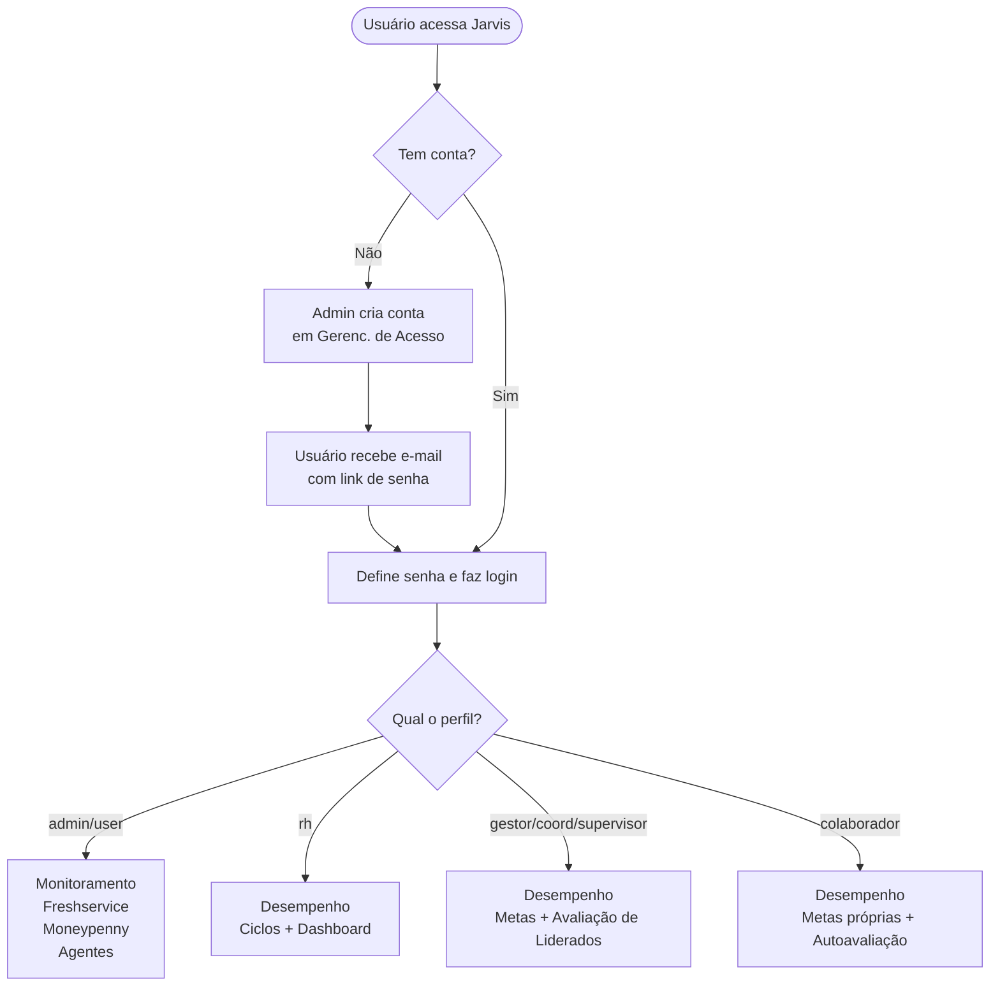

---

## 2. Fluxo de Login e Recuperação de Senha

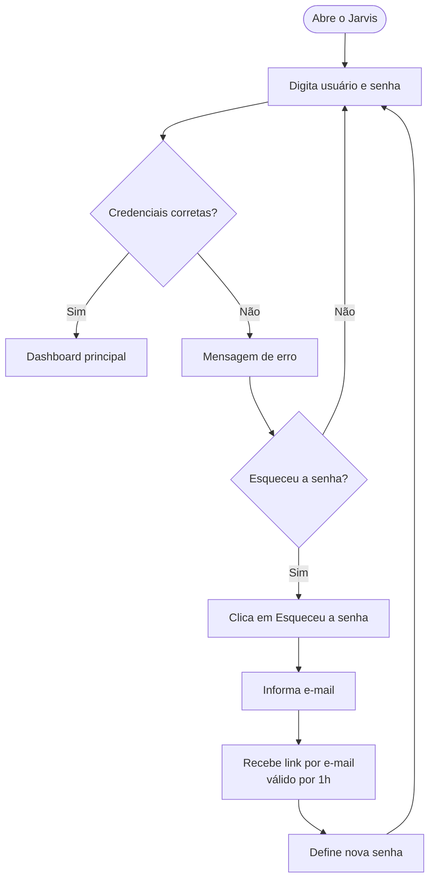

---

## 3. Fluxo VoeIA — Abertura de Chamado pelo WhatsApp

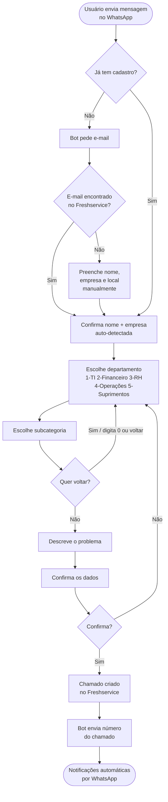

### Notificações automáticas após abertura

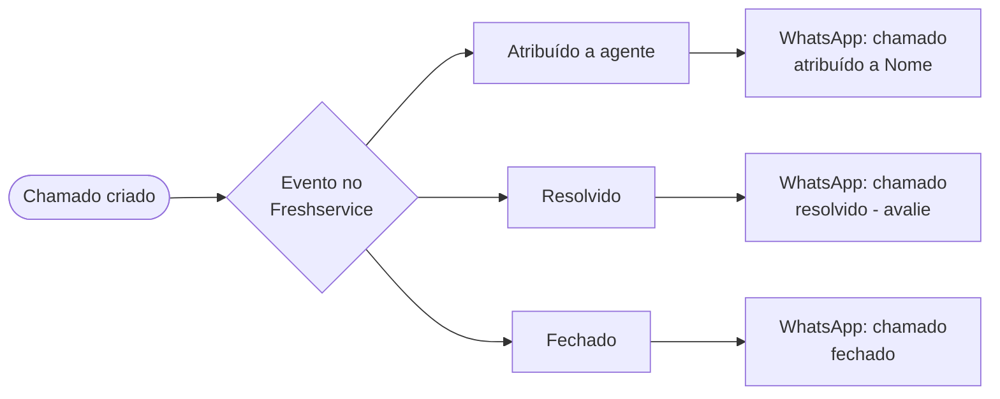

---

## 4. Fluxo Completo de Gestão de Desempenho

### 4.1 Visão Macro do Ciclo

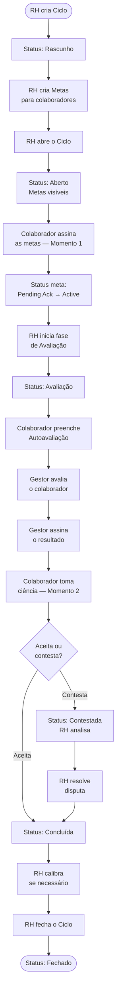

### 4.2 Fluxo detalhado — RH (Criação e Gestão)

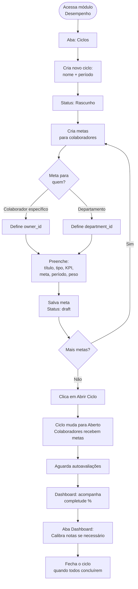

### 4.3 Fluxo detalhado — Colaborador

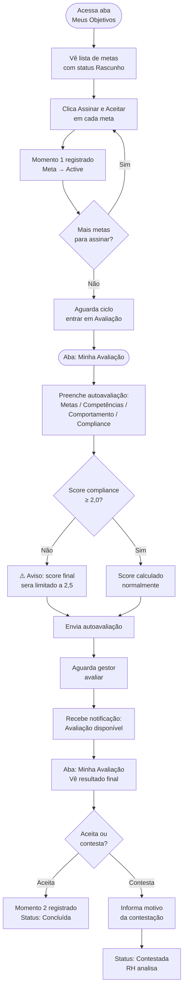

### 4.4 Fluxo detalhado — Gestor / Supervisor

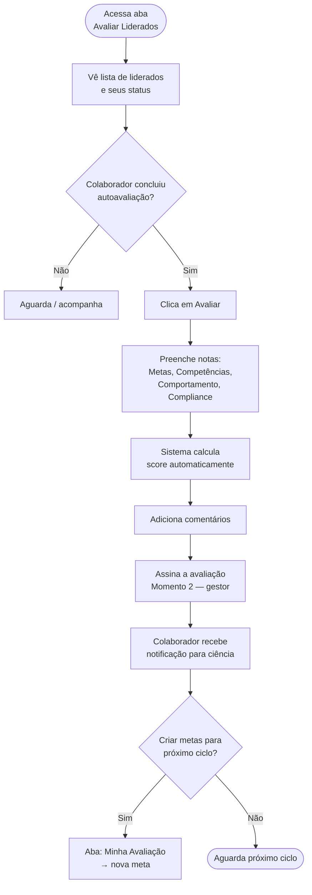

---

## 5. Fluxo de Score de Desempenho

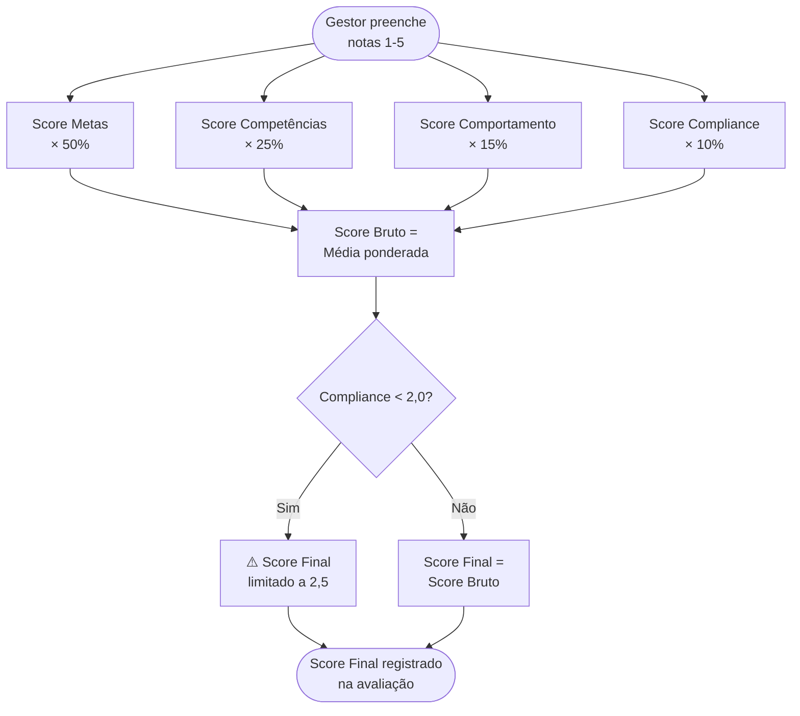

**Exemplo de cálculo:**
```
Metas:        4,0  × 0,50 = 2,00
Competências: 3,0  × 0,25 = 0,75
Comportamento:3,5  × 0,15 = 0,53
Compliance:   3,0  × 0,10 = 0,30
                    Total = 3,58
Compliance ≥ 2,0 → Score Final = 3,58
```

---

## 6. Fluxo de Monitoramento de Sistemas

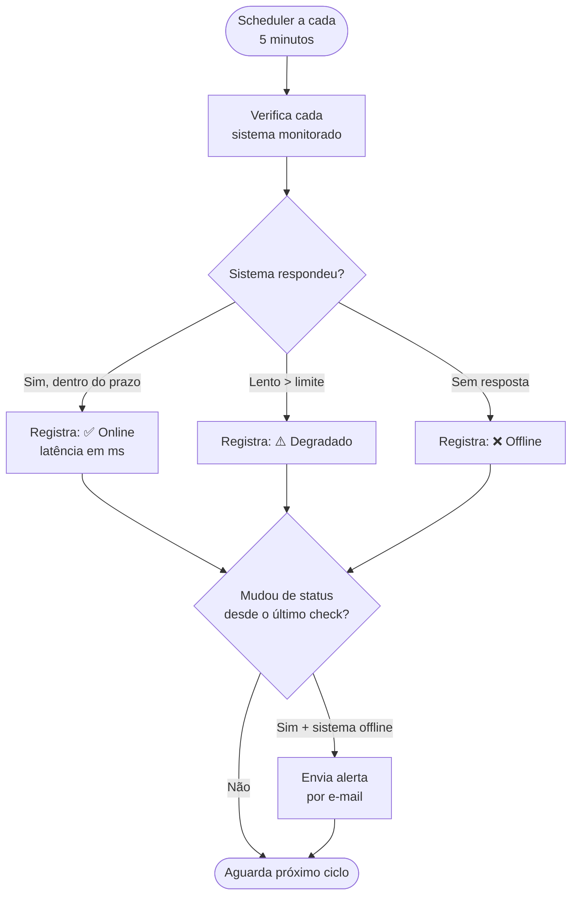

---

## 7. Fluxo de Sincronização Freshservice

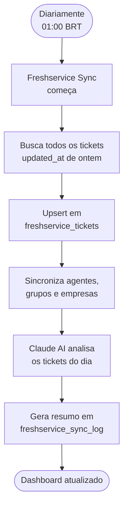

---

## 8. Fluxo de Gastos TI

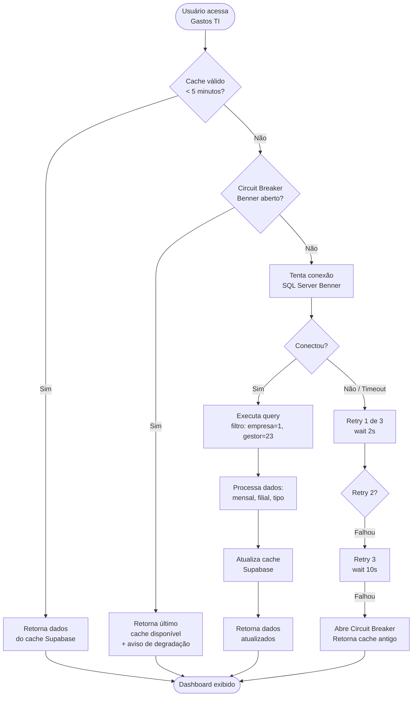

---

## 9. Fluxo de Criação de Usuário (Admin)

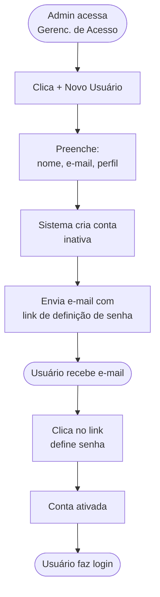
